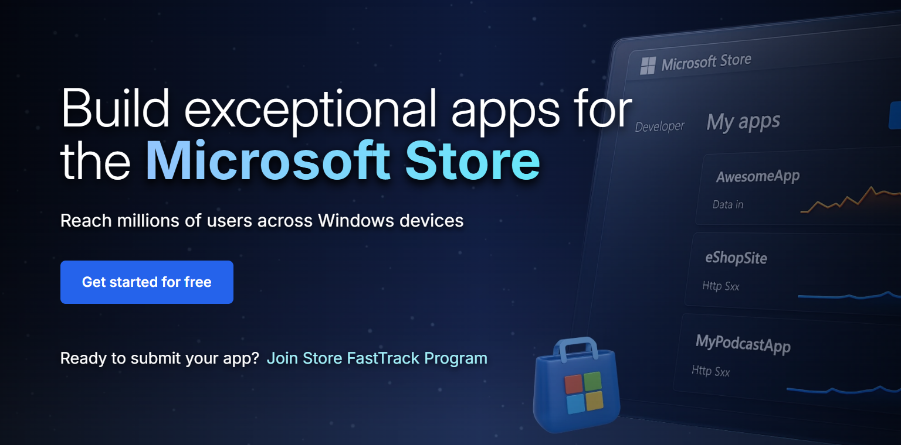
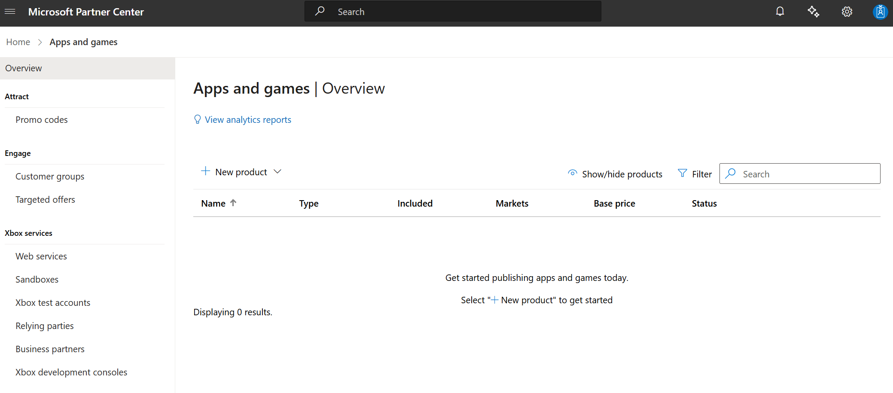

# Free developer registration for individual developers

The new onboarding process is now live, allowing individual developers to publish apps to the Microsoft Store without any onboarding fees. This experience is available in nearly 200 markets worldwide.

## What’s New

| Feature                           | Description                                                               |
|-----------------------------------|---------------------------------------------------------------------------|
| **No registration fee**           | The $19 registration fee is waived in the new flow (flighted markets only). |
| **ID-based verification**         | Verify your identity using a government-issued ID and selfie for a secure and compliant onboarding. |
| **Guided, lightweight onboarding**| Clean, modern UX with contextual guidance, MFA security, and live support links. |
| **Auto-filled profile info**      | Verified ID data pre-fills your developer profile for speed and accuracy. |
| **Instant access to Partner Center**| Once verified, you’re redirected to Partner Center to start publishing immediately. |

## Step-by-Step Flow

1. **Go to** [storedeveloper.microsoft.com](https://storedeveloper.microsoft.com)

   > **Note for existing developers:**  If you already have a developer account and sign in with an existing MSA, you will skip Steps 5–8 and be taken directly to Step 9. Alternatively, you can go straight to the [Partner Center apps and games page](https://aka.ms/submitwindowsapp).

2. **Click “Get started for free”** to begin.

3. Select **Individual developer** (free). If you’re a business, select Company account.

   > **Note for Company developers:** Selecting **Company account** will redirect you to the existing onboarding flow for Company developers. Learn more about Company account setup [here](/windows/apps/publish/partner-center/open-a-developer-account?tabs=company).

4. **Sign in** with your Microsoft account (MSA) or create a new one.

5. **Begin identity verification** with a government-issued ID and selfie.

6. **Capture** your ID and selfie on mobile in good lighting with original documents.

7. **Complete** your profile details. Review your auto-filled information, and update if required.

8. Complete your account setup and click **“Go to Partner Center dashboard”**

9. After clicking, you’ll first be prompted with the **Microsoft account (MSA) picker**  
> - Select the same account you used earlier to create your Store developer account.  
> - Once signed in, you’ll land on the "Apps & Games overview" page.  

> **Note:** If you're not taken there immediately:  
> - Wait ~5 minutes and refresh your browser until you see the **Apps & Games** tile, then click it.  
> - Or navigate directly to the [Partner Center apps and games page](https://aka.ms/submitwindowsapp) after a few minutes.

You’ll be redirected to Partner Center to finish setup and publish your first app.

## Need help? Contact us

If you need assistance with the new account onboarding process for individual developers (zero registration fees), you can email us directly at **storesupport@service.microsoft.com**. This inbox is only for issues related to the new onboarding process in **flighted markets**.

For help with anything else — including account creation or management, app submission, app certification, or app analytics — please raise a support ticket [here](https://aka.ms/windowsdevelopersupport).  
You can also explore guidance in our [publishing documentation](/windows/apps/publish).

## Frequently Asked Questions (FAQs)

### Do I need to pay the registration fee?

No — if you're using the new flow via the [Store marketing page](https://storedeveloper.microsoft.com/) in a flighted market. If you land on the legacy flow via other entry points or are in a non-flighted market, the registration fee still applies.  

The free onboarding flow applies only to individual developers. Company accounts continue to pay a one-time $99 USD registration fee as part of the existing onboarding process.

### How do I access the new flow?

You must begin your journey at [storedeveloper.microsoft.com](https://storedeveloper.microsoft.com). This is the only supported entry point during the flighting phase. Other paths (e.g. direct via Partner Center, Xbox, or Visual Studio) will show the legacy flow.

### Why is ID verification required?

To ensure platform integrity. Verifying your identity helps protect against fraud and impersonation, which in turn improves safety for customers and trust in the developer ecosystem.

### What happens to my ID data?

Your ID information is used solely for verification and processed securely per Microsoft’s privacy standards. Microsoft may retain non-PII data like Publisher name and country for support and dispute resolution purposes.

### I already have a developer account—do I need to use this?

No — this flow is only for new individual developers creating their account for the first time.
