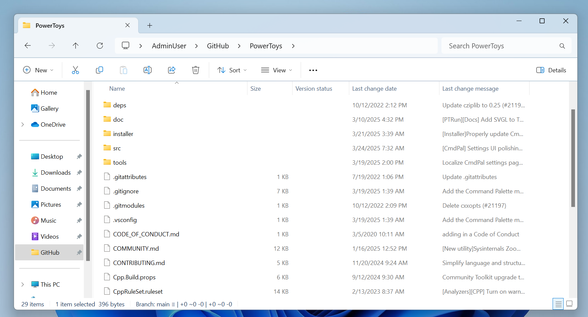
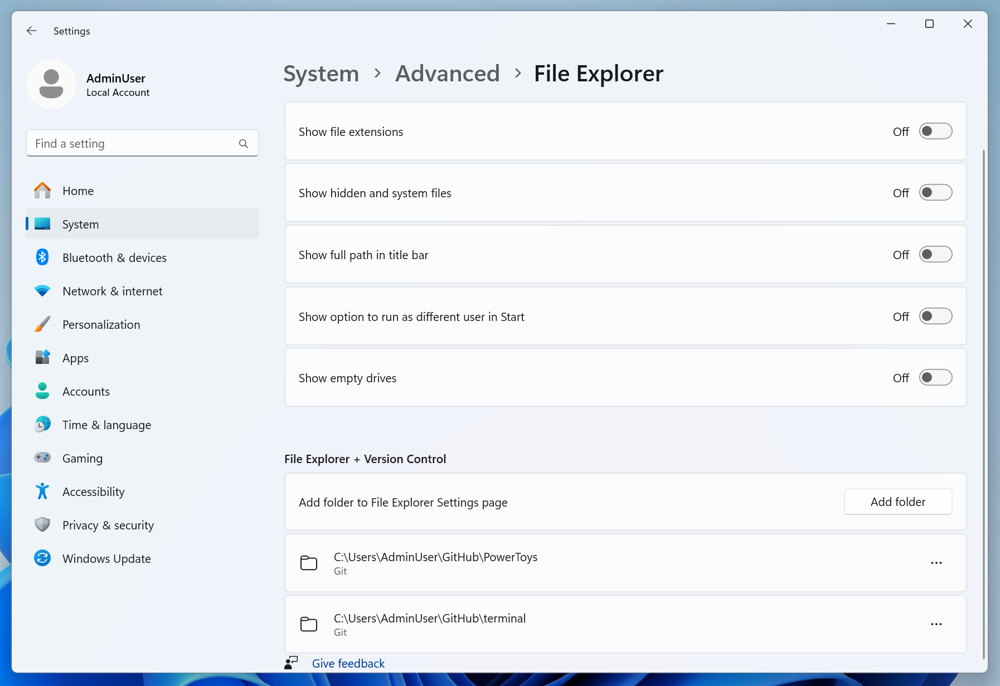

# File Explorer version control integration

**File Explorer version control integration** provides version control information directly in File Explorer. This includes information such as the branch name, last commit author, last commit message, and more.

> [!NOTE]
> As of right now, File Explorer version control integration only supports Git. The Advanced Settings system component is extensible to allow for additional version control types.

> [!IMPORTANT]
> Organizational policies can disable or hide Advanced settings controls. If a toggle is unavailable, contact your administrator. See related guidance in [Group Policy](../dev-drive/group-policy.md).

## Enable version control indicators

1. Open Settings and go to **[System > Advanced](ms-settings:developers)***.
2. Under **File Explorer + version control**, select **Add folders** and choose the repositories you want File Explorer to recognize.
3. Return to File Explorer and open one of the selected folders to see repository details.

> [!TIP]
> If indicators do not appear immediately, close and reopen File Explorer.

## How to identify repositories

Windows has to know which folders are source code repositories so File Explorer can display the version control information. You can select your repository folders in **Settings > Advanced Settings > File Explorer** settings under the File Explorer + version control header.

## What appears in File Explorer

When you open a selected repository folder in File Explorer, version control details are surfaced in the Explorer UI, including:

- Branch name
- Last commit author
- Last commit message
- Commit timestamp

## Limitations

- Git repositories are supported; other systems may require future extensions.
- Very large repositories or folders with extensive generated content can delay indicators.
- Nested repositories and submodules may not display details consistently.
- Network shares, symlinked paths, or WSL-mounted locations may not surface metadata.
- Case-sensitive filesystems and uncommon file attributes can affect detection.

> [!NOTE]
> To improve performance, consider excluding large generated folders (for example, `node_modules`, build outputs) when selecting repositories.

## Troubleshooting

- Indicators not showing: Confirm the folder contains a `.git` directory and is selected under **File Explorer + version control** in Advanced settings; restart File Explorer.
- Toggles disabled: Device may be managed by policy. See [Group Policy](../dev-drive/group-policy.md) and contact your administrator.
- Slow or inconsistent updates: Reduce very large folders from selection or move the repository to a local disk path.
- Conflicts with alternative SSH services: If using Developer Mode SSH features, ensure ports and services do not interfere with repository access.

## Extensibility and feedback

The Windows Advanced Settings system component is open source and designed to support additional version control providers.

- Learn more or request features on [GitHub](https://github.com/microsoft/windowsAdvancedSettings).
- For broader context on Advanced settings, see the [Advanced Windows Settings](index.md) landing page.
