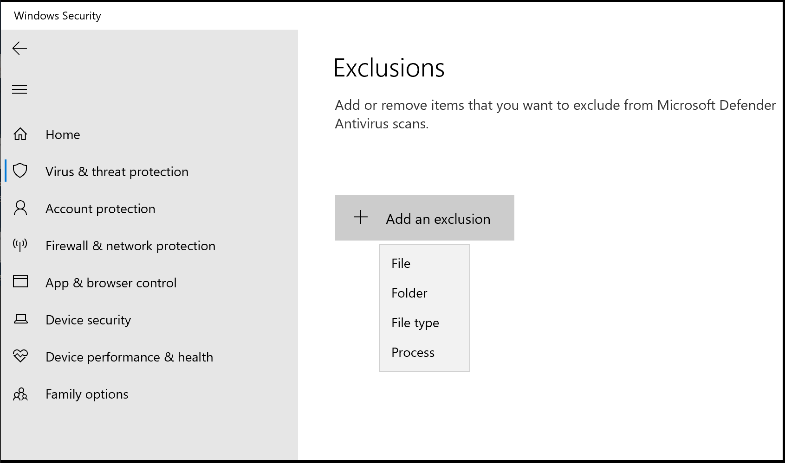

# Add Microsoft Defender exceptions to speed up Android build performance

This guide covers how to set up exclusions in your Microsoft Defender security settings in order to improve your build times when developing Android apps using a Windows machine.

## Microsoft Defender Antivirus Overview

In Windows 10, version 1703 and later, the [Microsoft Defender Antivirus](/windows/security/threat-protection/windows-defender-antivirus/windows-defender-security-center-antivirus) app is part of Windows Security. Microsoft Defender aims to keep your PC safe with built-in, real-time protection against viruses, ransomware, spyware, and other security threats.

**However**, Microsoft Defender's real-time protection will also dramatically slow file system access and build speed when developing Android apps.

During the Android build process, many files are created on your computer. With antivirus real-time scanning enabled, the build process will halt each time a new file is created while the antivirus scans that file.

Fortunately, Microsoft Defender has the capability to exclude files, project directories, or file types that you know to be secure from it's antivirus scanning process.

> [!WARNING]
> To ensure that your computer is safe from malicious software, you should not completely disable real-time scanning or your Microsoft Defender antivirus software.
> Defining exclusions lowers the protection offered by Defender. You should always evaluate the risks that are associated with implementing exclusions, and only exclude files that you are confident are not malicious.

## How to add antivirus exclusions to Microsoft Defender

To add exclusions in the [Microsoft Defender Security Center](windowsdefender://):

1. Select the Windows menu **Start** button
2. Enter **Windows Security**
3. Select **Virus and threat protection**
4. Select **Manage settings** under **Virus & threat protection settings**
5. Scroll to the **Exclusions** heading and select **Add or remove exclusions**
6. Select **+ Add an exclusion**. You will then need to choose whether the exclusion you wish to add is a **File**, **Folder**, **File type**, or **Process**.

## Exclusions to consider for Android development

Use Microsoft Defender Antivirus exclusions sparingly. See [Configure custom exclusions for Microsoft Defender Antivirus](/microsoft-365/security/defender-endpoint/configure-exclusions-microsoft-defender-antivirus) for more details about using exclusions.

Microsoft Defender Antivirus interprets *user environment variables* in the context of the system user, using the LocalSystem account, which means it gets information from the system environment variable, and not from the user environment variable. See [Using incorrect environment variables as wildcards in the file name and folder path or extension exclusion lists](/microsoft-365/security/defender-endpoint/common-exclusion-mistakes-microsoft-defender-antivirus#using-incorrect-environment-variables-as-wildcards-in-the-file-name-and-folder-path-or-extension-exclusion-lists). You can find a list of [System environment variables](/microsoft-365/security/defender-endpoint/configure-extension-file-exclusions-microsoft-defender-antivirus#system-environment-variables) in the Microsoft Defender for Endpoint documentation. You can also [Use wildcards in the file name and folder path or extension exclusion lists](/microsoft-365/security/defender-endpoint/configure-extension-file-exclusions-microsoft-defender-antivirus#use-wildcards-in-the-file-name-and-folder-path-or-extension-exclusion-lists). This explains the use of the asterisk `*`, question mark `?`, or environment variables (such as `%ALLUSERSPROFILE%`) as wildcards when defining items in the file name or folder path exclusion list. The way these wildcards are interpreted differs from their usual usage in other apps and languages.

Microsoft Defender Antivirus expands `%USERPROFILE%` to `C:\Windows\system32\config\systemprofile`, not a wildcard expression applying to all user profiles.  Instead of `%USERPROFILE%`
, for a single user scenario use a pre-expanded user environment variable. For example: `"${env:UserProfile}\AndroidStudioProjects"` or, for the all users scenario, use a wildcard pattern like: `"%SystemDrive%\Users\*\AndroidStudioProjects"` to include Android Studio project files.

Additional exclusions you may want to consider include:

- Visual Studio dev environment process: `devenv.exe`
- Visual Studio build process: `msbuild.exe`
- JetBrains directory: `%LOCALAPPDATA%\JetBrains\<Transient directory (folder)>`

For more information on adding antivirus scanning exclusions, including how to customize directory locations for Group Policy controlled environments, see the Antivirus Impact section of the [Android Studio documentation](https://developer.android.com/studio/intro/studio-config#antivirus-impact).

Please remember that adding exclusions lowers the protection offered by Defender. You should always evaluate the risks that are associated with implementing exclusions, and only exclude files that you are confident are not malicious.

> [!NOTE]
> Daniel Knoodle has set up a GitHub repo with recommended scripts to add [Microsoft Defender exclusions for Visual Studio 2017](https://gist.github.com/dknoodle/5a66b8b8a3f2243f4ca5c855b323cb7b#file-windows-defender-exclusions-vs-2017-ps1-L10).
