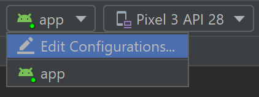
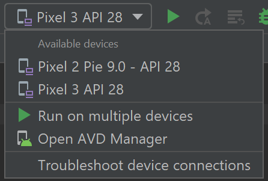
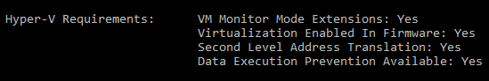
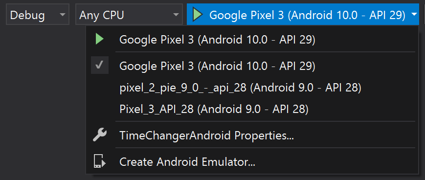

# Test on an Android device or emulator

There are several ways to test and debug your Android application using a real device or emulator on your Windows machine. We have outlined a few recommendations in this guide.

## Run on a real Android device

To run your app on a real Android device, you will first need to enable your Android device for development. Developer options on Android have been hidden by default since version 4.2 and enabling them can vary based on the Android version.

### Enable your device for development

For a device running a recent version of Android 9.0+:

1. Connect your device to your Windows development machine with a USB cable. You may receive a notification to install a USB driver.
2. Open the **Settings** screen on your Android device.
3. Select **About phone**.
4. Scroll to the bottom and tap **Build number** seven times, until **You are now a developer!** is visible.
5. Return to the previous screen, select **System**.
6. Select **Advanced**, scroll to the bottom, and tap **Developer options**.
7. In the **Developer options** window, scroll down to find and enable **USB debugging**.

For a device running an older version of Android, see [Set Up Device for Development](/xamarin/android/get-started/installation/set-up-device-for-development).

### Run your app on the device

1. In the Android Studio toolbar, select your app from the **run configurations** drop-down menu.

    

2. From the **target device** drop-down menu, select the device that you want to run your app on.

    

3. Select Run ▷. This will launch the app on your connected device.

## Run your app on a virtual Android device using an emulator

The first thing to know about running an Android emulator on your Windows machine is that regardless of your IDE (Android Studio, Visual Studio, etc), emulator performance is vastly improved by enabling virtualization support.

### Enable virtualization support

Before creating a virtual device with the Android emulator, it is recommended that you enable virtualization by turning on the Hyper-V and Windows Hypervisor Platform (WHPX) features. This will allow your computer's processor to significantly improve the execution speed of the emulator.

> To run Hyper-V and Windows Hypervisor Platform, your computer must:
>
> * Have 4GB of memory available
> * Have a 64-bit Intel processor or AMD Ryzen CPU with Second Level Address Translation (SLAT)
> * Be running Windows 10 build 1803+ ([Check your build #](ms-settings:about))
> * Have updated graphics drivers (Device Manager > Display adapters > Update driver)
>
> If your machine doesn't fit this criteria, you may be able to run [Intel HAXM](https://github.com/intel/haxm/wiki/Installation-Instructions-on-Windows) or [AMD Hypervisor](https://github.com/google/android-emulator-hypervisor-driver-for-amd-processors). For more info, see the article: [Hardware acceleration for emulator performance](/xamarin/android/get-started/installation/android-emulator/hardware-acceleration) or the [Android Studio Emulator documentation](https://developer.android.com/studio/run/emulator).

1. Verify that your computer hardware and software is compatible with Hyper-V by opening a command prompt and entering the command: `systeminfo`

    

2. In the Windows search box (lower left), enter "windows features". Select **Turn Windows features on or off** from the search results.

3. Once the **Windows Features** list appears, scroll to find **Hyper-V** (includes both Management Tools and Platform) and **Windows Hypervisor Platform**, ensure that the box is checked to enable both, then select **OK**.

4. Restart your computer when prompted.

### Emulator for native development with Android Studio

When building and testing a native Android app, we recommend [using Android Studio](./native-android.md). Once your app is ready for testing, you can build and run your app by:

1. In the Android Studio toolbar, select your app from the **run configurations** drop-down menu.

    

2. From the **target device** drop-down menu, select the device that you want to run your app on.

    

3. Select Run ▷. This will launch the [Android Emulator](https://developer.android.com/studio/run/emulator).

> [!TIP]
> Once your app is installed on the emulator device, you can use [Apply Changes](https://developer.android.com/studio/run#apply-changes) to deploy certain code and resource changes without building a new APK.

### Emulator for cross-platform development with Visual Studio

There are many [Android emulator options](https://www.androidauthority.com/best-android-emulators-for-pc-655308/) available for Windows PCs. We recommend using Google's [Android emulator](https://developer.android.com/studio/run/emulator), as it offers access to the latest Android OS images and Google Play services.

### Install Android emulator with Visual Studio

1. If you don't already have it installed, download [Visual Studio 2019](https://visualstudio.microsoft.com/downloads/). Use the Visual Studio Installer to [Modify your workloads](/visualstudio/install/modify-visual-studio?view=vs-2019#modify-workloads) and ensure that you have the **Mobile development with .NET workload**.

2. Create a new project. Once you've [set up the Android Emulator](/xamarin/android/get-started/installation/android-emulator/), you can use the [Android Device Manager](/xamarin/android/get-started/installation/android-emulator/device-manager?pivots=windows&tabs=windows#requirements) to create, duplicate, customize, and launch a variety of Android virtual devices. Launch the Android Device Manager from the Tools menu with: **Tools** > **Android** > **Android Device Manager**.

3. Once the Android Device Manager opens, select **+ New** to create a new device.

4. You will need to give the device a name, choose the base device type from a drop-down menu, choose a processor, and OS version, along with several other variables for the virtual device. For more information, [Android Device Manager Main Screen](/xamarin/android/get-started/installation/android-emulator/device-manager?pivots=windows&tabs=windows#main-screen).

5. In the Visual Studio toolbar, choose between **Debug** (attaches to the application process running inside the emulator after your app starts) or **Release** mode (disables the debugger). Then choose a virtual device from the device drop-down menu and select the **Play** button ▷ to run your application in the emulator.

    

## Additional resources

- [Develop Dual-screen apps for Android and get the Surface Duo device SDK](/dual-screen/android/)

- [Add Windows Defender exclusions to improve performance](defender-settings.md)