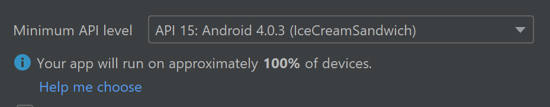
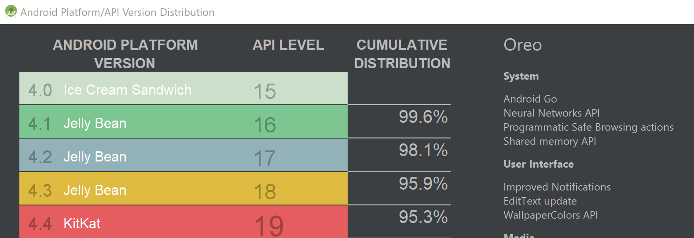

# Get started with native Android development on Windows

This guide will get you started using Windows to create native Android applications. If you would prefer a cross-platform solution, see [Overview of Android development on Windows](./overview.md) for a brief summary of some options.

The most straight-forward way to create a native Android app is using Android Studio with either [Java or Kotlin](#java-or-kotlin), though it is also possible to [use C or C++ for Android development](#use-c-or-c-for-android-game-development) if you have a specific purpose. The Android Studio SDK tools compile your code, data, and resource files into an archive Android package, .apk file. One APK file contains all the contents of an Android app and is the file that Android-powered devices use to install the app.

## Install Android Studio

Android Studio is the official integrated development environment for Google's Android operating system. [Download the latest version of Android Studio for Windows](https://developer.android.com/studio).

- If you downloaded an .exe file (recommended), double-click to launch it.
- If you downloaded a .zip file, unpack the ZIP, copy the android-studio folder into your Program Files folder, and then open the android-studio > bin folder and launch studio64.exe (for 64-bit machines) or studio.exe (for 32-bit machines).

Follow the setup wizard in Android Studio and install any SDK packages that it recommends. As new tools and other APIs become available, Android Studio will notify you with a pop-up, or check for updates by selecting **Help** > **Check for Update**.

## Create a new project

Select **File** > **New** > **New Project**.

In the **Choose your project** window, you will be able to choose between these templates:

- **Basic Activity**: Creates a simple app with an app bar, a floating action button and two layout files: one for the activity and one to separate out text content.

- **Empty Activity**: Creates an empty activity and a single layout file with sample text content.

- **Bottom Navigation Activity**: Creates a standard bottom navigation bar for an activity. For more information on this, see the Bottom Navigation Component section of the [Material Design guidelines](https://material.io/guidelines/components/bottom-navigation.html) by Google.

- Templates are commonly used to add activities to new and existing app modules. For example, to create a login screen for your app's users, add an activity with the Login Activity template. To learn more about selecting an activity and how to add code from a template, see [Android Developer guide](https://developer.android.com/studio/projects/templates#SelectTemplate) by Google.

> [!NOTE]
> The Android operating system is based on the idea of **components** and uses the terms **activity** and **intent** to define interactions. An **activity** represents a single, focused task that a user can do. An **activity** provides a window for building the user interface using classes based on the **View** class. There is a lifecycle for **activities** in the Android operating system, defined by six callbacks: `onCreate()`, `onStart()`, `onResume()`, `onPause()`, `onStop()`, and `onDestroy()`. The activity components interact with one another using **intent** objects. Intent either defines the activity to start or describes the type of action to perform (and the system selects the appropriate activity for you, which can even be from a different application). Learn more about Activities, the Activity Lifecycle, and Intents in the [Android Developer guide](https://developer.android.com/reference/android/app/Activity) by Google.

### Java or Kotlin

**Java** became a language in 1991, developed by what was then Sun Microsystems, but which is now owned by Oracle. It has become one of the most popular and powerful programming languages with one of the largest support communities in the world. Java is class-based and object-oriented, designed to have as few implementation dependencies as possible. The syntax is similar to C and C++, but it has fewer low-level facilities than either of them.

**Kotlin** was first announced as a new open-source language by JetBrains in 2011 and has been included as an alternative to Java in Android Studio since 2017. In May 2019, Google announced Kotlin as it's preferred language for Android app developers, so despite being a newer language, it also has a strong support community and has been identified as one of the fastest growing programming languages. Kotlin is cross-platform, statically typed, and designed to interoperate fully with Java.

Java is more widely used for a broader range of applications and offers some features that Kotlin does not, such as checked exceptions, primitive types that are not classes, static members, non-private fields, wildcard-types, and ternary-operators. Kotlin is specifically designed for and recommended by Android. It also offers some features that Java does not, such as null references controlled by the type system, no raw types, invariant arrays, proper function types (as opposed to Java's SAM-conversions), use-site variance without wildcards, smart casts, and more. Find a more in-depth look at the comparison to Java in the [Kotlin documentation](https://kotlinlang.org/docs/reference/comparison-to-java.html).

### Minimum API Level

You will need to decide the minimum API level for your application. This determines which version of Android your application will support. Lower API levels are older and therefore generally support more devices, but higher API levels are newer and therefore provide more features.

Select the **Help me choose** link to open a comparison chart showing the device support distribution and key features associated with the platform version release.

### Instant app support and Androidx artifacts

You may notice a checkbox to **Support instant apps** and another to **Use androidx artifacts** in your project creation options. The *instant apps support* is not checked and the *androidx* is checked as the recommended default.

Google Play **Instant apps** provide a way for people to try an app or game without installing it first. These instant apps can be surfaced across the Play Store, Google Search, social networks, and anywhere you share a link. By checking the **Support instant apps** box, you are asking Android Studio to include the Google Play Instant Development SDK with your project. Learn more about Google Play Instant apps in the [Android developer guide](https://developer.android.com/topic/google-play-instant).

**AndroidX artifacts** represents the new version of the Android support library and provides backwards-compatibility across Android releases. AndroidX provides a consistent namespace starting with the string androidx for all available packages.

> [!NOTE]
> AndroidX is now the default library. To uncheck this box and use the previous support library requires removing the lastest Android Q SDK. See [Uncheck use Androidx artifacts](https://stackoverflow.com/questions/56580980/uncheck-use-androidx-artifacts) on StackOverflow for instructions, but first note that the former Support Library packages have been mapped into corresponding androidx.* packages. For a full mapping of all the old classes and build artifacts to the new ones, see [Migrating to AndroidX](https://developer.android.com/jetpack/androidx/migrate).

## Project files

The Android Studio **Project** window, contains the following files (be sure that the Android view is selected from the drop-down menu):

**app > java > com.example.myfirstapp > MainActivity**

The main activity and entry point for your app. When you build and run your app, the system launches an instance of this Activity and loads its layout.

**app > res > layout > activity_main.xml**

The XML file defining the layout for the activity's user interface (UI). It contains a TextView element with the text "Hello World"

**app > manifests > AndroidManifest.xml**

The manifest file describing the fundamental characteristics of the app and each of its components.

**Gradle Scripts > build.gradle**

There are two files with this name: "Project: My First App", for the entire project, and "Module: app", for each app module. A new project will initially only have one module. Use the module's build.file to control how the Gradle plugin builds your app. Learn more about how to configure your build in the [Android developer guide](https://developer.android.com/studio/build/index).

## Use C or C++ for Android game development

The Android operating system is designed to support applications written in Java or Kotlin, benefiting from tooling embedded in the system's architecture. Many system features, like Android UI and Intent handling, are only exposed through Java interfaces. There are a few instances where you may want to **use C or C++ code via the Android Native Development Kit (NDK)** despite some of the associated challenges. Game development is an example, since games typically use custom rendering logic written in OpenGL or Vulkan and benefit from a wealth of C libraries focused on game development. Using C or C++ *might* also help you squeeze extra performance out of a device to achieve low latency or run computationally intensive applications, such as physics simulations. The NDK **is not appropriate for most novice Android programmers** however. Unless you have a specific purpose for using the NDK, we recommend sticking with Java, Kotlin, or one of the [cross-platform frameworks](./overview.md).

To create a new project with C/C++ support:

- In the **Choose your project** section of the Android Studio wizard, select the *Native C++** project type. Select **Next**, complete the remaining fields, then select **Next** again.

- In the **Customize C++ Support** section of the wizard, you can customize your project with the **C++ Standard** field. Use the drop-down list to select which standardization of C++ you want to use. Selecting **Toolchain Default** uses the default CMake setting. Select **Finish**.

- Once Android Studio creates your new project, you can find a **cpp** folder in the **Project** pane that contains the native source files, headers, build scripts for CMake or ndk-build, and prebuilt libraries that are a part of your project. You can also find a sample C++ source file, `native-lib.cpp`, in the `src/main/cpp/` folder which provides a simple `stringFromJNI()` function returning the string "Hello from C++". Additionally, you should see a CMake build script, `CMakeLists.txt`, in your module's root directory required for building your native library.

To learn more, about adding C and C++ code to your project, see the [Android developer guide](https://developer.android.com/studio/projects/add-native-code). To find Android NDK samples with C++ integration, see the [Android NDK samples repo](https://github.com/android/ndk-samples) on GitHub. To compile and run a C++ game on Android, use the [Google Play Game services API](https://developers.google.com/games/services/cpp/gettingStartedAndroid).

## Design guidelines

Device users expect applications to look and behave a certain way... whether swiping or tapping or using voice-controls, users will hold specific expectations for what your application should look like and how to use it. These expectations should remain consistent in order to reduce confusion and frustration. Android offers a guide to these platform and device expectations that combines the Google Material Design foundation for visual and navigational patterns, along with quality guidelines for compatibility, performance, and security.

Learn more in the [Android design documentation](https://developer.android.com/design).

### Fluent Design System for Android

Microsoft also offers design guidance with the goal of providing a seamless experience across the entire portfolio of Microsoft's mobile apps.

[Fluent Design System for Android](https://www.microsoft.com/design/fluent/#/android)
design and build custom apps that are natively Android while still uniquely Fluent.

- [Sketch toolkit](https://aka.ms/fluenttoolkits/android/sketch)
- [Figma toolkit](https://aka.ms/fluenttoolkits/android/figma)
- [Android font](https://fonts.google.com/specimen/Roboto)
- [Android User Interface Guidelines](https://developer.android.com/design/)
- [Guidelines for Android app icons](https://developer.android.com/guide/practices/ui_guidelines/icon_design)

## Additional resources

- [Android Application Fundamentals](https://developer.android.com/guide/components/fundamentals)

- [Develop Dual-screen apps for Android and get the Surface Duo device SDK](/dual-screen/android/)

- [Add Windows Defender exclusions to improve performance](defender-settings.md)

- [Enable Virtualization support to improve emulator performance](emulator.md#enable-virtualization-support)