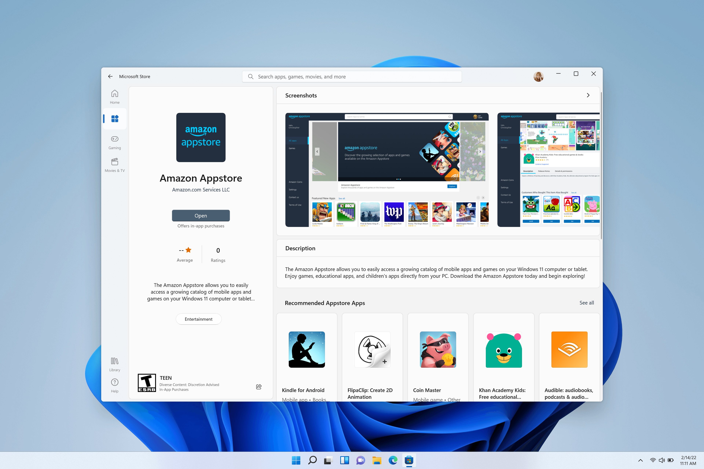
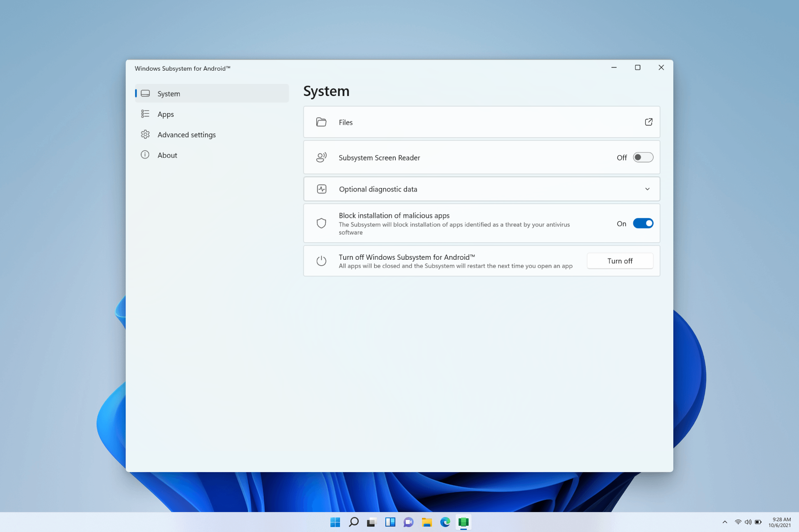
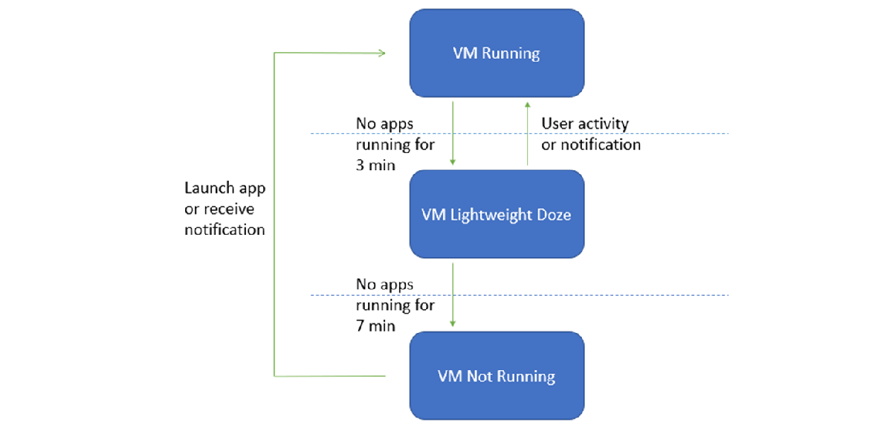

# Windows Subsystem for Android™️

Windows Subsystem for Android™️ enables your Windows 11 device to run Android applications that are available in the Amazon Appstore. Android is a trademark of Google LLC. If you're a developer interested in targeting Windows desktop devices and optimizing for the Windows operating system, this guide is for you.

> [!IMPORTANT]
> Microsoft is ending support for the Windows Subsystem for Android™️ (WSA). As a result, the Amazon Appstore on Windows and all applications and games dependent on WSA will no longer be supported beginning **March 5, 2025**. Until then, technical support will remain available to customers.  
> Customers that have installed the Amazon Appstore or Android apps prior to March 5, 2025, will continue to have access to those apps through the deprecation date of March 5, 2025. Please reach out to our support team for further questions at [support.microsoft.com](https://support.microsoft.com).
> We are grateful for the support of our developer community and remain committed to listening to feedback as we evolve experiences.

To make your Android app available on Windows 11 devices, you must:

- [Submit your app to the Amazon Appstore](https://developer.amazon.com/apps-and-games/appstore-on-windows-11).

For more information or support:

- [Sign up for updates to the Amazon Appstore on Windows program](https://m.amazonappservices.com/developer-interest).
- [Visit the Amazon developer support portal](https://developer.amazon.com/apps-and-games/appstore-on-windows-11) where you can find articles, forums, FAQs, or reach out for direct support via the Appstore "Contact us" page once you set up an Amazon Developer account.

This guide can help you test and debug your Android app on Windows:

- [Set up your development environment](#set-up-your-development-environment), including [prerequisites](#prerequisites), [installing the Amazon Appstore](#install-the-amazon-appstore), and using the [Settings](#windows-subsystem-for-android-settings).
- [Test and debug](#test-and-debug) your app on a Windows 11 device.
- Handle input compatibility considerations for Windows devices, such as: [keyboard input](#keyboard-input), [mouse input](#mouse-input), and [window management and resizing](#window-management-and-resizing).
- [Troubleshoot and find answers](#troubleshooting-issues).

## Developer GitHub

Want to learn more about Windows Subsystem for Android™️ roadmap, discuss developer issues and file bugs or feature requests with the subsystem team? Visit the [Windows Subsystem for Android™️ Developers GitHub](https://github.com/microsoft/WSA).

## Preview Program

The Windows Subsystem for Android™️ Preview Program allows users to receive early-preview builds of the Windows Subsystem for Android™ and Amazon Appstore on Windows. For more details, visit the [Preview Program page](./preview-program.md).

## Set up your development environment

To test your Android app in the Windows desktop environment, a bit of set up will be required.

### Prerequisites

Windows Subsystem for Android™️ is available on Windows 11. Your device must meet specific requirements: [Device requirements](https://support.microsoft.com/windows/f8d0abb5-44ad-47d8-b9fb-ad6b1459ff6c).

### Install the Amazon Appstore

The Microsoft Store will automatically install Windows Subsystem for Android™️ silently in the background when either of the two following user actions are taken:

1. Install the [Amazon Appstore from the Microsoft Store](https://www.microsoft.com/store/productId/9NJHK44TTKSX). Selecting **Get** will begin the installation of the app.
2. Install an Android app from the Microsoft Store for the first time, which will also install the Amazon Appstore.

The **Amazon Appstore** app will then appear in the Windows 11 Start menu and be available on search, offering a catalogue of Android apps. The **Windows Subsystem for Android™️** app, which lets you control mobile app settings and features, will also appear in the Start menu.



> [!NOTE]
> The Amazon Appstore on Windows (a requirement for running Android apps on Windows 11) is available in [select regions](https://support.microsoft.com/windows/countries-and-regions-that-support-amazon-appstore-on-windows-d8dd17c7-5994-4187-9527-ddb076f9493e?preview=true).

## Windows Subsystem for Android™️ Settings

To modify Windows Subsystem for Android™️ settings, go to: **Start > All Apps > Windows Subsystem for Android™️**. Learn more about specific settings app features: [Manage settings for mobile apps on Windows](https://support.microsoft.com/windows/000f97e8-8c20-490e-9ef4-cd90d903f847).



## Test and debug

To test and debug your app on a Windows 11 device using the Windows Subsystem for Android™️ the following set up steps are required.

### Enable developer mode in Windows Settings

You must first enable developer mode. Open the **[Windows Subsystem for Android™️](#windows-subsystem-for-android-settings)** settings. Once open, enable **Developer mode** under **Advanced settings**.

### Connect to the Windows Subsystem for Android™️ for debugging

To connect to the Windows Subsystem for Android™️ VM for debugging:

1. Launch an Android app that was installed using the Amazon Appstore.

2. You can connect using adb connect with the following command (you must have [adb installed](https://developer.android.com/studio/command-line/adb)):

    ```powershell
    adb connect 127.0.0.1:58526
    ```

### Connect to a test device

To connect to a test device (with Windows Subsystem for Android™️ installed) on the same network from Windows/Mac:

1. On the test device (where Windows Subsystem for Android™️ is installed) open a PowerShell window and identify the IP address of the test device by running the command:

    ```powershell
    ipconfig
    ```

2. Using the debugging device terminal where Android Studio and the Android SDK is installed (Mac/Windows), enter the command:

    ```console
    adb connect <TEST DEVICE IP ADDRESS>:58526
    ```

The `<TEST DEVICE IP ADDRESS>` can be found in the output of "ipconfig" from the test device. You can also deploy and debug apps from Android Studio.

To use Android Debug Bridge (ADB) to connect your development workstation directly to your Android device so you can install packages and evaluate changes, see [Android Debug Bridge in the Android Open Source Project docs](https://source.android.com/setup/build/adb).

### Debug your app

While apps should be installed using the Amazon Appstore, debugging an Android app on a Windows device is possible using an APK (Android application package) and adb (Android Debug Bridge).

To debug an APK using adb:

1. Follow the steps to connect to the Windows Subsystem for Android™️ VM above.

2. Install the APK using the adb install command: `adb install app-debug.apk`

    Expected Output:

    ```powershell
    Performing Streamed Install
    Success
    ```

3. A successful “app installed” notification  will appear in the Windows notification menu and the app will launch once selected.

### Building Universal APKs

Windows Subsystem for Android™️ utilizes Intel Bridge Technology to enable Arm applications on x86 based processors. Arm applications will run on Arm-based processors natively. The emulation layer will induce a performance overhead – for optimal performance, submit your application for both the x86-64 and Arm64 architectures.

## Input compatibility considerations for Windows devices

There are a few unique input behaviors to consider that will likely require updates to your Android app code, designed for handheld devices, to be compatible when running on a Windows desktop device via the Amazon Appstore.

### Keyboard input

For text input fields handled by an on-screen virtual keyboard input method (or IME), such as `EditText`, apps should behave as expected. ([EditText class in the Android docs](https://developer.android.com/reference/android/widget/EditText)).

For keystrokes that cannot be anticipated by the framework, apps will need to handle the behavior themselves. If this is already implemented in-app, no extra work is required.

As an example, some games may already support movement facilitated via keyboard, through `w` `a` `s` `d` keys, alongside touch input.

The following are keyboard inputs that developers should consider code updates for when building for Windows 11 devices:

- Enter Key
- Arrow-key and Tab-key Navigation
- Change Selected Item Highlight Color
- Ctrl-based Shortcuts

Learn more about how to optimize for these keyboard input scenarios on desktop devices by following the Android documentation:

- [Input compatibility guide in the Android docs](https://developer.android.com/topic/arc/input-compatibility)
- [Handle keyboard input guide in the Android docs](https://developer.android.com/training/keyboard-input)
- [Use touch gestures guide in the Android docs](https://developer.android.com/training/gestures)

### Mouse input

Developers should consider updating code for the following mouse inputs when building for Windows devices:

- Right Click
- Tooltips / Hover Text
- Hover Effects
- Mouse Scroll Wheel Action
- Drag and Drop

Mouse input, similar to keyboard input, must follow the official Android app guidelines. This means using the `InputDevice` class paired with the `SOURCE_MOUSE` constant. Learn more about how to optimize for these mouse input scenarios on desktop devices by following the Android documentation:

- [Input compatibility guide in the Android docs](https://developer.android.com/topic/arc/input-compatibility)
- [InputDevice reference in the Android docs](https://developer.android.com/reference/android/view/InputDevice)
- [SOURCE_MOUSE reference in the Android docs](https://developer.android.com/reference/android/view/InputDevice#SOURCE_MOUSE)

## Window management and resizing

Unlike traditional mobile form factors, Android apps running on Windows 11 can be freely resized, should be responsive in their resizing, and can be snapped using Windows actions/gestures.

### Minimum screen requirement

Windows 11 enforces a minimum screen requirement of 720p resolution (1280x720) with a >9” screen.

### Letter & pillar boxing  

When the aspect ratio of a window size does not align between the device screen sizes that window is being displayed on, the result may be Letterboxing (the window is wider than it is high, or horizontally longer) or Pillarboxing (the window is more narrow than it is wide, or vertically longer). The result is bars being placed on the sides of the window in order to center it. These bars may be light- or dark-themed depending on the system settings selected. This will only occur as necessary when the Android app is snapped or maximized, allowing Android apps to take advantage of the rich snapping features in Windows and integrate into the windowing model.


### Additional resizing considerations

The following should also be considered when updating an Android app to run on a Windows 11 device with respect to window management and resizing:

- Initial launch size
- Window dimensions
  - Content bounds
  - Free form resizing
- Screen Orientation

Learn more about how to optimize for window resizing scenarios on desktop devices by following the [Window Management guide in the Android docs](https://developer.android.com/topic/arc/window-management).

## Application Lifecycle Events

Developing Android applications for a multi-window environment has an impact on the lifecycle events that you choose to utilize in your application. While overriding the `onPause` event may achieve the results you’d like on a phone or tablet, it’s typically the wrong event to use if you’re changing your app’s UX.

See the [Android documentation](https://developer.android.com/guide/components/activities/activity-lifecycle) for a description of the lifecycle events. More often than not, you’ll want to use the `onStop` event and not the `onPause` or `onUserLeaveHint` events. In fact, many multi-window Android implementations do not deliver the `onUserLeaveHint` notification, and thus any business critical logic that might be in that event handler will not be called on these platforms, including Windows Subsystem for Android™️.

## VM lifecycle considerations

Windows Subsystem for Android™️ utilizes a virtual machine (VM) which provides compatibility with the [AOSP framework](https://source.android.com/) and devices like keyboards, mice, touch, pen, etc.

There are three possible states for the VM running apps with Windows Subsystem for Android™️:

1. Running
2. Lightweight Doze: Activated after no app activity for 3 minutes. Deactivated by user activity or an app notification.
3. Not Running: Activated after no app activity for 7 minutes.

Transitions between these states are triggered by user activity, such as launching or interaction with the Android app or an app notification. Android apps are paused and then stopped when their window is minimized.



### VM Properties

The properties for the Windows Subsystem for Android™️ VM are listed below. Hardcoding these values is not recommended as that could cause future incompatibilities.

| Property | Value |
| --- | --- |
| Build.MANUFACTURER | Microsoft Corporation |
| Build.MODEL | Subsystem for Android(TM) |
| Build.VERSION.SDK_INT | 33 |
| Build.BOARD | windows |

## Redirect to Windows apps

Windows Subsystem for Android™️ automatically redirects intents for files and common URI schemes to the corresponding Windows default file/protocol handler (if multiple intent filters match, users see a "Windows default app" option in the chooser dialog). Supported file intents include [ACTION_VIEW](https://developer.android.com/reference/android/content/Intent#ACTION_VIEW), [ACTION_EDIT](https://developer.android.com/reference/android/content/Intent#ACTION_EDIT), [ACTION_SEND](https://developer.android.com/reference/android/content/Intent#ACTION_SEND), and [ACTION_SEND_MULTIPLE](https://developer.android.com/reference/android/content/Intent#ACTION_SEND_MULTIPLE), which copy the file to the Windows Downloads folder before opening it. Supported URI intents include [ACTION_VIEW](https://developer.android.com/reference/android/content/Intent#ACTION_VIEW) for the http/https schemes and [ACTION_VIEW](https://developer.android.com/reference/android/content/Intent#ACTION_VIEW) and [ACTION_SENDTO](https://developer.android.com/reference/android/content/Intent#ACTION_SENDTO) for the mailto scheme.

Android apps can also manually redirect to Windows apps using custom URI schemes. Set the intent action to `com.microsoft.windows.LAUNCH_URI` and add a string extra to the intent named `com.microsoft.windows.EXTRA_URI` with the custom URI as the value. For example, to launch the Windows Calculator app from an Android app (Java):

```java
Intent intent = new Intent("com.microsoft.windows.LAUNCH_URI");
intent.putExtra("com.microsoft.windows.EXTRA_URI", "ms-calculator:");
 
try {
    startActivity(intent);
} catch (ActivityNotFoundException e) {
    // Not running in Windows Subsystem for Android™️ (or running on an older build that did not contain this feature).
}
```

## Security

Both Windows kernel-mode drivers and Windows applications running at medium integrity level (IL) can inspect arbitrary Android containers and Android app memory. There are no plans to add detection for cheats/macro/bot/suspicious behaviors detection in the short-term.

Developers querying `getSecurityLevel` will get `SECURITY_LEVEL_SW_SECURE_CRYPTO`. Learn more about `getSecurityLevel` in the [Android API Reference guide](https://developer.android.com/reference/android/media/MediaDrm#getSecurityLevel(byte[])).

## Uninstalling Windows Subsystem for Android™️

You can uninstall the Windows Subsystem for Android™️, but note that all associated apps will also be uninstalled.

- Uninstalling the Amazon Appstore will uninstall the Windows Subsystem for Android™️ and all other Android apps.
- Uninstalling an Amazon Appstore app will only uninstall the app (same behavior as Windows apps).
- Uninstalling the Windows Subsystem for Android™️ will uninstall the Amazon Appstore and all Android apps.

## Troubleshooting issues

If you encounter issues specific to the Amazon Appstore on Windows, try the following troubleshooting steps:

1. Select **Windows search** from the Windows task bar.
2. Search for “Amazon Appstore” and right-click on the Amazon Appstore icon.
3. Select “App Settings” in the dropdown options.
4. Select “Storage and Cache” and click both “Clear Storage” and “Clear cache”.
5. Go back and select “Force Stop”.
6. Close the Amazon Appstore Settings window.
7. Relaunch the Amazon Appstore.

For further troubleshooting steps relating to the Windows Subsystem for Android™️ Settings app or to leave feedback using Feedback Hub, see [Troubleshooting and FAQ for mobile apps on Windows](https://support.microsoft.com/windows/d6062afd-98a1-4018-a7c8-6b3b680a2ea5).

For any other developer questions and support, use the [Windows Subsystem for Android™️ tag on Microsoft Q&A](/answers/topics/windows-subsystem-for-android.html).

## Additional resources

- [Apps from the Amazon Appstore](https://support.microsoft.com/en-us/windows/apps-from-the-amazon-appstore-abed2335-81bf-490a-92e5-fe01b66e5c48)
- [Accessibility on Windows Subsystem for Android™️](https://support.microsoft.com/windows/97b77924-6df9-4597-8394-15b6e34d1658)
