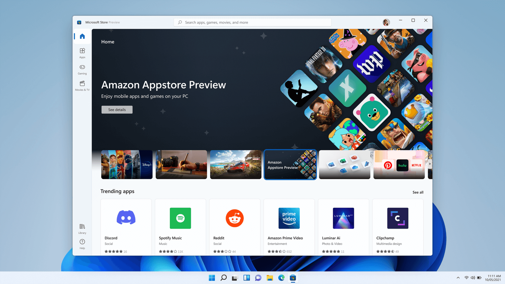

# Windows Subsystem for Android™️

Windows Subsystem for Android™️ enables your Windows 11 device to run Android applications that are available in the Amazon Appstore.

If you're a developer interested in targeting Windows desktop devices and optimizing for the Windows operating system, this guide is for you. Learn how to:

- [Set up your development environment](#set-up-your-development-environment), including [prerequisites](#prerequisites), [installing the Amazon Appstore](#install-the-amazon-appstore), and using the [Settings app](#settings-app).
- Handle input compatibility considerations for Windows devices, such as: [keyboard input](#keyboard-input), [mouse input](#mouse-input), and [window management and resizing](#window-management-and-resizing).
- [Test and debug](#test-and-debug) your app on a Windows 11 device.
- [Submit apps to the Amazon Appstore](#amazon-appstore): Your app must be available in the Amazon Appstore to run on Windows 11 devices.

## Set up your development environment

To test your Android app in the Windows desktop environment, a bit of set up will be required.

### Prerequisites

Windows Subsystem for Android is currently only available through **preview** via the Beta and Dev Channels of the [Windows Insiders Program](https://insider.windows.com/) (Windows 11 Build 22000.xxx series) in the U.S. only.

Your device also must meet specific Windows 11 requirements. Check the "Windows Subsystem for Android" section under "Feature-specific requirements" on the page: [Find Windows 11 specs, features, and computer requirements](https://www.microsoft.com/windows/windows-11-specifications).

### Install the Amazon Appstore

The Microsoft Store will automatically install Windows Subsystem for Android (running Android 11) silently in the background when either of the two following user actions are taken:

1. Install the Amazon Appstore from the Microsoft Store.
2. Install an Android or Amazon app from the Microsoft Store for the first time, which will also install the Amazon Appstore.

The Amazon Appstore will then appear in the Windows 11 Start menu and be available on search, offering a curated catalogue of Android apps.



Selecting **Get** will begin the installation of the app. The app will also appear in Windows Start, Search and in the Windows Programs list.


## Settings app

To access the Windows Subsystem for Android Settings app, go to: **Start > All Apps > Windows Subsystem for Android™️**. The Settings app can be used to adjust the following settings:

- **Subsystem Screen Reader**

    If touch input isn't working, make sure the Subsystem Screen Reader is turned off. For more info, see [Microsoft Support: Accessibility on Windows Subsystem for Android](https://support.microsoft.com/windows/97b77924-6df9-4597-8394-15b6e34d1658).

- **Subsystem resources**

  - **As needed**: When this is selected, the subsystem will open when a mobile app is opened. Since the subsystem needs to open first, the mobile app might take a little longer to open. Mobile apps opened after the first one might not be affected.

  - **Continuous**: The subsystem is always ready to open apps. Since it's always open in the background, it will use more of your PC's memory and processing power.

- **Enable developer mode**

    To [test and debug](#test-and-debug) your app on a Windows 11 device, you will need set Developer Mode to **On**.


## Input compatibility considerations for Windows devices

There are a few unique input behaviors to consider that will likely require updates to your Android app code, designed for handheld devices, to be compatible when running on a Windows desktop device via the Amazon Appstore.

### Keyboard input

For text input fields handled by an on-screen virtual keyboard input method (or IME), such as `EditText`, apps should behave as expected. ([EditText class in the Android docs](https://developer.android.com/reference/android/widget/EditText)).

For keystrokes that cannot be anticipated by the framework, apps will need to handle the behavior themselves. If this is already implemented in-app, no extra work is required.

As an example, some games may already support movement facilitated via keyboard, through `w` `a` `s` `d` keys, alongside touch input.

The following are keyboard inputs that developers should consider code updates for when building for Windows 11 devices:

- Enter Key
- Arrow-key and Tab-key Navigation
- Change Selected Item Highlight Color
- Ctrl-based Shortcuts

Learn more about how to optimize for these keyboard input scenarios on desktop devices by following the Android documentation:

- [Input compatibility guide in the Android docs](https://developer.android.com/topic/arc/input-compatibility)
- [Handle keyboard input guide in the Android docs](https://developer.android.com/training/keyboard-input)
- [Use touch gestures guide in the Android docs](https://developer.android.com/training/gestures)

### Mouse input

Developers should consider updating code for the following mouse inputs when building for Windows devices:

- Right Click
- Tooltips / Hover Text
- Hover Effects
- Mouse Scroll Wheel Action
- Drag and Drop

Mouse input, similar to keyboard input, must follow the official Android app guidelines. This means using the `InputDevice` class paired with the `SOURCE_MOUSE` constant. Learn more about how to optimize for these mouse input scenarios on desktop devices by following the Android documentation:

- [Input compatibility guide in the Android docs](https://developer.android.com/topic/arc/input-compatibility)
- [InputDevice reference in the Android docs](https://developer.android.com/reference/android/view/InputDevice)
- [SOURCE_MOUSE reference in the Android docs](https://developer.android.com/reference/android/view/InputDevice#SOURCE_MOUSE)

## Window management and resizing

Unlike traditional mobile form factors, Android apps running on Windows 11 can be freely resized, should be responsive in their resizing, and can be snapped using Windows actions/gestures.

### Minimum screen requirement

Windows 11 enforces a minimum screen requirement of 720p resolution (1280x720) with a >9” screen.

### Letter & pillar boxing  

When the aspect ratio of a window size does not align between the device screen sizes that window is being displayed on, the result may be Letterboxing (the window is wider than it is high, or horizontally longer) or Pillarboxing (the window is more narrow than it is wide, or vertically longer). The result is bars being placed on the sides of the window in order to center it. These bars may be light- or dark-themed depending on the system settings selected. This will only occur as necessary when the Android app is snapped or maximized, allowing Android apps to take advantage of the rich snapping features in Windows and integrate into the windowing model.


### Additional resizing considerations

The following should also be considered when updating an Android app to run on a Windows 11 device with respect to window management and resizing:

- Initial launch size
- Window dimensions
  - Content bounds
  - Free form resizing
- Screen Orientation

Learn more about how to optimize for window resizing scenarios on desktop devices by following the [Window Management guide in the Android docs](https://developer.android.com/topic/arc/window-management).

## Test and debug

To test and debug your app on a Windows 11 device using the Windows Subsystem for Android the following set up steps are required.

### Enable developer mode in Windows Settings

You must first enable developer mode in Windows Settings. There are three ways to enable developer mode:

- Open the [Windows Subsystem for Android Settings app](#settings-app). Once open, select **Enable Developer Settings**.
- Search for “Developer Settings” in Windows search.
- Navigate to Settings > Privacy and Security > For developers > Developer mode.

### Connect to the Windows Subsystem for Android for debugging

To connect to the Windows Subsystem for Android VM for debugging, you have two options:

1. **Recommended Method**:
    - Use localhost for connecting to debugging. The IP address of the localhost is: `127.0.0.1:58526`. Windows Subsystem for Android must be running in order to connect, the best way to launch Windows Subsystem for Android is by launching an Android app that was installed with the Amazon Appstore.
    - To connect to the localhost address of Windows Subsystem for Android, enter: `adb connect 127.0.0.1:58526`

2. **Alternative Method**: Use the Windows Subsystem for Android Settings app to get the IP address.
    - Launch the Settings app. (Use Windows Search to select and launch.)
    - The IP address will be displayed under the IP address section. If there is no IP address being displayed, launch an Android app that was installed using the Amazon Appstore, then select **Refresh** on the IP address button in the Settings app.

Now that you have the IP address to connect to the Windows Subsystem for Android VM, connect using adb connect:

```powershell
adb connect 172.22.137.166
```

## Connect to a test device

To connect to a test device (with Windows Subsystem for Android installed) on the same network from Windows/Mac:

1. On the test device (where Windows Subsystem for Android is installed) open a PowerShell window and identify the IP address of the test device by running the command:

    ```powershell
    ipconfig
    ```

2. Using the debugging device terminal where Android Studio and the Android SDK is installed (Mac/Windows), enter the command:

    ```console
    adb connect <TEST DEVICE IP ADDRESS>
    ```

The `<TEST DEVICE IP ADDRESS>` can be found in the output of "ipconfig" from the test device. You can also deploy and debug apps from Android Studio.

To use Android Debug Bridge (ADB) to connect your development workstation directly to your Android device so you can install packages and evaluate changes, see [Android Debug Bridge in the Android Open Source Project docs](https://source.android.com/setup/build/adb).

### Debug your app

While apps should be installed using the Amazon Appstore, debugging an Android app on a Windows device is possible using an APK (Android application package) and adb (Android Debug Bridge).

To debug an APK using adb:

1. Follow the steps to connect to the Windows Subsystem for Android VM above.

2. Install the APK using the adb install command: `adb install app-debug .apk`

    Expected Output:

    ```powershell
    Performing Streamed Install
    Success
    ```

3. A successful “app installed” notification  will appear in the Windows notification menu and the app will launch once selected.

## VM lifecycle considerations

Windows Subsystem for Android utilizes a virtual machine (VM) which provides compatibility with the [AOSP framework](https://source.android.com/) and devices like keyboards, mice, touch, pen, etc.

There are three possible states for the VM running apps with Windows Subsystem for Android:

1. Running
2. Lightweight Doze: Activated after no app activity for 3 minutes. Deactivated by user activity or an app notification.
3. Not Running: Activated after no app activity for 7 minutes.

Transitions between these states are triggered by user activity, such as launching or interaction with the Android app or an app notification. Android apps are paused and then stopped when their window is minimized.


### VM Properties

The properties for the Windows Subsystem for Android VM are listed below. Hardcoding these values is not recommended as that could cause future incompatibilities.

| Property | Value |
| --- | --- |
| Build.MANUFACTURER | Microsoft Corporation |
| Build.MODEL | Subsystem for Android |
| Build.VERSION.SDK_INT | 30 |
| Build.BOARD | windows |

## Security

Windows Subsystem for Android performs per-file encryption that is software-based.

Both Windows kernel-mode drivers and Windows applications running at medium integrity level (IL) can inspect arbitrary Android containers and Android app memory. There are no plans to add detection for cheats/macro/bot/suspicious behaviors detection in the short-term.

Developers querying `getSecurityLevel` will get `SECURITY_LEVEL_SW_SECURE_CRYPTO`. Learn more about `getSecurityLevel` in the [Android API Reference guide](https://developer.android.com/reference/android/media/MediaDrm#getSecurityLevel(byte[])).

## Amazon Appstore

In order to be available on a Windows 11 device, an Android app must be published to the Amazon Appstore. Currently, only a small set of apps selected by Microsoft and Amazon are available.

Developers should refer to the Amazon Device Targeting guidance for information on targeting APKs to specific devices.

- [Amazon Docs: Windows Subsystem for Android](https://developer.amazon.com/blogs/appstore/post/fe7771ac-f2df-42be-ac51-eb7fe0df1b5b/amazon-and-microsoft-announce-next-steps-for-bringing-the-amazon-appstore-to-windows-customers)

### Troubleshooting issues with Amazon Appstore

If you encounter issues specific to the Amazon Appstore on Windows, try the following troubleshooting steps:

1. Select **Windows search** from the Windows task bar.
2. Search for “Amazon Appstore” and right-click on the Amazon Appstore icon.
3. Select “App Settings” in the dropdown options.
4. Select “Storage and Cache” and click both “Clear Storage” and “Clear cache”.
5. Go back and select “Force Stop”.
6. Close the Amazon Apptore Settings window.
7. Relaunch the Amazon Appstore.

For further troubleshooting steps relating to the Windows Subsystem for Android Settings app or to leave feedback using Feedback Hub, see [Troubleshoot mobile apps on Windows](https://support.microsoft.com/windows/d6062afd-98a1-4018-a7c8-6b3b680a2ea5).

### Building Universal APKs

Windows Subsystem for Android utilizes Intel Bridge Technology to emulate ARM applications on x86 based processors. ARM applications will of course run on ARM based processors natively. The emulation layer will induce a performance overhead – for optimal performance, please submit your application for both the x86-64 and ARM64 architectures.

<!-- ## Block Android apps

If you want to prevent users from installing Android apps, you have the following options:

- **Option 1: Use Windows Defender Application Control (WDAC) PowerShell cmdlets**. For more information, see [Manage Packaged Apps with Windows Defender Application Control](/windows/security/threat-protection/windows-defender-application-control/manage-packaged-apps-with-windows-defender-application-control).

- **Option 2: Block the Microsoft Store app**. This option uses group policy or an MDM provider to block access to the Microsoft Store app. It prevents users from using the entire Microsoft Store app, not just Android apps.

  - **Group policy**:

    - `Computer configuration\Administrative templates\Windows Components\Store`
    - `User configuration\Administrative templates\Windows Components\Store`

  - **Microsoft Endpoint Manager, which is an MDM provider**: Use [Administrative Templates](/mem/intune/configuration/administrative-templates-windows) or the [Settings Catalog](/mem/intune/configuration/settings-catalog) to turn off the Microsoft Store app.

  For more possible options, see [Configure access to Microsoft Store](/windows/configuration/stop-employees-from-using-microsoft-store). -->

## Uninstalling Windows Subsystem for Android

You can uninstall the Windows Subsystem for Android, but note that all associated apps will also be uninstalled.

- Uninstalling the Amazon Appstore will uninstall the Windows Subsystem for Android and all other Amazon apps.
- Uninstalling an Amazon Appstore app will only uninstall the app (same behavior as Windows apps).
- Uninstalling the Windows Subsystem for Android will uninstall the Amazon Appstore and all Amazon apps.

## Additional resources

- [Mobile apps and the Windows Subsystem for Android](https://support.microsoft.com/windows/f8d0abb5-44ad-47d8-b9fb-ad6b1459ff6c)
- [Accessibility on Windows Subsystem for Android](https://support.microsoft.com/windows/97b77924-6df9-4597-8394-15b6e34d1658)
- [Windows Subsystem for Android keyboard shortcuts](https://support.microsoft.com/windows/f18a072e-22dd-4c8b-aa25-c6562bb409bc)
- [Microsoft License Terms - Microsoft Windows Subsystem for Android](https://support.microsoft.com/windows/cf8dfb03-ba62-4daa-b7f3-e2cb18f968ad)
- [Privacy with Windows subsystem for Android and Amazon Appstore](https://support.microsoft.com/windows/123fad73-f524-4151-bb42-ad7c8e252dd4)
- [Troubleshoot mobile apps on Windows](https://support.microsoft.com/windows/d6062afd-98a1-4018-a7c8-6b3b680a2ea5)
