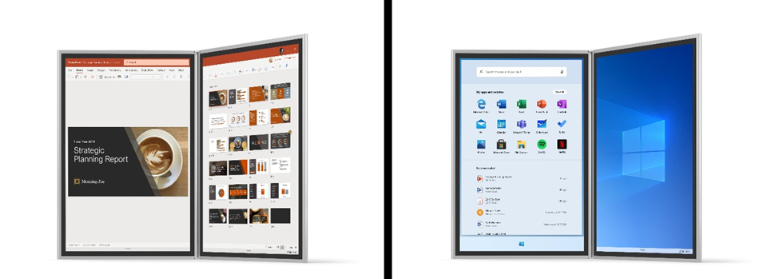

# Windows 10X Developer FAQ

> [!IMPORTANT]
> We recently announced some changes in the prioritization for Windows 10 and Windows 10X.
> These announcements include changes to the Windows 10X form factor priorities. [Read more here.](https://blogs.windows.com/windowsexperience/2020/05/04/accelerating-innovation-in-windows-10-to-meet-customers-where-they-are/)

Windows 10X is a product line in the Windows family optimized for use on dual-screen devices. As a developer, you can reach a wider audience by optimizing your app for Windows 10X, taking advantage of new features specific for a mobile and dual-screen audience while still enjoying the same breadth of Windows 10 functionality and rich desktop support. [We announced Windows 10X in late 2019](https://blogs.windows.com/windowsexperience/2019/10/02/introducing-windows-10x-enabling-dual-screen-pcs-in-2020/#6qxkItE2XMPu24uw.97), and we’re looking forward to releasing it in late 2020.

 
*[Pre-release product shown, screens simulated and subject to change]*

For more information about building dual-screen experiences and Windows 10X, check out the virtual sessions from the [Microsoft 365 Dev Day](https://developer.microsoft.com/microsoft-365/virtual-events), or the [dual-screen developer docs](/dual-screen/). For at-a-glance information, here are answers to some questions you might have.

### How is this different from developing for Windows 10?

For the majority of applications, it’s not different at all. Writing Windows 10X apps is supported through the Windows 10 SDK. As an expression of Windows 10, Windows 10X supports Windows Runtime (WinRT) APIs and runs Win32 apps through a native container. You can then call new APIs specifically designed for dual-screen devices from your new or existing UWP or Win32 apps, allowing them to access the features and benefits of this new platform.

### Does this replace desktop Windows 10?

No. Windows 10X will release in parallel to desktop releases of Windows 10. Desktop releases of Windows 10 will continue to provide enhancements and improvements to the modern desktop application story. Windows 10X is another platform optimized to support dual-screen platforms.

### When will Windows 10X be released?

Windows 10X will be released to accompany the Surface Neo and other third-party dual-screen devices in late 2020.

### When can I start development for Windows 10X?

You can download the [Microsoft Emulator and the Windows 10X Emulator Image](/dual-screen/windows/get-dev-tools) today. We will continue to improve this emulator, and complement it with support for other Windows 10X-enabled devices. These emulators, combined with prerelease versions of the Windows SDK, will allow you to develop for Windows 10X before the first dual-screen device is publicly released.

### Will my Universal Windows Platform (UWP) apps run on Windows 10X?

Most UWP apps are fully supported on Windows 10X, and function on devices running Windows 10X without any changes. All WinRT APIs are supported, as are most other features UWP apps have access to. As the prerelease development continues, we will release documentation detailing other unsupported features.

### Will my Win32 apps run on Windows 10X?

Windows 10X provides native support to run Win32 apps in a contained environment. Most Win32 apps can be run and debugged on a Windows 10X device without incident, and you can also use new Win32 APIs to add dual-screen support to your app.

### Are there any features of my app that won’t work on Windows 10X?

As Windows 10X continues its prerelease development, we will release documentation highlighting its specific limitations. However, the contained environment used to run Win32 apps does not include the Windows Shell, and thus Shell extensions and similar features won't be supported. Similarly, Windows 10X devices don't support APIs related to certain system settings, such as power-use options.

### If I enhance my app with Windows 10X features, will it still run on devices running desktop Windows 10?

Apps designed for Windows 10X still work on devices that run the desktop version of Windows 10, though these new Windows APIs won't be added to desktop versions of Windows 10 until the next major version update. Just as if you were developing an app supported on multiple versions of desktop Windows 10, follow [adaptive coding best practices](/windows/uwp/debug-test-perf/version-adaptive-code) to ensure that your app works gracefully on both 10X and desktop Windows 10.