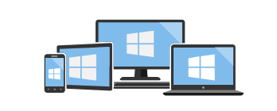

# Accessibility in Windows 10

Accessible apps are designed to be inclusive by improving usability for as many people as possible, including those with disabilities, personal preferences, specific work styles, or situational constraints (such as driving, cooking, glare, and so on).

This page provides information on how the various Windows development frameworks support accessibility for developers building Windows applications, assistive technology developers building tools such as screen readers and magnifiers, and software test engineers creating automated scripts for testing applications.

## Videos

<!-- <iframe src="https://www.youtube-nocookie.com/embed/WMklcdzcNcU" width="300" height="200" allowFullScreen="true" frameBorder="0"></iframe> -->

:::row:::
    :::column:::
        <!-- iframe src="https://channel9.msdn.com/Events/Build/2017/P4072" width="300" height="200" allowFullScreen="true" frameBorder="0"></iframe -->
        > [!VIDEO https://channel9.msdn.com/Events/Build/2017/P4072/player]
    :::column-end:::
    :::column:::
        <!-- iframe src="https://channel9.msdn.com/Blogs/One-Dev-Minute/Developing-Apps-for-Accessibility/player" width="300" height="200" allowFullScreen="true" frameBorder="0"></iframe -->
        > [!VIDEO https://channel9.msdn.com/Blogs/One-Dev-Minute/Developing-Apps-for-Accessibility/player]
    :::column-end:::
:::row-end:::

## Platform-specific documentation

:::row:::
    :::column:::
        

        ### Universal Windows Platform (UWP)

        Develop accessible apps and tools on the modern platform for Windows 10 applications and games on any Windows device (including PCs, phones, Xbox One, HoloLens, and more), and publish them to the Microsoft Store.

        [Designing inclusive software](https://docs.microsoft.com/windows/uwp/accessibility/designing-inclusive-software)

        [Developing inclusive Windows apps](https://docs.microsoft.com/windows/uwp/accessibility/developing-inclusive-windows-apps)

        [Accessibility testing](https://docs.microsoft.com/windows/uwp/accessibility/accessibility-testing)

        [Accessibility in the Store](https://docs.microsoft.com/windows/uwp/accessibility/accessibility-in-the-store)
    :::column-end:::
    :::column:::
        

        ### Win32 platform

        Develop accessible apps and tools on the original platform for C/C++ Windows applications.

        [What's new in Windows accessibility and automation](https://docs.microsoft.com/windows/desktop/accessibility-whatsnew)

        [Developing accessible applications for Windows](https://docs.microsoft.com/windows/desktop/accessibility-appdev)

        [Developing accessible UI frameworks for Windows](https://docs.microsoft.com/windows/desktop/accessibility-uiframeworkdev)

        [Developing assistive technology for Windows](https://docs.microsoft.com/windows/desktop/accessibility-atdev)

        [Testing for accessibility](https://docs.microsoft.com/windows/desktop/accessibility-testwithuia)

        [Legacy accessibility and automation technology - MSAA to UI Automation](https://docs.microsoft.com/windows/desktop/accessibility-legacy)

        [Windows Accessibility features](https://docs.microsoft.com/windows/desktop/winauto/about-windows-accessibility-features)

        [Guidelines for designing accessible apps](https://docs.microsoft.com/windows/desktop/uxguide/inter-accessibility)
    :::column-end:::
:::row-end:::
:::row:::
    :::column:::
        

        ### Windows Presentation Foundation (WPF)

        Develop accessible apps and tools on the established platform for managed Windows applications with a XAML UI model and the .NET Framework.

        [Accessibility Best Practices](https://docs.microsoft.com/dotnet/framework/ui-automation/accessibility-best-practices)

        [UI Automation Fundamentals](https://docs.microsoft.com/dotnet/framework/ui-automation/index)

        [UI Automation Providers for Managed Code](https://docs.microsoft.com/dotnet/framework/ui-automation/ui-automation-providers-for-managed-code)

        [UI Automation Clients for Managed Code](https://docs.microsoft.com/dotnet/framework/ui-automation/ui-automation-clients-for-managed-code)

        [UI Automation Control Patterns](https://docs.microsoft.com/dotnet/framework/ui-automation/ui-automation-control-patterns)

        [UI Automation Text Pattern](https://docs.microsoft.com/dotnet/framework/ui-automation/ui-automation-text-pattern)

        [UI Automation Control Types](https://docs.microsoft.com/dotnet/framework/ui-automation/ui-automation-control-types)

        [UI Automation Specification and Community Promise](https://docs.microsoft.com/dotnet/framework/ui-automation/ui-automation-specification-and-community-promise)
        :::column-end:::
    :::column:::
        

        ### Windows Forms (WinForms)

        Develop accessible apps and tools for managed Windows applications with a XAML UI model and the .NET Framework.

        [Windows Forms Accessibility](https://docs.microsoft.com/dotnet/framework/winforms/advanced/windows-forms-accessibility)

        [Creating an Accessible Windows Application](https://docs.microsoft.com/dotnet/framework/winforms/advanced/walkthrough-creating-an-accessible-windows-based-application)

        [Properties on Windows Forms Controls That Support Accessibility Guidelines](https://docs.microsoft.com/dotnet/framework/winforms/advanced/properties-on-windows-forms-controls-that-support-accessibility-guidelines)

        [Providing Accessibility Information for Controls on a Windows Form](https://docs.microsoft.com/dotnet/framework/winforms/controls/providing-accessibility-information-for-controls-on-a-windows-form)
    :::column-end:::
<!--         
    :::column:::

        ### .NET

        Develop accessible apps and tools for managed Windows applications with the .NET Framework.
    :::column-end:::
    :::column:::

    :::column-end:::
 -->    
:::row-end:::