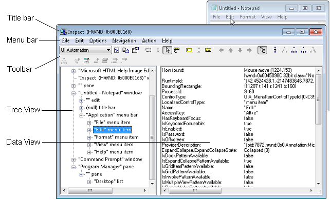

# Accessibility testing

This topic describes various tools and procedures for verifying the accessibility of your Windows app.

It is intended for teams that prioritize accessibility and automated testing throughout the development lifecycle. The most effective approach combines automation that runs in CI with focused manual assistive technology testing for high-risk scenarios.

## Successful user experiences

Programmatic and keyboard access are essential for accessibility. Test your Windows app, assistive technology (AT) tools, and UI frameworks to ensure a successful experience for people with vision, learning, dexterity/mobility, or language/communication disabilities, as well as people who prefer keyboard navigation.

Without adequate support for assistive technology (AT), such as screen readers and on-screen keyboards, many users may find your app difficult or impossible to use.

## Accessibility testing tools

Use the tools in this section throughout development, not just before release. Start with Accessibility Insights for fast, high-impact checks, then use legacy SDK tools for deeper inspection of UI Automation properties, events, or control patterns.

### Accessibility Insights

[Accessibility Insights](https://accessibilityinsights.io/) helps developers find and fix accessibility issues in both websites and Windows applications.

> [!VIDEO https://www.youtube.com/embed/Xlvl91Q3c_8]

- [Accessibility Insights for Windows](https://accessibilityinsights.io/docs/windows/overview) helps developers find and fix accessibility issues in Windows apps. The tool supports three primary scenarios:
  - **Live Inspect** lets developers verify that an element in an app has the right UI Automation properties simply by hovering over the element or setting keyboard focus on it.
  - **FastPass** - a lightweight, two-step process that helps developers identify common, high-impact accessibility issues in less than five minutes.
  - **Troubleshooting** allows you to diagnose and fix specific accessibility issues.
- [Accessibility Insights for Web](https://accessibilityinsights.io/docs/web/overview) is an extension for Chrome and [Microsoft Edge Insider](https://www.microsoftedgeinsider.com) that helps developers find and fix accessibility issues in web apps and sites. It supports two primary scenarios:
  - **FastPass** - a lightweight, two-step process that helps developers identify common, high-impact accessibility issues in less than five minutes.  
  - **Assessment** - lets anyone verify that a web site is 100% compliant with accessibility standards and guidelines. [Accessibility Insights](https://accessibilityinsights.io/) also lets you review UI Automation elements, properties, control patterns, and events (similar to the [Inspect](/windows/desktop/winauto/inspect-objects) and [AccEvent](/windows/desktop/winauto/accessible-event-watcher) legacy tools described in the following section).

### Legacy testing tools

> [!NOTE]
> The tools described here are still available in the Windows SDK, but we strongly recommend transitioning to [Accessibility Insights](https://accessibilityinsights.io/).

The Windows Software Development Kit (SDK) includes several accessibility testing tools, including [**AccScope**](/windows/desktop/WinAuto/accscope), [**Inspect**](/windows/desktop/WinAuto/inspect-objects) and [**UI Accessibility Checker**](/windows/desktop/WinAuto/ui-accessibility-checker), among others.

You can launch the following accessibility testing tools either from a Microsoft Visual Studio command prompt or by navigating to the *bin* folder of wherever the Windows SDK is installed on your development machine.
  
### **AccScope**  

The [**AccScope**](/windows/desktop/WinAuto/accscope) Enables visual evaluation of an application's accessibility during the early design and development phases. AccScope is specifically intended for testing Narrator accessibility scenarios and uses the UI Automation information provided by an app to show where accessibility can be improved.

### **Inspect**  

[**Inspect**](/windows/desktop/WinAuto/inspect-objects) enables you to select any UI element and view its accessibility data. You can view Microsoft UI Automation properties and control patterns and test the navigational structure of the automation elements in the UI Automation tree. It is especially useful for ensuring properties and control patterns are set correctly when extending a common control or creating a custom control.

Use **Inspect** as you develop the UI to verify how accessibility attributes are exposed in UI Automation. In some cases the attributes come from the UI Automation support that is already implemented for default XAML controls. In other cases the attributes come from specific values that you have set in your XAML markup, as [**AutomationProperties**](/windows/windows-app-sdk/api/winrt/microsoft.ui.xaml.automation.automationproperties) attached properties.

The following image shows the [**Inspect**](/windows/desktop/WinAuto/inspect-objects) tool querying the UI Automation properties of the **Edit** menu element in Notepad.

### UI Accessibility Checker

**UI Accessibility Checker (AccChecker)** helps you discover potential accessibility issues at run time. AccChecker includes verification checks for UI Automation, Microsoft Active Accessibility, and Accessible Rich Internet Applications (ARIA). It can provide a static check for errors such as missing names, tree issues and more. It helps verify programmatic access and includes advanced features for automating accessibility testing. You can run **AccChecker** in UI or command line mode. To run the UI mode tool, open the *AccChecker* folder in the Windows SDK *bin* folder, run acccheckui.exe, and click the **Help** menu.

### UI Automation Verify

**UI Automation Verify (UIA Verify)** is a framework for manual and automated testing of the UI Automation implementation in a control or application (results can be logged). **UIA Verify** can integrate into the test code and conduct regular, automated testing or spot checks of UI Automation scenarios and is useful for verifying that changes to applications with established features do not have new issues or regressions. **UIA Verify** can be found in the *UIAVerify* subfolder of the Windows SDK *bin* folder.

### Accessible Event Watcher

[**Accessible Event Watcher (AccEvent)**](/windows/desktop/WinAuto/accessible-event-watcher) tests whether an app's UI elements fire proper UI Automation and Microsoft Active Accessibility events when UI changes occur. Changes in the UI can occur when the focus changes, or when a UI element is invoked, selected, or has a state or property change. AccEvent is typically used to debug issues and to validate that custom and extended controls are working correctly.

## Accessibility testing procedures

### Build an automation-first accessibility workflow

Use accessibility testing as a release gate, in the same way you use unit, integration, and reliability tests.

1. Define baseline accessibility expectations for core user flows and control behavior.
2. Add automated checks that run in pull requests and CI to detect regressions quickly.
3. Fail builds when critical accessibility issues are detected, and track exemptions with an owner and expiration date.
4. Schedule manual screen reader and keyboard validation for scenarios where human judgment is required.
5. Retest affected scenarios whenever templates, control logic, or navigation behavior changes.

### Test keyboard accessibility

Validate keyboard behavior without pointer input. Confirm a complete and logical *Tab* sequence across all interactive elements, expected arrow-key navigation within composite controls, and reliable keyboard invocation of actions (typically *Enter* or *Spacebar*) for every focusable command surface.

### Verify the contrast ratio of visible text

Use color contrast tools to verify that the visible text contrast ratio is acceptable. The exceptions include inactive UI elements, and logos or decorative text that doesn't convey any information and can be rearranged without changing the meaning. See [Accessible text requirements](accessible-text-requirements.md) for more information on contrast ratio and exceptions. See [Techniques for WCAG 2.0 G18 (Resources section)](https://www.w3.org/TR/WCAG20-TECHS/G18.html#G18-resources) for tools that can test contrast ratios.

> [!NOTE]
> Some of the tools listed by Techniques for WCAG 2.0 G18 can't be used interactively with a Windows app. You may need to enter foreground and background color values manually in the tool, make screen captures of app UI and then run the contrast ratio tool over the screen capture image, or run the tool while opening source bitmap files in an image editing program rather than while that image is loaded by the app.

### Verify your app in high contrast

Use your app while a high-contrast theme is active to verify that all the UI elements display correctly. All text should be readable, and all images should be clear. Adjust the XAML theme-dictionary resources or control templates to correct any theme issues that come from controls. In cases where prominent high-contrast issues are not coming from themes or controls (such as from image files), provide separate versions to use when a high-contrast theme is active.

### Verify your app with display settings  

Validate UI scaling across system DPI changes, including accessibility-driven scaling scenarios. If layout or rendering regressions appear, apply the [Guidelines for layout scaling](https://developer.microsoft.com/windows/apps/design) and add resources for affected scale factors.

### Verify main app scenarios by using Narrator

Use Narrator to test the screen reading experience for your app.

**Use these steps to test your app using Narrator with a mouse and keyboard:**

1. Start Narrator by pressing *Windows logo key + Ctrl + Enter*. In versions prior to Windows 10 version 1607, use *Windows logo key + Enter* to start Narrator.
2. Navigate your app with the keyboard by using the *Tab* key, the arrow keys, and the *Caps Lock + arrow keys*.
3. As you navigate your app, listen as Narrator reads the elements of your UI and verify the following:
    - For each control, ensure that Narrator reads all visible content. Also ensure that Narrator reads each control's name, any applicable state (checked, selected, and so on), and the control type (button, check box, list item, and so on).
    - If the element is interactive, verify that you can use Narrator to invoke its action by pressing *Caps Lock + Enter*.
    - For each table, ensure that Narrator correctly reads the table name, the table description (if available), and the row and column headings.
4. Press *Caps Lock + Shift + Enter* to search your app and verify that all of your controls appear in the search list, and that the control names are localized and readable.
5. Turn off your monitor and try to accomplish main app scenarios by using only the keyboard and Narrator. To get the full list of Narrator commands and shortcuts, press *Caps Lock + F1*.

While Narrator is running, enable developer mode with *Control + Caps Lock + F12*. Developer mode masks the screen and highlights only programmatically exposed accessible objects and text, making it easier to validate Narrator-visible output.

**Use these steps to test your app using Narrator's touch mode:**

> [!NOTE]
> Narrator automatically enters touch mode on devices that support 4+ contacts. Narrator doesn't support multi-monitor scenarios or multi-touch digitizers on the primary screen.

1. Get familiar with the UI and explore the layout.
    - **Navigate through the UI by using single-finger swipe gestures.** Use left or right swipes to move between items, and up or down swipes to change the category of items being navigated. Categories include all items, links, tables, headers, and so on. Navigating with single-finger swipe gestures is similar to navigating with *Caps Lock + Arrow*.
    - **Use tab gestures to navigate through focusable elements.** A three-finger swipe to the right or left is the same as navigating with *Tab* and *Shift + Tab* on a keyboard.
    - **Spatially investigate the UI with a single finger.** Drag a single finger up and down, or left and right, to have Narrator read the items under your finger. You can use the mouse as an alternative because it uses the same hit-testing logic as dragging a single finger.
    - **Read the entire window and all its contents with a three finger swipe up**. This is equivalent to using *Caps Lock + W*.

    If there is important UI that you cannot reach, you may have an accessibility issue.

2. Interact with a control to test its primary and secondary actions, and its scrolling behavior.

    Primary actions include things like activating a button, placing a text caret, and setting focus to the control. Secondary actions include actions such as selecting a list item or expanding a button that offers multiple options.

    - To test a primary action: Double tap, or press with one finger and tap with another.
    - To test a secondary action: Triple tap, or press with one finger and double tap with another.
    - To test scrolling behavior: Use two-finger swipes to scroll in the desired direction.

    Some controls provide additional actions. To display the full list, enter a single four-finger tap.

    If a control responds to the mouse or keyboard but does not respond to a primary or secondary touch interaction, the control might need to implement additional [UI Automation](/windows/desktop/WinAuto/entry-uiauto-win32) control patterns.

You should also consider using the [**AccScope**](/windows/desktop/WinAuto/accscope) tool to test Narrator accessibility scenarios with your app. The [**AccScope tool topic**](/windows/desktop/WinAuto/accscope) describes how to configure **AccScope** to test Narrator scenarios.

### Examine the UI Automation representation for your app

Use UI Automation inspection tools to view your app as the UIA element tree consumed by assistive technologies.

[**AccScope**](/windows/desktop/WinAuto/accscope) is useful because it shows the tree as either a list or a visual overlay, letting you correlate automation structure with rendered UI. This is effective even for early UI prototypes, before full interaction logic is implemented.

Verify that only intended elements appear in each accessibility view and that required elements are present. Use [**AutomationProperties.AccessibilityView**](/windows/windows-app-sdk/api/winrt/microsoft.ui.xaml.automation.automationproperties.accessibilityviewproperty) to correct omissions or overexposure, then revalidate tab order and arrow-key navigation for all interactive elements in control view.

## Related topics

- [Accessibility overview](accessibility-overview.md)
- [Practices to avoid](practices-to-avoid.md)
- [UI Automation](/windows/desktop/WinAuto/entry-uiauto-win32)
- [Accessibility in Windows](https://www.microsoft.com/accessibility/)
- [Get started with Narrator](https://support.microsoft.com/help/22798/windows-10-complete-guide-to-narrator)