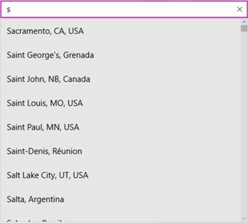
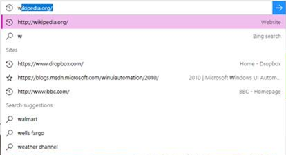
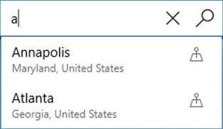

# Accessible text requirements

This topic covers accessible text requirements for Windows apps, including contrast, UI Automation text roles, and guidance for text in graphics.

## Contrast ratios

Do not treat high-contrast mode as the primary mitigation for low readability. Base text design on sufficient foreground/background contrast in the default experience.

Contrast evaluation is deterministic and does not account for hue perception. For example, red text on a green background can be unreadable for some users with color vision deficiencies, even when the colors appear visually distinct.

The recommendations in this section align with [G18: Ensuring that a contrast ratio of at least 4.5:1 exists between text (and images of text) and background behind the text](https://www.w3.org/TR/WCAG20-TECHS/G18.html) in *W3C Techniques for WCAG 2.0*.

To meet this requirement, visible text must have a minimum luminance contrast ratio of 4.5:1 against its background. Exceptions include logos and incidental text, such as text in inactive UI.

Decorative text that conveys no information is excluded. For example, words used only as a visual background, and are interchangeable without changing meaning, do not need to meet this criterion.

Use color contrast tools to verify that the visible text contrast ratio is acceptable. See [Techniques for WCAG 2.0 G18 (Resources section)](https://www.w3.org/TR/WCAG20-TECHS/G18.html#G18-resources) for tools that can test contrast ratios.

> [!NOTE]
> Some of the tools listed by Techniques for WCAG 2.0 G18 can't be used interactively with a Windows app. You may need to enter foreground and background color values manually in the tool, or make screen captures of app UI and then run the contrast ratio tool over the screen capture image.

## Text element roles  

Windows apps commonly use the following text elements and roles:

- [**TextBlock**](/windows/windows-app-sdk/api/winrt/microsoft.ui.xaml.controls.textblock): role is [**Text**](/windows/windows-app-sdk/api/winrt/microsoft.ui.xaml.automation.peers.automationcontroltype)
- [**TextBox**](/windows/windows-app-sdk/api/winrt/microsoft.ui.xaml.controls.textbox): role is [**Edit**](/windows/windows-app-sdk/api/winrt/microsoft.ui.xaml.automation.peers.automationcontroltype)
- [**RichTextBlock**](/windows/windows-app-sdk/api/winrt/microsoft.ui.xaml.controls.richtextblock) (and overflow class [**RichTextBlockOverflow**](/windows/windows-app-sdk/api/winrt/microsoft.ui.xaml.controls.richtextblockoverflow)): role is [**Text**](/windows/windows-app-sdk/api/winrt/microsoft.ui.xaml.automation.peers.automationcontroltype)
- [**RichEditBox**](/windows/windows-app-sdk/api/winrt/microsoft.ui.xaml.controls.richeditbox): role is [**Edit**](/windows/windows-app-sdk/api/winrt/microsoft.ui.xaml.automation.peers.automationcontroltype)

When a control reports the [**Edit**](/windows/windows-app-sdk/api/winrt/microsoft.ui.xaml.automation.peers.automationcontroltype) role, assistive technologies assume the value can be edited by the user. Putting static text in a [**TextBox**](/windows/windows-app-sdk/api/winrt/microsoft.ui.xaml.controls.textbox) misreports both role and interaction model.

For static text, use [**TextBlock**](/windows/windows-app-sdk/api/winrt/microsoft.ui.xaml.controls.textblock) and [**RichTextBlock**](/windows/windows-app-sdk/api/winrt/microsoft.ui.xaml.controls.richtextblock). These are not [**Control**](/windows/windows-app-sdk/api/winrt/microsoft.ui.xaml.controls.control) subclasses, are not keyboard-focusable, and typically do not appear in tab order but screen readers can still read them through reading/navigation modes that are independent of focus (for example, virtual cursor behavior).

Avoid placing static text in focusable containers just to expose it through tab navigation. Users expect tab stops to be actionable, and static content in tab order is usually a usability regression. Validate behavior with Narrator.

## Auto-suggest accessibility

Auto-suggest is the pattern where a suggestions list updates while the user types in an input field. If you use XAML [**AutosuggestBox**](/windows/windows-app-sdk/api/winrt/microsoft.ui.xaml.controls.autosuggestbox) or intrinsic HTML controls, most accessibility wiring is built in.

To make custom implementations accessible, the input and suggestion list must be associated in the UIA tree. See [Implementing auto-suggest](#implementing-auto-suggest).

Narrator supports this pattern with a dedicated suggestions experience. When the input and list are connected correctly, users can:

- Know the list is present and when the list closes
- Know how many suggestions are available
- Know the selected item, if any
- Be able to move Narrator focus to the list
- Be able to navigate through a suggestion with all other reading modes

<br/>
*Example of a suggestion list*

### Implementing auto-suggest

Associate the input field and suggestion list in the UIA tree. Use [UIA_ControllerForPropertyId](/windows/win32/winauto/uiauto-automation-element-propids) in desktop apps or [ControlledPeers](/windows/windows-app-sdk/api/winrt/microsoft.ui.xaml.automation.automationproperties.getcontrolledpeers) in XAML apps.

There are two common auto-suggest behaviors.

**Default selection**  
If the list has a default selection, Narrator expects [**UIA_SelectionItem_ElementSelectedEventId**](/windows/desktop/WinAuto/uiauto-event-ids) in desktop apps or [**AutomationEvents.SelectionItemPatternOnElementSelected**](/windows/windows-app-sdk/api/winrt/microsoft.ui.xaml.automation.peers.automationevents) in XAML apps.

Fire the corresponding selected event whenever selection changes, including updates caused by typing or list navigation.

<br/>
*Example where there is a default selection*

**No default selection**  
If there is no default selection, Narrator expects [**UIA_LayoutInvalidatedEventId**](/windows/desktop/WinAuto/uiauto-event-ids) in desktop apps or [**LayoutInvalidated**](/windows/windows-app-sdk/api/winrt/microsoft.ui.xaml.automation.peers.automationevents) in XAML apps whenever the list updates.

<br/>
*Example where there is no default selection*

### XAML implementation

With the default [**AutosuggestBox**](/windows/windows-app-sdk/api/winrt/microsoft.ui.xaml.controls.autosuggestbox), required accessibility behavior is already wired.

For custom implementations (such as [**TextBox**](/windows/windows-app-sdk/api/winrt/microsoft.ui.xaml.controls.textbox) plus list), set [**AutomationProperties.ControlledPeers**](/windows/windows-app-sdk/api/winrt/microsoft.ui.xaml.automation.automationproperties.getcontrolledpeers) on the **TextBox**. Fire **AutomationPropertyChanged** whenever **ControlledPeers** is added or removed, and raise either [**SelectionItemPatternOnElementSelected**](/windows/windows-app-sdk/api/winrt/microsoft.ui.xaml.automation.peers.automationevents) or [**LayoutInvalidated**](/windows/windows-app-sdk/api/winrt/microsoft.ui.xaml.automation.peers.automationevents), based on your scenario.

### HTML implementation

With intrinsic HTML controls, the UIA mapping is already provided. Example:

```html
<label>Sites <input id="input1" type="text" list="datalist1" /></label>
<datalist id="datalist1">
        <option value="http://www.google.com/" label="Google"></option>
        <option value="http://www.reddit.com/" label="Reddit"></option>
</datalist>
```

If you build custom controls, implement the required [ARIA semantics](https://www.w3.org/TR/html-aria/) as defined by W3C standards.

## Text in graphics

Avoid embedding text in graphics when possible. Text rendered inside an [**Image**](/windows/windows-app-sdk/api/winrt/microsoft.ui.xaml.controls.image) source is not automatically readable by assistive technologies.

If text in graphics is required, set [**AutomationProperties.Name**](/windows/windows-app-sdk/api/winrt/microsoft.ui.xaml.automation.automationproperties) to equivalent content (or a concise semantic summary). Apply the same principle to text-like content rendered through [**Path**](/windows/windows-app-sdk/api/winrt/microsoft.ui.xaml.shapes.path) or [**Glyphs**](/windows/windows-app-sdk/api/winrt/microsoft.ui.xaml.documents.glyphs).

## Text font size and scale

Text that is too small can cause readability issues. Start with a reasonable default size throughout the app.

You should then validate against Windows text-related accessibility settings, including:

- Magnifier, which enlarges part of the UI. Ensure layout and line wrapping remain readable under magnification.
- Global scale and resolution settings in **Settings->System->Display->Scale and layout**. Available values vary by display hardware.
- Text size settings in **Settings->Ease of access->Display**. **Make text bigger** scales text in supported controls across apps and screens (WinUI text controls support this by default).

> [!NOTE]
> The **Make everything bigger** setting lets a user specify their preferred size for text and apps in general on their primary screen only.

Many text elements and controls expose [**IsTextScaleFactorEnabled**](/windows/windows-app-sdk/api/winrt/microsoft.ui.xaml.controls.textblock.istextscalefactorenabled), which defaults to **true**. When enabled, text scales automatically, with smaller **FontSize** values typically affected more than larger ones.

Set **IsTextScaleFactorEnabled** to **false** only when necessary.

See [Text scaling](../input/text-scaling.md) for more details.

Use this sample to compare behavior with and without **IsTextScaleFactorEnabled** when **Text size** changes.

```xaml
<TextBlock Text="In this case, IsTextScaleFactorEnabled has been left set to its default value of true."
    Style="{StaticResource BodyTextBlockStyle}"/>

<TextBlock Text="In this case, IsTextScaleFactorEnabled has been set to false."
    Style="{StaticResource BodyTextBlockStyle}" IsTextScaleFactorEnabled="False"/>
```  

Avoid disabling text scaling broadly. Consistent cross-app text scaling is an important accessibility capability.

WinUI text controls support the full text scaling experience without any customization or templating. For other WinRT-based apps, you can monitor [**TextScaleFactorChanged**](/uwp/api/windows.ui.viewmanagement.uisettings.textscalefactorchanged) and get the [**TextScaleFactor**](/uwp/api/windows.ui.viewmanagement.uisettings.textscalefactor) to react to system text size changes:

```csharp
private readonly Windows.UI.ViewManagement.UISettings _uiSettings = new();

public MainWindow()
{
    InitializeComponent();
    _uiSettings.TextScaleFactorChanged += UISettings_TextScaleFactorChanged;
}

private void UISettings_TextScaleFactorChanged(Windows.UI.ViewManagement.UISettings sender, object args)
{
    // Marshal to the UI thread before applying layout or visual updates.
    DispatcherQueue.TryEnqueue(() =>
    {
        var scale = sender.TextScaleFactor;
        // Apply updates for UI that depends on text scale.
    });
}
```

**TextScaleFactor** is a `double` in the range \[1,2.25\]. You can use it to coordinate related UI elements (for example, scaling graphics with text).

Do not assume uniform scaling across all text sizes. Larger text is generally affected less than smaller text.

These types have an **IsTextScaleFactorEnabled** property:

- [**ContentPresenter**](/windows/windows-app-sdk/api/winrt/microsoft.ui.xaml.controls.contentpresenter)
- [**Control**](/windows/windows-app-sdk/api/winrt/microsoft.ui.xaml.controls.control) and derived classes
- [**FontIcon**](/windows/windows-app-sdk/api/winrt/microsoft.ui.xaml.controls.fonticon)
- [**RichTextBlock**](/windows/windows-app-sdk/api/winrt/microsoft.ui.xaml.controls.richtextblock)
- [**TextBlock**](/windows/windows-app-sdk/api/winrt/microsoft.ui.xaml.controls.textblock)
- [**TextElement**](/windows/windows-app-sdk/api/winrt/microsoft.ui.xaml.documents.textelement) and derived classes

## Examples

> [!div class="nextstepaction"]
> [Open the WinUI 3 Gallery app and see text accessibility support in action](winui3gallery://item/AccessibilityScreenReader)

[!INCLUDE [winui-3-gallery](../../../includes/winui-3-gallery.md)]

## Related topics  

- [Text scaling](../input/text-scaling.md)
- [Accessibility overview](accessibility-overview.md)
- [Basic accessibility information](basic-accessibility-information.md)
- [XAML text display sample](https://github.com/microsoftarchive/msdn-code-gallery-microsoft/tree/411c271e537727d737a53fa2cbe99eaecac00cc0/Official%20Windows%20Platform%20Sample/Windows%208%20app%20samples/%5BC%23%5D-Windows%208%20app%20samples/C%23/Windows%208%20app%20samples/XAML%20text%20display%20sample%20(Windows%208)) (archived legacy sample)
- [XAML text editing sample](https://github.com/microsoftarchive/msdn-code-gallery-microsoft/tree/411c271e537727d737a53fa2cbe99eaecac00cc0/Official%20Windows%20Platform%20Sample/Windows%208%20app%20samples/%5BC%23%5D-Windows%208%20app%20samples/C%23/Windows%208%20app%20samples/XAML%20text%20editing%20sample%20(Windows%208)) (archived legacy sample)
- [XAML accessibility sample](https://github.com/microsoftarchive/msdn-code-gallery-microsoft/tree/411c271e537727d737a53fa2cbe99eaecac00cc0/Official%20Windows%20Platform%20Sample/XAML%20accessibility%20sample) (archived legacy sample)
