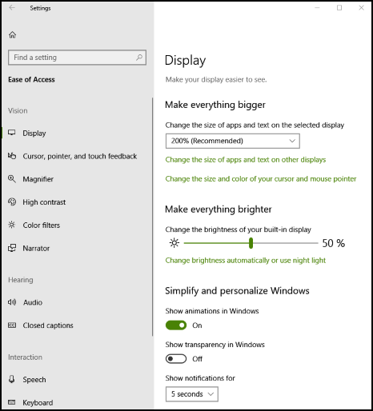

# Landmarks and Headings

**Landmarks** and **headings** help users of assistive technology (AT) navigate a UI more efficiently by uniquely identifying different sections of a user interface.

## Background

A user interface is typically organized in a visually efficient way, allowing a sighted user to quickly skim for what interests them without having to slow down to read *all* the content. A screen reader user needs to have this same skimming ability. Marking content as landmarks and headings provides the user of a screen reader the option to skim content similar to the way a sighted user would.

The concepts of [ARIA landmarks](https://www.w3.org/WAI/GL/wiki/Using_ARIA_landmarks_to_identify_regions_of_a_page), [ARIA headings](https://www.w3.org/TR/WCAG20-TECHS/ARIA12.html), and [HTML headings](https://www.w3.org/TR/2016/NOTE-WCAG20-TECHS-20161007/H42.html) have been used in web content for years to allow faster navigation by screen reader users. Web pages utilize landmarks and headings to make their content more usable by allowing the AT user to quickly get to the large chunk (landmark) and smaller chunk (heading).

Specifically, screen readers have commands allowing users to jump between landmarks and jump between headings (next/previous or specific heading level).

Landmarks enable content to be grouped into various categories such as *search*, *navigation*, *main content*, and so on. Once grouped, the AT user can quickly navigate between the groups. This quick navigation allows the user to skip potentially substantial amounts of content that previously required navigation item by item.

For example, when using a tab panel, consider making it a *navigation* landmark. When using a search edit box, consider making it a *search* landmark, and consider setting your main content as a *main content* landmark.

Whether within a landmark or even outside a landmark, consider annotating sub-elements as headings with logical heading levels.

## Example: Settings

Consider the **Ease of Access** page in the Windows Settings app.

  

There is a search edit box which is wrapped within a search landmark. The navigational elements on the left are wrapped within a navigational landmark and the main content on the right is wrapped within a main content landmark.

Taking this further, within the navigational landmark there is a main group heading called **Ease of Access** which is a heading level 1. Under that are the sub options **Vison**, **Hearing**, and so on. These have a heading level 2. Setting headings is continued within the main content again setting the main subject, **Display**, as heading level 1 and sub groups such as **Make everything bigger** as heading level 2.

The Settings app would be accessible without landmarks and headings, but it becomes more usable with them. A screen reader user can quickly and easily get to the group (landmark) they need and then quickly get to the sub group (heading) as well.

## Usage

Use [AutomationProperties.LandmarkTypeProperty](/uwp/api/windows.ui.xaml.automation.automationproperties.LandmarkTypeProperty) to setup the UI element as the [type of landmark](/windows/desktop/WinAuto/landmark-type-identifiers) you wish. This landmark UI element would encapsulate all the other UI elements which make sense for that landmark.

Use [AutomationProperties.LocalizedLandmarkTypeProperty](/uwp/api/windows.ui.xaml.automation.automationproperties.LocalizedLandmarkTypeProperty) to specifically name the landmark. If you select a predefined landmark type such as main or navigational, these names will be used for the landmark name. However, if you set the landmark type to custom you must specifically name the landmark through this property. You can also use this property to override the default names from the non-custom landmark types.

Use [AutomationProperties.HeadingLevel](/uwp/api/windows.ui.xaml.automation.automationproperties.headinglevelproperty) to set the UI element as a heading of a specific level from *Level1* through *Level9*.

## Examples

For numerous code samples showing how to resolve many common programmatic accessibility issues in Windows desktop apps, see [Code samples for resolving common programmatic accessibility issues in Windows desktop apps](/accessibility-tools-docs/).

These code samples are referenced directly by[ Microsoft Accessibility Insights for Windows](https://github.com/microsoft/accessibility-insights-windows), which can help to spotlight many accessibility issues in UI.
