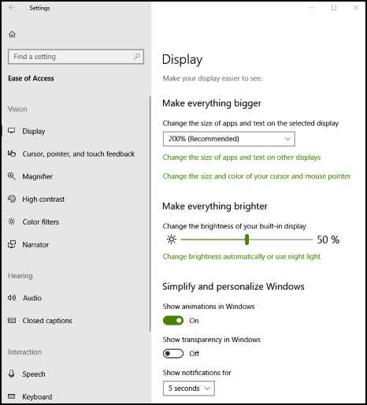

# Landmarks and Headings

**Landmarks** and **headings** help assistive technologies expose a predictable navigation model for complex UI. When applied correctly, they let users move through major regions and then drill into subsection content without traversing every intermediate control.

## Overview

A visual layout usually allows sighted users to scan quickly and prioritize the content that matters to their current task. Screen reader users need an equivalent mechanism for rapid orientation and selective traversal. Landmarks and headings provide that mechanism by adding explicit structure to the automation representation of the UI.

This model is consistent with long-established web accessibility patterns, including [ARIA landmarks](https://www.w3.org/WAI/GL/wiki/Using_ARIA_landmarks_to_identify_regions_of_a_page), [ARIA headings](https://www.w3.org/TR/WCAG20-TECHS/ARIA12.html), and [HTML headings](https://www.w3.org/TR/2016/NOTE-WCAG20-TECHS-20161007/H42.html). In each case, the goal is the same: provide navigable structure so users can jump to major regions (landmarks) and then to minor section boundaries (headings).

Most screen readers expose dedicated commands for landmark navigation and heading navigation, including next/previous traversal and, where supported, filtering by heading level.

Landmarks let you group content into meaningful regions such as *search*, *navigation*, and *main content*. After those regions are identified, users can move directly between them instead of traversing control-by-control through unrelated content.

For example, a tabbed area is often best represented as a *navigation* landmark. A search input area is a good candidate for a *search* landmark, and the primary task surface should usually be exposed as a *main content* landmark.

Within a landmark, and in some cases outside one, annotate sub-sections as headings using a logical level hierarchy. That hierarchy helps users build a mental model of scope and depth while they navigate.

## Windows Settings

The following image shows the **Ease of Access** page in a previous version of Windows Settings.

  

In this page layout, the search input is assigned to a search landmark, the left-side navigation is assigned to a navigation landmark, and the primary content pane on the right is assigned to a main-content landmark.

Inside the navigation landmark, **Ease of Access** serves as a top-level heading (level 1), with child categories such as **Vision** and **Hearing** represented at level 2. In the main-content region, **Display** can be level 1, with subsections such as **Make everything bigger** represented at level 2.

The page remains technically operable without landmarks and headings, but usability is substantially better when both are present. A screen reader user can first jump to the relevant region and then quickly navigate to the specific subsection they need.

## Usage

Use [AutomationProperties.LandmarkTypeProperty](/windows/windows-app-sdk/api/winrt/microsoft.ui.xaml.automation.automationproperties.LandmarkTypeProperty) to identify the [landmark type](/windows/desktop/WinAuto/landmark-type-identifiers) of a UI container. That container should encapsulate the set of elements that belong to the same navigational region.

Use [AutomationProperties.LocalizedLandmarkTypeProperty](/windows/windows-app-sdk/api/winrt/microsoft.ui.xaml.automation.automationproperties.LocalizedLandmarkTypeProperty) to provide the landmark label announced to users. For predefined landmark types (for example, main or navigation), assistive technologies can use built-in naming conventions. For custom landmark types, you should set this property explicitly, and you can also use it to override default labels when a more task-specific name is helpful.

Use [AutomationProperties.HeadingLevel](/windows/windows-app-sdk/api/winrt/microsoft.ui.xaml.automation.automationproperties.headinglevelproperty) to mark an element as a heading and assign a level from *Level1* through *Level9*. Keep heading levels semantically consistent so users can infer section nesting and move through content predictably.

Support F6-based pane traversal when your app contains multiple major regions. This is a familiar pattern in complex desktop applications such as File Explorer and Outlook, and it complements landmark and heading semantics by providing a keyboard-first region-jump mechanism. For implementation guidance, see [Keyboard navigation between application panes with F6](keyboard-accessibility.md#keyboard-navigation-between-application-panes-with-f6).

## Examples

See [Code samples for resolving common programmatic accessibility issues in Windows desktop apps](/accessibility-tools-docs/) for practical implementations that address recurring accessibility defects.

These samples are also referenced by [Microsoft Accessibility Insights for Windows](https://github.com/microsoft/accessibility-insights-windows), which can help you detect and triage accessibility issues in your app UI.
