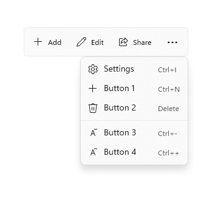
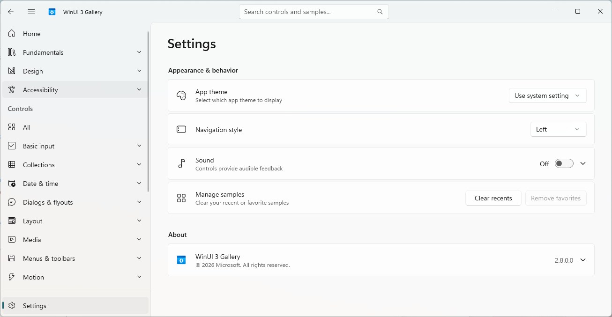
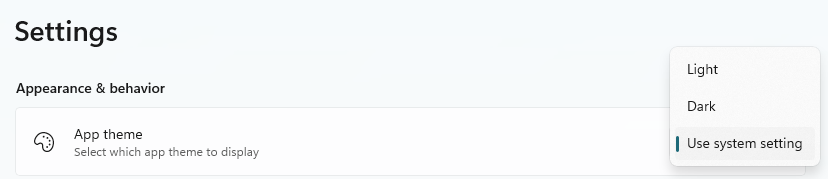
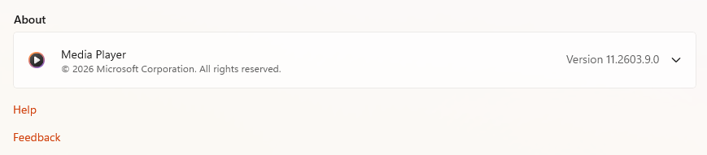

# Guidelines for app settings

App settings are the user-customizable portions of your Windows app, accessed through a dedicated settings page. For example, a news reader app might let the user specify which news sources to display or how many columns to display on the screen, while a weather app could let the user choose between Celsius and Fahrenheit. This article provides recommendations and best practices for creating and displaying app settings in WinUI apps.

## When to provide a settings page

Here are examples of app options that belong in an app settings page:

- Configuration options that affect the behavior of the app and don't require frequent readjustment, like choosing between Celsius or Fahrenheit as default units for temperature in a weather app, changing account settings for a mail app, settings for notifications, or accessibility options.
- Options that depend on the user's preferences, like music, sound effects, or color themes.
- App information that isn't accessed very often, such as privacy policy, help, app version, or copyright info.

Commands that are part of the typical app workflow (for example, changing the brush size in an art app) shouldn't be in a settings page. To learn more about command placement, see [Command design basics](../basics/commanding-basics.md).

## General recommendations

- Keep settings pages simple and make use of binary (on/off) controls. A [toggle switch](../../develop/ui/controls/toggles.md) is usually the best control for a binary setting.
- For settings that let users choose one item from a set of up to 5 mutually exclusive, related options, use [radio buttons](../../develop/ui/controls/radio-button.md).
- Create an entry point for all app settings in your app's settings page.
- Keep your settings simple. Define smart defaults and keep the number of settings to a minimum.
- When a user changes a setting, the app should immediately reflect the change.
- Don't include commands that are part of the common app workflow.

## Entry point

The way that users get to your app settings page should be based on your app's layout.

**Navigation pane**

For a [NavigationView](../../develop/ui/controls/navigationview.md) layout, app settings should be the last item in the list of navigational choices and be pinned to the bottom. `NavigationView` provides a built-in settings item for this purpose — set the [IsSettingsVisible](/windows/windows-app-sdk/api/winrt/microsoft.ui.xaml.controls.navigationview.issettingsvisible) property to `true` to display a **Settings** entry at the bottom of the navigation pane automatically.

**Command bar**

If you're using a [command bar](../../develop/ui/controls/command-bar.md) or tool bar, place the settings entry point as one of the last items in the "More" overflow menu. If greater discoverability for the settings entry point is important for your app, place the entry point directly on the command bar and not within the overflow.

## Layout

The app settings page should open full-screen and fill the whole window. Use a scrollable layout with a constrained max width (around 1000–1100 px) so content remains readable on wide displays. Group related settings under section headers using the **BodyStrong** text style.

Use the [SettingsCard and SettingsExpander](/dotnet/communitytoolkit/windows/settingscontrols/settingscard) controls from the [Windows Community Toolkit](https://aka.ms/toolkit/windows) to build your settings page. These controls provide a consistent, accessible layout with a header, description, icon, and an action control aligned to the right side of the card.

For complete implementation examples, see the [WinUI Gallery settings page](https://github.com/microsoft/WinUI-Gallery/blob/main/WinUIGallery/Pages/SettingsPage.xaml) and the [Windows Community Toolkit SettingsControls sample](https://github.com/CommunityToolkit/Windows/blob/main/components/SettingsControls/samples/SettingsPageExample.xaml).

### SettingsCard

Use a [SettingsCard](/dotnet/communitytoolkit/windows/settingscontrols/settingscard) for individual settings. Each card has a **Header**, an optional **Description**, an optional **HeaderIcon**, and an action control (such as a `ToggleSwitch`, `ComboBox`, or `Button`) placed as the card's content. Setting the `IsClickEnabled` property to `true` makes the entire card clickable, which is useful for navigation-style entries.

### SettingsExpander

Use a [SettingsExpander](/dotnet/communitytoolkit/windows/settingscontrols/settingsexpander) when a setting has sub-options that should be revealed on demand. The expander shows a primary action control on the header row and additional `SettingsCard` items inside the `Items` collection. This keeps the page compact while still surfacing advanced options. Avoid nesting expanders deeper than one level.

## App theme settings

If your app allows users to choose the app's color mode, present these options using a [combo box](../../develop/ui/controls/combo-box.md) inside a `SettingsCard`. The options should read:

- Light
- Dark
- Use system setting

You may also want to add a hyperlink to the Colors page of Windows Settings where users can access and modify the current default app mode. Use the string "Windows color settings" for the hyperlink text and `ms-settings:colors` for the URI.

## About section

We recommend placing an **About** section at the bottom of your settings page using a `SettingsExpander`. The collapsed header row should show your app name, icon, and version number. The expanded area can include:

- A link to your app's repository or website.
- A link to file bugs or request features.
- A list of dependencies and references as [HyperlinkButton](/windows/windows-app-sdk/api/winrt/microsoft.ui.xaml.controls.hyperlinkbutton) controls.
- Legal information such as a copyright notice, Terms of Use, and Privacy Statement links.

## Recommended page content

Once you have a list of items that you want to include in your app settings page, consider these guidelines:

- Group similar or related settings under one section header.
- Try to keep the total number of settings to a maximum of four or five.
- Display the same settings regardless of the app context. If some settings aren't relevant in a certain context, disable the `SettingsCard` by setting `IsEnabled` to `false`.
- Use descriptive, one-word labels for settings headers. For example, name the setting "Accounts" instead of "Account settings" for account-related settings.
- If a setting directly links to the web, use a clickable `SettingsCard` with `IsClickEnabled="True"` and an appropriate action icon to indicate external navigation.
- Combine less-used settings into a `SettingsExpander` so that common settings can each have their own `SettingsCard`. Put content or links that only contain information in an "About" section.
- Present content from top to bottom in a single column, scrollable if necessary.
- Use the following controls for app settings:

    - [Toggle switches](../../develop/ui/controls/toggles.md): To let users set values on or off.
    - [Radio buttons](../../develop/ui/controls/radio-button.md): To let users choose one item from a set of up to 5 mutually exclusive, related options.
    - [Combo boxes](../../develop/ui/controls/combo-box.md): To let users choose from a set of options in a compact dropdown.
    - [Text input boxes](../../develop/ui/controls/text-box.md): To let users enter text. Use the type of text input box that corresponds to the type of text you're getting from the user, such as an email or password.
    - [Hyperlinks](../../develop/ui/controls/hyperlinks.md): To take the user to another page within the app or to an external website.
    - [Buttons](../../develop/ui/controls/buttons.md): To let users initiate an immediate action.
- Add a descriptive message if one of the controls is disabled. Use the `Description` property of `SettingsCard` to explain why the setting is unavailable.
- When a user changes a setting, the app should immediately reflect the change — don't require a confirmation button.

## Related articles

* [SettingsCard and SettingsExpander (Windows Community Toolkit)](/dotnet/communitytoolkit/windows/settingscontrols/settingscard)
* [Command design basics](../basics/commanding-basics.md)
* [Guidelines for progress controls](../../develop/ui/controls/progress-controls.md)
* [Store and retrieve app data](../../develop/data/store-and-retrieve-app-data.md)
