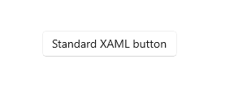
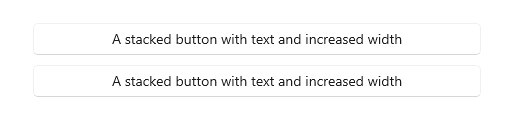
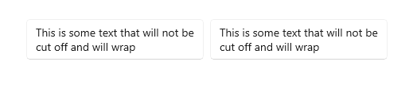
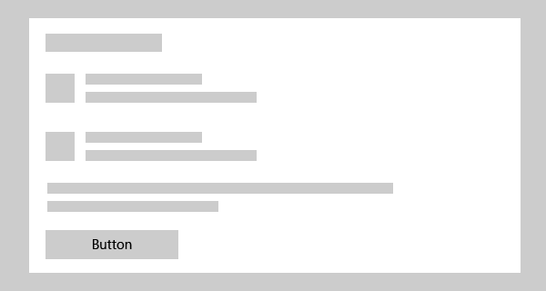
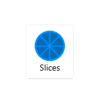
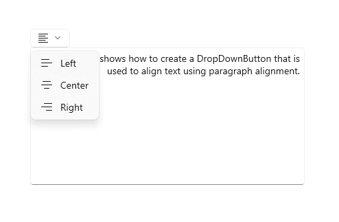
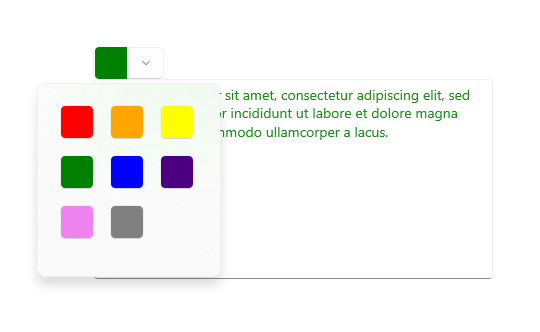
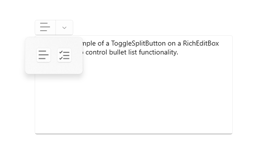

# Buttons

A button gives the user a way to trigger an immediate action. Some buttons are specialized for particular tasks, such as navigation, repeated actions, or presenting menus.



The [Extensible Application Markup Language (XAML)](/windows/uwp/xaml-platform/xaml-overview) framework provides a standard button control as well as several specialized button controls.

Control | Description
------- | -----------
[Button](/windows/windows-app-sdk/api/winrt/microsoft.ui.xaml.controls.button) | A button that initiates an immediate action. Can be used with a [Click](/windows/windows-app-sdk/api/winrt/microsoft.ui.xaml.controls.primitives.buttonbase.click) event or [Command](/windows/windows-app-sdk/api/winrt/microsoft.ui.xaml.controls.primitives.buttonbase.command) binding.
[RepeatButton](/windows/windows-app-sdk/api/winrt/microsoft.ui.xaml.controls.primitives.repeatbutton) | A button that raises a [Click](/windows/windows-app-sdk/api/winrt/microsoft.ui.xaml.controls.primitives.buttonbase.click) event continuously while pressed.
[HyperlinkButton](/windows/windows-app-sdk/api/winrt/microsoft.ui.xaml.controls.hyperlinkbutton) | A button that's styled like a hyperlink and used for navigation. For more info about hyperlinks, see [Hyperlinks](hyperlinks.md).
[DropDownButton](/windows/windows-app-sdk/api/winrt/microsoft.ui.xaml.controls.dropdownbutton) | A button with a chevron to open an attached flyout.
[SplitButton](/windows/windows-app-sdk/api/winrt/microsoft.ui.xaml.controls.splitbutton) | A button with two sides. One side initiates an action, and the other side opens a menu.
[ToggleSplitButton](/windows/windows-app-sdk/api/winrt/microsoft.ui.xaml.controls.togglesplitbutton) | A toggle button with two sides. One side toggles on/off, and the other side opens a menu.
[ToggleButton](/windows/windows-app-sdk/api/winrt/microsoft.ui.xaml.controls.primitives.togglebutton) | A button that can be on or off.

## Is this the right control?

Use a **Button** control to let the user initiate an immediate action, such as submitting a form.

Don't use a **Button** control when the action is to navigate to another page; instead, use a [HyperlinkButton](/windows/windows-app-sdk/api/winrt/microsoft.ui.xaml.controls.hyperlinkbutton) control. For more info about hyperlinks, see [Hyperlinks](hyperlinks.md).

> [!IMPORTANT]
> For wizard navigation, use buttons labeled *Back* and *Next*. For other types of backwards navigation or navigation to an upper level, use a [back button](../basics/navigation-history-and-backwards-navigation.md).

Use a **RepeatButton** control when the user might want to trigger an action repeatedly. For example, use a **RepeatButton** control to increment or decrement a value in a counter.

Use a **DropDownButton** control when the button has a flyout that contains more options. The default chevron provides a visual indication that the button includes a flyout.

Use a **SplitButton** control when you want the user to be able to initiate an immediate action or choose from additional options independently.

Use a **ToggleButton** control when you want the user to be able to immediately switch between two mutually exclusive states, and a button is the best fit for your UI needs. Unless your UI benefits from a button, it might be a better choice to use an [AppBarToggleButton](/windows/windows-app-sdk/api/winrt/microsoft.ui.xaml.controls.appbartogglebutton), [CheckBox](checkbox.md), [RadioButton](radio-button.md), or [ToggleSwitch](toggles.md).

## Recommendations

- Make sure the purpose and state of a button are clear to the user.

- When there are multiple buttons for the same decision (such as in a confirmation dialog), present the commit buttons in this order, where [Do it] and [Don't do it] are specific responses to the main instruction:
  - OK/[Do it]/Yes
    - [Don't do it]/No
    - Cancel

- Expose only one or two buttons to the user at a time, for example, **Accept** and **Cancel**. If you need to expose more actions to the user, consider using [checkboxes](checkbox.md) or [radio buttons](radio-button.md) from which the user can select actions, with a single command button to trigger those actions.

- For an action that needs to be available across multiple pages within your app, instead of duplicating a button on multiple pages, consider using a [bottom app bar](command-bar.md).

### Button text

A button's content is usually text. When you design that text, use the following recommendations:

-  Use a concise, specific, self-explanatory text that clearly describes the action that the button performs. Usually button text is a single word that is a verb.

-  Use the default font, unless your brand guidelines tell you to use something different.

-  For shorter text, avoid narrow command buttons by using a minimum button width of 120px.

- For longer text, avoid wide command buttons by limiting text to a maximum length of 26 characters.

-  If the button's text content is dynamic (that is, it is [localized](../globalizing/globalizing-portal.md)), consider how the button will be resized and what will happen to controls around it.

<table>
<tr>
<td> <b>Need to fix:</b><br> Buttons with overflowing text. </td>
<td>  </td>
</tr>
<tr>
<td> <b>Option 1:</b><br> Increase button width, stack buttons, and wrap if text length is greater than 26 characters. </td>
<td>  </td>
</tr>
<tr>
<td> <b>Option 2:</b><br> Increase button height, and wrap text. </td>
<td>  </td>
</tr>
</table>

### Recommended single-button layout

If your layout requires only one button, it should be either left- or right-aligned based on its container context.

  - Dialogs with only one button should **right-align** the button. If your dialog contains only one button, ensure that the button performs the safe, nondestructive action. If you use [ContentDialog](./dialogs-and-flyouts/index.md) and specify a single button, it will be automatically right-aligned.

    

  - If your button appears within a container UI (for example, within a toast notification, a flyout, or a list view item), you should **right-align** the button within the container.

    

  - In pages that contain a single button (for example, an **Apply** button at the bottom of a settings page), you should **left-align** the button. This ensures that the button aligns with the rest of the page content.

    

### Back buttons

The back button is a system-provided UI element that enables backward navigation through either the back stack or navigation history of the user. You don't have to create your own back button, but you might have to do some work to enable a good backwards navigation experience. For more info, see [Navigation history and backwards navigation for Windows apps](../basics/navigation-history-and-backwards-navigation.md).

## Examples

This example uses three buttons, **Save**, **Don't Save**, and **Cancel**, in a dialog that asks users if they want to save their work.


## UWP and WinUI 2

[!INCLUDE [uwp-winui2-note](../../../includes/uwp-winui-2-note.md)]

The DropDownButton, SplitButton, and ToggleSplitButton controls for UWP apps are included as part of WinUI 2. For more info, including installation instructions, see [WinUI 2](../../winui/winui2/index.md). APIs for these controls exist in both the [Windows.UI.Xaml.Controls](/uwp/api/Windows.UI.Xaml.Controls) and [Microsoft.UI.Xaml.Controls](/windows/winui/api/microsoft.ui.xaml.controls) namespaces.

> [!div class="checklist"]
>
> - **UWP APIs:** [Button class](/uwp/api/windows.ui.xaml.controls.button), [RepeatButton class](/uwp/api/windows.ui.xaml.controls.primitives.repeatbutton), [HyperlinkButton class](/uwp/api/windows.ui.xaml.controls.hyperlinkbutton), [DropDownButton](/uwp/api/windows.ui.xaml.controls.dropdownbutton), [SplitButton](/uwp/api/windows.ui.xaml.controls.splitbutton), [ToggleSplitButton](/uwp/api/windows.ui.xaml.controls.togglesplitbutton), [ToggleButton](/uwp/api/windows.ui.xaml.controls.primitives.togglebutton), [Click event](/uwp/api/windows.ui.xaml.controls.primitives.buttonbase.click), [Command property](/uwp/api/windows.ui.xaml.controls.primitives.buttonbase.command), [Content property](/uwp/api/windows.ui.xaml.controls.contentcontrol.content)
> - **WinUI 2 Apis:** [DropDownButton](/windows/winui/api/microsoft.ui.xaml.controls.dropdownbutton), [SplitButton](/windows/winui/api/microsoft.ui.xaml.controls.splitbutton), [ToggleSplitButton](/windows/winui/api/microsoft.ui.xaml.controls.togglesplitbutton)
> - [Open the WinUI 2 Gallery app and see the Button in action](winui2gallery:/item/Button). [!INCLUDE [winui-2-gallery](../../../includes/winui-2-gallery.md)]

We recommend using the latest [WinUI 2](../../winui/winui2/index.md) to get the most current styles and templates for all controls. WinUI 2.2 or later includes a new template for these controls that uses rounded corners. For more info, see [Corner radius](../style/rounded-corner.md).

[!INCLUDE [muxc-alias-note](../../../includes/muxc-alias-note.md)]

```xaml
xmlns:muxc="using:Microsoft.UI.Xaml.Controls"

<muxc:DropDownButton />
<muxc:SplitButton />
<muxc:ToggleSplitButton />
```

## Create a button

> [!div class="checklist"]
>
> - **Important APIs:** [Button class](/windows/windows-app-sdk/api/winrt/microsoft.ui.xaml.controls.button), [Click event](/windows/windows-app-sdk/api/winrt/microsoft.ui.xaml.controls.primitives.buttonbase.click), [Command property](/windows/windows-app-sdk/api/winrt/microsoft.ui.xaml.controls.primitives.buttonbase.command), [Content property](/windows/windows-app-sdk/api/winrt/microsoft.ui.xaml.controls.contentcontrol.content)

> [!div class="nextstepaction"]
> [Open the WinUI 3 Gallery app and see the Buttons in action](winui3gallery:/item/Button).

[!INCLUDE [winui-3-gallery](../../../includes/winui-3-gallery.md)]

This example shows a button that responds to a click.

Create the button in XAML.

```xaml
<Button Content="Subscribe" Click="SubscribeButton_Click"/>
```

Or create the button in code.

```csharp
Button subscribeButton = new Button();
subscribeButton.Content = "Subscribe";
subscribeButton.Click += SubscribeButton_Click;

// Add the button to a parent container in the visual tree.
stackPanel1.Children.Add(subscribeButton);
```

Handle the [Click](/windows/windows-app-sdk/api/winrt/microsoft.ui.xaml.controls.primitives.buttonbase.click) event.

```csharp
private async void SubscribeButton_Click(object sender, RoutedEventArgs e)
{
    // Call app specific code to subscribe to the service. For example:
    ContentDialog subscribeDialog = new ContentDialog
    {
        Title = "Subscribe to App Service?",
        Content = "Listen, watch, and play in high definition for only $9.99/month. Free to try, cancel anytime.",
        CloseButtonText = "Not Now",
        PrimaryButtonText = "Subscribe",
        SecondaryButtonText = "Try it"
    };

    ContentDialogResult result = await subscribeDialog.ShowAsync();
}
```

### Button interaction

When you tap a **Button** control with a finger or stylus, or press a left mouse button while the pointer is over it, the button raises the [Click](/windows/windows-app-sdk/api/winrt/microsoft.ui.xaml.controls.primitives.buttonbase.click) event. If a button has keyboard focus, pressing the Enter key or the Spacebar also raises the **Click** event.

You generally can't handle low-level [PointerPressed](/windows/windows-app-sdk/api/winrt/microsoft.ui.xaml.uielement.pointerpressed) events on a **Button** object because it has the **Click** behavior instead. For more info, see [Events and routed events overview](/windows/uwp/xaml-platform/events-and-routed-events-overview).

You can change how a button raises the **Click** event by changing the [ClickMode](/windows/windows-app-sdk/api/winrt/microsoft.ui.xaml.controls.clickmode) property. The default value of **ClickMode** is **Release**, but you also can set a button's **ClickMode** value to **Hover** or **Press**. If **ClickMode** is **Hover**, the **Click** event can't be raised by using the keyboard or touch.

### Button content

**Button** is a content control of the [ContentControl](/windows/windows-app-sdk/api/winrt/microsoft.UI.Xaml.Controls.ContentControl) class. Its XAML content property is [Content](/windows/windows-app-sdk/api/winrt/microsoft.ui.xaml.controls.contentcontrol.content), which enables a syntax like this for XAML: `<Button>A button's content</Button>`. You can set any object as the button's content. If the content is a [UIElement](/windows/windows-app-sdk/api/winrt/microsoft.UI.Xaml.UIElement) object, it is rendered in the button. If the content is another type of object, its string representation is shown in the button.

A button's content is usually text. When you design that text, follow the [Button text recommendations](#button-text) listed previously.

You can also customize visuals that make up the button's appearance. For example, you could replace the text with an icon, or use an icon in addition to text.

Here, a **StackPanel** that contains an image and text is set as the content of a button.

```xaml
<Button x:Name="Button2" Click="Button_Click" Width="80" Height="90">
    <StackPanel>
        <Image Source="/Assets/Slices.png" Height="52"/>
        <TextBlock Text="Slices" Foreground="Black" HorizontalAlignment="Center"/> 
    </StackPanel>
</Button>
```

The button looks like this.



## Create a repeat button

> [!div class="checklist"]
>
> - **Important APIs:** [RepeatButton class](/windows/windows-app-sdk/api/winrt/microsoft.ui.xaml.controls.primitives.repeatbutton), [Click event](/windows/windows-app-sdk/api/winrt/microsoft.ui.xaml.controls.primitives.buttonbase.click), [Content property](/windows/windows-app-sdk/api/winrt/microsoft.ui.xaml.controls.contentcontrol.content)

> [!div class="nextstepaction"]
> [Open the WinUI 3 Gallery app and see the RepeatButton in action](winui3gallery:/item/RepeatButton).

[!INCLUDE [winui-3-gallery](../../../includes/winui-3-gallery.md)]

A [RepeatButton](/windows/windows-app-sdk/api/winrt/microsoft.ui.xaml.controls.primitives.repeatbutton) control is a button that raises [Click](/windows/windows-app-sdk/api/winrt/microsoft.ui.xaml.controls.primitives.buttonbase.click) events repeatedly from the time it's pressed until it's released. Set the [Delay](/windows/windows-app-sdk/api/winrt/microsoft.ui.xaml.controls.primitives.repeatbutton.delay) property to specify the time that the **RepeatButton** control waits after it is pressed before it starts repeating the click action. Set the [Interval](/windows/windows-app-sdk/api/winrt/microsoft.ui.xaml.controls.primitives.repeatbutton.interval) property to specify the time between repetitions of the click action. Times for both properties are specified in milliseconds.

The following example shows two **RepeatButton** controls whose respective **Click** events are used to increase and decrease the value shown in a text block.

```xaml
<StackPanel>
    <RepeatButton Width="100" Delay="500" Interval="100" Click="Increase_Click">Increase</RepeatButton>
    <RepeatButton Width="100" Delay="500" Interval="100" Click="Decrease_Click">Decrease</RepeatButton>
    <TextBlock x:Name="clickTextBlock" Text="Number of Clicks:" />
</StackPanel>
```

```csharp
private static int _clicks = 0;
private void Increase_Click(object sender, RoutedEventArgs e)
{
    _clicks += 1;
    clickTextBlock.Text = "Number of Clicks: " + _clicks;
}

private void Decrease_Click(object sender, RoutedEventArgs e)
{
    if(_clicks > 0)
    {
        _clicks -= 1;
        clickTextBlock.Text = "Number of Clicks: " + _clicks;
    }
}
```

## Create a drop down button

> [!div class="checklist"]
>
> - **Important APIs**: [DropDownButton class](/windows/windows-app-sdk/api/winrt/microsoft.ui.xaml.controls.button), [Flyout property](/windows/windows-app-sdk/api/winrt/microsoft.ui.xaml.controls.button.flyout)

> [!div class="nextstepaction"]
> [Open the WinUI 3 Gallery app and see the DropdownButton in action](winui3gallery:/item/DropdownButton).

[!INCLUDE [winui-3-gallery](../../../includes/winui-3-gallery.md)]

A [DropDownButton](/windows/windows-app-sdk/api/winrt/microsoft.ui.xaml.controls.dropdownbutton) is a button that shows a chevron as a visual indicator that it has an attached flyout that contains more options. It has the same behavior as a standard **Button** control with a flyout; only the appearance is different.

The drop down button inherits the **Click** event, but you typically don't use it. Instead, you use the [Flyout](/windows/windows-app-sdk/api/winrt/microsoft.ui.xaml.controls.button.flyout) property to attach a flyout and invoke actions by using menu options in the flyout. The flyout opens automatically when the button is clicked.
Be sure to specify the [Placement](/windows/windows-app-sdk/api/winrt/microsoft.ui.xaml.controls.primitives.flyoutbase.placement) property of your flyout to ensure the desired placement in relation to the button. The default placement algorithm might not produce the intended placement in all situations. For more info about flyouts, see [Flyouts](dialogs-and-flyouts/flyouts.md) and [Menu flyout and menu bar](menus.md).

### Example - Drop down button

This example shows how to create a drop down button with a flyout that contains commands for paragraph alignment in a **RichEditBox** control. (For more info and code, see [Rich edit box](rich-edit-box.md)).



```xaml
<DropDownButton ToolTipService.ToolTip="Alignment">
    <TextBlock FontFamily="Segoe MDL2 Assets" FontSize="14" Text="&#xE8E4;"/>
    <DropDownButton.Flyout>
        <MenuFlyout Placement="BottomEdgeAlignedLeft">
            <MenuFlyoutItem Text="Left" Icon="AlignLeft" Tag="left"
                            Click="AlignmentMenuFlyoutItem_Click"/>
            <MenuFlyoutItem Text="Center" Icon="AlignCenter" Tag="center"
                            Click="AlignmentMenuFlyoutItem_Click"/>
            <MenuFlyoutItem Text="Right" Icon="AlignRight" Tag="right"
                            Click="AlignmentMenuFlyoutItem_Click"/>
        </MenuFlyout>
    </DropDownButton.Flyout>
</DropDownButton>
```

```csharp
private void AlignmentMenuFlyoutItem_Click(object sender, RoutedEventArgs e)
{
    var option = ((MenuFlyoutItem)sender).Tag.ToString();

    Windows.UI.Text.ITextSelection selectedText = editor.Document.Selection;
    if (selectedText != null)
    {
        // Apply the alignment to the selected paragraphs.
        var paragraphFormatting = selectedText.ParagraphFormat;
        if (option == "left")
        {
            paragraphFormatting.Alignment = Windows.UI.Text.ParagraphAlignment.Left;
        }
        else if (option == "center")
        {
            paragraphFormatting.Alignment = Windows.UI.Text.ParagraphAlignment.Center;
        }
        else if (option == "right")
        {
            paragraphFormatting.Alignment = Windows.UI.Text.ParagraphAlignment.Right;
        }
    }
}
```

## Create a split button

> [!div class="checklist"]
>
> - **Important APIs**: [SplitButton class](/windows/windows-app-sdk/api/winrt/microsoft.ui.xaml.controls.splitbutton), [Click event](/windows/windows-app-sdk/api/winrt/microsoft.ui.xaml.controls.primitives.buttonbase.click), [Flyout property](/windows/windows-app-sdk/api/winrt/microsoft.ui.xaml.controls.button.flyout)

> [!div class="nextstepaction"]
> [Open the WinUI 3 Gallery app and see the SplitButton in action](winui3gallery:/item/SplitButton).

[!INCLUDE [winui-3-gallery](../../../includes/winui-3-gallery.md)]

A [SplitButton](/windows/windows-app-sdk/api/winrt/microsoft.ui.xaml.controls.splitbutton) control has two parts that can be invoked separately. One part behaves like a standard button and invokes an immediate action. The other part invokes a flyout that contains additional options that the user can choose from.

> [!NOTE]
> When invoked with touch, the split button behaves as a drop down button; both halves of the button invoke the flyout. With other methods of input, a user can invoke either half of the button separately.

The typical behavior for a split button is:

- When the user clicks the button part, handle the **Click** event to invoke the option that's currently selected in the drop down.

- When the drop down is open, handle invocation of the items in the drop down to both change which option is selected, and then invoke it. It's important to invoke the flyout item because the button **Click** event doesn't occur when using touch.

> [!TIP]
> There are many ways to put items in the drop down and handle their invocation. If you use a **ListView** or **GridView**, one way is to handle the **SelectionChanged** event. If you do this, set [SingleSelectionFollowsFocus](/windows/windows-app-sdk/api/winrt/microsoft.ui.xaml.controls.listviewbase.singleselectionfollowsfocus) to **false**. This lets users navigate the options using a keyboard without invoking the item on each change.

### Example - Split button

This example shows how to create a split button that is used to change the foreground color of selected text in a **RichEditBox** control. (For more info and code, see [Rich edit box](rich-edit-box.md)).
Split button's flyout uses [BottomEdgeAlignedLeft](/windows/windows-app-sdk/api/winrt/microsoft.ui.xaml.controls.primitives.flyoutplacementmode) as the default value for its [Placement](/windows/windows-app-sdk/api/winrt/microsoft.ui.xaml.controls.primitives.flyoutbase.placement) property. You can't override this value.



```xaml
<SplitButton ToolTipService.ToolTip="Foreground color"
             Click="BrushButtonClick">
    <Border x:Name="SelectedColorBorder" Width="20" Height="20"/>
    <SplitButton.Flyout>
        <Flyout x:Name="BrushFlyout">
            <!-- Set SingleSelectionFollowsFocus="False"
                 so that keyboard navigation works correctly. -->
            <GridView ItemsSource="{x:Bind ColorOptions}"
                      SelectionChanged="BrushSelectionChanged"
                      SingleSelectionFollowsFocus="False"
                      SelectedIndex="0" Padding="0">
                <GridView.ItemTemplate>
                    <DataTemplate>
                        <Rectangle Fill="{Binding}" Width="20" Height="20"/>
                    </DataTemplate>
                </GridView.ItemTemplate>
                <GridView.ItemContainerStyle>
                    <Style TargetType="GridViewItem">
                        <Setter Property="Margin" Value="2"/>
                        <Setter Property="MinWidth" Value="0"/>
                        <Setter Property="MinHeight" Value="0"/>
                    </Style>
                </GridView.ItemContainerStyle>
            </GridView>
        </Flyout>
    </SplitButton.Flyout>
</SplitButton>
```

```csharp
public sealed partial class MainPage : Page
{
    // Color options that are bound to the grid in the split button flyout.
    private List<SolidColorBrush> ColorOptions = new List<SolidColorBrush>();
    private SolidColorBrush CurrentColorBrush = null;

    public MainPage()
    {
        this.InitializeComponent();

        // Add color brushes to the collection.
        ColorOptions.Add(new SolidColorBrush(Colors.Black));
        ColorOptions.Add(new SolidColorBrush(Colors.Red));
        ColorOptions.Add(new SolidColorBrush(Colors.Orange));
        ColorOptions.Add(new SolidColorBrush(Colors.Yellow));
        ColorOptions.Add(new SolidColorBrush(Colors.Green));
        ColorOptions.Add(new SolidColorBrush(Colors.Blue));
        ColorOptions.Add(new SolidColorBrush(Colors.Indigo));
        ColorOptions.Add(new SolidColorBrush(Colors.Violet));
        ColorOptions.Add(new SolidColorBrush(Colors.White));
    }

    private void BrushButtonClick(object sender, object e)
    {
        // When the button part of the split button is clicked,
        // apply the selected color.
        ChangeColor();
    }

    private void BrushSelectionChanged(object sender, SelectionChangedEventArgs e)
    {
        // When the flyout part of the split button is opened and the user selects
        // an option, set their choice as the current color, apply it, then close the flyout.
        CurrentColorBrush = (SolidColorBrush)e.AddedItems[0];
        SelectedColorBorder.Background = CurrentColorBrush;
        ChangeColor();
        BrushFlyout.Hide();
    }

    private void ChangeColor()
    {
        // Apply the color to the selected text in a RichEditBox.
        Windows.UI.Text.ITextSelection selectedText = editor.Document.Selection;
        if (selectedText != null)
        {
            Windows.UI.Text.ITextCharacterFormat charFormatting = selectedText.CharacterFormat;
            charFormatting.ForegroundColor = CurrentColorBrush.Color;
            selectedText.CharacterFormat = charFormatting;
        }
    }
}
```

## Create a toggle split button

> [!div class="checklist"]
>
> - **Important APIs**: [ToggleSplitButton class](/windows/windows-app-sdk/api/winrt/microsoft.ui.xaml.controls.togglesplitbutton), [IsCheckedChanged event](/windows/windows-app-sdk/api/winrt/microsoft.ui.xaml.controls.togglesplitbutton.ischeckedchanged), [IsChecked property](/windows/windows-app-sdk/api/winrt/microsoft.ui.xaml.controls.togglesplitbutton.ischecked)

> [!div class="nextstepaction"]
> [Open the WinUI 3 Gallery app and see the ToggleSplitButton in action](winui3gallery:/item/ToggleSplitButton).

[!INCLUDE [winui-3-gallery](../../../includes/winui-3-gallery.md)]

A [ToggleSplitButton](/windows/windows-app-sdk/api/winrt/microsoft.ui.xaml.controls.togglesplitbutton) control has two parts that can be invoked separately. One part behaves like a toggle button that can be on or off. The other part invokes a flyout that contains additional options that the user can choose from.

A toggle split button is typically used to enable or disable a feature when the feature has multiple options that the user can choose from. For example, in a document editor, it could be used to turn lists on or off, while the drop down is used to choose the style of the list.

> [!NOTE]
> When invoked with touch, the toggle split button behaves as a drop down button. With other methods of input, a user can toggle and invoke the two halves of the button separately. With touch, both halves of the button invoke the flyout. Therefore, you must include an option in your flyout content to toggle the button on or off.

### Differences with ToggleButton

Unlike [ToggleButton](/windows/windows-app-sdk/api/winrt/microsoft.ui.xaml.controls.primitives.togglebutton), **ToggleSplitButton** does not have an indeterminate state. As a result, you should keep in mind these differences:

- **ToggleSplitButton** does not have an **IsThreeState** property or **Indeterminate** event.
- The [ToggleSplitButton.IsChecked](/windows/windows-app-sdk/api/winrt/microsoft.ui.xaml.controls.togglesplitbutton.ischecked) property is just a Boolean, not a **Nullable\<bool>**.
- **ToggleSplitButton** has only the [IsCheckedChanged](/windows/windows-app-sdk/api/winrt/microsoft.ui.xaml.controls.togglesplitbutton.ischeckedchanged) event; it does not have separate **Checked** and **Unchecked** events.

### Example - Toggle split button

The following example shows how a toggle split button could be used to turn list formatting on or off, and change the style of the list, in a **RichEditBox** control. (For more info and code, see [Rich edit box](rich-edit-box.md)).
The flyout of the toggle split button uses [BottomEdgeAlignedLeft](/windows/windows-app-sdk/api/winrt/microsoft.ui.xaml.controls.primitives.flyoutplacementmode) as the default value for its [Placement](/windows/windows-app-sdk/api/winrt/microsoft.ui.xaml.controls.primitives.flyoutbase.placement) property. You can't override this value.



```xaml
<ToggleSplitButton x:Name="ListButton"
                   ToolTipService.ToolTip="List style"
                   Click="ListButton_Click"
                   IsCheckedChanged="ListStyleButton_IsCheckedChanged">
    <TextBlock FontFamily="Segoe MDL2 Assets" FontSize="14" Text="&#xE8FD;"/>
    <ToggleSplitButton.Flyout>
        <Flyout>
            <ListView x:Name="ListStylesListView"
                      SelectionChanged="ListStylesListView_SelectionChanged"
                      SingleSelectionFollowsFocus="False">
                <StackPanel Tag="bullet" Orientation="Horizontal">
                    <FontIcon FontFamily="Segoe MDL2 Assets" Glyph="&#xE7C8;"/>
                    <TextBlock Text="Bullet" Margin="8,0"/>
                </StackPanel>
                <StackPanel Tag="alpha" Orientation="Horizontal">
                    <TextBlock Text="A" FontSize="24" Margin="2,0"/>
                    <TextBlock Text="Alpha" Margin="8"/>
                </StackPanel>
                <StackPanel Tag="numeric" Orientation="Horizontal">
                    <FontIcon FontFamily="Segoe MDL2 Assets" Glyph="&#xF146;"/>
                    <TextBlock Text="Numeric" Margin="8,0"/>
                </StackPanel>
                <TextBlock Tag="none" Text="None" Margin="28,0"/>
            </ListView>
        </Flyout>
    </ToggleSplitButton.Flyout>
</ToggleSplitButton>
```

```csharp
private void ListStyleButton_IsCheckedChanged(ToggleSplitButton sender, ToggleSplitButtonIsCheckedChangedEventArgs args)
{
    // Use the toggle button to turn the selected list style on or off.
    if (((ToggleSplitButton)sender).IsChecked == true)
    {
        // On. Apply the list style selected in the drop down to the selected text.
        var listStyle = ((FrameworkElement)(ListStylesListView.SelectedItem)).Tag.ToString();
        ApplyListStyle(listStyle);
    }
    else
    {
        // Off. Make the selected text not a list,
        // but don't change the list style selected in the drop down.
        ApplyListStyle("none");
    }
}

private void ListStylesListView_SelectionChanged(object sender, SelectionChangedEventArgs e)
{
    var listStyle = ((FrameworkElement)(e.AddedItems[0])).Tag.ToString();

    if (ListButton.IsChecked == true)
    {
        // Toggle button is on. Turn it off...
        if (listStyle == "none")
        {
            ListButton.IsChecked = false;
        }
        else
        {
            // or apply the new selection.
            ApplyListStyle(listStyle);
        }
    }
    else
    {
        // Toggle button is off. Turn it on, which will apply the selection
        // in the IsCheckedChanged event handler.
        ListButton.IsChecked = true;
    }
}

private void ApplyListStyle(string listStyle)
{
    Windows.UI.Text.ITextSelection selectedText = editor.Document.Selection;
    if (selectedText != null)
    {
        // Apply the list style to the selected text.
        var paragraphFormatting = selectedText.ParagraphFormat;
        if (listStyle == "none")
        {  
            paragraphFormatting.ListType = Windows.UI.Text.MarkerType.None;
        }
        else if (listStyle == "bullet")
        {
            paragraphFormatting.ListType = Windows.UI.Text.MarkerType.Bullet;
        }
        else if (listStyle == "numeric")
        {
            paragraphFormatting.ListType = Windows.UI.Text.MarkerType.Arabic;
        }
        else if (listStyle == "alpha")
        {
            paragraphFormatting.ListType = Windows.UI.Text.MarkerType.UppercaseEnglishLetter;
        }
        selectedText.ParagraphFormat = paragraphFormatting;
    }
}
```

## Get the sample code

- [WinUI Gallery](https://github.com/Microsoft/WinUI-Gallery): This sample shows all the XAML controls in an interactive format.

## Related articles

- [Button class](/windows/windows-app-sdk/api/winrt/microsoft.ui.xaml.controls.button)
- [Radio buttons](radio-button.md)
- [Check boxes](checkbox.md)
- [Toggle switches](toggles.md)