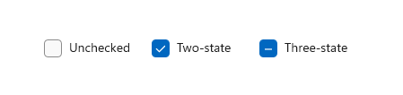
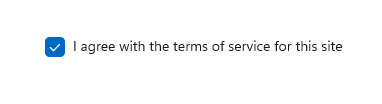
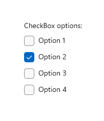
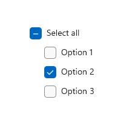
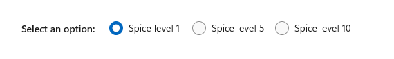

# Check boxes

A check box is used to select or deselect action items. It can be used for a single item or for a list of multiple items that a user can choose from. The control has three selection states: unselected, selected, and indeterminate. Use the indeterminate state when a collection of sub-choices have both unselected and selected states.



## Is this the right control?

Use a **single check box** for a binary yes/no choice, such as with a "Remember me?" login scenario or with a terms of service agreement.



For a binary choice, the main difference between a **check box** and a [toggle switch](toggles.md) is that the check box is for status and the toggle switch is for action. You can delay committing a check box interaction (as part of a form submit, for example), while you should immediately commit a toggle switch interaction. Also, only check boxes allow for multi-selection.

Use **multiple check boxes** for multi-select scenarios in which a user chooses one or more items from a group of choices that are not mutually exclusive.

Create a group of check boxes when users can select any combination of options.



When options can be grouped, you can use an indeterminate check box to represent the whole group. Use the check box's indeterminate state when a user selects some, but not all, sub-items in the group.



Both **check box** and **radio button** controls let the user select from a list of options. Check boxes let the user select a combination of options. In contrast, radio buttons let the user make a single choice from mutually exclusive options. When there is more than one option but only one can be selected, use a radio button instead.

## Recommendations

- Verify that the purpose and current state of the check box is clear.
- Limit check box text content to no more than two lines.
- Word the checkbox label as a statement that the check mark makes true and the absence of a check mark makes false.
- Use the default font unless your brand guidelines tell you to use another.
- If the text content is dynamic, consider how the control will resize and what will happen to visuals around it.
- If there are two or more mutually exclusive options from which to choose, consider using [radio buttons](radio-button.md).
- Don't put two check box groups next to each other. Use group labels to separate the groups.
- Don't use a check box as an on/off control or to perform a command; instead, use a [toggle switch](toggles.md).
- Don't use a check box to display other controls, such as a dialog box.
- Use the indeterminate state to indicate that an option is set for some, but not all, sub-choices.
- When using indeterminate state, use subordinate check boxes to show which options are selected and which are not. Design the UI so that the user can get see the sub-choices.
- Don't use the indeterminate state to represent a third state. The indeterminate state is used to indicate that an option is set for some, but not all, sub-choices. So, don't allow users to set an indeterminate state directly. For an example of what not to do, this check box uses the indeterminate state to indicate medium spiciness:

    

    Instead, use a radio button group that has three options.

    

## UWP and WinUI 2

[!INCLUDE [uwp-winui2-note](../../../includes/uwp-winui-2-note.md)]

APIs for this control exist in the [Windows.UI.Xaml.Controls](/uwp/api/Windows.UI.Xaml.Controls) namespace.

> [!div class="checklist"]
>
> - **UWP APIs:** [CheckBox class](/uwp/api/Windows.UI.Xaml.Controls.CheckBox), [Checked event](/uwp/api/windows.ui.xaml.controls.primitives.togglebutton.checked), [IsChecked property](/uwp/api/windows.ui.xaml.controls.primitives.togglebutton.ischecked), [Content property](/uwp/api/windows.ui.xaml.controls.contentcontrol.content)
> - [Open the WinUI 2 Gallery app and see the CheckBox in action](winui2gallery:/item/CheckBox). [!INCLUDE [winui-2-gallery](../../../includes/winui-2-gallery.md)]

We recommend using the latest [WinUI 2](../../winui/winui2/index.md) to get the most current styles and templates for all controls. WinUI 2.2 or later includes a new template for this control that uses rounded corners. For more info, see [Corner radius](../style/rounded-corner.md).

## Create a checkbox

> [!div class="checklist"]
>
> - **Important APIs**: [CheckBox class](/windows/windows-app-sdk/api/winrt/microsoft.ui.xaml.controls.checkbox), [Checked event](/windows/windows-app-sdk/api/winrt/microsoft.ui.xaml.controls.primitives.togglebutton.checked), [IsChecked property](/windows/windows-app-sdk/api/winrt/microsoft.ui.xaml.controls.primitives.togglebutton.ischecked), [Content property](/windows/windows-app-sdk/api/winrt/microsoft.ui.xaml.controls.contentcontrol.content)

> [!div class="nextstepaction"]
> [Open the WinUI 3 Gallery app and see the CheckBox in action](winui3gallery:/item/CheckBox).

[!INCLUDE [winui-3-gallery](../../../includes/winui-3-gallery.md)]

### Create a simple check box

To assign a label to the checkbox, set the [Content](/windows/windows-app-sdk/api/winrt/microsoft.ui.xaml.controls.contentcontrol.content) property. The label displays next to the checkbox.

This XAML creates a single check box that is used to agree to terms of service before a form can be submitted.

```xaml
<CheckBox x:Name="termsOfServiceCheckBox"
          Content="I agree to the terms of service."/>
```

Here's the same check box created in code.

```csharp
CheckBox termsOfServiceCheckBox = new CheckBox();
termsOfServiceCheckBox.Content = "I agree to the terms of service.";
```

### Bind to IsChecked

Use the [IsChecked](/windows/windows-app-sdk/api/winrt/microsoft.ui.xaml.controls.primitives.togglebutton.ischecked) property to determine whether the check box is checked or cleared. You can bind the value of the IsChecked property to another binary value.
However, because IsChecked is a [nullable](/dotnet/api/system.nullable-1) boolean value, you must either use a cast or a value converter to bind it to a boolean property. This depends on the actual binding type you are using and you will find examples below for each possible type.

In this example, the **IsChecked** property of the check box to agree to terms of service is bound to the [IsEnabled](/windows/windows-app-sdk/api/winrt/microsoft.ui.xaml.controls.control.isenabled) property of a Submit button. The Submit button is enabled only if the terms of service are agreed to.

#### Using x:Bind

> [!NOTE]
> We only show the relevant code here. For more info about data binding see [Data binding overview](/windows/uwp/data-binding/data-binding-quickstart). Specific {x:Bind} info (such as casting) is detailed in [{x:Bind} markup extension](/windows/uwp/xaml-platform/x-bind-markup-extension).

```xaml
<StackPanel Grid.Column="2" Margin="40">
    <CheckBox x:Name="termsOfServiceCheckBox" Content="I agree to the terms of service."/>
    <Button Content="Submit"
            IsEnabled="{x:Bind (x:Boolean)termsOfServiceCheckBox.IsChecked, Mode=OneWay}"/>
</StackPanel>
```

If the check box can also be in the **indeterminate** state, we use the binding's [FallbackValue](/windows/windows-app-sdk/api/winrt/microsoft.ui.xaml.data.binding.fallbackvalue) property to specify the boolean value representing this state. In this case, we don't want to have the Submit button enabled as well:

```xaml
<Button Content="Submit"
        IsEnabled="{x:Bind (x:Boolean)termsOfServiceCheckBox.IsChecked, Mode=OneWay, FallbackValue=False}"/>
```

#### Using x:Bind or Binding

> [!NOTE]
> We only show the relevant code here using {x:Bind}. In the {Binding} example, we would replace {x:Bind} with {Binding}. For more info about data binding, value converters and differences between the {x:Bind} and {Binding} markup extensions, see [Data binding overview](/windows/uwp/data-binding/data-binding-quickstart).

```xaml
...
<Page.Resources>
    <local:NullableBooleanToBooleanConverter x:Key="NullableBooleanToBooleanConverter"/>
</Page.Resources>

...

<StackPanel Grid.Column="2" Margin="40">
    <CheckBox x:Name="termsOfServiceCheckBox" Content="I agree to the terms of service."/>
    <Button Content="Submit"
            IsEnabled="{x:Bind termsOfServiceCheckBox.IsChecked,
                        Converter={StaticResource NullableBooleanToBooleanConverter}, Mode=OneWay}"/>
</StackPanel>
```


```csharp
public class NullableBooleanToBooleanConverter : IValueConverter
{
    public object Convert(object value, Type targetType, object parameter, string language)
    {
        if (value is bool?)
        {
            return (bool)value;
        }
        return false;
    }

    public object ConvertBack(object value, Type targetType, object parameter, string language)
    {
        if (value is bool)
            return (bool)value;
        return false;
    }
}
```

### Handle Click and Checked events

To perform an action when the check box state changes, you can handle either the [Click](/windows/windows-app-sdk/api/winrt/microsoft.ui.xaml.controls.primitives.buttonbase.click) event, or the [Checked](/windows/windows-app-sdk/api/winrt/microsoft.ui.xaml.controls.primitives.togglebutton.checked) and [Unchecked](/windows/windows-app-sdk/api/winrt/microsoft.ui.xaml.controls.primitives.togglebutton.unchecked) events.

The **Click** event occurs whenever the checked state changes. If you handle the Click event, use the **IsChecked** property to determine the state of the check box.

The **Checked** and **Unchecked** events occur independently. If you handle these events, you should handle both of them to respond to state changes in the check box.

In the following examples, we show handling the Click event, and the Checked and Unchecked events.

Multiple checkboxes can share the same event handler. This example creates four checkboxes for selecting pizza toppings. The four checkboxes share the same **Click** event handler to update the list of selected toppings.

```XAML
<StackPanel Margin="40">
    <TextBlock Text="Pizza Toppings"/>
    <CheckBox Content="Pepperoni" x:Name="pepperoniCheckbox"
              Click="toppingsCheckbox_Click"/>
    <CheckBox Content="Beef" x:Name="beefCheckbox"
              Click="toppingsCheckbox_Click"/>
    <CheckBox Content="Mushrooms" x:Name="mushroomsCheckbox"
              Click="toppingsCheckbox_Click"/>
    <CheckBox Content="Onions" x:Name="onionsCheckbox"
              Click="toppingsCheckbox_Click"/>

    <!-- Display the selected toppings. -->
    <TextBlock Text="Toppings selected:"/>
    <TextBlock x:Name="toppingsList"/>
</StackPanel>
```

Here's the event handler for the Click event. Every time a checkbox is clicked, it examines the checkboxes to see which ones are checked and updates the list of selected toppings.

```csharp
private void toppingsCheckbox_Click(object sender, RoutedEventArgs e)
{
    string selectedToppingsText = string.Empty;
    CheckBox[] checkboxes = new CheckBox[] { pepperoniCheckbox, beefCheckbox,
                                             mushroomsCheckbox, onionsCheckbox };
    foreach (CheckBox c in checkboxes)
    {
        if (c.IsChecked == true)
        {
            if (selectedToppingsText.Length > 1)
            {
                selectedToppingsText += ", ";
            }
            selectedToppingsText += c.Content;
        }
    }
    toppingsList.Text = selectedToppingsText;
}
```

### Use the indeterminate state

The CheckBox control inherits from [ToggleButton](/windows/windows-app-sdk/api/winrt/microsoft.ui.xaml.controls.primitives.togglebutton) and can have three states:

State | Property | Value
------|----------|------
checked | IsChecked | **true**
unchecked | IsChecked | **false**
indeterminate | IsChecked | **null**

For the check box to report the indeterminate state, you must set the [IsThreeState](/windows/windows-app-sdk/api/winrt/microsoft.ui.xaml.controls.primitives.togglebutton.isthreestate) property to **true**.

When options can be grouped, you can use an indeterminate check box to represent the whole group. Use the check box's indeterminate state when a user selects some, but not all, sub-items in the group.

In the following example, the "Select all" checkbox has its IsThreeState property set to **true**. The "Select all" checkbox is checked if all child elements are checked, unchecked if all child elements are unchecked, and indeterminate otherwise.

```xaml
<StackPanel>
    <CheckBox x:Name="OptionsAllCheckBox" Content="Select all" IsThreeState="True"
              Checked="SelectAll_Checked" Unchecked="SelectAll_Unchecked"
              Indeterminate="SelectAll_Indeterminate"/>
    <CheckBox x:Name="Option1CheckBox" Content="Option 1" Margin="24,0,0,0"
              Checked="Option_Checked" Unchecked="Option_Unchecked" />
    <CheckBox x:Name="Option2CheckBox" Content="Option 2" Margin="24,0,0,0"
              Checked="Option_Checked" Unchecked="Option_Unchecked" IsChecked="True"/>
    <CheckBox x:Name="Option3CheckBox" Content="Option 3" Margin="24,0,0,0"
              Checked="Option_Checked" Unchecked="Option_Unchecked" />
</StackPanel>
```

```csharp
private void Option_Checked(object sender, RoutedEventArgs e)
{
    SetCheckedState();
}

private void Option_Unchecked(object sender, RoutedEventArgs e)
{
    SetCheckedState();
}

private void SelectAll_Checked(object sender, RoutedEventArgs e)
{
    Option1CheckBox.IsChecked = Option2CheckBox.IsChecked = Option3CheckBox.IsChecked = true;
}

private void SelectAll_Unchecked(object sender, RoutedEventArgs e)
{
    Option1CheckBox.IsChecked = Option2CheckBox.IsChecked = Option3CheckBox.IsChecked = false;
}

private void SelectAll_Indeterminate(object sender, RoutedEventArgs e)
{
    // If the SelectAll box is checked (all options are selected),
    // clicking the box will change it to its indeterminate state.
    // Instead, we want to uncheck all the boxes,
    // so we do this programmatically. The indeterminate state should
    // only be set programmatically, not by the user.

    if (Option1CheckBox.IsChecked == true &&
        Option2CheckBox.IsChecked == true &&
        Option3CheckBox.IsChecked == true)
    {
        // This will cause SelectAll_Unchecked to be executed, so
        // we don't need to uncheck the other boxes here.
        OptionsAllCheckBox.IsChecked = false;
    }
}

private void SetCheckedState()
{
    // Controls are null the first time this is called, so we just
    // need to perform a null check on any one of the controls.
    if (Option1CheckBox != null)
    {
        if (Option1CheckBox.IsChecked == true &&
            Option2CheckBox.IsChecked == true &&
            Option3CheckBox.IsChecked == true)
        {
            OptionsAllCheckBox.IsChecked = true;
        }
        else if (Option1CheckBox.IsChecked == false &&
            Option2CheckBox.IsChecked == false &&
            Option3CheckBox.IsChecked == false)
        {
            OptionsAllCheckBox.IsChecked = false;
        }
        else
        {
            // Set third state (indeterminate) by setting IsChecked to null.
            OptionsAllCheckBox.IsChecked = null;
        }
    }
}
```


## Get the sample code

- [WinUI Gallery sample](https://github.com/Microsoft/WinUI-Gallery) - See all the XAML controls in an interactive format.

## Related articles

- [CheckBox class](/windows/windows-app-sdk/api/winrt/microsoft.UI.Xaml.Controls.CheckBox)
- [Radio buttons](radio-button.md)
- [Toggle switch](toggles.md)