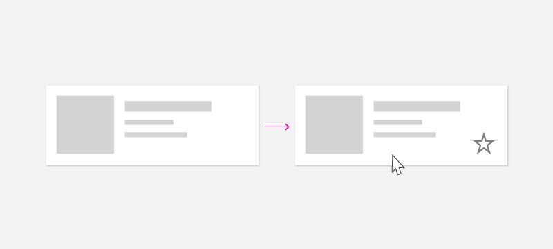
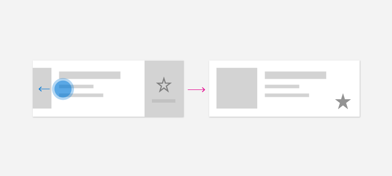

# Contextual commanding for collections and lists

Many apps contain collections of content in the form of lists, grids, and trees that users can manipulate. For example, users might be able to delete, rename, flag, or refresh items. This article shows you how to use contextual commands to implement these sorts of actions in a way that provides the best possible experience for all input types.

> **Important APIs**: [ICommand interface](/windows/windows-app-sdk/api/winrt/microsoft.UI.Xaml.Input.ICommand), [UIElement.ContextFlyout property](/windows/windows-app-sdk/api/winrt/microsoft.UI.Xaml.UIElement.ContextFlyout), [INotifyPropertyChanged interface](/windows/windows-app-sdk/api/winrt/microsoft.ui.xaml.data.inotifypropertychanged)


## Creating commands for all input types

Because users can interact with a Windows app using [a broad range of devices and inputs](../devices/index.md), your app should expose commands though both input-agnostic context menus and input-specific accelerators. Including both lets the user quickly invoke commands on content, regardless of input or device type.

This table shows some typical collection commands and ways to expose those commands.

| Command          | Input-agnostic | Mouse accelerator | Keyboard accelerator | Touch accelerator |
| ---------------- | -------------- | ----------------- | -------------------- | ----------------- |
| Delete item      | Context menu   | Hover button      | DEL key              | Swipe to delete   |
| Flag item        | Context menu   | Hover button      | Ctrl+Shift+G         | Swipe to flag     |
| Refresh data     | Context menu   | N/A               | F5 key               | Pull to refresh   |
| Favorite an item | Context menu   | Hover button      | F, Ctrl+S            | Swipe to favorite |


* **In general, you should make all commands for an item available in the item's [context menu](menus-and-context-menus.md).** Context menus are accessible to users regardless of input type, and should contain all of the contextual commands that user can perform.

* **For frequently accessed commands, consider using input accelerators.** Input accelerators let the user perform actions quickly, based on their input device. Input accelerators include:
    - Swipe-to-action (touch accelerator)
    - Pull to refresh data (touch accelerator)
    - Keyboard shortcuts (keyboard accelerator)
    - Access keys (keyboard accelerator)
    - Mouse & Pen hover buttons (pointer accelerator)

> [!NOTE]
> Users should be able to access all commands from any type of device. For example, if your app's commands are only exposed through hover button pointer accelerators, touch users won't be able to access them. At a minimum, use a context menu to provide access to all commands.

## Example: The PodcastObject data model

To demonstrate our commanding recommendations, this article creates a list of podcasts for a podcast app. The example code demonstrate how to enable the user to "favorite" a particular podcast from a list.

Here's the definition for the podcast object we'll be working with:

```csharp
public class PodcastObject : INotifyPropertyChanged
{
    // The title of the podcast
    public String Title { get; set; }

    // The podcast's description
    public String Description { get; set; }

    // Describes if the user has set this podcast as a favorite
    public bool IsFavorite
    {
        get
        {
            return _isFavorite;
        }
        set
        {
            _isFavorite = value;
            OnPropertyChanged("IsFavorite");
        }
    }
    private bool _isFavorite = false;

    public event PropertyChangedEventHandler PropertyChanged;

    private void OnPropertyChanged(String property)
    {
        PropertyChanged?.Invoke(this, new PropertyChangedEventArgs(property));
    }
}
```

Notice that the PodcastObject implements [INotifyPropertyChanged](/windows/windows-app-sdk/api/winrt/microsoft.UI.Xaml.Data.INotifyPropertyChanged) to respond to property changes when the user toggles the IsFavorite property.

## Defining commands with the ICommand interface

The [ICommand interface](/windows/windows-app-sdk/api/winrt/microsoft.UI.Xaml.Input.ICommand) helps you to define a command that's  available for multiple input types. For example, instead of writing the same code for a delete command in two different event handlers, one for when the user presses the Delete key and one for when the user right clicks "Delete" in a context menu, you can implement your delete logic once, as an [ICommand](/windows/windows-app-sdk/api/winrt/microsoft.UI.Xaml.Input.ICommand),  and then make it available to different input types.

We need to define the ICommand that represents the "Favorite" action. We will use the command's [Execute](/windows/windows-app-sdk/api/winrt/microsoft.UI.Xaml.Input.ICommand.Execute) method to favorite a podcast. The particular podcast will be provided to the execute method via the command's parameter, which can be bound using the CommandParameter property.

```csharp
public class FavoriteCommand: ICommand
{
    public event EventHandler CanExecuteChanged;

    public bool CanExecute(object parameter)
    {
        return true;
    }
    public void Execute(object parameter)
    {
        // Perform the logic to "favorite" an item.
        (parameter as PodcastObject).IsFavorite = true;
    }
}
```

To use the same command with multiple collections and elements, you can store the command as a resource on the page or on the app.

```xaml
<Application.Resources>
    <local:FavoriteCommand x:Key="favoriteCommand" />
</Application.Resources>
```

To execute the command, you call its [Execute](/windows/windows-app-sdk/api/winrt/microsoft.UI.Xaml.Input.ICommand.Execute) method.

```csharp
// Favorite the item using the defined command
var favoriteCommand = Application.Current.Resources["favoriteCommand"] as ICommand;
favoriteCommand.Execute(PodcastObject);
```


## Creating a UserControl to respond to a variety of inputs

When you have a list of items and each of those items should respond to multiple inputs, you can simplify your code by defining a [UserControl](/windows/windows-app-sdk/api/winrt/microsoft.UI.Xaml.Controls.UserControl) for the item and using it to define your items' context menu and event handlers.

To create a UserControl in Visual Studio:
1. In the Solution Explorer, right click the project. A context menu appears.
2. Select **Add > New Item...** <br />The **Add New Item** dialog appears.
3. Select UserControl from the list of items. Give it the name you want and click **Add**. Visual Studio will generate a stub UserControl for you.

In our podcast example, each podcast will be displayed in a list, which will expose a variety of ways to "Favorite" a podcast. The user will be able to perform the following actions to "Favorite" the podcast:
- Invoke a context menu
- Perform keyboard shortcuts
- Show a hover button
- Perform a swipe gesture

In order to encapsulate these behaviors and use the FavoriteCommand, let's create a new [UserControl](/windows/windows-app-sdk/api/winrt/microsoft.UI.Xaml.Controls.UserControl) named "PodcastUserControl" to represent a podcast in the list.

The PodcastUserControl displays the fields of the PodcastObject as TextBlocks, and responds to various user interactions. We will reference and expand upon the PodcastUserControl throughout this article.

**PodcastUserControl.xaml**
```xaml
<UserControl
    x:Class="ContextCommanding.PodcastUserControl"
    xmlns="http://schemas.microsoft.com/winfx/2006/xaml/presentation"
    xmlns:x="http://schemas.microsoft.com/winfx/2006/xaml"
    xmlns:d="http://schemas.microsoft.com/expression/blend/2008"
    xmlns:mc="http://schemas.openxmlformats.org/markup-compatibility/2006"
    mc:Ignorable="d"
    IsTabStop="True" UseSystemFocusVisuals="True"
    >
    <Grid Margin="12,0,12,0">
        <StackPanel>
            <TextBlock Text="{x:Bind PodcastObject.Title, Mode=OneWay}" Style="{StaticResource TitleTextBlockStyle}" />
            <TextBlock Text="{x:Bind PodcastObject.Description, Mode=OneWay}" Style="{StaticResource SubtitleTextBlockStyle}" />
            <TextBlock Text="{x:Bind PodcastObject.IsFavorite, Mode=OneWay}" Style="{StaticResource SubtitleTextBlockStyle}"/>
        </StackPanel>
    </Grid>
</UserControl>
```

**PodcastUserControl.xaml.cs**
```csharp
public sealed partial class PodcastUserControl : UserControl
{
    public static readonly DependencyProperty PodcastObjectProperty =
        DependencyProperty.Register(
            "PodcastObject",
            typeof(PodcastObject),
            typeof(PodcastUserControl),
            new PropertyMetadata(null));

    public PodcastObject PodcastObject
    {
        get { return (PodcastObject)GetValue(PodcastObjectProperty); }
        set { SetValue(PodcastObjectProperty, value); }
    }

    public PodcastUserControl()
    {
        this.InitializeComponent();

        // TODO: We will add event handlers here.
    }
}
```

Notice that the PodcastUserControl maintains a reference to the PodcastObject as a DependencyProperty. This enables us to bind PodcastObjects to the PodcastUserControl.

After you have generated some PodcastObjects, you can create a list of podcasts by binding the PodcastObjects to a ListView. The PodcastUserControl objects describe the visualization of the PodcastObjects, and are therefore set using the ListView's ItemTemplate.

**MainPage.xaml**
```xaml
<ListView x:Name="ListOfPodcasts"
            ItemsSource="{x:Bind podcasts}">
    <ListView.ItemTemplate>
        <DataTemplate x:DataType="local:PodcastObject">
            <local:PodcastUserControl PodcastObject="{x:Bind Mode=OneWay}" />
        </DataTemplate>
    </ListView.ItemTemplate>
    <ListView.ItemContainerStyle>
        <!-- The PodcastUserControl will entirely fill the ListView item and handle tabbing within itself. -->
        <Style TargetType="ListViewItem" BasedOn="{StaticResource ListViewItemRevealStyle}">
            <Setter Property="HorizontalContentAlignment" Value="Stretch" />
            <Setter Property="Padding" Value="0"/>
            <Setter Property="IsTabStop" Value="False"/>
        </Style>
    </ListView.ItemContainerStyle>
</ListView>
```

## Creating context menus

Context menus display a list of commands or options when the user requests them. Context menus provide contextual commands related to their attached element, and are generally reserved for secondary actions specific to that item.


The user can invoke context menus using these "context actions":

| Input    | Context action                          |
| -------- | --------------------------------------- |
| Mouse    | Right click                             |
| Keyboard | Shift+F10, Menu button                  |
| Touch    | Long press on item                      |
| Pen      | Barrel button press, long press on item |
| Gamepad  | Menu button                             |

**Since the user can open a context menu regardless of input type, your context menu should contain all of the contextual commands available for the list item.**

### ContextFlyout

The [ContextFlyout property](/windows/windows-app-sdk/api/winrt/microsoft.UI.Xaml.UIElement.ContextFlyout), defined by the UIElement class, makes it easy to create a context menu that works with all input types. You provide a flyout representing your context menu using MenuFlyout or CommandBarFlyout, and when the user performs a "context action" as defined above, the MenuFlyout or CommandBarFlyout corresponding to the item will be displayed.

See [menus and context menus](menus-and-context-menus.md) for help identifying menu vs. context menu scenarios and guidance on when to use [menu flyout](menus.md) vs. [command bar flyout](command-bar-flyout.md).

For this example, we will use MenuFlyout and will start by adding a ContextFlyout to the PodcastUserControl. The MenuFlyout specified as the ContextFlyout contains a single item to favorite a podcast. Notice that this MenuFlyoutItem uses the favoriteCommand defined above, with the CommandParameter bound to the PodcastObject.

**PodcastUserControl.xaml**
```xaml
<UserControl>
    <UserControl.ContextFlyout>
        <MenuFlyout>
            <MenuFlyoutItem Text="Favorite" Command="{StaticResource favoriteCommand}" CommandParameter="{x:Bind PodcastObject, Mode=OneWay}" />
        </MenuFlyout>
    </UserControl.ContextFlyout>
    <Grid Margin="12,0,12,0">
        <!-- ... -->
    </Grid>
</UserControl>

```

Note that you can also use the [ContextRequested](/windows/windows-app-sdk/api/winrt/microsoft.UI.Xaml.UIElement.ContextRequested) event to respond to context actions. The ContextRequested event will not fire if a ContextFlyout has been specified.

## Creating input accelerators

Although each item in the collection should have a context menu containing all contextual commands, you might want to enable users to quickly perform a smaller set of frequently performed commands. For example, a mailing app may have secondary commands like Reply, Archive, Move to Folder, Set Flag, and Delete which appear in a context menu, but the most common commands are Delete and Flag. After you have identified which commands are most common, you can use input-based accelerators to make these commands easier for a user to perform.

In the podcast app, the frequently performed command is the "Favorite" command.

### Keyboard accelerators

#### Shortcuts and direct key handling


Depending on the type of content, you may identify certain key combinations that should perform an action. In an email app, for example, the DEL key may be used to delete the email that is selected. In a podcast app, the Ctrl+S or F keys could favorite a podcast for later. Although some commands have common, well-known keyboard shortcuts like DEL to delete, other commands have app- or domain-specific shortcuts. Use well-known shortcuts if possible, or consider providing reminder text in a [tooltip](tooltips.md) to teach the user about the shortcut command.

Your app can respond when the user presses a key using the [KeyDown](/windows/windows-app-sdk/api/winrt/microsoft.UI.Xaml.UIElement.KeyDownEvent) event. In general, users expect that the app will respond when they first press the key down, rather than waiting until they release the key.

This example walks through how to add the KeyDown handler to the PodcastUserControl to favorite a podcast when the user presses Ctrl+S or F. It uses the same command as before.

**PodcastUserControl.xaml.cs**
```csharp
// Respond to the F and Ctrl+S keys to favorite the focused item.
protected override void OnKeyDown(KeyRoutedEventArgs e)
{
    var ctrlState = CoreWindow.GetForCurrentThread().GetKeyState(VirtualKey.Control);
    var isCtrlPressed = (ctrlState & CoreVirtualKeyStates.Down) == CoreVirtualKeyStates.Down || (ctrlState & CoreVirtualKeyStates.Locked) == CoreVirtualKeyStates.Locked;

    if (e.Key == Windows.System.VirtualKey.F || (e.Key == Windows.System.VirtualKey.S && isCtrlPressed))
    {
        // Favorite the item using the defined command
        var favoriteCommand = Application.Current.Resources["favoriteCommand"] as ICommand;
        favoriteCommand.Execute(PodcastObject);
    }
}
```

### Mouse accelerators



Users are familiar with right-click context menus, but you may wish to empower users to perform common commands using only a single click of the mouse. To enable this experience, you can include dedicated buttons on your collection item's canvas. To both empower users to act quickly using mouse, and to minimize visual clutter, you can choose to only reveal these buttons when the user has their pointer within a particular list item.

In this example, the Favorite command is represented by a button defined directly in the PodcastUserControl. Note that the button in this example uses the same command, FavoriteCommand, as before. To toggle visibility of this button, you can use the VisualStateManager to switch between visual states when the pointer enters and exits the control.

**PodcastUserControl.xaml**
```xaml
<UserControl>
    <UserControl.ContextFlyout>
        <!-- ... -->
    </UserControl.ContextFlyout>
    <Grid Margin="12,0,12,0">
        <VisualStateManager.VisualStateGroups>
            <VisualStateGroup x:Name="HoveringStates">
                <VisualState x:Name="HoverButtonsShown">
                    <VisualState.Setters>
                        <Setter Target="hoverArea.Visibility" Value="Visible" />
                    </VisualState.Setters>
                </VisualState>
                <VisualState x:Name="HoverButtonsHidden" />
            </VisualStateGroup>
        </VisualStateManager.VisualStateGroups>
        <Grid.ColumnDefinitions>
            <ColumnDefinition Width="*" />
            <ColumnDefinition Width="Auto" />
        </Grid.ColumnDefinitions>
        <StackPanel>
            <TextBlock Text="{x:Bind PodcastObject.Title, Mode=OneWay}" Style="{StaticResource TitleTextBlockStyle}" />
            <TextBlock Text="{x:Bind PodcastObject.Description, Mode=OneWay}" Style="{StaticResource SubtitleTextBlockStyle}" />
            <TextBlock Text="{x:Bind PodcastObject.IsFavorite, Mode=OneWay}" Style="{StaticResource SubtitleTextBlockStyle}"/>
        </StackPanel>
        <Grid Grid.Column="1" x:Name="hoverArea" Visibility="Collapsed" VerticalAlignment="Stretch">
            <AppBarButton Icon="OutlineStar" Label="Favorite" Command="{StaticResource favoriteCommand}" CommandParameter="{x:Bind PodcastObject, Mode=OneWay}" IsTabStop="False" VerticalAlignment="Stretch"  />
        </Grid>
    </Grid>
</UserControl>
```

The hover buttons should appear and disappear when the mouse enters and exits the item. To respond to mouse events, you can use the [PointerEntered](/windows/windows-app-sdk/api/winrt/microsoft.UI.Xaml.UIElement.PointerEnteredEvent) and [PointerExited](/windows/windows-app-sdk/api/winrt/microsoft.UI.Xaml.UIElement.PointerExitedEvent) events on the PodcastUserControl.

**PodcastUserControl.xaml.cs**
```csharp
protected override void OnPointerEntered(PointerRoutedEventArgs e)
{
    base.OnPointerEntered(e);

    // Only show hover buttons when the user is using mouse or pen.
    if (e.Pointer.PointerDeviceType == Windows.Devices.Input.PointerDeviceType.Mouse || e.Pointer.PointerDeviceType == Windows.Devices.Input.PointerDeviceType.Pen)
    {
        VisualStateManager.GoToState(this, "HoverButtonsShown", true);
    }
}

protected override void OnPointerExited(PointerRoutedEventArgs e)
{
    base.OnPointerExited(e);

    VisualStateManager.GoToState(this, "HoverButtonsHidden", true);
}
```

The buttons displayed in the hover state will only be accessible via the pointer input type. Because these buttons are limited to pointer input, you may choose to minimize or remove the padding around the icon of the button to optimize for pointer input. If you choose to do so, ensure that the button footprint is at least 20x20px to remain usable with pen and mouse.

### Touch accelerators

#### Swipe



Swipe commanding is a touch accelerator that enables users on touch devices to perform common secondary actions using touch. Swipe empowers touch users to quickly and naturally interact with content, using common actions like Swipe-to-Delete or Swipe-to-Invoke. See the [swipe commanding](swipe.md) article to learn more.

In order to integrate swipe into your collection, you need two components: SwipeItems, which hosts the commands; and a SwipeControl, which wraps the item and allows for swipe interaction.

The SwipeItems can be defined as a Resource in the PodcastUserControl. In this example, SwipeItems contains a command to Favorite an item.

```xaml
<UserControl.Resources>
    <SymbolIconSource x:Key="FavoriteIcon" Symbol="Favorite"/>
    <SwipeItems x:Key="RevealOtherCommands" Mode="Reveal">
        <SwipeItem IconSource="{StaticResource FavoriteIcon}" Text="Favorite" Background="Yellow" Invoked="SwipeItem_Invoked"/>
    </SwipeItems>
</UserControl.Resources>
```

The SwipeControl wraps the item and allows the user to interact with it using the swipe gesture. Notice that the SwipeControl contains a reference to the SwipeItems as its RightItems. The Favorite item will show when the user swipes from right to left.

```xaml
<SwipeControl x:Name="swipeContainer" RightItems="{StaticResource RevealOtherCommands}">
   <!-- The visual state groups moved from the Grid to the SwipeControl, since the SwipeControl wraps the Grid. -->
   <VisualStateManager.VisualStateGroups>
       <VisualStateGroup x:Name="HoveringStates">
           <VisualState x:Name="HoverButtonsShown">
               <VisualState.Setters>
                   <Setter Target="hoverArea.Visibility" Value="Visible" />
               </VisualState.Setters>
           </VisualState>
           <VisualState x:Name="HoverButtonsHidden" />
       </VisualStateGroup>
   </VisualStateManager.VisualStateGroups>
   <Grid Margin="12,0,12,0">
       <Grid.ColumnDefinitions>
           <ColumnDefinition Width="*" />
           <ColumnDefinition Width="Auto" />
       </Grid.ColumnDefinitions>
       <StackPanel>
           <TextBlock Text="{x:Bind PodcastObject.Title, Mode=OneWay}" Style="{StaticResource TitleTextBlockStyle}" />
           <TextBlock Text="{x:Bind PodcastObject.Description, Mode=OneWay}" Style="{StaticResource SubtitleTextBlockStyle}" />
           <TextBlock Text="{x:Bind PodcastObject.IsFavorite, Mode=OneWay}" Style="{StaticResource SubtitleTextBlockStyle}"/>
       </StackPanel>
       <Grid Grid.Column="1" x:Name="hoverArea" Visibility="Collapsed" VerticalAlignment="Stretch">
           <AppBarButton Icon="OutlineStar" Command="{StaticResource favoriteCommand}" CommandParameter="{x:Bind PodcastObject, Mode=OneWay}" IsTabStop="False" LabelPosition="Collapsed" VerticalAlignment="Stretch"  />
       </Grid>
   </Grid>
</SwipeControl>
```

When the user swipes to invoke the Favorite command, the Invoked method is called.

```csharp
private void SwipeItem_Invoked(SwipeItem sender, SwipeItemInvokedEventArgs args)
{
    // Favorite the item using the defined command
    var favoriteCommand = Application.Current.Resources["favoriteCommand"] as ICommand;
    favoriteCommand.Execute(PodcastObject);
}
```

#### Pull to refresh

Pull to refresh lets a user pull down on a collection of data using touch in order to retrieve more data. See the [pull to refresh](pull-to-refresh.md) article to learn more.

### Pen accelerators

The pen input type provides the precision of pointer input. Users can perform common actions such as opening context menus using pen-based accelerators. To open a context menu, users can tap the screen with the barrel button pressed, or long press on the content. Users can also use the pen to hover over content to get a deeper understanding of the UI like displaying tooltips, or to reveal secondary hover actions, similar to mouse.

To optimize your app for pen input, see the [pen and stylus interaction](../input/pen-and-stylus-interactions.md) article.


## Recommendations

* Make sure that users can access all commands from all types of Windows devices.
* Include a context menu that provides access to all the commands available for a collection item.
* Provide input accelerators for frequently-used commands.
* Use the [ICommand interface](/windows/windows-app-sdk/api/winrt/microsoft.UI.Xaml.Input.ICommand) to implement commands.

## Related topics

* [Command design basics for Windows apps](../basics/commanding-basics.md)
* [ICommand Interface](/windows/windows-app-sdk/api/winrt/microsoft.UI.Xaml.Input.ICommand)
* [Menus and context menus](menus-and-context-menus.md)
* [Swipe](swipe.md)
* [Pull to refresh](pull-to-refresh.md)
* [Pen and stylus interaction](../input/pen-and-stylus-interactions.md)
* [Designing for Xbox and TV](../devices/designing-for-tv.md)
