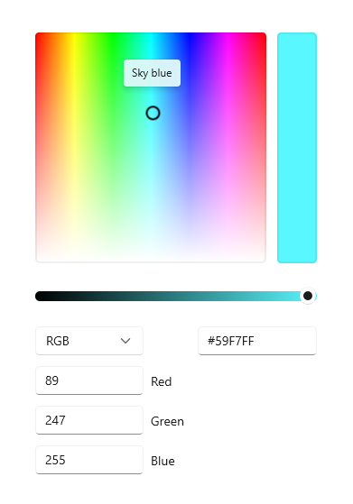
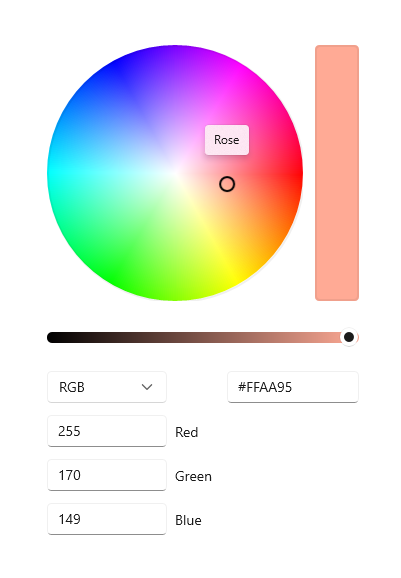
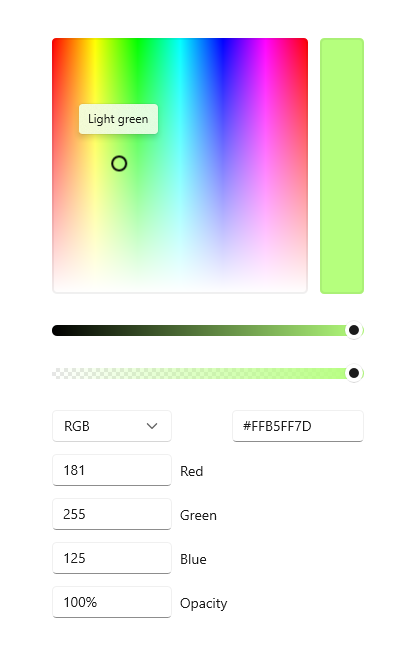
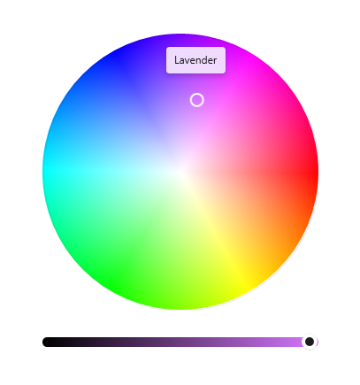

# Color picker

A color picker is used to browse through and select colors. By default, it lets a user navigate through colors on a color spectrum, or specify a color in either Red-Green-Blue (RGB), Hue-Saturation-Value (HSV), or Hexadecimal text boxes.



## Is this the right control?

Use the color picker to let a user select colors in your app. For example, use it to change color settings, such as font colors, background, or app theme colors.

If your app is for drawing or similar tasks using pen, consider using [Inking controls](inking-controls.md) along with the color picker.

## Recommendations

- Think about what kind of color picking experience is appropriate for your app. Some scenarios may not require granular color picking and would benefit from a simplified picker
- For the most accurate color picking experience, use the square spectrum and ensure it is at least 256x256px, or include the text input fields to let users refine their selected color.
- When used in a flyout, tapping in the spectrum or adjusting the slider alone should not commit the color selection. To commit the selection:
  - Provide commit and cancel buttons to apply or cancel the selection. Hitting the back button or tapping outside of the flyout will dismiss it, and not save the user's selection.
  - Or, commit the selection upon dismissing the flyout, by either tapping outside of the flyout or hitting the back button.

## UWP and WinUI 2

[!INCLUDE [uwp-winui2-note](../../../includes/uwp-winui-2-note.md)]

The ColorPicker control for UWP apps is included as part of WinUI 2. For more info, including installation instructions, see [WinUI 2](../../winui/winui2/index.md). APIs for this control exist in both the [Windows.UI.Xaml.Controls](/uwp/api/Windows.UI.Xaml.Controls) and [Microsoft.UI.Xaml.Controls](/windows/winui/api/microsoft.ui.xaml.controls) namespaces.

> [!div class="checklist"]
>
> - **UWP APIs:** [ColorPicker class](/uwp/api/windows.ui.xaml.controls.colorpicker), [Color property](/uwp/api/windows.ui.xaml.controls.colorpicker.Color), [ColorChanged event](/uwp/api/windows.ui.xaml.controls.colorpicker.ColorChanged)
> - **WinUI 2 Apis:** [ColorPicker class](/windows/winui/api/microsoft.ui.xaml.controls.colorpicker), [Color property](/windows/winui/api/microsoft.ui.xaml.controls.colorpicker.Color), [ColorChanged event](/windows/winui/api/microsoft.ui.xaml.controls.colorpicker.ColorChanged)
> - [Open the WinUI 2 Gallery app and see the ColorPicker in action](winui2gallery:/item/ColorPicker). [!INCLUDE [winui-2-gallery](../../../includes/winui-2-gallery.md)]

We recommend using the latest [WinUI 2](../../winui/winui2/index.md) to get the most current styles, templates, and features for all controls. WinUI 2.2 or later includes a new template for this control that uses rounded corners. For more info, see [Corner radius](../style/rounded-corner.md).

[!INCLUDE [muxc-alias-note](../../../includes/muxc-alias-note.md)]

```xaml
xmlns:muxc="using:Microsoft.UI.Xaml.Controls"

<muxc:ColorPicker />
```

## Create a color picker

> [!div class="checklist"]
>
> - **Important APIs:** [ColorPicker class](/windows/windows-app-sdk/api/winrt/microsoft.ui.xaml.controls.colorpicker), [Color property](/windows/windows-app-sdk/api/winrt/microsoft.ui.xaml.controls.colorpicker.Color), [ColorChanged event](/windows/windows-app-sdk/api/winrt/microsoft.ui.xaml.controls.colorpicker.ColorChanged)

> [!div class="nextstepaction"]
> [Open the WinUI 3 Gallery app and see the ColorPicker in action](winui3gallery:/item/ColorPicker).

[!INCLUDE [winui-3-gallery](../../../includes/winui-3-gallery.md)]

This example shows how to create a default color picker in XAML.

```xaml
<ColorPicker x:Name="myColorPicker"/>
```

By default, the color picker shows a preview of the chosen color on the rectangular bar beside the color spectrum. You can use either the [ColorChanged](/windows/windows-app-sdk/api/winrt/microsoft.ui.xaml.controls.colorpicker.ColorChanged) event or the [Color](/windows/windows-app-sdk/api/winrt/microsoft.ui.xaml.controls.colorpicker.Color) property to access the selected color and use it in your app. See the following examples for detailed code.

### Bind to the chosen color

When the color selection should take effect immediately, you can either use databinding to bind to the Color property, or handle the ColorChanged event to access the selected color in your code.

In this example, you bind the Color property of a SolidColorBrush that's used as the Fill for a Rectangle directly to the color picker's selected color. Any change to the color picker results in a live change to the bound property.

```xaml
<ColorPicker x:Name="myColorPicker"
             ColorSpectrumShape="Ring"
             IsColorPreviewVisible="False"
             IsColorChannelTextInputVisible="False"
             IsHexInputVisible="False"/>

<Rectangle Height="50" Width="50">
    <Rectangle.Fill>
        <SolidColorBrush Color="{x:Bind myColorPicker.Color, Mode=OneWay}"/>
    </Rectangle.Fill>
</Rectangle>
```

This example uses a simplified color picker with just the circle and the slider, which is a common "casual" color picking experience. When the color change can be seen and happens in real-time on the affected object, you don't need to show the color preview bar. See the *Customize the color picker* section for more info.

### Save the chosen color

In some cases, you don't want to apply the color change immediately. For example, when you host a color picker in a flyout, we recommend that you apply the selected color only after the user confirms the selection or closes the flyout. You can also save the selected color value to use later.

In this example, you host a color picker in a Flyout with Confirm and Cancel buttons. When the user confirms their color choice, you save the selected color to use later in your app.

```xaml
<Page.Resources>
    <Flyout x:Key="myColorPickerFlyout">
        <RelativePanel>
            <ColorPicker x:Name="myColorPicker"
                         IsColorChannelTextInputVisible="False"
                         IsHexInputVisible="False"/>

            <Grid RelativePanel.Below="myColorPicker"
                  RelativePanel.AlignLeftWithPanel="True"
                  RelativePanel.AlignRightWithPanel="True">
                <Grid.ColumnDefinitions>
                    <ColumnDefinition/>
                    <ColumnDefinition/>
                </Grid.ColumnDefinitions>
                <Button Content="OK" Click="confirmColor_Click"
                        Margin="0,12,2,0" HorizontalAlignment="Stretch"/>
                <Button Content="Cancel" Click="cancelColor_Click"
                        Margin="2,12,0,0" HorizontalAlignment="Stretch"
                        Grid.Column="1"/>
            </Grid>
        </RelativePanel>
    </Flyout>
</Page.Resources>

<Grid Background="{ThemeResource ApplicationPageBackgroundThemeBrush}">
    <Button x:Name="colorPickerButton"
            Content="Pick a color"
            Flyout="{StaticResource myColorPickerFlyout}"/>
</Grid>
```

```csharp
private Color myColor;

private void confirmColor_Click(object sender, RoutedEventArgs e)
{
    // Assign the selected color to a variable to use outside the popup.
    myColor = myColorPicker.Color;

    // Close the Flyout.
    colorPickerButton.Flyout.Hide();
}

private void cancelColor_Click(object sender, RoutedEventArgs e)
{
    // Close the Flyout.
    colorPickerButton.Flyout.Hide();
}
```

### Configure the color picker

Not all fields are necessary to let a user pick a color, so the color picker is flexible. It provides a variety of options that let you configure the control to fit your needs.

For example, when the user doesn't need precise control, like picking a highlighter color in a note taking app, you can use a simplified UI. You can hide the text entry fields and change the color spectrum to a circle.

When the user does need precise control, like in a graphic design app, you can show both sliders and text entry fields for each aspect of the color.

#### Show the circle spectrum

This example shows how to use the [ColorSpectrumShape](/windows/windows-app-sdk/api/winrt/microsoft.ui.xaml.controls.colorpicker.ColorSpectrumShape) property to configure the color picker to use a circular spectrum instead of the default square.

```xaml
<ColorPicker x:Name="myColorPicker"
             ColorSpectrumShape="Ring"/>
```



When you must choose between the square and circle color spectrum, a primary consideration is accuracy. A user has more control when they select a specific color using a square because more of the color gamut is shown. You should consider the circle spectrum as more of the "casual" color choosing experience.

#### Show the alpha channel

In this example, you enable an opacity slider and textbox on the color picker.

```xaml
<ColorPicker x:Name="myColorPicker"
             IsAlphaEnabled="True"/>
```



#### Show a simple picker

This example shows how to configure the color picker with a simple UI for "casual" use. You show the circular spectrum and hide the default text input boxes. When the color change can be seen and happens in real-time on the affected object, you don't need to show the color preview bar. Otherwise, you should leave the color preview visible.

```xaml
<ColorPicker x:Name="myColorPicker"
             ColorSpectrumShape="Ring"
             IsColorPreviewVisible="False"
             IsColorChannelTextInputVisible="False"
             IsHexInputVisible="False"/>
```



#### Specify the layout direction

Use the Orientation property to specify whether the ColorPicker should align vertically or horizontally. This affects the location of the editing controls relative to the color spectrum. By default, the orientation is Vertical.

```xaml
<ColorPicker IsAlphaEnabled="True" 
             Orientation="Horizontal"/>
```


> [!NOTE]
> If the Orientation is set to Horizontal, the ColorPicker does **not** apply the [IsMoreButtonVisible](/windows/windows-app-sdk/api/winrt/microsoft.ui.xaml.controls.colorpicker.ismorebuttonvisible) property.

#### Show or hide additional features

This table shows all the options you can use to configure the ColorPicker control.

Feature | Properties
--------|-----------
Color spectrum | IsColorSpectrumVisible, ColorSpectrumShape, ColorSpectrumComponents
Color preview | IsColorPreviewVisible
Color values| IsColorSliderVisible, IsColorChannelTextInputVisible
Opacity values | IsAlphaEnabled, IsAlphaSliderVisible, IsAlphaTextInputVisible
Hex values | IsHexInputVisible

> [!NOTE]
> IsAlphaEnabled must be **true** in order to show the opacity textbox and slider. The visibility of the input controls can then be modified using IsAlphaTextInputVisible and IsAlphaSliderVisible properties. See the API documentation for details.

## Get the sample code

- [WinUI Gallery sample](https://github.com/Microsoft/WinUI-Gallery) - See all the XAML controls in an interactive format.

## Related articles

- [Pen and stylus interactions in Windows apps](../input/pen-and-stylus-interactions.md)
- [Inking](inking-controls.md)