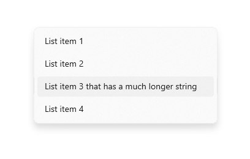
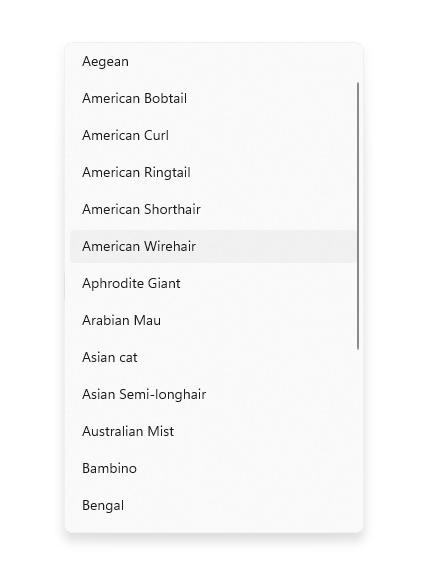

# Combo box and list box

Use a combo box (also known as a drop-down list) to present a list of items that a user can select from. A combo box starts in a compact state and expands to show a list of selectable items. A list box is similar to a combo box, but is not collapsible/does not have a compact state. You can learn more about list boxes at the end of this article.

When the combo box is closed, it either displays the current selection or is empty if there is no selected item. When the user expands the combo box, it displays the list of selectable items.


## Is this the right control?

- Use a drop-down list to let users select a single value from a set of items that can be adequately represented with single lines of text.
- Use a list or grid view instead of a combo box to display items that contain multiple lines of text or images.
- When there are fewer than five items, consider using [radio buttons](radio-button.md) (if only one item can be selected) or [check boxes](checkbox.md) (if multiple items can be selected).
- Use a combo box when the selection items are of secondary importance in the flow of your app. If the default option is recommended for most users in most situations, showing all the items by using a list view might draw more attention to the options than necessary. You can save space and minimize distraction by using a combo box.

## Examples

A combo box in its compact state can show a header.


Although combo boxes expand to support longer string lengths, avoid excessively long strings that are difficult to read.



If the collection in a combo box is long enough, a scroll bar will appear to accommodate it. Group items logically in the list.



## Recommendations

- Limit the text content of combo box items to a single line.
- Sort items in a combo box in the most logical order. Group together related options and place the most common options at the top. Sort names in alphabetical order, numbers in numerical order, and dates in chronological order.

## List boxes

A list box allows the user to choose either a single item or multiple items from a collection. List boxes are similar to drop-down lists, except that list boxes are always open—there is no compact (non-expanded) state for a list box. Items in the list can be scrolled if there isn't space to show everything.

### Is a list box the right control?

- A list box can be useful when items in the list are important enough to prominently display, and when there's enough screen real estate, to show the full list.
- A list box should draw the user's attention to the full set of alternatives in an important choice. By contrast, a drop-down list initially draws the user's attention to the selected item.
- Avoid using a list box if:
  - There is a very small number of items for the list. A single-select list box that always has the same 2 options might be better presented as [radio buttons](radio-button.md). Also consider using radio buttons when there are 3 or 4 static items in the list.
  - The list box is single-select and it always has the same 2 options where one can be implied as not the other, such as "on" and "off." Use a single check box or a toggle switch.
  - There is a very large number of items. A better choice for long lists are grid view and list view. For very long lists of grouped data, semantic zoom is preferred.
  - The items are contiguous numerical values. If that's the case, consider using a [slider](slider.md).
  - The selection items are of secondary importance in the flow of your app or the default option is recommended for most users in most situations. Use a drop-down list instead.

### Recommendations for list boxes

- The ideal range of items in a list box is 3 to 9.
- A list box works well when its items can dynamically vary.
- If possible, set the size of a list box so that its list of items don't need to be panned or scrolled.
- Verify that the purpose of the list box, and which items are currently selected, is clear.
- Reserve visual effects and animations for touch feedback, and for the selected state of items.
- Limit the list box item's text content to a single line. If the items are visuals, you can customize the size. If an item contains multiple lines of text or images, instead use a grid view or list view.
- Use the default font unless your brand guidelines indicate to use another.
- Don't use a list box to perform commands or to dynamically show or hide other controls.

## UWP and WinUI 2

[!INCLUDE [uwp-winui2-note](../../../includes/uwp-winui-2-note.md)]

APIs for this control exist in the [Windows.UI.Xaml.Controls](/uwp/api/Windows.UI.Xaml.Controls) namespace.

> [!div class="checklist"]
>
> - **UWP APIs:** [ComboBox class](/uwp/api/Windows.UI.Xaml.Controls.ComboBox), [IsEditable property](/uwp/api/windows.ui.xaml.controls.combobox.iseditable), [Text property](/uwp/api/Windows.UI.Xaml.Controls.ComboBox), [TextSubmitted event](/uwp/api/Windows.UI.Xaml.Controls.ComboBox), [ListBox class](/uwp/api/Windows.UI.Xaml.Controls.ListBox)
> - [Open the WinUI 2 Gallery app and see the ComboBox in action](winui2gallery:/item/ComboBox). [!INCLUDE [winui-2-gallery](../../../includes/winui-2-gallery.md)]

[WinUI 2.2](../../winui/winui2/index.md) or later includes a new template for this control that uses rounded corners. For more info, see [Corner radius](../style/rounded-corner.md).

## Create a combo box

> [!div class="checklist"]
>
> - **Important APIs**: [ComboBox class](/windows/windows-app-sdk/api/winrt/microsoft.UI.Xaml.Controls.ComboBox), [IsEditable property](/windows/windows-app-sdk/api/winrt/microsoft.ui.xaml.controls.combobox.iseditable), [Text property](/windows/windows-app-sdk/api/winrt/microsoft.UI.Xaml.Controls.ComboBox), [TextSubmitted event](/windows/windows-app-sdk/api/winrt/microsoft.UI.Xaml.Controls.ComboBox), [ListBox class](/windows/windows-app-sdk/api/winrt/microsoft.UI.Xaml.Controls.ListBox)

> [!div class="nextstepaction"]
> [Open the WinUI 3 Gallery app and see the ComboBox in action](winui3gallery:/item/ComboBox).

[!INCLUDE [winui-3-gallery](../../../includes/winui-3-gallery.md)]

You populate the combo box by adding objects directly to the [Items](/windows/windows-app-sdk/api/winrt/microsoft.ui.xaml.controls.itemscontrol.items) collection or by binding the [ItemsSource](/windows/windows-app-sdk/api/winrt/microsoft.ui.xaml.controls.itemscontrol.itemssource) property to a data source. Items added to the ComboBox are wrapped in [ComboBoxItem](/windows/windows-app-sdk/api/winrt/microsoft.ui.xaml.controls.comboboxitem) containers.

Here's a simple combo box with items added in XAML.

```xaml
<ComboBox Header="Colors" PlaceholderText="Pick a color" Width="200">
    <x:String>Blue</x:String>
    <x:String>Green</x:String>
    <x:String>Red</x:String>
    <x:String>Yellow</x:String>
</ComboBox>
```

The following example demonstrates binding a combo box to a collection of FontFamily objects.

```xaml
<ComboBox x:Name="FontsCombo" Header="Fonts" Height="44" Width="296"
          ItemsSource="{x:Bind fonts}" DisplayMemberPath="Source"/>
```

```csharp
ObservableCollection<FontFamily> fonts = new ObservableCollection<FontFamily>()
{
    fonts.Add(new FontFamily("Arial"));
    fonts.Add(new FontFamily("Courier New"));
    fonts.Add(new FontFamily("Times New Roman"));
};
```

### Item selection

Like ListView and GridView, ComboBox is derived from [Selector](/windows/windows-app-sdk/api/winrt/microsoft.ui.xaml.controls.primitives.selector), so you can get the user's selection in the same standard way.

You can get or set the combo box's selected item by using the [SelectedItem](/windows/windows-app-sdk/api/winrt/microsoft.ui.xaml.controls.primitives.selector.selecteditem) property, and get or set the index of the selected item by using the [SelectedIndex](/windows/windows-app-sdk/api/winrt/microsoft.ui.xaml.controls.primitives.selector.selectedindex) property.

To get the value of a particular property on the selected data item, you can use the [SelectedValue](/windows/windows-app-sdk/api/winrt/microsoft.ui.xaml.controls.primitives.selector.selectedvalue) property. In this case, set the [SelectedValuePath](/windows/windows-app-sdk/api/winrt/microsoft.ui.xaml.controls.primitives.selector.selectedvaluepath) to specify which property on the selected item to get the value from.

> [!TIP]
> If you set SelectedItem or SelectedIndex to indicate the default selection, an exception occurs if the property is set before the combo box Items collection is populated. Unless you define your Items in XAML, it's best to handle the combo box Loaded event, and set SelectedItem or SelectedIndex in the Loaded event handler.

You can bind to these properties in XAML, or handle the [SelectionChanged](/windows/windows-app-sdk/api/winrt/microsoft.ui.xaml.controls.primitives.selector.selectionchanged) event to respond to selection changes.

In the event handler code, you can get the selected item from the [SelectionChangedEventArgs.AddedItems](/windows/windows-app-sdk/api/winrt/microsoft.ui.xaml.controls.selectionchangedeventargs.addeditems) property. You can get the previously selected item (if any) from the [SelectionChangedEventArgs.RemovedItems](/windows/windows-app-sdk/api/winrt/microsoft.ui.xaml.controls.selectionchangedeventargs.removeditems) property. The AddedItems and RemovedItems collections each contain only 1 item because combo box does not support multiple selection.

This example shows how to handle the SelectionChanged event, and also how to bind to the selected item.

```xaml
<StackPanel>
    <ComboBox x:Name="colorComboBox" Width="200"
              Header="Colors" PlaceholderText="Pick a color"
              SelectionChanged="ColorComboBox_SelectionChanged">
        <x:String>Blue</x:String>
        <x:String>Green</x:String>
        <x:String>Red</x:String>
        <x:String>Yellow</x:String>
    </ComboBox>

    <Rectangle x:Name="colorRectangle" Height="30" Width="100"
               Margin="0,8,0,0" HorizontalAlignment="Left"/>

    <TextBlock Text="{x:Bind colorComboBox.SelectedIndex, Mode=OneWay}"/>
    <TextBlock Text="{x:Bind colorComboBox.SelectedItem, Mode=OneWay}"/>
</StackPanel>
```

```csharp
private void ColorComboBox_SelectionChanged(object sender, SelectionChangedEventArgs e)
{
    string colorName = e.AddedItems[0].ToString();
    Color color;
    switch (colorName)
    {
        case "Yellow":
            color = Colors.Yellow;
            break;
        case "Green":
            color = Colors.Green;
            break;
        case "Blue":
            color = Colors.Blue;
            break;
        case "Red":
            color = Colors.Red;
            break;
    }
    colorRectangle.Fill = new SolidColorBrush(color);
}
```

#### SelectionChanged and keyboard navigation

By default, the SelectionChanged event occurs when a user clicks, taps, or presses Enter on an item in the list to commit their selection, and the combo box closes. Selection doesn't change when the user navigates the open combo box list with the keyboard arrow keys.

To make a combo box that "live updates" while the user is navigating the open list with the arrow keys (like a Font selection drop-down), set [SelectionChangedTrigger](/windows/windows-app-sdk/api/winrt/microsoft.ui.xaml.controls.combobox.selectionchangedtrigger) to [Always](/windows/windows-app-sdk/api/winrt/microsoft.ui.xaml.controls.comboboxselectionchangedtrigger). This causes the SelectionChanged event to occur when focus changes to another item in the open list.

#### Selected item behavior change

In Windows 10, version 1809 ([SDK 17763](https://developer.microsoft.com/windows/downloads/windows-10-sdk)) or later, the behavior of selected items is updated to support editable combo boxes.

Prior to SDK 17763, the value of the SelectedItem property (and therefore, SelectedValue and SelectedIndex) was required to be in the combo box's Items collection. Using the previous example, setting `colorComboBox.SelectedItem = "Pink"` results in:

- SelectedItem = null
- SelectedValue = null
- SelectedIndex = -1

In SDK 17763 and later, the value of the SelectedItem property (and therefore, SelectedValue and SelectedIndex) is not required to be in the combo box's Items collection. Using the previous example, setting `colorComboBox.SelectedItem = "Pink"` results in:

- SelectedItem = Pink
- SelectedValue = Pink
- SelectedIndex = -1

### Text Search

Combo boxes automatically support search within their collections. As users type characters on a physical keyboard while focused on an open or closed combo box, candidates matching the user's string are brought into view. This functionality is especially helpful when navigating a long list. For example, when interacting with a drop-down containing a list of states, users can press the "w" key to bring "Washington" into view for quick selection. The text search is not case-sensitive.

You can set the [IsTextSearchEnabled](/windows/windows-app-sdk/api/winrt/microsoft.ui.xaml.controls.combobox.istextsearchenabled) property to **false** to disable this functionality.

## Make a combo box editable

> [!IMPORTANT]
> This feature requires Windows 10, version 1809 ([SDK 17763](https://developer.microsoft.com/windows/downloads/windows-10-sdk)) or later.

By default, a combo box lets the user select from a pre-defined list of options. However, there are cases where the list contains only a subset of valid values, and the user should be able to enter other values that aren't listed. To support this, you can make the combo box editable.

To make a combo box editable, set the [IsEditable](/windows/windows-app-sdk/api/winrt/microsoft.ui.xaml.controls.combobox.iseditable) property to **true**. Then, handle the [TextSubmitted](/windows/windows-app-sdk/api/winrt/microsoft.UI.Xaml.Controls.ComboBox) event to work with the value entered by the user.

By default, the SelectedItem value is updated when the user commits custom text. You can override this behavior by setting **Handled** to **true** in the TextSubmitted event args. When the event is marked as handled, the combo box will take no further action after the event and will stay in the editing state. SelectedItem will not be updated.

This example shows a simple editable combo box. The list contains simple strings, and any value entered by the user is used as entered.

A "recently used names" chooser lets the user enter custom strings. The 'RecentlyUsedNames' list contains some values that the user can choose from, but the user can also add a new, custom value. The 'CurrentName' property represents the currently entered name.

```xaml
<ComboBox IsEditable="true"
          ItemsSource="{x:Bind RecentlyUsedNames}"
          SelectedItem="{x:Bind CurrentName, Mode=TwoWay}"/>
```

### Text submitted

You can handle the [TextSubmitted](/windows/windows-app-sdk/api/winrt/microsoft.UI.Xaml.Controls.ComboBox) event to work with the value entered by the user. In the event handler, you will typically validate that the value entered by the user is valid, then use the value in your app. Depending on the situation, you might also add the value to the combo box's list of options for future use.

The TextSubmitted event occurs when these conditions are met:

- The IsEditable property is **true**
- The user enters text that does not match an existing entry in the combo box list
- The user presses Enter, or moves focus from the combo box.

The TextSubmitted event does not occur if the user enters text and then navigates up or down through the list.

### Sample - Validate input and use locally

In this example, a font size chooser contains a set of values corresponding to the font size ramp, but the user may enter font sizes that are not in the list.

When the user adds a value that's not in the list, the font size updates, but the value is not added to the list of font sizes.

If the newly entered value is not valid, you use the SelectedValue to revert the Text property to the last known good value.

```xaml
<ComboBox x:Name="fontSizeComboBox"
          IsEditable="true"
          ItemsSource="{x:Bind ListOfFontSizes}"
          TextSubmitted="FontSizeComboBox_TextSubmitted"/>
```

```csharp
private void FontSizeComboBox_TextSubmitted(ComboBox sender, ComboBoxTextSubmittedEventArgs e)
{
    if (byte.TryParse(e.Text, out double newValue))
    {
        // Update the app's font size.
        _fontSize = newValue;
    }
    else
    {
        // If the item is invalid, reject it and revert the text.
        // Mark the event as handled so the framework doesn't update the selected item.
        sender.Text = sender.SelectedValue.ToString();
        e.Handled = true;
    }
}
```

### Sample - Validate input and add to list

Here, a "favorite color chooser" contains the most common favorite colors (Red, Blue, Green, Orange), but the user may enter a favorite color that's not in the list. When the user adds a valid color (like Pink), the newly entered color is added to the list and set as the active "favorite color".

```xaml
<ComboBox x:Name="favoriteColorComboBox"
          IsEditable="true"
          ItemsSource="{x:Bind ListOfColors}"
          TextSubmitted="FavoriteColorComboBox_TextSubmitted"/>
```

```csharp
private void FavoriteColorComboBox_TextSubmitted(ComboBox sender, ComboBoxTextSubmittedEventArgs e)
{
    if (IsValid(e.Text))
    {
        FavoriteColor newColor = new FavoriteColor()
        {
            ColorName = e.Text,
            Color = ColorFromStringConverter(e.Text)
        }
        ListOfColors.Add(newColor);
    }
    else
    {
        // If the item is invalid, reject it but do not revert the text.
        // Mark the event as handled so the framework doesn't update the selected item.
        e.Handled = true;
    }
}

bool IsValid(string Text)
{
    // Validate that the string is: not empty; a color.
}
```

## Get the sample code

- [WinUI Gallery sample](https://github.com/Microsoft/WinUI-Gallery) - See all the XAML controls in an interactive format.

## Related articles

- [Text controls](text-controls.md)
- [Guidelines for spell checking](text-controls.md#guidelines-for-spell-checking)
- [TextBox class](/windows/windows-app-sdk/api/winrt/microsoft.UI.Xaml.Controls.TextBox)
- [PasswordBox class](/windows/windows-app-sdk/api/winrt/microsoft.UI.Xaml.Controls.PasswordBox)
- [String.Length property](/dotnet/api/system.string.length)