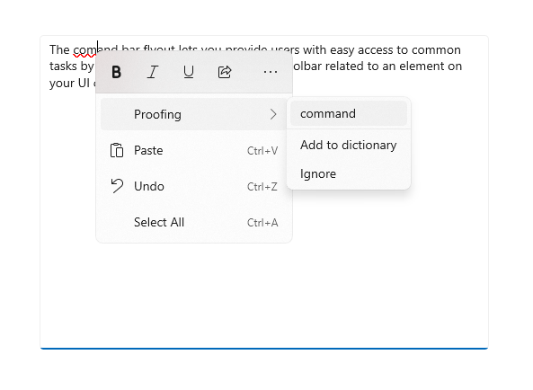
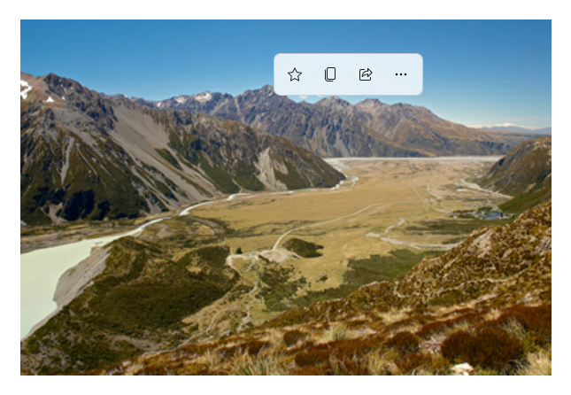
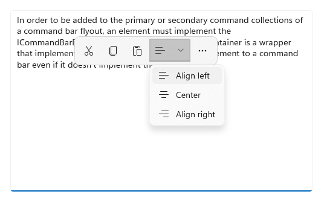
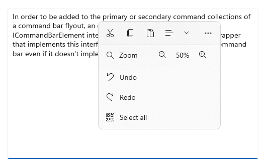
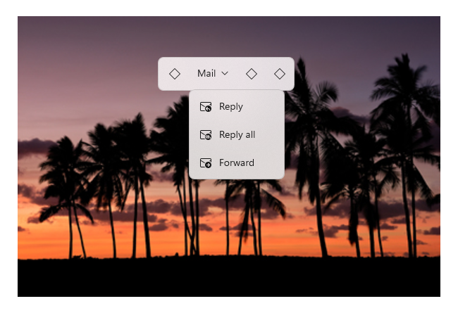
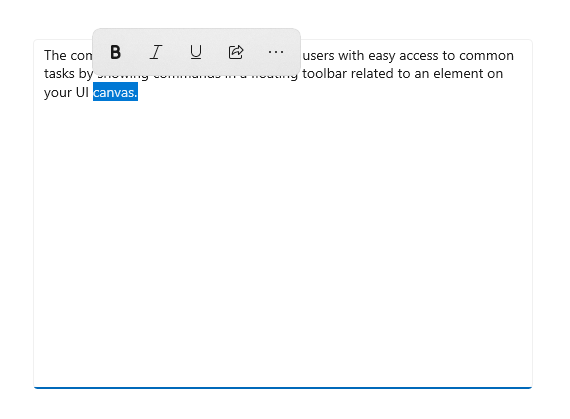

# Command bar flyout

The command bar flyout lets you provide users with easy access to common tasks by showing commands in a floating toolbar related to an element on your UI canvas.



Like [CommandBar](command-bar.md), CommandBarFlyout has **PrimaryCommands** and **SecondaryCommands** properties you can use to add commands. You can place commands in either collection, or both. When and how the primary and secondary commands are displayed depends on the display mode.

The command bar flyout has two display modes: *collapsed* and *expanded*.

- In the collapsed mode, only the primary commands are shown. If your command bar flyout has both primary and secondary commands, a "see more" button, which is represented by an ellipsis \[...\], is displayed. This lets the user get access to the secondary commands by transitioning to expanded mode.
- In the expanded mode, both the primary and secondary commands are shown. (If the control has only secondary items, they are shown in a way similar to the MenuFlyout control.)

**Get the Windows UI Library**

:::row:::
   :::column:::
      
   :::column-end:::
   :::column span="3":::
      The **CommandBarFlyout** control is included as part of the Windows UI Library, a NuGet package that contains new controls and UI features for Windows apps. For more info, including installation instructions, see [Windows UI Library](/uwp/toolkits/winui/).
   :::column-end:::
   :::column:::

   :::column-end:::
:::row-end:::

>**Windows UI Library APIs**: [CommandBarFlyout class](/uwp/api/microsoft.ui.xaml.controls.commandbarflyout), [TextCommandBarFlyout class](/uwp/api/microsoft.ui.xaml.controls.textcommandbarflyout)
>
>**Platform APIs**: [CommandBarFlyout class](/uwp/api/windows.ui.xaml.controls.commandbarflyout), [TextCommandBarFlyout class](/uwp/api/windows.ui.xaml.controls.textcommandbarflyout), [AppBarButton class](/uwp/api/windows.ui.xaml.controls.appbarbutton), [AppBarToggleButton class](/uwp/api/windows.ui.xaml.controls.appbartogglebutton), [AppBarSeparator class](/uwp/api/windows.ui.xaml.controls.appbarseparator)

## Is this the right control?

Use the command bar flyout control to show a collection of commands to the user, such as buttons and menu items, in the context of an element on the app canvas.

Command bar flyout is the recommended control for creating [context menus](menus-and-context-menus.md). This allows the common commands (such as Copy, Cut, Paste, Delete, Share or text selection commands) that are most contextually relevant for the context menu's scenario to be added as primary commands so that they will be shown as a single, horizontal row in the command bar flyout. The TextCommandBarFlyout is already configured appropriately to automatically display text commands in TextBox, TextBlock, RichEditBox, RichTextBlock, and PasswordBox controls. A CommandBarFlyout can be used to replace the default text commands on text controls.

To show contextual commands on list items follow the guidance in [Contextual commanding for collections and lists](collection-commanding.md).

## Examples

<table>
<th align="left">XAML Controls Gallery<th>
<tr>
<td></img></td>
<td>
    <p>If you have the <strong style="font-weight: semi-bold">XAML Controls Gallery</strong> app installed, click here to <a href="xamlcontrolsgallery:/item/CommandBarFlyout">open the app and see the CommandBarFlyout in action</a>.</p>
    <ul>
    <li><a href="https://www.microsoft.com/p/xaml-controls-gallery/9msvh128x2zt">Get the XAML Controls Gallery app (Microsoft Store)</a></li>
    <li><a href="https://github.com/Microsoft/Xaml-Controls-Gallery">Get the source code (GitHub)</a></li>
    </ul>
</td>
</tr>
</table>

## Proactive vs. reactive invocation

There are typically two ways to invoke a flyout or menu that's associated with an element on your UI canvas: _proactive invocation_ and _reactive invocation_.

In proactive invocation, commands appear automatically when the user interacts with the item that the commands are associated with. For example, text formatting commands might pop up when the user selects text in a text box. In this case, the command bar flyout does not take focus. Instead, it presents relevant commands close to the item the user is interacting with. If the user doesn't interact with the commands, they are dismissed.

In reactive invocation, commands are shown in response to an explicit user action to request the commands; for example, a right-click. This corresponds to the traditional concept of a [context menu](menus-and-context-menus.md).

You can use the CommandBarFlyout in either way, or even a mixture of the two.

## Create a command bar flyout

This example shows how to create a command bar flyout and use it both proactively and reactively. When the image is tapped, the flyout is shown in its collapsed mode. When shown as a context menu, the flyout is shown in its expanded mode. In either case, the user can expand or collapse the flyout after it's opened.



> _A collapsed command bar flyout_


> _An expanded command bar flyout_

```xaml
<Grid>
    <Grid.Resources>
        <CommandBarFlyout x:Name="ImageCommandsFlyout">
            <AppBarButton Icon="OutlineStar" ToolTipService.ToolTip="Favorite"/>
            <AppBarButton Icon="Copy" ToolTipService.ToolTip="Copy"/>
            <AppBarButton Icon="Share" ToolTipService.ToolTip="Share"/>
            <CommandBarFlyout.SecondaryCommands>
                <AppBarButton Label="Select all"/>
                <AppBarButton Label="Delete" Icon="Delete"/>
            </CommandBarFlyout.SecondaryCommands>
        </CommandBarFlyout>
    </Grid.Resources>

    <Image Source="Assets/image1.png" Width="300"
           Tapped="Image_Tapped" FlyoutBase.AttachedFlyout="{x:Bind ImageCommandsFlyout}"
           ContextFlyout="{x:Bind ImageCommandsFlyout}"/>
</Grid>
```

```csharp
private void Image_Tapped(object sender, TappedRoutedEventArgs e)
{
    var flyout = FlyoutBase.GetAttachedFlyout((FrameworkElement)sender);
    var options = new FlyoutShowOptions()
    {
        // Position shows the flyout next to the pointer.
        // "Transient" ShowMode makes the flyout open in its collapsed state.
        Position = e.GetPosition((FrameworkElement)sender),
        ShowMode = FlyoutShowMode.Transient
    };
    flyout?.ShowAt((FrameworkElement)sender, options);
}
```

### Show commands proactively

When you show contextual commands proactively, only the primary commands should be shown by default (the command bar flyout should be collapsed). Place the most important commands in the primary commands collection, and additional commands that would traditionally go in a context menu into the secondary commands collection.

To proactively show commands, you typically handle the [Click](/uwp/api/windows.ui.xaml.controls.primitives.buttonbase.click) or [Tapped](/uwp/api/windows.ui.xaml.uielement.tapped) event to show the command bar flyout. Set the flyout's [ShowMode](/uwp/api/windows.ui.xaml.controls.primitives.flyoutbase.showmode) to **Transient** or **TransientWithDismissOnPointerMoveAway** to open the flyout in its collapsed mode without taking focus.

Starting in the Windows 10 Insider Preview, text controls have a **SelectionFlyout** property. When you assign a flyout to this property, it is automatically shown when text is selected.

### Show commands reactively

When you show contextual commands reactively, as a context menu, the secondary commands are shown by default (the command bar flyout should be expanded). In this case, the command bar flyout might have both primary and secondary commands, or secondary commands only.

To show commands in a context menu, you typically assign the flyout to the [ContextFlyout](/uwp/api/windows.ui.xaml.uielement.contextflyout) property of a UI element. This way, opening the flyout is handled by the element, and you don't need to do anything more.

If you handle showing the flyout yourself (for example, on a [RightTapped](/uwp/api/windows.ui.xaml.uielement.righttapped) event), set the flyout's [ShowMode](/uwp/api/windows.ui.xaml.controls.primitives.flyoutbase.showmode) to **Standard** to open the flyout in its expanded mode and give it focus.

> [!TIP]
> For more info about options when showing a flyout and how to control placement of the flyout, see [Flyouts](../controls/dialogs-and-flyouts/flyouts.md).

### Show an always expanded CommandBarFlyout

When you have primary and secondary commands in a CommandBarFlyout, the "see more" \[...\] button is displayed by default, and can be used to expand and collapse the secondary commands. If you'd like to keep your CommandBarFlyout in expanded mode and show the secondary commands at all times, you can use the `CommandBarFlyout.AlwaysExpanded` property.

When the `AlwaysExpanded` property is set to `true`, the "see more" button is not shown, and the user is not able to toggle the expanded state of the control. The CommandBarFlyout will still dismiss as usual when a secondary command is clicked or the user clicks outside of the flyout.

This property only has an effect if the CommandBarFlyout has secondary commands. If there are no secondary commands, the CommandBarFlyout will always be in collapsed mode.

> [!TIP]
> You can still collapse and expand the CommandBarFlyout programmatically by setting the [IsOpen](/uwp/api/windows.ui.xaml.controls.primitives.flyoutbase.isopen) property even when the `AlwaysExpanded` property is set to `true`.

## Commands and content

The CommandBarFlyout control has 2 properties you can use to add commands and content: [PrimaryCommands](/uwp/api/windows.ui.xaml.controls.commandbarflyout.primarycommands) and [SecondaryCommands](/uwp/api/windows.ui.xaml.controls.commandbarflyout.secondarycommands).

By default, command bar items are added to the **PrimaryCommands** collection. These commands are shown in the command bar and are visible in both the collapsed and expanded modes. Unlike CommandBar, primary commands do not automatically overflow to the secondary commands and might be truncated.

You can also add commands to the **SecondaryCommands** collection. Secondary commands are shown in the menu portion of the control and are visible only in the expanded mode.

If there are **common commands** (such as Copy, Cut, Paste, Delete, Share or text selection commands) that are important to the scenario, it is recommended to add them as primary commands rather than secondary commands.

### App bar buttons

You can populate the PrimaryCommands and SecondaryCommands directly with [AppBarButton](/uwp/api/Windows.UI.Xaml.Controls.AppBarButton), [AppBarToggleButton](/uwp/api/Windows.UI.Xaml.Controls.AppBarToggleButton), and [AppBarSeparator](/uwp/api/Windows.UI.Xaml.Controls.AppBarSeparator) controls.

The app bar button controls are characterized by an icon and text label. These controls are optimized for use in a command bar, and their appearance changes depending on whether the control is shown in the command bar or the overflow menu.

- App bar buttons used as primary commands are shown in the command bar with only their icon; the text label is not shown. We recommend that you use a tooltip to show a text description of the command, as shown here.
    ```xaml
    <AppBarButton Icon="Copy" ToolTipService.ToolTip="Copy"/>
    ```
- App bar buttons used as secondary commands are shown in the menu, with both the label and icon visible.

## Icons

Consider providing menu item icons for:

- The most commonly used items.
- Menu items whose icon is standard or well known.
- Menu items whose icon well illustrates what the command does.

Don't feel obligated to provide icons for commands that don't have a standard visualization. Cryptic icons aren't helpful, create visual clutter, and prevent users from focusing on the important menu items.

### Other content

You can add other controls to a command bar flyout by wrapping them in an AppBarElementContainer. This lets you add controls like [DropDownButton](buttons.md) or [SplitButton](buttons.md), or add containers like [StackPanel](buttons.md) to create more complex UI.

In order to be added to the primary or secondary command collections of a command bar flyout, an element must implement the [ICommandBarElement](/uwp/api/windows.ui.xaml.controls.icommandbarelement) interface. AppBarElementContainer is a wrapper that implements this interface so you can add an element to a command bar even if it doesn't implement the interface itself.

Here, an AppBarElementContainer is used to add extra elements to a command bar flyout. A SplitButton is added to the primary commands to allow selection of colors. A StackPanel is added to the secondary commands to allow a more complex layout for zoom controls.

> [!TIP]
> By default, elements designed for the app canvas might not look right in a command bar. When you add an element using AppBarElementContainer, there are some steps you should take to make the element match other command bar elements:
>
> - Override the default brushes with [lightweight styling](../style/xaml-styles.md#lightweight-styling) to make the element's background and border match the app bar buttons.
> - Adjust the size and position of the element.
> - Wrap icons in a Viewbox with a Width and Height of 16px.

> [!NOTE]
> This example shows only the command bar flyout UI, it does not implement any of the commands that are shown. For more info about implementing the commands, see [Buttons](buttons.md) and [Command design basics](../basics/commanding-basics.md).



> _A collapsed command bar flyout with an open SplitButton_



> _An expanded command bar flyout with custom zoom UI in the menu_


```xaml
<muxc:CommandBarFlyout>
    <AppBarButton Icon="Cut" ToolTipService.ToolTip="Cut"/>
    <AppBarButton Icon="Copy" ToolTipService.ToolTip="Copy"/>
    <AppBarButton Icon="Paste" ToolTipService.ToolTip="Paste"/>
    <!-- Alignment controls -->
    <AppBarElementContainer>
         <muxc:SplitButton ToolTipService.ToolTip="Alignment">
            <muxc:SplitButton.Resources>
                <!-- Override default brushes to make the SplitButton 
                     match other command bar elements. -->
                <Style TargetType="SplitButton">
                    <Setter Property="Height" Value="38"/>
                </Style>
                <SolidColorBrush x:Key="SplitButtonBackground"
                                 Color="Transparent"/>
                <SolidColorBrush x:Key="SplitButtonBackgroundPressed"
                                 Color="{ThemeResource SystemListMediumColor}"/>
                <SolidColorBrush x:Key="SplitButtonBackgroundPointerOver"
                                 Color="{ThemeResource SystemListLowColor}"/>
                <SolidColorBrush x:Key="SplitButtonBorderBrush" Color="Transparent"/>
                <SolidColorBrush x:Key="SplitButtonBorderBrushPointerOver"
                                 Color="Transparent"/>
                <SolidColorBrush x:Key="SplitButtonBorderBrushChecked"
                                 Color="Transparent"/>
            </muxc:SplitButton.Resources>
            <muxc:SplitButton.Content>
                <Viewbox Width="16" Height="16" Margin="0,2,0,0">
                    <SymbolIcon Symbol="AlignLeft"/>
                </Viewbox>
            </muxc:SplitButton.Content>
            <muxc:SplitButton.Flyout>
                <MenuFlyout>
                    <MenuFlyoutItem Icon="AlignLeft" Text="Align left"/>
                    <MenuFlyoutItem Icon="AlignCenter" Text="Center"/>
                    <MenuFlyoutItem Icon="AlignRight" Text="Align right"/>
                </MenuFlyout>
            </muxc:SplitButton.Flyout>
        </muxc:SplitButton>
    </AppBarElementContainer>
    <!-- end Alignment controls -->
    <muxc:CommandBarFlyout.SecondaryCommands>
        <!-- Zoom controls -->
        <AppBarElementContainer>
            <AppBarElementContainer.Resources>
                <!-- Override default brushes to make the Buttons
                     match other command bar elements. -->
                <SolidColorBrush x:Key="ButtonBackground"
                                 Color="Transparent"/>
                <SolidColorBrush x:Key="ButtonBackgroundPressed"
                                 Color="{ThemeResource SystemListMediumColor}"/>
                <SolidColorBrush x:Key="ButtonBackgroundPointerOver"
                                 Color="{ThemeResource SystemListLowColor}"/>
                <SolidColorBrush x:Key="ButtonBorderBrush"
                                 Color="Transparent"/>
                <SolidColorBrush x:Key="ButtonBorderBrushPointerOver"
                                 Color="Transparent"/>
                <SolidColorBrush x:Key="ButtonBorderBrushChecked"
                                 Color="Transparent"/>
                <Style TargetType="TextBlock">
                    <Setter Property="VerticalAlignment" Value="Center"/>
                </Style>
                <Style TargetType="Button">
                    <Setter Property="Height" Value="40"/>
                    <Setter Property="Width" Value="40"/>
                </Style>
            </AppBarElementContainer.Resources>
            <Grid Margin="12,-4">
                <Grid.ColumnDefinitions>
                    <ColumnDefinition Width="Auto"/>
                    <ColumnDefinition Width="76"/>
                    <ColumnDefinition Width="Auto"/>
                </Grid.ColumnDefinitions>
                <Viewbox Width="16" Height="16" Margin="0,2,0,0">
                    <SymbolIcon Symbol="Zoom"/>
                </Viewbox>
                <TextBlock Text="Zoom" Margin="10,0,0,0" Grid.Column="1"/>
                <StackPanel Orientation="Horizontal" Grid.Column="2">
                    <Button ToolTipService.ToolTip="Zoom out">
                        <Viewbox Width="16" Height="16">
                            <SymbolIcon Symbol="ZoomOut"/>
                        </Viewbox>
                    </Button>
                    <TextBlock Text="50%" Width="40"
                               HorizontalTextAlignment="Center"/>
                    <Button ToolTipService.ToolTip="Zoom in">
                        <Viewbox Width="16" Height="16">
                            <SymbolIcon Symbol="ZoomIn"/>
                        </Viewbox>
                    </Button>
                </StackPanel>
            </Grid>
        </AppBarElementContainer>
        <!-- end Zoom controls -->
        <AppBarSeparator/>
        <AppBarButton Label="Undo" Icon="Undo"/>
        <AppBarButton Label="Redo" Icon="Redo"/>
        <AppBarButton Label="Select all" Icon="SelectAll"/>
    </muxc:CommandBarFlyout.SecondaryCommands>
</muxc:CommandBarFlyout>
```

## Create a context menu with secondary commands only

You can use a command bar flyout with only secondary commands to create a context menu that achieves the same look and behavior of [menu flyout](menus.md).


> _Command bar flyout as a context menu_

```xaml
<Grid>
    <Grid.Resources>
        <!-- A command bar flyout with only secondary commands. -->
        <CommandBarFlyout x:Name="ContextMenu">
            <CommandBarFlyout.SecondaryCommands>
                <AppBarButton Label="Copy" Icon="Copy"/>
                <AppBarButton Label="Save" Icon="Save"/>
                <AppBarButton Label="Print" Icon="Print"/>
                <AppBarSeparator />
                <AppBarButton Label="Properties"/>
            </CommandBarFlyout.SecondaryCommands>
        </CommandBarFlyout>
    </Grid.Resources>

    <Image Source="Assets/image1.png" Width="300"
           ContextFlyout="{x:Bind ContextMenu}"/>
</Grid>
```

You can also use a CommandBarFlyout with a DropDownButton to create a standard menu.



> _A drop down button menu in a command bar flyout_

```xaml
<CommandBarFlyout>
    <AppBarButton Icon="Placeholder"/>
    <AppBarElementContainer>
        <DropDownButton Content="Mail">
            <DropDownButton.Resources>
                <!-- Override default brushes to make the DropDownButton
                     match other command bar elements. -->
                <Style TargetType="DropDownButton">
                    <Setter Property="Height" Value="38"/>
                </Style>
                <SolidColorBrush x:Key="ButtonBackground"
                                 Color="Transparent"/>
                <SolidColorBrush x:Key="ButtonBackgroundPressed"
                                 Color="{ThemeResource SystemListMediumColor}"/>
                <SolidColorBrush x:Key="ButtonBackgroundPointerOver"
                                 Color="{ThemeResource SystemListLowColor}"/>

                <SolidColorBrush x:Key="ButtonBorderBrush"
                                 Color="Transparent"/>
                <SolidColorBrush x:Key="ButtonBorderBrushPointerOver"
                                 Color="Transparent"/>
                <SolidColorBrush x:Key="ButtonBorderBrushChecked"
                                 Color="Transparent"/>
            </DropDownButton.Resources>
            <DropDownButton.Flyout>
                <CommandBarFlyout Placement="BottomEdgeAlignedLeft">
                    <CommandBarFlyout.SecondaryCommands>
                        <AppBarButton Icon="MailReply" Label="Reply"/>
                        <AppBarButton Icon="MailReplyAll" Label="Reply all"/>
                        <AppBarButton Icon="MailForward" Label="Forward"/>
                    </CommandBarFlyout.SecondaryCommands>
                </CommandBarFlyout>
            </DropDownButton.Flyout>
        </DropDownButton>
    </AppBarElementContainer>
    <AppBarButton Icon="Placeholder"/>
    <AppBarButton Icon="Placeholder"/>
</CommandBarFlyout>
```

## Command bar flyouts for text controls

The [TextCommandBarFlyout](/uwp/api/microsoft.ui.xaml.controls.textcommandbarflyout) is a specialized command bar flyout that contains commands for editing text. Each text control shows the TextCommandBarFlyout automatically as a context menu (right-click), or when text is selected. The text command bar flyout adapts to the text selection to only show relevant commands.



> _A text command bar flyout on text selection_


> _An expanded text command bar flyout_


### Available commands

This table shows the commands that are included in a TextCommandBarFlyout, and when they are shown.

| Command | Shown... |
| ------- | -------- |
| Bold | when the text control is not read-only (RichEditBox only). |
| Italic | when the text control is not read-only (RichEditBox only). |
| Underline | when the text control is not read-only (RichEditBox only). |
| Proofing | when IsSpellCheckEnabled is **true** and misspelled text is selected. |
| Cut | when the text control is not read-only and text is selected. |
| Copy | when text is selected. |
| Paste | when the text control is not read-only and the clipboard has content. |
| Undo | when there is an action that can be undone. |
| Select all | when text can be selected. |

### Custom text command bar flyouts

TextCommandBarFlyout can't be customized, and is managed automatically by each text control. However, you can replace the default TextCommandBarFlyout with custom commands.

- To replace the default TextCommandBarFlyout that's shown on text selection, you can create a custom CommandBarFlyout (or other flyout type) and assign it to the **SelectionFlyout** property. If you set SelectionFlyout to **null**, no commands are shown on selection.
- To replace the default TextCommandBarFlyout that's shown as the context menu, assign a custom CommandBarFlyout (or other flyout type) to the **ContextFlyout** property on a text control. If you set ContextFlyout to **null**, the menu flyout shown in previous versions of the text control is shown instead of the TextCommandBarFlyout.

### Light dismiss

Light dismiss controls–such as menus, context menus, and other flyouts–trap keyboard and gamepad focus inside the transient UI until dismissed. To provide a visual cue for this behavior, light dismiss controls on Xbox will draw an overlay that dims the visibility of out of scope UI. This behavior can be modified with the [LightDismissOverlayMode](/uwp/api/windows.ui.xaml.controls.primitives.flyoutbase.lightdismissoverlaymode) property. By default, transient UIs will draw the light dismiss overlay on Xbox (**Auto**) but not other device families. You can choose to force the overlay to be always **On** or always **Off**.

```xaml
<CommandBarFlyout LightDismissOverlayMode="Off" /> >
```

## Get the sample code

- [XAML Controls Gallery sample](https://github.com/Microsoft/Xaml-Controls-Gallery) - See all the XAML controls in an interactive format.
- [XAML Commanding sample](https://github.com/Microsoft/Windows-universal-samples/tree/master/Samples/XamlCommanding)

## Related articles

- [Command design basics for Windows apps](../basics/commanding-basics.md)
- [Contextual commanding for collections and lists](collection-commanding.md).
- [Menus and context menus](menus-and-context-menus.md)
- [Command bar](command-bar.md)
- [CommandBar class](/uwp/api/Windows.UI.Xaml.Controls.CommandBar)
- [CommandBarFlyout class](/uwp/api/microsoft.ui.xaml.controls.commandbarflyout)
