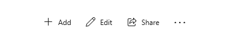
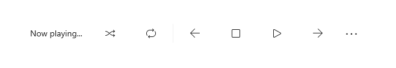
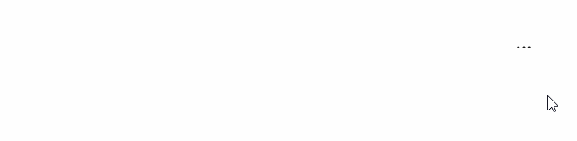
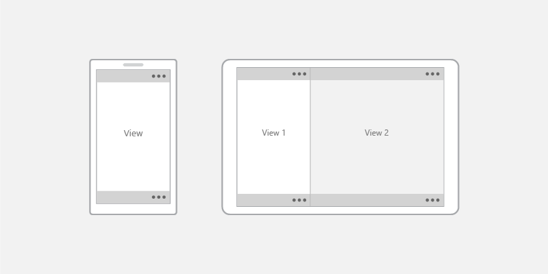
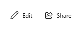
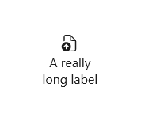
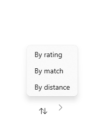
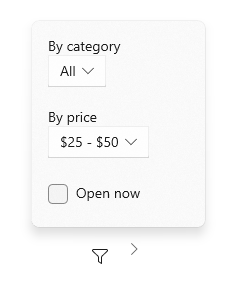

# Command bar

Command bars provide users with easy access to your app's most common tasks. Command bars can provide access to app-level or page-specific commands and can be used with any navigation pattern.



## Is this the right control?

The CommandBar control is a general-purpose, flexible, light-weight control that can display both complex content, such as images or text blocks, as well as simple commands such as [AppBarButton](/windows/winui/api/microsoft.ui.xaml.controls.appbarbutton), [AppBarToggleButton](/windows/winui/api/microsoft.ui.xaml.controls.appbartogglebutton), and [AppBarSeparator](/windows/winui/api/microsoft.ui.xaml.controls.appbarseparator) controls.

> [!NOTE]
> XAML provides both the [AppBar](/windows/winui/api/microsoft.ui.xaml.controls.appbar) control and the [CommandBar](/windows/winui/api/microsoft.ui.xaml.controls.commandbar) control. You should use the AppBar only when you are upgrading a Universal Windows 8 app that uses the AppBar, and need to minimize changes. For new apps in Windows 10, we recommend using the CommandBar control instead. This document assumes you are using the CommandBar control.

## Anatomy

By default, the command bar shows a row of icon buttons and an optional "see more" button, which is represented by an ellipsis \[...\]. Here's the command bar created by the example code shown later. It's shown in its closed compact state.



The command bar can also be shown in a closed minimal state that looks like this. See the [Open and closed states](#open-and-closed-states) section for more info.



Here's the same command bar in its open state. The labels identify the main parts of the control.


The command bar is divided into 4 main areas:

- The content area is aligned to the left side of the bar. It is shown if the [Content](/windows/winui/api/microsoft.ui.xaml.controls.contentcontrol.content) property is populated.
- The primary command area is aligned to the right side of the bar. It is shown if the [PrimaryCommands](/windows/winui/api/microsoft.ui.xaml.controls.commandbar.primarycommands) property is populated.
- The "see more" \[...\] button is shown on the right of the bar. Pressing the "see more" \[...\] button reveals primary command labels and opens the overflow menu if there are secondary commands. The button will not be visible when no primary command labels or secondary labels are present. To change default behavior, use the [OverflowButtonVisibility](/windows/winui/api/microsoft.ui.xaml.controls.commandbar.overflowbuttonvisibility) property.
- The overflow menu is shown only when the command bar is open and the [SecondaryCommands](/windows/winui/api/microsoft.ui.xaml.controls.commandbar.secondarycommands) property is populated. When space is limited, primary commands will move into the SecondaryCommands area. To change default behavior, use the [IsDynamicOverflowEnabled](/windows/winui/api/microsoft.ui.xaml.controls.commandbar.isdynamicoverflowenabled) property.

The layout is reversed when the [FlowDirection](/windows/winui/api/microsoft.ui.xaml.frameworkelement.flowdirection) is **RightToLeft**.

## Placement

Command bars can be placed at the top of the app window, at the bottom of the app window, and inline, by embedding them in a layout control such as ```Grid.row```.


- For small handheld devices, we recommend positioning command bars at the bottom of the screen for easy reachability.
- For devices with larger screens, placing command bars near the top of the window makes them more noticeable and discoverable.

Use the [DiagonalSizeInInches](/uwp/api/windows.graphics.display.displayinformation.diagonalsizeininches) API to determine physical screen size.

Command bars can be placed in the following screen regions on single-view screens (left example) and on multi-view screens (right example). Inline command bars can be placed anywhere in the action space.



>**Touch devices**: If the command bar must remain visible to a user when the touch keyboard, or Soft Input Panel (SIP), appears then you can assign the command bar to the [BottomAppBar](/windows/winui/api/microsoft.ui.xaml.controls.page.bottomappbar) property of a Page and it will move to remain visible when the SIP is present. Otherwise, you should place the command bar inline and positioned relative to your app content.

## UWP and WinUI 2

> [!IMPORTANT]
> The information and examples in this article are optimized for apps that use the [Windows App SDK](/windows/apps/windows-app-sdk/) and [WinUI 3](/windows/apps/winui/winui3/), but are generally applicable to UWP apps that use [WinUI 2](/windows/apps/winui/winui2/). See the UWP API reference for platform specific information and examples.
>
> This section contains information you need to use the control in a UWP or WinUI 2 app.

APIs for this control exist in the [Windows.UI.Xaml.Controls](/uwp/api/Windows.UI.Xaml.Controls) namespace.

> [!div class="checklist"]
>
> - **UWP APIs:** [CommandBar class](/uwp/api/windows.ui.xaml.controls.commandbar), [AppBarButton class](/uwp/api/windows.ui.xaml.controls.appbarbutton), [AppBarToggleButton class](/uwp/api/windows.ui.xaml.controls.appbartogglebutton), [AppBarSeparator class](/uwp/api/windows.ui.xaml.controls.appbarseparator)
> - If you have the **WinUI 2 Gallery** app installed, click here to [open the app and see the CommandBar in action](winui2gallery:/item/CommandBar). Get the app from the [Microsoft Store](https://www.microsoft.com/store/productId/9MSVH128X2ZT) or get the source code on [GitHub](https://github.com/Microsoft/WinUI-Gallery).

We recommend using the latest [WinUI 2](/windows/apps/winui/winui2/) to get the most current styles and templates for all controls. WinUI 2.2 or later includes a new template for this control that uses rounded corners. For more info, see [Corner radius](../style/rounded-corner.md).

[Automatic styling of a SplitButton](#splitbutton) in a CommandBar requires that you use the SplitButton control from WinUI 2.6 or later.

## Create a command bar

> [!div class="checklist"]
>
> - **Important APIs:** [CommandBar class](/windows/winui/api/microsoft.ui.xaml.controls.commandbar), [AppBarButton class](/windows/winui/api/microsoft.ui.xaml.controls.appbarbutton), [AppBarToggleButton class](/windows/winui/api/microsoft.ui.xaml.controls.appbartogglebutton), [AppBarSeparator class](/windows/winui/api/microsoft.ui.xaml.controls.appbarseparator)
> - If you have the **WinUI 3 Gallery** app installed, click here to [open the app and see the CommandBar in action](winui3gallery:/item/CommandBar). Get the app from the [Microsoft Store](https://www.microsoft.com/store/productId/9P3JFPWWDZRC) or get the source code on [GitHub](https://github.com/microsoft/WinUI-Gallery).
This example creates the command bar shown previously.

```xaml
<CommandBar>
    <AppBarToggleButton Icon="Shuffle" Label="Shuffle" Click="AppBarButton_Click" />
    <AppBarToggleButton Icon="RepeatAll" Label="Repeat" Click="AppBarButton_Click"/>
    <AppBarSeparator/>
    <AppBarButton Icon="Back" Label="Back" Click="AppBarButton_Click"/>
    <AppBarButton Icon="Stop" Label="Stop" Click="AppBarButton_Click"/>
    <AppBarButton Icon="Play" Label="Play" Click="AppBarButton_Click"/>
    <AppBarButton Icon="Forward" Label="Forward" Click="AppBarButton_Click"/>

    <CommandBar.SecondaryCommands>
        <AppBarButton Label="Like" Click="AppBarButton_Click"/>
        <AppBarButton Label="Dislike" Click="AppBarButton_Click"/>
    </CommandBar.SecondaryCommands>

    <CommandBar.Content>
        <TextBlock Text="Now playing..." Margin="12,14"/>
    </CommandBar.Content>
</CommandBar>
```

## Commands and content

The CommandBar control has 3 properties you can use to add commands and content: [PrimaryCommands](/windows/winui/api/microsoft.ui.xaml.controls.commandbar.primarycommands), [SecondaryCommands](/windows/winui/api/microsoft.ui.xaml.controls.commandbar.secondarycommands), and [Content](/windows/winui/api/microsoft.ui.xaml.controls.contentcontrol.content).

### Commands

By default, command bar items are added to the **PrimaryCommands** collection. You should add commands in order of their importance so that the most important commands are always visible. When the command bar width changes, such as when users resize their app window, primary commands dynamically move between the command bar and the overflow menu at breakpoints. To change this default behavior, use the [IsDynamicOverflowEnabled](/windows/winui/api/microsoft.ui.xaml.controls.commandbar.isdynamicoverflowenabled) property.

On the smallest screens (320 epx width), a maximum of 4 primary commands fit in the command bar.

You can also add commands to the **SecondaryCommands** collection, which are shown in the overflow menu.


You can programmatically move commands between the PrimaryCommands and SecondaryCommands as needed.

- *If there is a command that would appear consistently across pages, it's best to keep that command in a consistent location.*
- *We recommended placing Accept, Yes, and OK commands to the left of Reject, No, and Cancel. Consistency gives users the confidence to move around the system and helps them transfer their knowledge of app navigation from app to app.*

### App bar buttons

Both the PrimaryCommands and SecondaryCommands can be populated only with types that implement the [ICommandBarElement](/windows/winui/api/microsoft.ui.xaml.controls.icommandbarelement) interface, which includes [AppBarButton](/windows/winui/api/microsoft.UI.Xaml.Controls.AppBarButton), [AppBarToggleButton](/windows/winui/api/microsoft.UI.Xaml.Controls.AppBarToggleButton), and [AppBarSeparator](/windows/winui/api/microsoft.UI.Xaml.Controls.AppBarSeparator) command elements.

If you'd like to include a different type of element in your PrimaryCommands or SecondaryCommands, you can use the [AppBarElementContainer](/windows/winui/api/microsoft.ui.xaml.controls.appbarelementcontainer) class. This will serve as a wrapper for your element and will enable the element to display in a CommandBar.

The app bar button controls are characterized by an icon and text label. These controls are optimized for use in a command bar, and their appearance changes depending on whether the control is used in the command bar or the overflow menu.

#### Icons

The size of the icons when shown in the primary command area is 20x20px; in the overflow menu, icons are displayed at 16x16px. If you use [SymbolIcon](/windows/winui/api/microsoft.ui.xaml.controls.symbolicon), [FontIcon](/windows/winui/api/microsoft.ui.xaml.controls.fonticon), or [PathIcon](/windows/winui/api/microsoft.ui.xaml.controls.pathicon), the icon will automatically scale to the correct size with no loss of fidelity when the command enters the secondary command area.

For more information and examples of setting the icon, see the documentation for the [AppBarButton](/windows/winui/api/microsoft.ui.xaml.controls.appbarbutton) class.

#### Labels

The AppBarButton [IsCompact](/windows/winui/api/microsoft.ui.xaml.controls.appbarbutton.IsCompact) property determines whether the label is shown. In a CommandBar control, the command bar overwrites the button's IsCompact property automatically as the command bar is opened and closed.

To position app bar button labels, use CommandBar's [DefaultLabelPosition](/windows/winui/api/microsoft.ui.xaml.controls.commandbar.defaultlabelposition) property.

```xaml
<CommandBar DefaultLabelPosition="Right">
    <AppBarToggleButton Icon="Edit" Label="Edit"/>
    <AppBarToggleButton Icon="Share" Label="Share"/>
</CommandBar>
```



On larger windows, consider moving labels to the right of app bar button icons to improve legibility. Labels on the bottom require users to open the command bar to reveal labels, while labels on the right are visible even when command bar is closed.

In overflow menus, labels are positioned to the right of icons by default, and **LabelPosition** is ignored. You can adjust the styling by setting the [CommandBarOverflowPresenterStyle](/windows/winui/api/microsoft.UI.Xaml.Controls.CommandBar.CommandBarOverflowPresenterStyle) property to a Style that targets the [CommandBarOverflowPresenter](/windows/winui/api/microsoft.ui.xaml.controls.commandbaroverflowpresenter).

Button labels should be short, preferably a single word. Longer labels below an icon will wrap to multiple lines, increasing the overall height of the opened command bar. You can include a soft-hyphen character (0x00AD) in the text for a label to hint at the character boundary where a word break should occur. In XAML, you express this using an escape sequence, like this:

```xaml
<AppBarButton Icon="Back" Label="Areally&#x00AD;longlabel"/>
```

When the label wraps at the hinted location, it looks like this.



#### SplitButton

You can display a [SplitButton](/windows/winui/api/microsoft.ui.xaml.controls.splitbutton) in a CommandBar using the built-in `SplitButtonCommandBarStyle` and the [AppBarElementContainer](/windows/winui/api/microsoft.ui.xaml.controls.appbarelementcontainer) class. `SplitButtonCommandBarStyle` provides visuals for a SplitButton to look and feel like an AppBarButton, while `AppBarElementContainer` is a wrapper class that provides the functionality that SplitButton needs to act like an AppBarButton.

When you wrap a SplitButton in an `AppBarElementContainer` and place it in a CommandBar, the `SplitButtonCommandBarStyle` resource is applied automatically.

This sample code creates and displays a SplitButton inside of a CommandBar:

```xaml
<CommandBar>
    <AppBarButton Icon="Copy" ToolTipService.ToolTip="Copy" Label="Copy"/>
    <AppBarElementContainer>
        <muxc:SplitButton ToolTipService.ToolTip="Insert" Content="Insert">
            <muxc:SplitButton.Flyout>
                <MenuFlyout Placement="RightEdgeAlignedTop">
                    <MenuFlyoutItem Text="Insert above"/>
                    <MenuFlyoutItem Text="Insert between"/>
                    <MenuFlyoutItem  Text="Insert below"/>
                </MenuFlyout>
            </muxc:SplitButton.Flyout>
        </muxc:SplitButton>
    </AppBarElementContainer>
    <AppBarButton Label="Select all"/>
    <AppBarButton Label="Delete" Icon="Delete"/>
</CommandBar>
```

### Menus and flyouts

Consider logical groupings for the commands, such as placing Reply, Reply All, and Forward in a Respond menu. While typically an app bar button activates a single command, an app bar button can be used to show a [MenuFlyout](/windows/winui/api/microsoft.ui.xaml.controls.menuflyout) or [Flyout](/windows/winui/api/microsoft.ui.xaml.controls.flyout) with custom content.




### Other content

You can add any XAML elements to the content area by setting the **Content** property. If you want to add more than one element, you need to place them in a panel container and make the panel the single child of the Content property.

When dynamic overflow is enabled, content will not clip because primary commands can move into the overflow menu. Otherwise, primary commands take precedence and may cause the content to be clipped.

When the [ClosedDisplayMode](/windows/winui/api/microsoft.ui.xaml.controls.appbar.closeddisplaymode) is **Compact**, the content can be clipped if it is larger than the compact size of the command bar. You should handle the [Opening](/windows/winui/api/microsoft.ui.xaml.controls.appbar.opening) and [Closed](/windows/winui/api/microsoft.ui.xaml.controls.appbar.closed) events to show or hide parts of the UI in the content area so that they aren't clipped. See the [Open and closed states](#open-and-closed-states) section for more info.

## Open and closed states

The command bar can be open or closed. When it's open, it shows primary command buttons with text labels and it opens the overflow menu  (if there are secondary commands).
The command bar opens the overflow menu upwards (above the primary commands) or downwards (below the primary commands).
The default direction is up, but if there's not enough space to open the overflow menu upwards, the command bar opens it downwards.

A user can switch between these states by pressing the "see more" \[...\] button. You can switch between them programmatically by setting the [IsOpen](/windows/winui/api/microsoft.ui.xaml.controls.appbar.isopen) property.

You can use the [Opening](/windows/winui/api/microsoft.ui.xaml.controls.appbar.opening), [Opened](/windows/winui/api/microsoft.ui.xaml.controls.appbar.opened), [Closing](/windows/winui/api/microsoft.ui.xaml.controls.appbar.closing), and [Closed](/windows/winui/api/microsoft.ui.xaml.controls.appbar.closed) events to respond to the command bar being opened or closed.

- The Opening and Closing events occur before the transition animation begins.
- The Opened and Closed events occur after the transition completes.

In this example, the Opening and Closing events are used to change the opacity of the command bar. When the command bar is closed, it's semi-transparent so the app background shows through. When the command bar is opened, the command bar is made opaque so the user can focus on the commands.

```xaml
<CommandBar Opening="CommandBar_Opening"
            Closing="CommandBar_Closing">
    <AppBarButton Icon="Accept" Label="Accept"/>
    <AppBarButton Icon="Edit" Label="Edit"/>
    <AppBarButton Icon="Save" Label="Save"/>
    <AppBarButton Icon="Cancel" Label="Cancel"/>
</CommandBar>
```

```csharp
private void CommandBar_Opening(object sender, object e)
{
    CommandBar cb = sender as CommandBar;
    if (cb != null) cb.Background.Opacity = 1.0;
}

private void CommandBar_Closing(object sender, object e)
{
    CommandBar cb = sender as CommandBar;
    if (cb != null) cb.Background.Opacity = 0.5;
}

```

### IsSticky

If a user interacts with other parts of an app when a command bar is open, then the command bar will automatically close. This is called *light dismiss*. You can control light dismiss behavior by setting the [IsSticky](/windows/winui/api/microsoft.ui.xaml.controls.appbar.issticky) property. When `IsSticky="true"`, the bar remains open until the user presses the "see more" \[...\] button or selects an item from the overflow menu.

We recommend avoiding sticky command bars because they don't conform to users' expectations for [light dismiss and keyboard focus behavior](./menus.md#light-dismiss).

### Display Mode

You can control how the command bar is shown in its closed state by setting the [ClosedDisplayMode](/windows/winui/api/microsoft.ui.xaml.controls.appbar.closeddisplaymode) property. There are 3 closed display modes to choose from:

- **Compact**: The default mode. Shows content, primary command icons without labels, and the "see more" \[...\] button.
- **Minimal**: Shows only a thin bar that acts as the "see more" \[...\] button. The user can press anywhere on the bar to open it.
- **Hidden**: The command bar is not shown when it's closed. This can be useful for showing contextual commands with an inline command bar. In this case, you must open the command bar programmatically by setting the **IsOpen** property or changing the ClosedDisplayMode to **Minimal** or **Compact**.

Here, a command bar is used to hold simple formatting commands for a [RichEditBox](/windows/winui/api/microsoft.UI.Xaml.Controls.RichEditBox). When the edit box doesn't have focus, the formatting commands can be distracting, so they're hidden. When the edit box is being used, the command bar's ClosedDisplayMode is changed to Compact so the formatting commands are visible.

```xaml
<StackPanel Width="300"
            GotFocus="EditStackPanel_GotFocus"
            LostFocus="EditStackPanel_LostFocus">
    <CommandBar x:Name="FormattingCommandBar" ClosedDisplayMode="Hidden">
        <AppBarButton Icon="Bold" Label="Bold" ToolTipService.ToolTip="Bold"/>
        <AppBarButton Icon="Italic" Label="Italic" ToolTipService.ToolTip="Italic"/>
        <AppBarButton Icon="Underline" Label="Underline" ToolTipService.ToolTip="Underline"/>
    </CommandBar>
    <RichEditBox Height="200"/>
</StackPanel>
```

```csharp
private void EditStackPanel_GotFocus(object sender, RoutedEventArgs e)
{
    FormattingCommandBar.ClosedDisplayMode = AppBarClosedDisplayMode.Compact;
}

private void EditStackPanel_LostFocus(object sender, RoutedEventArgs e)
{
    FormattingCommandBar.ClosedDisplayMode = AppBarClosedDisplayMode.Hidden;
}
```

> [!NOTE]
> The implementation of the editing commands is beyond the scope of this example. For more info, see the [RichEditBox](rich-edit-box.md) article.

Although the Minimal and Hidden modes are useful in some situations, keep in mind that hiding all actions could confuse users.

Changing the ClosedDisplayMode to provide more or less of a hint to the user affects the layout of surrounding elements. In contrast, when the CommandBar transitions between closed and open, it does not affect the layout of other elements.

## Get the sample code

- [WinUI Gallery sample](https://github.com/Microsoft/WinUI-Gallery) - See all the XAML controls in an interactive format.
- [XAML Commanding sample](https://github.com/Microsoft/Windows-universal-samples/tree/master/Samples/XamlCommanding)

## Related articles

- [Command design basics for Windows apps](../basics/commanding-basics.md)
- [Command bar flyout](command-bar-flyout.md)
- [Menu flyout and menu bar](menus.md)
- [MenuFlyout class](/windows/winui/api/microsoft.ui.xaml.controls.menuflyout)
- [CommandBar class](/windows/winui/api/microsoft.UI.Xaml.Controls.CommandBar)
