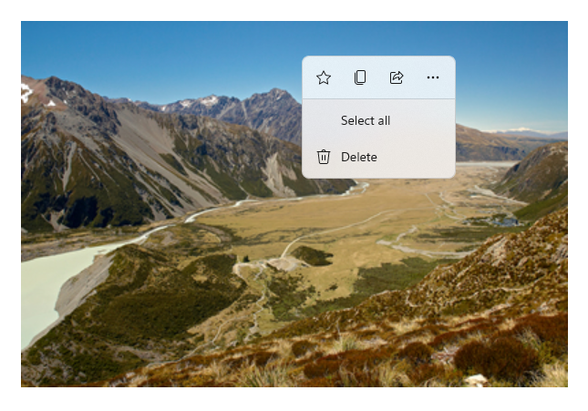
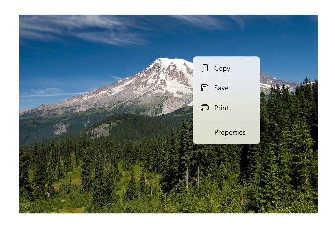
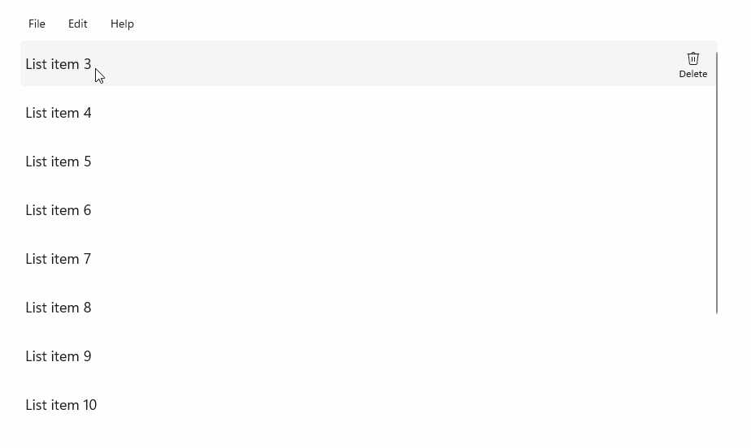
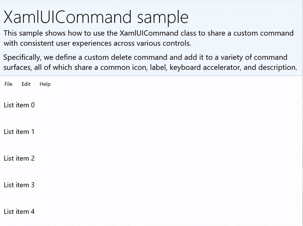

# Commanding in Windows apps using StandardUICommand, XamlUICommand, and ICommand

In this topic, we describe commanding in Windows applications. Specifically, we discuss how you can use the [XamlUICommand](/windows/windows-app-sdk/api/winrt/microsoft.ui.xaml.input.xamluicommand) and [StandardUICommand](/windows/windows-app-sdk/api/winrt/microsoft.ui.xaml.input.standarduicommand) classes (along with the ICommand interface) to share and manage commands across various control types, regardless of the device and input type being used.


*Share commands across various controls, regardless of device and input type*

## Important APIs

- [Windows.UI.Xaml.Input.ICommand](/windows/windows-app-sdk/api/winrt/microsoft.ui.xaml.input.icommand) and [System.Windows.Input.ICommand](/dotnet/api/system.windows.input.icommand)
- [XamlUICommand](/windows/windows-app-sdk/api/winrt/microsoft.ui.xaml.input.xamluicommand)
- [StandardUICommand](/windows/windows-app-sdk/api/winrt/microsoft.ui.xaml.input.standarduicommand)

## Overview

<!-- See https://blogs.msdn.microsoft.com/jebarson/2017/07/26/writing-an-asynchronous-relaycommand-implementing-icommand/ -->

<!-- A command describes an action but not its implementation (in other words, the what, but not the how). For example, the "Paste" command indicates that the user wants to copy something from the clipboard to a target control, but does not specify how. -->

Commands can be invoked directly through UI interactions like clicking a button or selecting an item from a context menu. They can also be invoked indirectly through an input device such as a keyboard accelerator, gesture, speech recognition, or an automation/accessibility tool. Once invoked, the command can then be handled by a control (text navigation in an edit control), a window (back navigation), or the application (exit).

Commands can operate on a specific context within your app, such as deleting text or undoing an action, or they can be context-free, such as muting audio or adjusting brightness.

The following image shows two command interfaces (a [CommandBar](command-bar.md) and a floating contextual [CommandBarFlyout](command-bar-flyout.md)) that share some of the same commands.

<br>*Command bar*

<br>*Context menu in the Microsoft Photos gallery*

## Command interactions

Due to the variety of devices, input types, and UI surfaces that can affect how a command is invoked, we recommend exposing your commands through as many commanding surfaces as possible. These can include a combination of [Swipe](swipe.md), [MenuBar](menus.md), [CommandBar](command-bar.md), [CommandBarFlyout](command-bar-flyout.md), and traditional [context menu](menus.md).

**For critical commands, use input-specific accelerators.** Input accelerators let a user perform actions more quickly depending on the input device they're using.

Here are some common input accelerators for various input types:

- **Pointer** - Mouse & Pen hover buttons
- **Keyboard** - Shortcuts (access keys and accelerator keys)
- **Touch** - Swipe
- **Touch** - Pull to refresh data

You must consider the input type and user experiences to make your application's functionality universally accessible. For example, collections (especially user editable ones) typically include a variety of specific commands that are performed quite differently depending on the input device.

The following table shows some typical collection commands and ways to expose those commands.

| Command          | Input-agnostic | Mouse accelerator | Keyboard accelerator | Touch accelerator |
| ---------------- | -------------- | ----------------- | -------------------- | ----------------- |
| Delete item      | Context menu   | Hover button      | DEL key              | Swipe to delete   |
| Flag item        | Context menu   | Hover button      | Ctrl+Shift+G         | Swipe to flag     |
| Refresh data     | Context menu   | N/A               | F5 key               | Pull to refresh   |
| Favorite an item | Context menu   | Hover button      | F, Ctrl+S            | Swipe to favorite |

**Always provide a context menu** We recommend including all relevant contextual commands in a traditional context menu or CommandBarFlyout, as both are supported for all input types. For example, if a command is exposed only during a pointer hover event, it cannot be used on a touch-only device.

## Commands in Windows applications

There are a few ways you can share and manage commanding experiences in a Windows application. You can define event handlers for standard interactions, such as Click, in code-behind (this can be quite inefficient, depending on the complexity of your UI), you can bind event listener for standard interactions to a shared handler, or you can bind the control's Command property to an ICommand implementation that describes the command logic.

To provide rich and comprehensive user experiences across command surfaces efficiently and with minimal code duplication, we recommend using the command binding features described in this topic(for standard event handling, see the individual event topics).

To bind a control to a shared command resource, you can implement the ICommand interfaces yourself, or you can build your command from either the [XamlUICommand](/windows/windows-app-sdk/api/winrt/microsoft.ui.xaml.input.xamluicommand) base class or one of the platform commands defined by the [StandardUICommand](/windows/windows-app-sdk/api/winrt/microsoft.ui.xaml.input.standarduicommand) derived class.

- The ICommand interface ([Windows.UI.Xaml.Input.ICommand](/windows/windows-app-sdk/api/winrt/microsoft.ui.xaml.input.icommand) or [System.Windows.Input.ICommand](/dotnet/api/system.windows.input.icommand)) lets you create fully customized, reusable commands across your app.
- [XamlUICommand](/windows/windows-app-sdk/api/winrt/microsoft.ui.xaml.input.xamluicommand) also provides this capability but simplifies development by exposing a set of built-in command properties such as the command behavior, keyboard shortcuts (access key and accelerator key), icon, label, and description.
- [StandardUICommand](/windows/windows-app-sdk/api/winrt/microsoft.ui.xaml.input.standarduicommand) simplifies things further by letting you choose from a set of standard platform commands with predefined properties.

> [!Important]
> In UWP applications, commands are implementations of either the [Windows.UI.Xaml.Input.ICommand](/windows/windows-app-sdk/api/winrt/microsoft.ui.xaml.input.icommand) (C++) or the [System.Windows.Input.ICommand](/dotnet/api/system.windows.input.icommand) (C#) interface, depending on your chosen language framework.

## Command experiences using the StandardUICommand class

Derived from [XamlUICommand](/windows/windows-app-sdk/api/winrt/microsoft.ui.xaml.input.xamluicommand) (derived from [Windows.UI.Xaml.Input.ICommand](/windows/windows-app-sdk/api/winrt/microsoft.ui.xaml.input.icommand) for C++ or  [System.Windows.Input.ICommand](/dotnet/api/system.windows.input.icommand) for C#), the [StandardUICommand](/windows/windows-app-sdk/api/winrt/microsoft.ui.xaml.input.standarduicommand) class exposes a set of standard platform commands with pre-defined properties such as icon, keyboard accelerator, and description.

A [StandardUICommand](/windows/windows-app-sdk/api/winrt/microsoft.ui.xaml.input.standarduicommand) provides a quick and consistent way to define common commands such as `Save` or `Delete`. All you have to do is provide the execute and canExecute functions.

### Example



*StandardUICommandSample*

| Download the code for this example |
| -------------------- |
| [UWP commanding sample (StandardUICommand)](https://github.com/MicrosoftDocs/windows-topic-specific-samples/archive/uwp-commanding-standarduicommand.zip) |

In this example, we show how to enhance a basic [ListView](listview-and-gridview.md) with a Delete item command implemented through the [StandardUICommand](/windows/windows-app-sdk/api/winrt/microsoft.ui.xaml.input.standarduicommand) class, while optimizing the user experience for a variety of input types using a [MenuBar](menus.md), [Swipe](swipe.md) control, hover buttons, and [context menu](menus.md).

> [!NOTE]
> This sample requires the Microsoft.UI.Xaml.Controls NuGet package, a part of the [Microsoft Windows UI Library](/uwp/toolkits/winui/).

**Xaml:**

The sample UI includes a [ListView](/windows/windows-app-sdk/api/winrt/microsoft.ui.xaml.controls.listview) of five items. The Delete [StandardUICommand](/windows/windows-app-sdk/api/winrt/microsoft.ui.xaml.input.standarduicommand) is bound to a [MenuBarItem](/uwp/api/microsoft.ui.xaml.controls.menubaritem), a [SwipeItem](/uwp/api/microsoft.ui.xaml.controls.swipeitem), an [AppBarButton](/windows/windows-app-sdk/api/winrt/microsoft.ui.xaml.controls.appbarbutton), and [ContextFlyout menu](/windows/windows-app-sdk/api/winrt/microsoft.ui.xaml.uielement.contextflyout).

``` xaml
<Page
    x:Class="StandardUICommandSample.MainPage"
    xmlns="http://schemas.microsoft.com/winfx/2006/xaml/presentation"
    xmlns:x="http://schemas.microsoft.com/winfx/2006/xaml"
    xmlns:local="using:StandardUICommandSample"
    xmlns:d="http://schemas.microsoft.com/expression/blend/2008"
    xmlns:mc="http://schemas.openxmlformats.org/markup-compatibility/2006"
    xmlns:muxcontrols="using:Microsoft.UI.Xaml.Controls"
    mc:Ignorable="d"
    Background="{ThemeResource ApplicationPageBackgroundThemeBrush}">

    <Page.Resources>
        <Style x:Key="HorizontalSwipe" 
               TargetType="ListViewItem" 
               BasedOn="{StaticResource ListViewItemRevealStyle}">
            <Setter Property="Height" Value="60"/>
            <Setter Property="Padding" Value="0"/>
            <Setter Property="HorizontalContentAlignment" Value="Stretch"/>
            <Setter Property="VerticalContentAlignment" Value="Stretch"/>
            <Setter Property="BorderThickness" Value="0"/>
        </Style>
    </Page.Resources>

    <Grid Loaded="ControlExample_Loaded">
        <Grid.RowDefinitions>
            <RowDefinition Height="Auto" />
            <RowDefinition Height="Auto" />
            <RowDefinition Height="*"/>
        </Grid.RowDefinitions>

        <StackPanel Grid.Row="0" 
                    Padding="10" 
                    BorderThickness="0,0,0,1" 
                    BorderBrush="LightBlue"
                    Background="AliceBlue">
            <TextBlock Style="{StaticResource HeaderTextBlockStyle}">
                StandardUICommand sample
            </TextBlock>
            <TextBlock Style="{StaticResource SubtitleTextBlockStyle}" Margin="0,0,0,10">
                This sample shows how to use the StandardUICommand class to 
                share a platform command and consistent user experiences 
                across various controls.
            </TextBlock>
            <TextBlock Style="{StaticResource SubtitleTextBlockStyle}" Margin="0,0,0,0">
                Specifically, we define a standard delete command and add it 
                to a variety of command surfaces, all of which share a common 
                icon, label, keyboard accelerator, and description.
            </TextBlock>
        </StackPanel>

        <muxcontrols:MenuBar Grid.Row="1" Padding="10">
            <muxcontrols:MenuBarItem Title="File">
            </muxcontrols:MenuBarItem>
            <muxcontrols:MenuBarItem Title="Edit">
                <MenuFlyoutItem x:Name="DeleteFlyoutItem"/>
            </muxcontrols:MenuBarItem>
            <muxcontrols:MenuBarItem Title="Help">
            </muxcontrols:MenuBarItem>
        </muxcontrols:MenuBar>

        <ListView x:Name="ListViewRight" Grid.Row="2" 
                  Loaded="ListView_Loaded" 
                  IsItemClickEnabled="True" 
                  SelectionMode="Single" 
                  SelectionChanged="ListView_SelectionChanged" 
                  ItemContainerStyle="{StaticResource HorizontalSwipe}">
            <ListView.ItemTemplate>
                <DataTemplate x:DataType="local:ListItemData">
                    <UserControl PointerEntered="ListViewSwipeContainer_PointerEntered" 
                                 PointerExited="ListViewSwipeContainer_PointerExited">
                        <UserControl.ContextFlyout>
                            <MenuFlyout>
                                <MenuFlyoutItem 
                                    Command="{x:Bind Command}" 
                                    CommandParameter="{x:Bind Text}" />
                            </MenuFlyout>
                        </UserControl.ContextFlyout>
                        <Grid AutomationProperties.Name="{x:Bind Text}">
                            <VisualStateManager.VisualStateGroups>
                                <VisualStateGroup x:Name="HoveringStates">
                                    <VisualState x:Name="HoverButtonsHidden" />
                                    <VisualState x:Name="HoverButtonsShown">
                                        <VisualState.Setters>
                                            <Setter Target="HoverButton.Visibility" 
                                                    Value="Visible" />
                                        </VisualState.Setters>
                                    </VisualState>
                                </VisualStateGroup>
                            </VisualStateManager.VisualStateGroups>
                            <SwipeControl x:Name="ListViewSwipeContainer" >
                                <SwipeControl.RightItems>
                                    <SwipeItems Mode="Execute">
                                        <SwipeItem x:Name="DeleteSwipeItem" 
                                                   Background="Red" 
                                                   Command="{x:Bind Command}" 
                                                   CommandParameter="{x:Bind Text}"/>
                                    </SwipeItems>
                                </SwipeControl.RightItems>
                                <Grid VerticalAlignment="Center">
                                    <TextBlock Text="{x:Bind Text}" 
                                               Margin="10" 
                                               FontSize="18" 
                                               HorizontalAlignment="Left" 
                                               VerticalAlignment="Center"/>
                                    <AppBarButton x:Name="HoverButton" 
                                                  IsTabStop="False" 
                                                  HorizontalAlignment="Right" 
                                                  Visibility="Collapsed" 
                                                  Command="{x:Bind Command}" 
                                                  CommandParameter="{x:Bind Text}"/>
                                </Grid>
                            </SwipeControl>
                        </Grid>
                    </UserControl>
                </DataTemplate>
            </ListView.ItemTemplate>
        </ListView>
    </Grid>
</Page>
```

**Code-behind**

1. First, we define a `ListItemData` class that contains a text string and ICommand for each ListViewItem in our ListView.

```csharp
public class ListItemData
{
    public String Text { get; set; }
    public ICommand Command { get; set; }
}
```

2. In the MainPage class, we define a collection of `ListItemData` objects for the [DataTemplate](/windows/windows-app-sdk/api/winrt/microsoft.ui.xaml.datatemplate) of the [ListView](/windows/windows-app-sdk/api/winrt/microsoft.ui.xaml.controls.listview) [ItemTemplate](/windows/windows-app-sdk/api/winrt/microsoft.ui.xaml.controls.itemscontrol.itemtemplate). We then populate it with an initial collection of five items (with text and associated [StandardUICommand](/windows/windows-app-sdk/api/winrt/microsoft.ui.xaml.input.standarduicommand) Delete).

```csharp
/// <summary>
/// ListView item collection.
/// </summary>
ObservableCollection<ListItemData> collection = 
    new ObservableCollection<ListItemData>();

/// <summary>
/// Handler for the layout Grid control load event.
/// </summary>
/// <param name="sender">Source of the control loaded event</param>
/// <param name="e">Event args for the loaded event</param>
private void ControlExample_Loaded(object sender, RoutedEventArgs e)
{
    // Create the standard Delete command.
    var deleteCommand = new StandardUICommand(StandardUICommandKind.Delete);
    deleteCommand.ExecuteRequested += DeleteCommand_ExecuteRequested;

    DeleteFlyoutItem.Command = deleteCommand;

    for (var i = 0; i < 5; i++)
    {
        collection.Add(
            new ListItemData {
                Text = "List item " + i.ToString(),
                Command = deleteCommand });
    }
}

/// <summary>
/// Handler for the ListView control load event.
/// </summary>
/// <param name="sender">Source of the control loaded event</param>
/// <param name="e">Event args for the loaded event</param>
private void ListView_Loaded(object sender, RoutedEventArgs e)
{
    var listView = (ListView)sender;
    // Populate the ListView with the item collection.
    listView.ItemsSource = collection;
}
```

3. Next, we define the ICommand ExecuteRequested handler where we implement the item delete command.

``` csharp
/// <summary>
/// Handler for the Delete command.
/// </summary>
/// <param name="sender">Source of the command event</param>
/// <param name="e">Event args for the command event</param>
private void DeleteCommand_ExecuteRequested(
    XamlUICommand sender, ExecuteRequestedEventArgs args)
{
    // If possible, remove specified item from collection.
    if (args.Parameter != null)
    {
        foreach (var i in collection)
        {
            if (i.Text == (args.Parameter as string))
            {
                collection.Remove(i);
                return;
            }
        }
    }
    if (ListViewRight.SelectedIndex != -1)
    {
        collection.RemoveAt(ListViewRight.SelectedIndex);
    }
}
```

4. Finally, we define handlers for various ListView events, including [PointerEntered](/windows/windows-app-sdk/api/winrt/microsoft.ui.xaml.uielement.pointerentered), [PointerExited](/windows/windows-app-sdk/api/winrt/microsoft.ui.xaml.uielement.pointerexited), and [SelectionChanged](/windows/windows-app-sdk/api/winrt/microsoft.ui.xaml.controls.primitives.selector.selectionchanged) events. The pointer event handlers are used to show or hide the Delete button for each item.

```csharp
/// <summary>
/// Handler for the ListView selection changed event.
/// </summary>
/// <param name="sender">Source of the selection changed event</param>
/// <param name="e">Event args for the selection changed event</param>
private void ListView_SelectionChanged(object sender, SelectionChangedEventArgs e)
{
    if (ListViewRight.SelectedIndex != -1)
    {
        var item = collection[ListViewRight.SelectedIndex];
    }
}

/// <summary>
/// Handler for the pointer entered event.
/// Displays the delete item "hover" buttons.
/// </summary>
/// <param name="sender">Source of the pointer entered event</param>
/// <param name="e">Event args for the pointer entered event</param>
private void ListViewSwipeContainer_PointerEntered(
    object sender, PointerRoutedEventArgs e)
{
    if (e.Pointer.PointerDeviceType == 
        Windows.Devices.Input.PointerDeviceType.Mouse || 
        e.Pointer.PointerDeviceType == 
        Windows.Devices.Input.PointerDeviceType.Pen)
    {
        VisualStateManager.GoToState(
            sender as Control, "HoverButtonsShown", true);
    }
}

/// <summary>
/// Handler for the pointer exited event.
/// Hides the delete item "hover" buttons.
/// </summary>
/// <param name="sender">Source of the pointer exited event</param>
/// <param name="e">Event args for the pointer exited event</param>

private void ListViewSwipeContainer_PointerExited(
    object sender, PointerRoutedEventArgs e)
{
    VisualStateManager.GoToState(
        sender as Control, "HoverButtonsHidden", true);
}
```

## Command experiences using the XamlUICommand class

If you need to create a command that isn't defined by the [StandardUICommand](/windows/windows-app-sdk/api/winrt/microsoft.ui.xaml.input.standarduicommand) class, or you'd like more control over the command appearance, the [XamlUICommand](/windows/windows-app-sdk/api/winrt/microsoft.ui.xaml.input.xamluicommand) class derives from the [ICommand](/windows/windows-app-sdk/api/winrt/microsoft.ui.xaml.input.icommand) interface, adding various UI properties (such as an icon, label, description, and keyboard shortcuts), methods, and events to quickly define the UI and behavior of a custom command.

[XamlUICommand](/windows/windows-app-sdk/api/winrt/microsoft.ui.xaml.input.xamluicommand) lets you specify UI through the control binding, such as an icon, label, description, and keyboard shortcuts (both an access key and a keyboard accelerator), without setting the individual properties.

### Example



*XamlUICommandSample*

| Download the code for this example |
| -------------------- |
| [UWP commanding sample (XamlUICommand)](https://github.com/MicrosoftDocs/windows-topic-specific-samples/archive/uwp-commanding-xamluicommand.zip) |

This example shares the Delete functionality of the previous [StandardUICommand](/windows/windows-app-sdk/api/winrt/microsoft.ui.xaml.input.standarduicommand) example, but shows how the [XamlUICommand](/windows/windows-app-sdk/api/winrt/microsoft.ui.xaml.input.xamluicommand) class lets you define a custom delete command with your own font icon, label, keyboard accelerator, and description. Like the [StandardUICommand](/windows/windows-app-sdk/api/winrt/microsoft.ui.xaml.input.standarduicommand) example, we enhance a basic [ListView](listview-and-gridview.md) with a Delete item command implemented through the [XamlUICommand](/windows/windows-app-sdk/api/winrt/microsoft.ui.xaml.input.xamluicommand) class, while optimizing the user experience for a variety of input types using a [MenuBar](menus.md), [Swipe](swipe.md) control, hover buttons, and [context menu](menus.md).

Many platform controls use the XamlUICommand properties under the covers, just like our StandardUICommand example in the previous section. 

> [!NOTE]
> This sample requires the Microsoft.UI.Xaml.Controls NuGet package, a part of the [Microsoft Windows UI Library](/uwp/toolkits/winui/).

**Xaml:**

The sample UI includes a [ListView](/windows/windows-app-sdk/api/winrt/microsoft.ui.xaml.controls.listview) of five items. The custom [XamlUICommand](/windows/windows-app-sdk/api/winrt/microsoft.ui.xaml.input.xamluicommand) CustomXamlUICommand is bound to a [MenuBarItem](/uwp/api/microsoft.ui.xaml.controls.menubaritem), a [SwipeItem](/uwp/api/microsoft.ui.xaml.controls.swipeitem), an [AppBarButton](/windows/windows-app-sdk/api/winrt/microsoft.ui.xaml.controls.appbarbutton), and [ContextFlyout menu](/windows/windows-app-sdk/api/winrt/microsoft.ui.xaml.uielement.contextflyout).

``` xaml
<Page
    x:Class="XamlUICommand_Sample.MainPage"
    xmlns="http://schemas.microsoft.com/winfx/2006/xaml/presentation"
    xmlns:x="http://schemas.microsoft.com/winfx/2006/xaml"
    xmlns:local="using:XamlUICommand_Sample"
    xmlns:d="http://schemas.microsoft.com/expression/blend/2008"
    xmlns:mc="http://schemas.openxmlformats.org/markup-compatibility/2006"
    xmlns:muxcontrols="using:Microsoft.UI.Xaml.Controls"
    mc:Ignorable="d"
    Background="{ThemeResource ApplicationPageBackgroundThemeBrush}">

    <Page.Resources>
        <XamlUICommand x:Name="CustomXamlUICommand" 
                       ExecuteRequested="DeleteCommand_ExecuteRequested"
                       Description="Custom XamlUICommand" 
                       Label="Custom XamlUICommand">
            <XamlUICommand.IconSource>
                <FontIconSource FontFamily="Wingdings" Glyph="&#x4D;"/>
            </XamlUICommand.IconSource>
            <XamlUICommand.KeyboardAccelerators>
                <KeyboardAccelerator Key="D" Modifiers="Control"/>
            </XamlUICommand.KeyboardAccelerators>
        </XamlUICommand>

        <Style x:Key="HorizontalSwipe" 
               TargetType="ListViewItem" 
               BasedOn="{StaticResource ListViewItemRevealStyle}">
            <Setter Property="Height" Value="70"/>
            <Setter Property="Padding" Value="0"/>
            <Setter Property="HorizontalContentAlignment" Value="Stretch"/>
            <Setter Property="VerticalContentAlignment" Value="Stretch"/>
            <Setter Property="BorderThickness" Value="0"/>
        </Style>
        
    </Page.Resources>

    <Grid Loaded="ControlExample_Loaded" Name="MainGrid">
        <Grid.RowDefinitions>
            <RowDefinition Height="Auto" />
            <RowDefinition Height="Auto" />
            <RowDefinition Height="*"/>
        </Grid.RowDefinitions>
        
        <StackPanel Grid.Row="0" 
                    Padding="10" 
                    BorderThickness="0,0,0,1" 
                    BorderBrush="LightBlue"
                    Background="AliceBlue">
            <TextBlock Style="{StaticResource HeaderTextBlockStyle}">
                XamlUICommand sample
            </TextBlock>
            <TextBlock Style="{StaticResource SubtitleTextBlockStyle}" Margin="0,0,0,10">
                This sample shows how to use the XamlUICommand class to 
                share a custom command with consistent user experiences 
                across various controls.
            </TextBlock>
            <TextBlock Style="{StaticResource SubtitleTextBlockStyle}" Margin="0,0,0,0">
                Specifically, we define a custom delete command and add it 
                to a variety of command surfaces, all of which share a common 
                icon, label, keyboard accelerator, and description.
            </TextBlock>
        </StackPanel>

        <muxcontrols:MenuBar Grid.Row="1">
            <muxcontrols:MenuBarItem Title="File">
            </muxcontrols:MenuBarItem>
            <muxcontrols:MenuBarItem Title="Edit">
                <MenuFlyoutItem x:Name="DeleteFlyoutItem" 
                                Command="{StaticResource CustomXamlUICommand}"/>
            </muxcontrols:MenuBarItem>
            <muxcontrols:MenuBarItem Title="Help">
            </muxcontrols:MenuBarItem>
        </muxcontrols:MenuBar>

        <ListView x:Name="ListViewRight" Grid.Row="2" 
                  Loaded="ListView_Loaded" 
                  IsItemClickEnabled="True"
                  SelectionMode="Single" 
                  SelectionChanged="ListView_SelectionChanged" 
                  ItemContainerStyle="{StaticResource HorizontalSwipe}">
            <ListView.ItemTemplate>
                <DataTemplate x:DataType="local:ListItemData">
                    <UserControl PointerEntered="ListViewSwipeContainer_PointerEntered"
                                 PointerExited="ListViewSwipeContainer_PointerExited">
                        <UserControl.ContextFlyout>
                            <MenuFlyout>
                                <MenuFlyoutItem 
                                    Command="{x:Bind Command}" 
                                    CommandParameter="{x:Bind Text}" />
                            </MenuFlyout>
                        </UserControl.ContextFlyout>
                        <Grid AutomationProperties.Name="{x:Bind Text}">
                            <VisualStateManager.VisualStateGroups>
                                <VisualStateGroup x:Name="HoveringStates">
                                    <VisualState x:Name="HoverButtonsHidden" />
                                    <VisualState x:Name="HoverButtonsShown">
                                        <VisualState.Setters>
                                            <Setter Target="HoverButton.Visibility" 
                                                    Value="Visible" />
                                        </VisualState.Setters>
                                    </VisualState>
                                </VisualStateGroup>
                            </VisualStateManager.VisualStateGroups>
                            <SwipeControl x:Name="ListViewSwipeContainer">
                                <SwipeControl.RightItems>
                                    <SwipeItems Mode="Execute">
                                        <SwipeItem x:Name="DeleteSwipeItem"
                                                   Background="Red" 
                                                   Command="{x:Bind Command}" 
                                                   CommandParameter="{x:Bind Text}"/>
                                    </SwipeItems>
                                </SwipeControl.RightItems>
                                <Grid VerticalAlignment="Center">
                                    <TextBlock Text="{x:Bind Text}" 
                                               Margin="10" 
                                               FontSize="18" 
                                               HorizontalAlignment="Left"       
                                               VerticalAlignment="Center"/>
                                    <AppBarButton x:Name="HoverButton" 
                                                  IsTabStop="False" 
                                                  HorizontalAlignment="Right" 
                                                  Visibility="Collapsed" 
                                                  Command="{x:Bind Command}" 
                                                  CommandParameter="{x:Bind Text}"/>
                                </Grid>
                            </SwipeControl>
                        </Grid>
                    </UserControl>
                </DataTemplate>
            </ListView.ItemTemplate>
        </ListView>
    </Grid>
</Page>
```

**Code-behind**

1. First, we define a `ListItemData` class that contains a text string and ICommand for each ListViewItem in our ListView.

```csharp
public class ListItemData
{
    public String Text { get; set; }
    public ICommand Command { get; set; }
}
```

2. In the MainPage class, we define a collection of `ListItemData` objects for the [DataTemplate](/windows/windows-app-sdk/api/winrt/microsoft.ui.xaml.datatemplate) of the [ListView](/windows/windows-app-sdk/api/winrt/microsoft.ui.xaml.controls.listview) [ItemTemplate](/windows/windows-app-sdk/api/winrt/microsoft.ui.xaml.controls.itemscontrol.itemtemplate). We then populate it with an initial collection of five items (with text and associated [XamlUICommand](/windows/windows-app-sdk/api/winrt/microsoft.ui.xaml.input.xamluicommand)).

```csharp
ObservableCollection<ListItemData> collection = new ObservableCollection<ListItemData>();

private void ControlExample_Loaded(object sender, RoutedEventArgs e)
{
    for (var i = 0; i < 5; i++)
    {
        collection.Add(
           new ListItemData { Text = "List item " + i.ToString(), Command = CustomXamlUICommand });
    }
}

private void ListView_Loaded(object sender, RoutedEventArgs e)
{
    var listView = (ListView)sender;
    listView.ItemsSource = collection;
}
```

3. Next, we define the ICommand ExecuteRequested handler where we implement the item delete command.

``` csharp
private void DeleteCommand_ExecuteRequested(
   XamlUICommand sender, ExecuteRequestedEventArgs args)
{
    if (args.Parameter != null)
    {
        foreach (var i in collection)
        {
            if (i.Text == (args.Parameter as string))
            {
                collection.Remove(i);
                return;
            }
        }
    }
    if (ListViewRight.SelectedIndex != -1)
    {
        collection.RemoveAt(ListViewRight.SelectedIndex);
    }
}
```

4. Finally, we define handlers for various ListView events, including [PointerEntered](/windows/windows-app-sdk/api/winrt/microsoft.ui.xaml.uielement.pointerentered), [PointerExited](/windows/windows-app-sdk/api/winrt/microsoft.ui.xaml.uielement.pointerexited), and [SelectionChanged](/windows/windows-app-sdk/api/winrt/microsoft.ui.xaml.controls.primitives.selector.selectionchanged) events. The pointer event handlers are used to show or hide the Delete button for each item.

```csharp
private void ListView_SelectionChanged(object sender, SelectionChangedEventArgs e)
{
    if (ListViewRight.SelectedIndex != -1)
    {
        var item = collection[ListViewRight.SelectedIndex];
    }
}

private void ListViewSwipeContainer_PointerEntered(object sender, PointerRoutedEventArgs e)
{
    if (e.Pointer.PointerDeviceType == 
        Windows.Devices.Input.PointerDeviceType.Mouse || 
        e.Pointer.PointerDeviceType == Windows.Devices.Input.PointerDeviceType.Pen)
    {
        VisualStateManager.GoToState(sender as Control, "HoverButtonsShown", true);
    }
}

private void ListViewSwipeContainer_PointerExited(object sender, PointerRoutedEventArgs e)
{
    VisualStateManager.GoToState(sender as Control, "HoverButtonsHidden", true);
}
```

## Command experiences using the ICommand interface

Standard UWP controls (button, list, selection, calendar, predictive text) provide the basis for many common command experiences. For a complete list of control types, see [Controls and patterns for Windows apps](index.md).

The most basic way to support a structured commanding experience is to define an implementation of the ICommand interface ([Windows.UI.Xaml.Input.ICommand](/windows/windows-app-sdk/api/winrt/microsoft.ui.xaml.input.icommand) for C++ or  [System.Windows.Input.ICommand](/dotnet/api/system.windows.input.icommand) for C#).  This ICommand instance can then be bound to controls such as buttons.

> [!NOTE]
> In some cases, it might be just as efficient to bind a method to the Click event and a property to the IsEnabled property.

#### Example


*ICommand example*

| Download the code for this example |
| -------------------- |
| [UWP commanding sample (ICommand)](https://github.com/MicrosoftDocs/windows-topic-specific-samples/archive/uwp-commanding-icommand.zip) |

In this basic example, we demonstrate how a single command can be invoked with a button click, a keyboard accelerator, and rotating a mouse wheel.

We use two [ListViews](/windows/windows-app-sdk/api/winrt/microsoft.ui.xaml.controls.listview), one populated with five items and the other empty, and two buttons, one for moving items from the ListView on the left to the ListView on the right, and the other for moving items from the right to the left. Each button is bound to a corresponding command (ViewModel.MoveRightCommand and ViewModel.MoveLeftCommand, respectively), and are enabled and disabled automatically based on the number of items in their associated ListView.

**The following XAML code defines the UI for our example.**

```xaml
<Page
    x:Class="UICommand1.View.MainPage"
    xmlns="http://schemas.microsoft.com/winfx/2006/xaml/presentation"
    xmlns:x="http://schemas.microsoft.com/winfx/2006/xaml"
    xmlns:vm="using:UICommand1.ViewModel"
    xmlns:d="http://schemas.microsoft.com/expression/blend/2008"
    xmlns:mc="http://schemas.openxmlformats.org/markup-compatibility/2006"
    mc:Ignorable="d"
    Background="{ThemeResource ApplicationPageBackgroundThemeBrush}">

    <Page.Resources>
        <vm:OpacityConverter x:Key="opaque" />
    </Page.Resources>

    <Grid Name="ItemGrid"
          Background="AliceBlue"
          PointerWheelChanged="Page_PointerWheelChanged">
        <Grid.ColumnDefinitions>
            <ColumnDefinition Width="*"/>
            <ColumnDefinition Width="2*"/>
            <ColumnDefinition Width="*"/>
        </Grid.ColumnDefinitions>
        <ListView Grid.Column="0" VerticalAlignment="Center"
                  x:Name="CommandListView" 
                  ItemsSource="{x:Bind Path=ViewModel.ListItemLeft}" 
                  SelectionMode="None" IsItemClickEnabled="False" 
                  HorizontalAlignment="Right">
            <ListView.ItemTemplate>
                <DataTemplate x:DataType="vm:ListItemData">
                    <Grid VerticalAlignment="Center">
                        <AppBarButton Label="{x:Bind ListItemText}">
                            <AppBarButton.Icon>
                                <SymbolIcon Symbol="{x:Bind ListItemIcon}"/>
                            </AppBarButton.Icon>
                        </AppBarButton>
                    </Grid>
                </DataTemplate>
            </ListView.ItemTemplate>
        </ListView>
        <Grid Grid.Column="1" Margin="0,0,0,0"
              HorizontalAlignment="Center" 
              VerticalAlignment="Center">
            <Grid.RowDefinitions>
                <RowDefinition Height="*"/>
                <RowDefinition Height="*"/>
                <RowDefinition Height="*"/>
            </Grid.RowDefinitions>
            <StackPanel Grid.Row="1">
                <FontIcon FontFamily="{StaticResource SymbolThemeFontFamily}" 
                          FontSize="40" Glyph="&#xE893;" 
                          Opacity="{x:Bind Path=ViewModel.ListItemLeft.Count, 
                                        Mode=OneWay, Converter={StaticResource opaque}}"/>
                <Button Name="MoveItemRightButton"
                        Margin="0,10,0,10" Width="120" HorizontalAlignment="Center"
                        Command="{x:Bind Path=ViewModel.MoveRightCommand}">
                    <Button.KeyboardAccelerators>
                        <KeyboardAccelerator 
                            Modifiers="Control" 
                            Key="Add" />
                    </Button.KeyboardAccelerators>
                    <StackPanel>
                        <SymbolIcon Symbol="Next"/>
                        <TextBlock>Move item right</TextBlock>
                    </StackPanel>
                </Button>
                <Button Name="MoveItemLeftButton" 
                            Margin="0,10,0,10" Width="120" HorizontalAlignment="Center"
                            Command="{x:Bind Path=ViewModel.MoveLeftCommand}">
                    <Button.KeyboardAccelerators>
                        <KeyboardAccelerator 
                            Modifiers="Control" 
                            Key="Subtract" />
                    </Button.KeyboardAccelerators>
                    <StackPanel>
                        <SymbolIcon Symbol="Previous"/>
                        <TextBlock>Move item left</TextBlock>
                    </StackPanel>
                </Button>
                <FontIcon FontFamily="{StaticResource SymbolThemeFontFamily}" 
                          FontSize="40" Glyph="&#xE892;"
                          Opacity="{x:Bind Path=ViewModel.ListItemRight.Count, 
                                        Mode=OneWay, Converter={StaticResource opaque}}"/>
            </StackPanel>
        </Grid>
        <ListView Grid.Column="2" 
                  x:Name="CommandListViewRight" 
                  VerticalAlignment="Center" 
                  IsItemClickEnabled="False" 
                  SelectionMode="None"
                  ItemsSource="{x:Bind Path=ViewModel.ListItemRight}" 
                  HorizontalAlignment="Left">
            <ListView.ItemTemplate>
                <DataTemplate x:DataType="vm:ListItemData">
                    <Grid VerticalAlignment="Center">
                        <AppBarButton Label="{x:Bind ListItemText}">
                            <AppBarButton.Icon>
                                <SymbolIcon Symbol="{x:Bind ListItemIcon}"/>
                            </AppBarButton.Icon>
                        </AppBarButton>
                    </Grid>
                </DataTemplate>
            </ListView.ItemTemplate>
        </ListView>
    </Grid>
</Page>
```

**Here's the code-behind for the preceding UI.**

In code-behind, we connect to our view model that contains our command code. In addition, we define a handler for input from the mouse wheel, which also connects our command code.

```csharp
using Windows.UI.Xaml;
using Windows.UI.Xaml.Input;
using Windows.UI.Xaml.Controls;
using UICommand1.ViewModel;
using Windows.System;
using Windows.UI.Core;

namespace UICommand1.View
{
    /// <summary>
    /// An empty page that can be used on its own or navigated to within a Frame.
    /// </summary>
    public sealed partial class MainPage : Page
    {
        // Reference to our view model.
        public UICommand1ViewModel ViewModel { get; set; }

        // Initialize our view and view model.
        public MainPage()
        {
            this.InitializeComponent();
            ViewModel = new UICommand1ViewModel();
        }

        /// <summary>
        /// Handle mouse wheel input and assign our
        /// commands to appropriate direction of rotation.
        /// </summary>
        /// <param name="sender"></param>
        /// <param name="e"></param>
        private void Page_PointerWheelChanged(object sender, PointerRoutedEventArgs e)
        {
            var props = e.GetCurrentPoint(sender as UIElement).Properties;

            // Require CTRL key and accept only vertical mouse wheel movement 
            // to eliminate accidental wheel input.
            if ((Window.Current.CoreWindow.GetKeyState(VirtualKey.Control) != 
                CoreVirtualKeyStates.None) && !props.IsHorizontalMouseWheel)
            {
                bool delta = props.MouseWheelDelta < 0 ? true : false;

                switch (delta)
                {
                    case true:
                        ViewModel.MoveRight();
                        break;
                    case false:
                        ViewModel.MoveLeft();
                        break;
                    default:
                        break;
                }
            }
        }
    }
}
```

**Here's the code from our view model**

Our view model is where we define the execution details for the two commands in our app, populate one ListView, and provide an opacity value converter for hiding or displaying some additional UI based on the item count of each ListView.

```csharp
using System;
using System.Collections.ObjectModel;
using System.ComponentModel;
using Windows.UI.Xaml.Controls;
using Windows.UI.Xaml.Data;

namespace UICommand1.ViewModel
{
    /// <summary>
    /// UI properties for our list items.
    /// </summary>
    public class ListItemData
    {
        /// <summary>
        /// Gets and sets the list item content string.
        /// </summary>
        public string ListItemText { get; set; }
        /// <summary>
        /// Gets and sets the list item icon.
        /// </summary>
        public Symbol ListItemIcon { get; set; }
    }

    /// <summary>
    /// View Model that sets up a command to handle invoking the move item buttons.
    /// </summary>
    public class UICommand1ViewModel
    {
        /// <summary>
        /// The command to invoke when the Move item left button is pressed.
        /// </summary>
        public RelayCommand MoveLeftCommand { get; private set; }

        /// <summary>
        /// The command to invoke when the Move item right button is pressed.
        /// </summary>
        public RelayCommand MoveRightCommand { get; private set; }

        // Item collections
        public ObservableCollection<ListItemData> ListItemLeft { get; } = 
           new ObservableCollection<ListItemData>();
        public ObservableCollection<ListItemData> ListItemRight { get; } = 
           new ObservableCollection<ListItemData>();

        public ListItemData listItem;

        /// <summary>
        /// Sets up a command to handle invoking the move item buttons.
        /// </summary>
        public UICommand1ViewModel()
        {
            MoveLeftCommand = 
               new RelayCommand(new Action(MoveLeft), CanExecuteMoveLeftCommand);
            MoveRightCommand = 
               new RelayCommand(new Action(MoveRight), CanExecuteMoveRightCommand);

            LoadItems();
        }

        /// <summary>
        ///  Populate our list of items.
        /// </summary>
        public void LoadItems()
        {
            for (var x = 0; x <= 4; x++)
            {
                listItem = new ListItemData();
                listItem.ListItemText = "Item " + (ListItemLeft.Count + 1).ToString();
                listItem.ListItemIcon = Symbol.Emoji;
                ListItemLeft.Add(listItem);
            }
        }

        /// <summary>
        /// Move left command valid when items present in the list on right.
        /// </summary>
        /// <returns>True, if count is greater than 0.</returns>
        private bool CanExecuteMoveLeftCommand()
        {
            return ListItemRight.Count > 0;
        }

        /// <summary>
        /// Move right command valid when items present in the list on left.
        /// </summary>
        /// <returns>True, if count is greater than 0.</returns>
        private bool CanExecuteMoveRightCommand()
        {
            return ListItemLeft.Count > 0;
        }

        /// <summary>
        /// The command implementation to execute when the Move item right button is pressed.
        /// </summary>
        public void MoveRight()
        {
            if (ListItemLeft.Count > 0)
            {
                listItem = new ListItemData();
                ListItemRight.Add(listItem);
                listItem.ListItemText = "Item " + ListItemRight.Count.ToString();
                listItem.ListItemIcon = Symbol.Emoji;
                ListItemLeft.RemoveAt(ListItemLeft.Count - 1);
                MoveRightCommand.RaiseCanExecuteChanged();
                MoveLeftCommand.RaiseCanExecuteChanged();
            }
        }

        /// <summary>
        /// The command implementation to execute when the Move item left button is pressed.
        /// </summary>
        public void MoveLeft()
        {
            if (ListItemRight.Count > 0)
            {
                listItem = new ListItemData();
                ListItemLeft.Add(listItem);
                listItem.ListItemText = "Item " + ListItemLeft.Count.ToString();
                listItem.ListItemIcon = Symbol.Emoji;
                ListItemRight.RemoveAt(ListItemRight.Count - 1);
                MoveRightCommand.RaiseCanExecuteChanged();
                MoveLeftCommand.RaiseCanExecuteChanged();
            }
        }

        /// <summary>
        /// Views subscribe to this event to get notified of property updates.
        /// </summary>
        public event PropertyChangedEventHandler PropertyChanged;

        /// <summary>
        /// Notify subscribers of updates to the named property
        /// </summary>
        /// <param name="propertyName">The full, case-sensitive, name of a property.</param>
        protected void NotifyPropertyChanged(string propertyName)
        {
            PropertyChangedEventHandler handler = this.PropertyChanged;
            if (handler != null)
            {
                PropertyChangedEventArgs args = new PropertyChangedEventArgs(propertyName);
                handler(this, args);
            }
        }
    }

    /// <summary>
    /// Convert a collection count to an opacity value of 0.0 or 1.0.
    /// </summary>
    public class OpacityConverter : IValueConverter
    {
        /// <summary>
        /// Converts a collection count to an opacity value of 0.0 or 1.0.
        /// </summary>
        /// <param name="value">The count passed in</param>
        /// <param name="targetType">Ignored.</param>
        /// <param name="parameter">Ignored</param>
        /// <param name="language">Ignored</param>
        /// <returns>1.0 if count > 0, otherwise returns 0.0</returns>
        public object Convert(object value, Type targetType, object parameter, string language)
        {
            return ((int)value > 0 ? 1.0 : 0.0);
        }

        /// <summary>
        /// Not used, converter is not intended for two-way binding. 
        /// </summary>
        /// <param name="value">Ignored</param>
        /// <param name="targetType">Ignored</param>
        /// <param name="parameter">Ignored</param>
        /// <param name="language">Ignored</param>
        /// <returns></returns>
        public object ConvertBack(object value, Type targetType, object parameter, string language)
        {
            throw new NotImplementedException();
        }
    }
}
```

**Finally, here's our implementation of the ICommand interface**

Here, we define a command that implements the [ICommand](/windows/windows-app-sdk/api/winrt/microsoft.ui.xaml.input.icommand) interface and simply relays its functionality to other objects.

```csharp
using System;
using System.Windows.Input;

namespace UICommand1
{
    /// <summary>
    /// A command whose sole purpose is to relay its functionality 
    /// to other objects by invoking delegates. 
    /// The default return value for the CanExecute method is 'true'.
    /// <see cref="RaiseCanExecuteChanged"/> needs to be called whenever
    /// <see cref="CanExecute"/> is expected to return a different value.
    /// </summary>
    public class RelayCommand : ICommand
    {
        private readonly Action _execute;
        private readonly Func<bool> _canExecute;

        /// <summary>
        /// Raised when RaiseCanExecuteChanged is called.
        /// </summary>
        public event EventHandler CanExecuteChanged;

        /// <summary>
        /// Creates a new command that can always execute.
        /// </summary>
        /// <param name="execute">The execution logic.</param>
        public RelayCommand(Action execute)
            : this(execute, null)
        {
        }

        /// <summary>
        /// Creates a new command.
        /// </summary>
        /// <param name="execute">The execution logic.</param>
        /// <param name="canExecute">The execution status logic.</param>
        public RelayCommand(Action execute, Func<bool> canExecute)
        {
            if (execute == null)
                throw new ArgumentNullException("execute");
            _execute = execute;
            _canExecute = canExecute;
        }

        /// <summary>
        /// Determines whether this <see cref="RelayCommand"/> can execute in its current state.
        /// </summary>
        /// <param name="parameter">
        /// Data used by the command. If the command does not require 
        /// data to be passed, this object can be set to null.
        /// </param>
        /// <returns>true if this command can be executed; otherwise, false.</returns>
        public bool CanExecute(object parameter)
        {
            return _canExecute == null ? true : _canExecute();
        }

        /// <summary>
        /// Executes the <see cref="RelayCommand"/> on the current command target.
        /// </summary>
        /// <param name="parameter">
        /// Data used by the command. If the command does not require 
        /// data to be passed, this object can be set to null.
        /// </param>
        public void Execute(object parameter)
        {
            _execute();
        }

        /// <summary>
        /// Method used to raise the <see cref="CanExecuteChanged"/> event
        /// to indicate that the return value of the <see cref="CanExecute"/>
        /// method has changed.
        /// </summary>
        public void RaiseCanExecuteChanged()
        {
            var handler = CanExecuteChanged;
            if (handler != null)
            {
                handler(this, EventArgs.Empty);
            }
        }
    }
}
```

## Summary

The Universal Windows Platform provides a robust and flexible commanding system that lets you build apps that share and manage commands across control types, devices, and input types.

Use the following approaches when building commands for your Windows apps:

- Listen for and handle events in XAML/code-behind
- Bind to an event handling method such as Click
- Define your own ICommand implementation
- Create XamlUICommand objects with your own values for a pre-defined set of properties
- Create StandardUICommand objects with a set of pre-defined platform properties and values

## Next steps

For a complete example that demonstrates a [XamlUICommand](/windows/windows-app-sdk/api/winrt/microsoft.ui.xaml.input.xamluicommand) and [StandardUICommand](/windows/windows-app-sdk/api/winrt/microsoft.ui.xaml.input.standarduicommand) implementation, see the [WinUI 2 Gallery](https://github.com/Microsoft/WinUI-Gallery) sample.

## See also

[Controls and patterns for Windows apps](index.md)

### Samples

#### Topic samples

- [UWP commanding sample (StandardUICommand)](https://github.com/MicrosoftDocs/windows-topic-specific-samples/archive/uwp-commanding-standarduicommand.zip)
- [UWP commanding sample (XamlUICommand)](https://github.com/MicrosoftDocs/windows-topic-specific-samples/archive/uwp-commanding-xamluicommand.zip)
- [UWP commanding sample (ICommand)](https://github.com/MicrosoftDocs/windows-topic-specific-samples/archive/uwp-commanding-icommand.zip)

#### Other samples

- [Universal Windows Platform samples (C# and C++)](https://github.com/Microsoft/Windows-universal-samples/tree/b78d95134ce2d57c848e0a8dc339fc362748fb9c/Samples/RadialController)
- [WinUI 2 Gallery](https://github.com/Microsoft/WinUI-Gallery)
