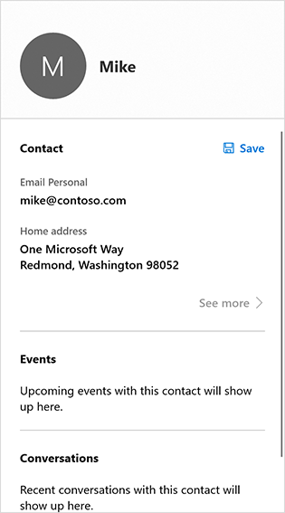
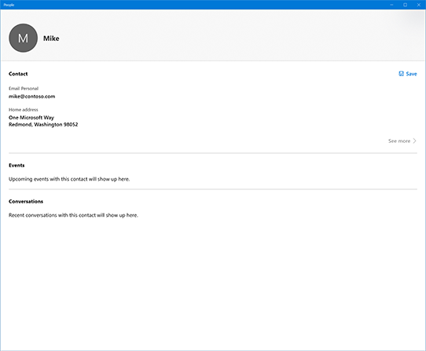
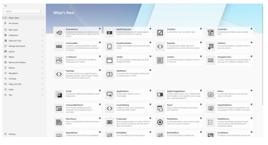

# Contact card

The contact card displays contact information, such as the name, phone number, and address, for a [Contact](/uwp/api/Windows.ApplicationModel.Contacts.Contact) (the mechanism Windows uses to represent people and businesses).  The contact card also lets the user edit contact info. You can choose to display a compact contact card, or a full contact card that contains additional information.

> **Important APIs**: [ShowContactCard method](/uwp/api/windows.applicationmodel.contacts.contactmanager.showcontactcard),   [ShowFullContactCard method](/uwp/api/windows.applicationmodel.contacts.contactmanager.showfullcontactcard),  [IsShowContactCardSupported method](/uwp/api/windows.applicationmodel.contacts.contactmanager.IsShowContactCardSupported),  [Contact class](/uwp/api/Windows.ApplicationModel.Contacts.Contact)  

There are two ways to display the contact card:  
* As a standard contact card that appears in a flyout that is light-dismissable--the contact card disapears when the user clicks outside of it. 
* As a full contact card that takes up more space and is not light-dismissable--the user must click **close** to close it. 


<figure>
    
    <figcaption>The standard contact card</figcaption>
</figure>

<figure>
    
    <figcaption>The full contact card</figcaption>
</figure>


## Is this the right control?

Use the contact card when you want to display contact info for a contact. If you only want to display the contact's name and picture, use the [person picture control](person-picture.md). 


<!-- TODO: Add examples back when the contact card has been added. -->

<!-- ## Examples

<table>
<th align="left">WinUI 2 Gallery<th>
<tr>
<td></img></td>
<td>
    <p>If you have the <strong style="font-weight: semi-bold">WinUI 2 Gallery</strong> app installed, click here to <a href="winui2gallery:/item/Button">open the app and see the Button in action</a>.</p>
    <ul>
    <li><a href="https://www.microsoft.com/store/productId/9MSVH128X2ZT">Get the WinUI 2 Gallery app (Microsoft Store)</a></li>
    <li><a href="https://github.com/Microsoft/WinUI-Gallery">Get the source code (GitHub)</a></li>
    </ul>
</td>
</tr>
</table> -->

## Show a standard contact card

1. Typically, you show a contact card because the user clicked something: a button or perhaps the [person picture control](person-picture.md). We don't want to hide the element. To avoid hiding it, we need to create a [Rect](/uwp/api/windows.foundation.rect) that describes the location and size of the element. 

    Let's create a utility function that does that for us--we'll use it later.
    ```csharp
    // Gets the rectangle of the element 
    public static Rect GetElementRectHelper(FrameworkElement element) 
    { 
        // Passing "null" means set to root element. 
        GeneralTransform elementTransform = element.TransformToVisual(null); 
        Rect rect = elementTransform.TransformBounds(new Rect(0, 0, element.ActualWidth, element.ActualHeight)); 
        return rect; 
    } 

    ```

2. Determine whether you can display the contact card by calling the [ContactManager.IsShowContactCardSupported](/uwp/api/windows.applicationmodel.contacts.contactmanager.IsShowContactCardSupported) method. If it's not supported, display an error message. (This example assumes that you'll be showing the contact card in response to a click event .)
    ```csharp
    // Contact and Contact Managers are existing classes 
    private void OnUserClickShowContactCard(object sender, RoutedEventArgs e) 
    { 
        if (ContactManager.IsShowContactCardSupported()) 
        { 

    ```

3. Use the utility function you created in step 1 to get the bounds of the control that fired the event (so we don't cover it up with the contact card).

    ```csharp
            Rect selectionRect = GetElementRect((FrameworkElement)sender); 
    ```

4. Get the [Contact](/uwp/api/Windows.ApplicationModel.Contacts.Contact) object you want to display. This example just creates a simple contact, but your code should retrieve an actual contact. 

    ```csharp
                // Retrieve the contact to display
                var contact = new Contact(); 
                var email = new ContactEmail(); 
                email.Address = "jsmith@contoso.com"; 
                contact.Emails.Add(email); 
    ```
5. Show the contact card by calling the  [ShowContactCard](/uwp/api/windows.applicationmodel.contacts.contactmanager.showcontactcard) method. 

    ```csharp
            ContactManager.ShowFullContactCard(
                contact, selectionRect, Placement.Default); 
        } 
    } 
    ```

Here's the complete code example:

```csharp
// Gets the rectangle of the element 
public static Rect GetElementRect(FrameworkElement element) 
{ 
    // Passing "null" means set to root element. 
    GeneralTransform elementTransform = element.TransformToVisual(null); 
    Rect rect = elementTransform.TransformBounds(new Rect(0, 0, element.ActualWidth, element.ActualHeight)); 
    return rect; 
} 
 
// Display a contact in response to an event
private void OnUserClickShowContactCard(object sender, RoutedEventArgs e) 
{ 
    if (ContactManager.IsShowContactCardSupported()) 
    { 
        Rect selectionRect = GetElementRect((FrameworkElement)sender);

        // Retrieve the contact to display
        var contact = new Contact(); 
        var email = new ContactEmail(); 
        email.Address = "jsmith@contoso.com"; 
        contact.Emails.Add(email); 
    
        ContactManager.ShowContactCard(
            contact, selectionRect, Placement.Default); 
    } 
} 

```

## Show a full contact card

To show the full contact card, call the [ShowFullContactCard](/uwp/api/windows.applicationmodel.contacts.contactmanager.showfullcontactcard) method instead of [ShowContactCard](/uwp/api/windows.applicationmodel.contacts.contactmanager.showcontactcard).

```csharp
private void onUserClickShowContactCard() 
{ 
   
    Contact contact = new Contact(); 
    ContactEmail email = new ContactEmail(); 
    email.Address = "jsmith@hotmail.com"; 
    contact.Emails.Add(email); 
 
 
    // Setting up contact options.     
    FullContactCardOptions fullContactCardOptions = new FullContactCardOptions(); 
 
    // Display full contact card on mouse click.   
    // Launch the People’s App with full contact card  
    fullContactCardOptions.DesiredRemainingView = ViewSizePreference.UseLess; 
     
 
    // Shows the full contact card by launching the People App. 
    ContactManager.ShowFullContactCard(contact, fullContactCardOptions); 
} 

```

## Retrieving "real" contacts

The examples in this article create a simple contact. In a real app, you'd probably want to retrieve an existing contact. For instructions, see the [Contacts and calendar article](/windows/uwp/contacts-and-calendar/index).


## Related articles
- [Contacts and calendar](/windows/uwp/contacts-and-calendar/index)
- [Contact cards sample](https://github.com/Microsoft/Windows-universal-samples/tree/master/Samples/ContactCards)
- [People picture control](/windows/uwp/controls-and-patterns/person-picture/)
