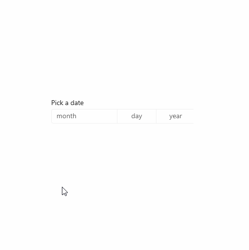

# Date picker

The date picker gives you a standardized way to let users pick a localized date value using touch, mouse, or keyboard input.


**Get the Windows UI Library**

:::row:::
   :::column:::
      
   :::column-end:::
   :::column span="3":::
      Windows UI Library 2.2 or later includes a new template for this control that uses rounded corners. For more info, see [Corner radius](../style/rounded-corner.md). WinUI is a NuGet package that contains new controls and UI features for Windows apps. For more info, including installation instructions, see [Windows UI Library](/uwp/toolkits/winui/).
   :::column-end:::
   :::column:::

   :::column-end:::
:::row-end:::

> **Platform APIs:** [DatePicker class](/uwp/api/Windows.UI.Xaml.Controls.DatePicker), [SelectedDate property](/uwp/api/windows.ui.xaml.controls.datepicker.selecteddate)

## Is this the right control?

Use a date picker to let a user pick a known date, such as a date of birth, where the context of the calendar is not important.

If the context of a calendar is important, consider using a [calendar date picker](calendar-date-picker.md) or [calendar view](calendar-view.md).

For more info about choosing the right date control, see the [Date and time controls](date-and-time.md) article.

## Examples

<table>
<th align="left">XAML Controls Gallery<th>
<tr>
<td></img></td>
<td>
    <p>If you have the <strong style="font-weight: semi-bold">XAML Controls Gallery</strong> app installed, click here to <a href="xamlcontrolsgallery:/item/DatePicker">open the app and see the DatePicker in action</a>.</p>
    <ul>
    <li><a href="https://www.microsoft.com/store/productId/9MSVH128X2ZT">Get the XAML Controls Gallery app (Microsoft Store)</a></li>
    <li><a href="https://github.com/Microsoft/Xaml-Controls-Gallery">Get the source code (GitHub)</a></li>
    </ul>
</td>
</tr>
</table>

The entry point displays the chosen date, and when the user selects the entry point, a picker surface expands vertically from the middle for the user to make a selection. The date picker overlays other UI; it doesn't push other UI out of the way.



## Create a date picker

This example shows how to create a simple date picker with a header.

```xaml
<DatePicker x:Name="exampleDatePicker" Header="Pick a date"/>
```

```csharp
DatePicker exampleDatePicker = new DatePicker();
exampleDatePicker.Header = "Pick a date";
```

The resulting date picker looks like this:


### Formatting the date picker

By default, the date picker shows the day, month, and year. If your scenario for the date picker doesn't require all the fields, you can hide the ones you don't need. To hide a field, set its corresponding *field*Visible property to `false`: [DayVisible](/uwp/api/windows.ui.xaml.controls.datepicker.dayvisible), [MonthVisible](/uwp/api/windows.ui.xaml.controls.datepicker.monthvisible), or [YearVisible](/uwp/api/windows.ui.xaml.controls.datepicker.yearvisible).

Here, only the year is needed, so the day and month fields are hidden.

```xaml
<DatePicker x:Name="yearDatePicker" Header="In what year was Microsoft founded?" 
            MonthVisible="False" DayVisible="False"/>
```

:::image type="content" source="images/date-time/date-picker-year-only.png" alt-text="A date picker with the day and month fields hidden.":::

The string content of each `ComboBox` in the `DatePicker` is created by a [DateTimeFormatter](/uwp/api/windows.globalization.datetimeformatting.datetimeformatter). You inform the `DateTimeFormatter` how to format the date value by providing a string that is either a *format template* or a *format pattern*. For more info, see the [DayFormat](/uwp/api/windows.ui.xaml.controls.datepicker.dayformat), [MonthFormat](/uwp/api/windows.ui.xaml.controls.datepicker.monthformat), and [YearFormat](/uwp/api/windows.ui.xaml.controls.datepicker.yearformat) properties.

Here, a *format pattern* is used to show the month as an integer and abbreviation. You can add literal strings to the format pattern, such as the parentheses around the month abbreviation: `({month.abbreviated})`.

```xaml
<DatePicker MonthFormat="{}{month.integer(2)} ({month.abbreviated})" DayVisible="False"/>
```

:::image type="content" source="images/date-time/date-picker-day-hidden.png" alt-text="A date picker with the day field hidden.":::

### Date values

The date picker control has both [Date](/uwp/api/windows.ui.xaml.controls.datepicker.date)/[DateChanged](/uwp/api/windows.ui.xaml.controls.datepicker.datechanged) and [SelectedDate](/uwp/api/windows.ui.xaml.controls.datepicker.selecteddate)/[SelectedDateChanged](/uwp/api/windows.ui.xaml.controls.datepicker.selecteddatechanged) APIs. The difference between these is that `Date` is not nullable, while `SelectedDate` is nullable.

The value of `SelectedDate` is used to populate the date picker and is `null` by default. If `SelectedDate` is `null`, the `Date` property is set to 12/31/1600; otherwise, the `Date` value is synchronized with the `SelectedDate` value. When `SelectedDate` is `null`, the picker is 'unset' and shows the field names instead of a date.

:::image type="content" source="images/date-time/date-picker-no-selected-date.png" alt-text="A date picker with no date selected.":::

You can set the [MinYear](/uwp/api/windows.ui.xaml.controls.datepicker.minyear) and [MaxYear](/uwp/api/windows.ui.xaml.controls.datepicker.maxyear) properties to restrict the date values in the picker. By default, `MinYear` is set to 100 years prior to the current date and `MaxYear` is set to 100 years past the current date.

If you set only `MinYear` or `MaxYear`, you need to ensure that a valid date range is created by the date you set and the default value of the other date; otherwise, no date will be available to select in the picker. For example, setting only `yearDatePicker.MaxYear = new DateTimeOffset(new DateTime(900, 1, 1));` creates an invalid date range with the default value of `MinYear`.

#### Initializing a date value

The date properties can't be set as a XAML attribute string, because the Windows Runtime XAML parser doesn't have a conversion logic for converting strings to dates as [DateTime](/uwp/api/windows.foundation.datetime) / [DateTimeOffset](/dotnet/api/system.datetimeoffset?view=dotnet-uwp-10.0&preserve-view=true) objects. Here are some suggested ways these objects can be defined in code and set to a date other than the current date.

- [DateTime](/uwp/api/windows.foundation.datetime): Instantiate a [Windows.Globalization.Calendar](/uwp/api/windows.globalization.calendar) object (it is initialized to the current date). Set [Year](/uwp/api/windows.globalization.calendar.year), or call [AddYears](/uwp/api/windows.globalization.calendar.addyears), to adjust the date. Then, call [Calendar.GetDateTime](/uwp/api/windows.globalization.calendar.getdatetime) and use the returned `DateTime` to set the date property.
- [DateTimeOffset](/dotnet/api/system.datetimeoffset?view=dotnet-uwp-10.0&preserve-view=true): Call the  constructor. For the inner [System.DateTime](/dotnet/api/system.datetime?view=dotnet-uwp-10.0&preserve-view=true), use the  constructor signature. Or, construct a default [DateTimeOffset](/dotnet/api/system.datetimeoffset?view=dotnet-uwp-10.0&preserve-view=true) (it is initialized to the current date) and call [AddYears](/dotnet/api/system.datetimeoffset.addyears?view=dotnet-uwp-10.0&preserve-view=true).

Another possible technique is to define a date that's available as a data object or in the data context, then set the date property as a XAML attribute that references a [{Binding} markup extension](/windows/uwp/xaml-platform/binding-markup-extension) that can access the date as data.

> [!NOTE]
> For important info about date values, see [DateTime and Calendar values](date-and-time.md#datetime-and-calendar-values) in the Date and time controls article.

This example demonstrates setting the `SelectedDate`, `MinYear`, and `MaxYear` properties on different `DatePicker` controls.

```xaml
<DatePicker x:Name="yearDatePicker" MonthVisible="False" DayVisible="False"/>
<DatePicker x:Name="arrivalDatePicker" Header="Arrival date"/>
```

```csharp
public MainPage()
{
    this.InitializeComponent();

    // Set minimum year to 1900 and maximum year to 1999.
    yearDatePicker.SelectedDate = new DateTimeOffset(new DateTime(1950, 1, 1));
    yearDatePicker.MinYear = new DateTimeOffset(new DateTime(1900, 1, 1));
    // Using a different DateTimeOffset constructor.
    yearDatePicker.MaxYear = new DateTimeOffset(1999, 12, 31, 0, 0, 0, new TimeSpan());

    // Set minimum to the current year and maximum to five years from now.
    arrivalDatePicker.MinYear = DateTimeOffset.Now;
    arrivalDatePicker.MaxYear = DateTimeOffset.Now.AddYears(5);
}
```

### Using the date values

To use the date value in your app, you typically use a data binding to the [SelectedDate](/uwp/api/windows.ui.xaml.controls.datepicker.selecteddate) property, or handle the [SelectedDateChanged](/uwp/api/windows.ui.xaml.controls.datepicker.selecteddatechanged) event.

> For an example of using a `DatePicker` and `TimePicker` together to update a single `DateTime` value, see [Calendar, date, and time controls - Use a date picker and time picker together](./date-and-time.md#use-a-date-picker-and-time-picker-together).

Here, you use a `DatePicker` to let a user select their arrival date. You handle the `SelectedDateChanged` event to update a [DateTime](/uwp/api/windows.foundation.datetime) instance named `arrivalDateTime`.

```xaml
<StackPanel>
    <DatePicker x:Name="arrivalDatePicker" Header="Arrival date"
                DayFormat="{}{day.integer} ({dayofweek.abbreviated})"
                SelectedDateChanged="arrivalDatePicker_SelectedDateChanged"/>
    <Button Content="Clear" Click="ClearDateButton_Click"/>
    <TextBlock x:Name="arrivalText" Margin="0,12"/>
</StackPanel>
```

```csharp
public sealed partial class MainPage : Page
{
    DateTime arrivalDateTime;

    public MainPage()
    {
        this.InitializeComponent();

        // Set minimum to the current year and maximum to five years from now.
        arrivalDatePicker.MinYear = DateTimeOffset.Now;
        arrivalDatePicker.MaxYear = DateTimeOffset.Now.AddYears(5);
    }

    private void arrivalDatePicker_SelectedDateChanged(DatePicker sender, DatePickerSelectedValueChangedEventArgs args)
    {
        if (arrivalDatePicker.SelectedDate != null)
        {
            arrivalDateTime = new DateTime(args.NewDate.Value.Year, args.NewDate.Value.Month, args.NewDate.Value.Day);
        }
        arrivalText.Text = arrivalDateTime.ToString();
    }

    private void ClearDateButton_Click(object sender, RoutedEventArgs e)
    {
        arrivalDatePicker.SelectedDate = null;
        arrivalText.Text = string.Empty;
    }
}
```

## Get the sample code

- [XAML Controls Gallery sample](https://github.com/Microsoft/Xaml-Controls-Gallery) - See all the XAML controls in an interactive format.

## Related articles

- [Date and time controls](date-and-time.md)
- [Calendar date picker](calendar-date-picker.md)
- [Calendar view](calendar-view.md)
- [Time picker](time-picker.md)
