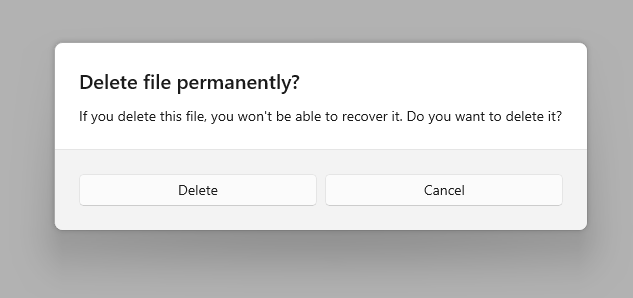
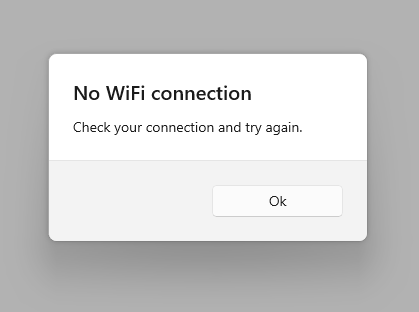
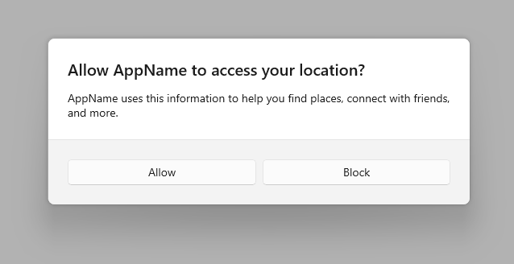
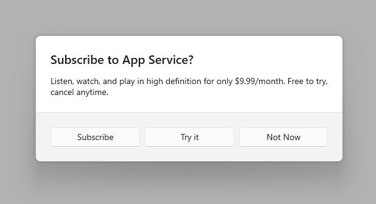
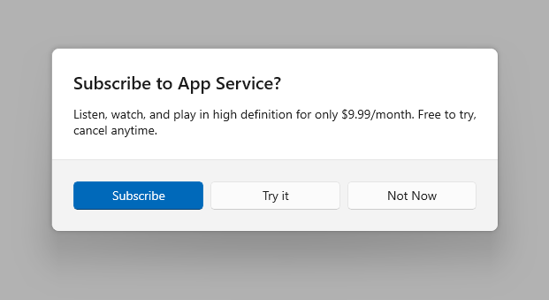

# Dialog controls

Dialog controls are modal UI overlays that provide contextual app information. They block interactions with the app window until being explicitly dismissed. They often request some kind of action from the user.



## Is this the right control?

Use dialogs to notify users of important information or to request confirmation or additional info before an action can be completed.

For recommendations on when to use a dialog vs. when to use a flyout (a similar control), see [Dialogs and flyouts](index.md).

## General guidelines

- Clearly identify the issue or the user's objective in the first line of the dialog's text.
- The dialog title is the main instruction and is optional.
  - Use a short title to explain what people need to do with the dialog.
  - If you're using the dialog to deliver a simple message, error or question, you can optionally omit the title. Rely on the content text to deliver that core information.
  - Make sure that the title relates directly to the button choices.
- The dialog content contains the descriptive text and is required.
  - Present the message, error, or blocking question as simply as possible.
  - If a dialog title is used, use the content area to provide more detail or define terminology. Don't repeat the title with slightly different wording.
- At least one dialog button must appear.
  - Ensure that your dialog has at least one button corresponding to a safe, nondestructive action like "Got it!", "Close", or "Cancel". Use the CloseButton API to add this button.
  - Use specific responses to the main instruction or content as button text. An example is, "Do you want to allow AppName to access your location?", followed by "Allow" and "Block" buttons. Specific responses can be understood more quickly, resulting in efficient decision making.
  - Ensure that the text of the action buttons is concise. Short strings enable the user to make a choice quickly and confidently.
  - In addition to the safe, nondestructive action, you may optionally present the user with one or two action buttons related to the main instruction. These "do it" action buttons confirm the main point of the dialog. Use the PrimaryButton and SecondaryButton APIs to add these "do it" actions.
  - The "do it" action button(s) should appear as the leftmost buttons. The safe, nondestructive action should appear as the rightmost button.
  - You may optionally choose to differentiate one of the three buttons as the dialog's default button. Use the DefaultButton API to differentiate one of the buttons.
- Don't use dialogs for errors that are contextual to a specific place on the page, such as validation errors (in password fields, for example), use the app's canvas itself to show inline errors.
- Use the [ContentDialog class](/windows/windows-app-sdk/api/winrt/microsoft.UI.Xaml.Controls.ContentDialog) to build your dialog experience. Don't use the deprecated MessageDialog API.

## UWP and WinUI 2

[!INCLUDE [uwp-winui2-note](../../../../includes/uwp-winui-2-note.md)]

APIs for this control exist in the [Windows.UI.Xaml.Controls](/uwp/api/Windows.UI.Xaml.Controls) namespace.

> [!div class="checklist"]
>
> - **UWP APIs:** [ContentDialog class](/uwp/api/Windows.UI.Xaml.Controls.ContentDialog)
> - [Open the WinUI 2 Gallery app and see the ContentDialog in action](winui2gallery:/item/ContentDialog). [!INCLUDE [winui-2-gallery](../../../../includes/winui-2-gallery.md)]

We recommend using the latest [WinUI 2](../../../winui/winui2/index.md) to get the most current styles and templates for all controls. WinUI 2.2 or later includes a new template for this control that uses rounded corners. For more info, see [Corner radius](../../style/rounded-corner.md).

## Create a dialog

> [!div class="checklist"]
>
> - **Important APIs**: [ContentDialog class](/windows/windows-app-sdk/api/winrt/microsoft.UI.Xaml.Controls.ContentDialog)

> [!div class="nextstepaction"]
> [Open the WinUI 3 Gallery app and see the ContentDialog in action](winui3gallery:/item/ContentDialog).

[!INCLUDE [winui-3-gallery](../../../../includes/winui-3-gallery.md)]

To create a dialog, you use the [ContentDialog class](/windows/windows-app-sdk/api/winrt/microsoft.UI.Xaml.Controls.ContentDialog). You can create a dialog in code or markup. Although its usually easier to define UI elements in XAML, in the case of a simple dialog, it's actually easier to just use code. This example creates a dialog to notify the user that there's no WiFi connection, and then uses the [ShowAsync](/windows/windows-app-sdk/api/winrt/microsoft.UI.Xaml.Controls.ContentDialog.ShowAsync) method to display it.

```csharp
private async void DisplayNoWifiDialog()
{
    ContentDialog noWifiDialog = new ContentDialog
    {
        Title = "No wifi connection",
        Content = "Check your connection and try again.",
        CloseButtonText = "OK"
    };

    ContentDialogResult result = await noWifiDialog.ShowAsync();
}
```

When the user clicks a dialog button, the [ShowAsync](/windows/windows-app-sdk/api/winrt/microsoft.UI.Xaml.Controls.ContentDialog.ShowAsync) method returns a [ContentDialogResult](/windows/windows-app-sdk/api/winrt/microsoft.UI.Xaml.Controls.ContentDialogResult) to let you know which button the user clicks.

The dialog in this example asks a question and uses the returned [ContentDialogResult](/windows/windows-app-sdk/api/winrt/microsoft.UI.Xaml.Controls.ContentDialogResult) to determine the user's response.

```csharp
private async void DisplayDeleteFileDialog()
{
    ContentDialog deleteFileDialog = new ContentDialog
    {
        Title = "Delete file permanently?",
        Content = "If you delete this file, you won't be able to recover it. Do you want to delete it?",
        PrimaryButtonText = "Delete",
        CloseButtonText = "Cancel"
    };

    ContentDialogResult result = await deleteFileDialog.ShowAsync();

    // Delete the file if the user clicked the primary button.
    /// Otherwise, do nothing.
    if (result == ContentDialogResult.Primary)
    {
        // Delete the file.
    }
    else
    {
        // The user clicked the CloseButton, pressed ESC, Gamepad B, or the system back button.
        // Do nothing.
    }
}
```

## Provide a safe action

Because dialogs block user interaction, and because buttons are the primary mechanism for users to dismiss the dialog, ensure that your dialog contains at least one "safe" and nondestructive button such as "Close" or "Got it!". **All dialogs should contain at least one safe action button to close the dialog.** This ensures that the user can confidently close the dialog without performing an action.<br>

```csharp
private async void DisplayNoWifiDialog()
{
    ContentDialog noWifiDialog = new ContentDialog
    {
        Title = "No wifi connection",
        Content = "Check your connection and try again.",
        CloseButtonText = "OK"
    };

    ContentDialogResult result = await noWifiDialog.ShowAsync();
}
```

When dialogs are used to display a blocking question, your dialog should present the user with action buttons related to the question. The "safe" and nondestructive button may be accompanied by one or two "do it" action buttons. When presenting the user with multiple options, ensure that the buttons clearly explain the "do it" and safe/"don't do it" actions related to the question proposed.



```csharp
private async void DisplayLocationPromptDialog()
{
    ContentDialog locationPromptDialog = new ContentDialog
    {
        Title = "Allow AppName to access your location?",
        Content = "AppName uses this information to help you find places, connect with friends, and more.",
        CloseButtonText = "Block",
        PrimaryButtonText = "Allow"
    };

    ContentDialogResult result = await locationPromptDialog.ShowAsync();
}
```

Three button dialogs are used when you present the user with two "do it" actions and a "don't do it" action. Three button dialogs should be used sparingly with clear distinctions between the secondary action and the safe/close action.



```csharp
private async void DisplaySubscribeDialog()
{
    ContentDialog subscribeDialog = new ContentDialog
    {
        Title = "Subscribe to App Service?",
        Content = "Listen, watch, and play in high definition for only $9.99/month. Free to try, cancel anytime.",
        CloseButtonText = "Not Now",
        PrimaryButtonText = "Subscribe",
        SecondaryButtonText = "Try it"
    };

    ContentDialogResult result = await subscribeDialog.ShowAsync();
}
```

## The three dialog buttons

ContentDialog has three different types of buttons that you can use to build a dialog experience.

- **CloseButton** - Required - Represents the safe, nondestructive action that enables the user to exit the dialog. Appears as the rightmost button.
- **PrimaryButton** - Optional - Represents the first "do it" action. Appears as the leftmost button.
- **SecondaryButton** - Optional - Represents the second "do it" action. Appears as the middle button.

Using the built-in buttons will position the buttons appropriately, ensure that they correctly respond to keyboard events, ensure that the command area remains visible even when the on-screen keyboard is up, and will make the dialog look consistent with other dialogs.

### CloseButton

Every dialog should contain a safe, nondestructive action button that enables the user to confidently exit the dialog.

Use the ContentDialog.CloseButton API to create this button. This allows you to create the right user experience for all inputs including mouse, keyboard, touch, and gamepad. This experience will happen when:

- The user clicks or taps on the CloseButton.
- The user presses the system back button.
- The user presses the ESC button on the keyboard.
- The user presses Gamepad B.

When the user clicks a dialog button, the [ShowAsync](/windows/windows-app-sdk/api/winrt/microsoft.UI.Xaml.Controls.ContentDialog.ShowAsync) method returns a [ContentDialogResult](/windows/windows-app-sdk/api/winrt/microsoft.UI.Xaml.Controls.ContentDialogResult) to let you know which button the user clicks. Pressing on the CloseButton returns ContentDialogResult.None.

### PrimaryButton and SecondaryButton

In addition to the CloseButton, you may optionally present the user with one or two action buttons related to the main instruction.
Leverage PrimaryButton for the first "do it" action, and SecondaryButton for the second "do it" action. In three-button dialogs, the PrimaryButton generally represents the affirmative "do it" action, while the SecondaryButton generally represents a neutral or secondary "do it" action.
For example, an app may prompt the user to subscribe to a service. The PrimaryButton as the affirmative "do it" action would host the Subscribe text, while the SecondaryButton as the neutral "do it" action would host the Try it text. The CloseButton would allow the user to cancel without performing either action.

When the user clicks on the PrimaryButton, the [ShowAsync](/windows/windows-app-sdk/api/winrt/microsoft.UI.Xaml.Controls.ContentDialog.ShowAsync) method returns ContentDialogResult.Primary.
When the user clicks on the SecondaryButton, the [ShowAsync](/windows/windows-app-sdk/api/winrt/microsoft.UI.Xaml.Controls.ContentDialog.ShowAsync) method returns ContentDialogResult.Secondary.


### DefaultButton

You may optionally choose to differentiate one of the three buttons as the default button. Specifying the default button causes the following to happen:

- The button receives the Accent Button visual treatment
- The button will respond to the ENTER key automatically
  - When the user presses the ENTER key on the keyboard, the click handler associated with the Default Button will fire and the ContentDialogResult will return the value associated with the Default Button
  - If the user has placed Keyboard Focus on a control that handles ENTER, the Default Button will not respond to ENTER presses
- The button will receive focus automatically when the Dialog is opened unless the dialog's content contains focusable UI

Use the ContentDialog.DefaultButton property to indicate the default button. By default, no default button is set.



```csharp
private async void DisplaySubscribeDialog()
{
    ContentDialog subscribeDialog = new ContentDialog
    {
        Title = "Subscribe to App Service?",
        Content = "Listen, watch, and play in high definition for only $9.99/month. Free to try, cancel anytime.",
        CloseButtonText = "Not Now",
        PrimaryButtonText = "Subscribe",
        SecondaryButtonText = "Try it",
        DefaultButton = ContentDialogButton.Primary
    };

    ContentDialogResult result = await subscribeDialog.ShowAsync();
}
```

## Confirmation dialogs (OK/Cancel)

A confirmation dialog gives users the chance to confirm that they want to perform an action. They can affirm the action, or choose to cancel.
A typical confirmation dialog has two buttons: an affirmation ("OK") button and a cancel button.

<ul>
    <li>
        <p>In general, the affirmation button should be on the left (the primary button) and the cancel button (the secondary button) should be on the right.</p>
        
    </li>
    <li>As noted in the general recommendations section, use buttons with text that identifies specific responses to the main instruction or content.
    </li>
</ul>

> Some platforms put the affirmation button on the right instead of the left. So why do we recommend putting it on the left?  If you assume that the majority of users are right-handed and they hold their phone with that hand, it's actually more comfortable to press the affirmation button when it's on the left, because the button is more likely to be within the user's thumb-arc. Buttons on the right-side of the screen require the user to pull their thumb inward into a less-comfortable position.

## ContentDialog in AppWindow or Xaml Islands

> NOTE: This section applies only to apps that target Windows 10, version 1903 or later. AppWindow and XAML Islands are not available in earlier versions. For more info about versioning, see [Version adaptive apps](/windows/uwp/debug-test-perf/version-adaptive-apps).

By default, content dialogs display modally relative to the root [ApplicationView](/uwp/api/windows.ui.viewmanagement.applicationview). When you use ContentDialog inside of either an [AppWindow](/uwp/api/windows.ui.windowmanagement.appwindow) or a [XAML Island](../../../desktop/modernize/xaml-islands/xaml-islands.md), you need to manually set the [XamlRoot](/windows/windows-app-sdk/api/winrt/microsoft.ui.xaml.uielement.xamlroot) on the dialog to the root of the XAML host.

To do so, set the ContentDialog's XamlRoot property to the same XamlRoot as an element already in the AppWindow or XAML Island, as shown here.

```csharp
private async void DisplayNoWifiDialog()
{
    ContentDialog noWifiDialog = new ContentDialog
    {
        Title = "No wifi connection",
        Content = "Check your connection and try again.",
        CloseButtonText = "OK"
    };

    // Use this code to associate the dialog to the appropriate AppWindow by setting
    // the dialog's XamlRoot to the same XamlRoot as an element that is already present in the AppWindow.
    if (ApiInformation.IsApiContractPresent("Windows.Foundation.UniversalApiContract", 8))
    {
        noWifiDialog.XamlRoot = elementAlreadyInMyAppWindow.XamlRoot;
    }

    ContentDialogResult result = await noWifiDialog.ShowAsync();
}
```

> [!WARNING]
> There can only be one ContentDialog open per thread at a time. Attempting to open two ContentDialogs will throw an exception, even if they are attempting to open in separate AppWindows.

## Get the sample code

- [WinUI Gallery sample](https://github.com/Microsoft/WinUI-Gallery) - See all the XAML controls in an interactive format.

## Related articles

- [Tooltips](../tooltips.md)
- [Menus and context menu](../menus.md)
- [Flyout class](/windows/windows-app-sdk/api/winrt/microsoft.UI.Xaml.Controls.Flyout)
- [ContentDialog class](/windows/windows-app-sdk/api/winrt/microsoft.UI.Xaml.Controls.ContentDialog)
