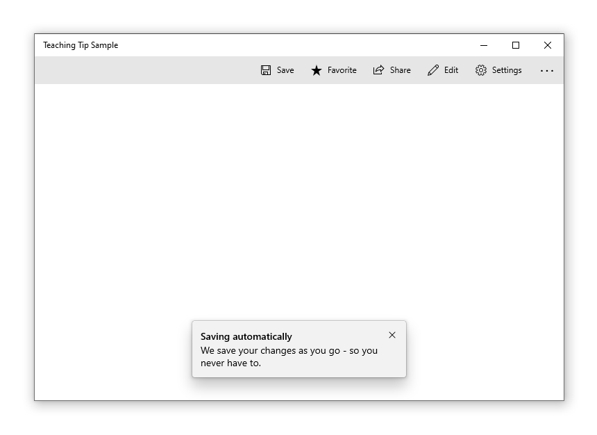
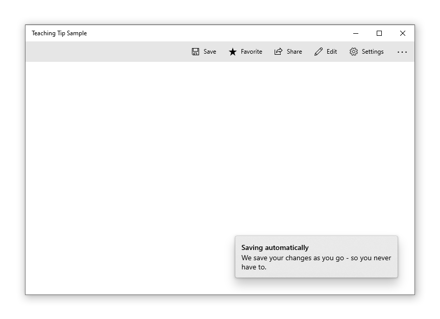
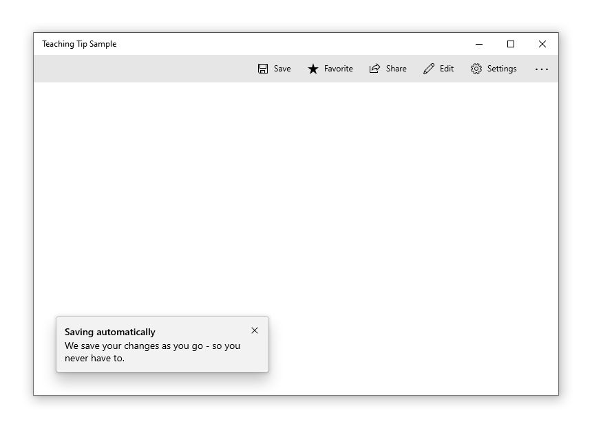

# Teaching tip

A teaching tip is a semi-persistent and content-rich flyout that provides contextual information. It is often used for informing, reminding, and teaching users about important and new features that may enhance their experience.

A teaching tip may be light-dismiss or require explicit action to close. A teaching tip can target a specific UI element with its tail and also be used without a tail or target.

## Is this the right control?

Use a **TeachingTip** control to focus a user's attention on new or important updates and features, remind a user of nonessential options that would improve their experience, or teach a user how a task should be completed.

Because teaching tip is transient, it would not be the recommended control for prompting users about errors or important status changes.

## Recommendations

* Tips are impermanent and should not contain information or options that are critical to the experience of an application.
* Try to avoid showing teaching tips too often. Teaching tips are most likely to each recieve individual attention when they are staggered throughout long sessions or across multiple sessions.
* Keep tips succinct and their topic clear. Research shows users, on average, only read 3-5 words and only comprehend 2-3 words before deciding whether to interact with a tip.
* Gamepad accessibility of a teaching tip is not guaranteed. For applications that predict gamepad input, please see [gamepad and remote control interactions]( ../../input/gamepad-and-remote-interactions.md#xy-focus-navigation-and-interaction). It is encouraged to test gamepad accessibility of each teaching tip using all possible configurations of an app's UI.
* When enabling a teaching tip to escape the xaml root, it is encouraged to also enable the IsLightDismissEnabled property and set the PreferredPlacement mode nearest to the center of the xaml root.

### Reconfiguring an open teaching tip

Some content and properties can be reconfigured while the teaching tip is open and will take effect immediately. Other content and properties, such as the icon property, the Action and Close buttons, and reconfiguring between light-dismiss and explicit-dismiss will all require the teaching tip to be closed and reopened for changes to these properties to take affect. Note that changing dismissal behavior from manual-dismiss to light-dismiss while a teaching tip is open will cause the teaching tip to have its Close button removed before the light-dismiss behavior is enabled and the tip can remain stuck on-screen.

## Examples

A teaching tip can have several configurations, including these notable ones:

A teaching tip can target a specific UI element with its tail to enhance contextual clarity of the information it is presenting.


When the information presented does not pertain to a particular UI element, a nontargeted teaching tip can be created by removing the tail.



A teaching tip can require the user to dismiss it via an "X" button in a top corner or a "Close" button at the bottom. A teaching tip may also be light-dismiss enabled in which case there is no dismiss button and the teaching tip will instead dismiss when a user scrolls or interacts with other elements of the application. Because of this behavior, light-dismiss tips are the best solution when a tip needs to be placed in a scrollable area.



## UWP and WinUI 2

[!INCLUDE [uwp-winui2-note](../../../../includes/uwp-winui-2-note.md)]

The TeachingTip for UWP apps requires WinUI 2. For more info, including installation instructions, see [WinUI](../../../winui/winui2/index.md). APIs for this control exist in the [Microsoft.UI.Xaml.Controls](/windows/winui/api/microsoft.ui.xaml.controls) namespace.

> [!div class="checklist"]
>
> - **WinUI 2 Apis:** [TeachingTip class](/windows/winui/api/microsoft.ui.xaml.controls.teachingtip)
> - [Open the WinUI 2 Gallery app and see the TeachingTip in action](winui2gallery:/item/TeachingTip). [!INCLUDE [winui-2-gallery](../../../../includes/winui-2-gallery.md)]

[!INCLUDE [muxc-alias-note](../../../../includes/muxc-alias-note.md)]

```xaml
xmlns:muxc="using:Microsoft.UI.Xaml.Controls"

<muxc:TeachingTip />
```

### Create a teaching tip

> [!div class="checklist"]
>
> - **Important APIs:** [TeachingTip class](/windows/windows-app-sdk/api/winrt/microsoft.ui.xaml.controls.teachingtip)

> [!div class="nextstepaction"]
> [Open the WinUI 3 Gallery app and see the TeachingTip in action](winui3gallery:/item/TeachingTip).

[!INCLUDE [winui-3-gallery](../../../../includes/winui-3-gallery.md)]

Here's the XAML for a targeted teaching tip control that demonstrates the default look of the TeachingTip with a title and subtitle.
Note that the teaching tip can appear anywhere in the element tree or code behind. In this example below, it's located in a ResourceDictionary.

```xaml
<Button x:Name="SaveButton" Content="Save">
    <Button.Resources>
        <TeachingTip x:Name="AutoSaveTip"
            Target="{x:Bind SaveButton}"
            Title="Save automatically"
            Subtitle="When you save your file to OneDrive, we save your changes as you go - so you never have to.">
        </TeachingTip>
    </Button.Resources>
</Button>
```

```csharp
public MainPage()
{
    this.InitializeComponent();

    if(!HaveExplainedAutoSave())
    {
        AutoSaveTip.IsOpen = true;
        SetHaveExplainedAutoSave();
    }
}
```

Here's the result when the Page containing the button and teaching tip is shown:


In the example above, the [Title](/windows/windows-app-sdk/api/winrt/microsoft.ui.xaml.controls.teachingtip.title) and [Subtitle](/windows/windows-app-sdk/api/winrt/microsoft.ui.xaml.controls.teachingtip.subtitle) properties are used to set the teaching tip's title and subtitle. The [Target](/windows/windows-app-sdk/api/winrt/microsoft.ui.xaml.controls.teachingtip.target) property is set to the "SaveButton" to establish the visual connection between itself and the button. To show the teaching tip, its [IsOpen](/windows/windows-app-sdk/api/winrt/microsoft.ui.xaml.controls.teachingtip.isopen) property is set to `true`.

### Non-targeted tips

Not all tips relate to an element onscreen. For these scenarios, do not set a target and the teaching tip will instead display relative to the edges of the xaml root. However, a teaching tip can have the tail removed while retaining placement relative to a UI element by setting the [TailVisibility](/windows/windows-app-sdk/api/winrt/microsoft.ui.xaml.controls.teachingtip.tailvisibility) property to "Collapsed". The following example is of a non-targeted teaching tip.

```xaml
<Button x:Name="SaveButton" Content="Save" />

<TeachingTip x:Name="AutoSaveTip"
    Title="Saving automatically"
    Subtitle="We save your changes as you go - so you never have to.">
</TeachingTip>
```

Note that in this example the TeachingTip is in the element tree rather than in a ResourceDictionary or in code behind. This has no effect on behavior; the TeachingTip only displays when opened, and takes up no layout space.


### Preferred placement

Teaching tip replicates Flyout's [FlyoutPlacementMode](/windows/windows-app-sdk/api/winrt/microsoft.UI.Xaml.Controls.Primitives.FlyoutPlacementMode) placement behavior with the [PreferredPlacement](/windows/windows-app-sdk/api/winrt/microsoft.ui.xaml.controls.teachingtip.preferredplacement) property. The default placement mode will try to place a targeted teaching tip above its target and a non-targeted teaching tip centered at the bottom of the xaml root. As with Flyout, if the preferred placement mode would not leave room for the teaching tip to show, another placement mode will be automatically chosen.

For applications that predict gamepad input, please see [gamepad and remote control interactions]( ../../input/gamepad-and-remote-interactions.md#xy-focus-navigation-and-interaction). It is encouraged to test gamepad accessibility of each teaching tip using all possible configurations of an app's UI.

A targeted teaching tip with its PreferredPlacement set to "BottomLeft" will appear with the tail centered at the bottom of its target with the teaching tip's body shifted toward the left.

```xaml
<Button x:Name="SaveButton" Content="Save">
    <Button.Resources>
        <TeachingTip x:Name="AutoSaveTip"
            Target="{x:Bind SaveButton}"
            Title="Saving automatically"
            Subtitle="We save your changes as you go - so you never have to."
            PreferredPlacement="BottomLeft">
        </TeachingTip>
    </Button.Resources>
</Button>
```


A non-targeted teaching tip with its PreferredPlacement set to "BottomLeft" will appear in the bottom left corner of the xaml root.

```xaml
<Button x:Name="SaveButton" Content="Save" />

<TeachingTip x:Name="AutoSaveTip"
    Title="Saving automatically"
    Subtitle="We save your changes as you go - so you never have to."
    PreferredPlacement="BottomLeft">
</TeachingTip>
```



The diagram below depicts the result of all 13 PreferredPlacement modes that can be set for targeted teaching tips.
![Illustration containing 13 teaching tips, each demonstrating a different targeted placement mode. Each teaching tip is labeled with the mode it represents. The first word of a placement mode indicates the side of the target that the teaching tip will appear centered on. The tail of the teaching tip will always be located at the center of that side of the target and will point towards the target. If there is a second word in the placement mode, the body of the teaching tip will not be centered, but will instead be shifted in the specified direction. For example, the placement mode "TopRight" will make the teaching tip appear above the target and shifted right, with its tail pointing down at the center of the target's top edge. Because the body is shifted right, the tail is almost on the leftmost edge of the body of the teaching tip, and the teaching tip extends past the right edge of the target. The placement mode "Center" in unique and will make the teaching tip's tail point at the center of the target and the teaching tip will be centered over the top half of the target.](../images/teaching-tip-targeted-preferred-placement-modes.png)

The diagram below depicts the result of all 13 PreferredPlacement modes that can be set for non-targeted teaching tips.
![Illustration containing nine teaching tips, each demonstrating a different non-targeted placement mode. Each teaching tip is labeled with the mode it represents. The first word of a placement mode indicates the side of the xaml root that the teaching tip will appear centered on. If there is a second word in the placement mode, the teaching tip will position itself toward that specified corner of the xaml root. For example, the placement mode "TopRight" will make the teaching tip appear in the top right corner of the xaml root. For non-targeted placement modes, the order of the two words does not affect the placement. TopRight is equivalent to RightTop. The placement mode "Center" in unique and will make the teaching tip appear in the vertical and horizontal center of the xaml root.](../images/teaching-tip-non-targeted-preferred-placement-modes.png)

### Add a placement margin

You can control how far a targeted teaching tip is set apart from its target and how far a non-targeted teaching tip is set apart from the edges of the xaml root by using the [PlacementMargin](/windows/windows-app-sdk/api/winrt/microsoft.ui.xaml.controls.teachingtip.placementmargin) property. Like [Margin](/windows/windows-app-sdk/api/winrt/microsoft.ui.xaml.frameworkelement.margin), PlacementMargin has four values – left, right, top, and bottom – so only the relevant values are used. For example, PlacementMargin.Left applies when the tip is left of the target or on the left edge of the xaml root.

The following example shows a non-targeted tip with the PlacementMargin's Left/Top/Right/Bottom all set to 80.

```xaml
<Button x:Name="SaveButton" Content="Save" />

<TeachingTip x:Name="AutoSaveTip"
    Title="Saving automatically"
    Subtitle="We save your changes as you go - so you never have to."
    PreferredPlacement="BottomLeft"
    PlacementMargin="80">
</TeachingTip>
```


### Add content

Content can be added to a teaching tip using the [Content](/windows/windows-app-sdk/api/winrt/microsoft.ui.xaml.controls.contentcontrol.content) property. If there is more content to show than what the size of a teaching tip will allow, a scrollbar will be automatically enabled to allow a user to scroll the content area.

```xaml
<Button x:Name="SaveButton" Content="Save">
    <Button.Resources>
        <TeachingTip x:Name="AutoSaveTip"
            Target="{x:Bind SaveButton}"
            Title="Saving automatically"
            Subtitle="We save your changes as you go - so you never have to.">
                <StackPanel>
                    <CheckBox x:Name="HideTipsCheckBox" Content="Don't show tips at start up" IsChecked="{x:Bind HidingTips, Mode=TwoWay}" />
                    <TextBlock>You can change your tip preferences in <Hyperlink NavigateUri="app:/item/SettingsPage">Settings</Hyperlink> if you change your mind.</TextBlock>
                </StackPanel>
        </TeachingTip>
    </Button.Resources>
</Button>
```

![A sample app with a teaching tip targeting the save button. The tip title reads "Saving automatically" and the subtitle reads "We save your changes as you go - so you never have to." In the content area of the teaching tip is a CheckBox labeled "Don't show tips at startup" and underneath is text that reads "You can change your tip preferences in Settings if you change your mind" where "Settings" is a link to the app's settings page. There is a close button on the top right corner of the teaching tip.](../images/teaching-tip-content.png)

### Add buttons

By default, a standard "X" close button is shown next to the title of a teaching tip. The Close button can be customized with the [CloseButtonContent](/windows/windows-app-sdk/api/winrt/microsoft.ui.xaml.controls.teachingtip.closebuttoncontent) property, in which case the button is moved to the bottom of the teaching tip.

**Note: No close button will appear on light-dismiss enabled tips**

A custom action button can be added by setting [ActionButtonContent](/windows/windows-app-sdk/api/winrt/microsoft.ui.xaml.controls.teachingtip.actionbuttoncontent) property (and optionally the [ActionButtonCommand](/windows/windows-app-sdk/api/winrt/microsoft.ui.xaml.controls.teachingtip.actionbuttoncommand) and the [ActionButtonCommandParameter](/windows/windows-app-sdk/api/winrt/microsoft.ui.xaml.controls.teachingtip.actionbuttoncommandparameter) properties).

```xaml
<Button x:Name="SaveButton" Content="Save">
    <Button.Resources>
        <TeachingTip x:Name="AutoSaveTip"
            Target="{x:Bind SaveButton}"
            Title="Saving automatically"
            Subtitle="We save your changes as you go - so you never have to."
            ActionButtonContent="Disable"
            ActionButtonCommand="{x:Bind DisableAutoSaveCommand}"
            CloseButtonContent="Got it!">
                <StackPanel>
                    <CheckBox x:Name="HideTipsCheckBox" Content="Don't show tips at start up" IsChecked="{x:Bind HidingTips, Mode=TwoWay}" />
                    <TextBlock>You can change your tip preferences in <Hyperlink NavigateUri="app:/item/SettingsPage">Settings</Hyperlink> if you change your mind.</TextBlock>
                </StackPanel>
        </TeachingTip>
    </Button.Resources>
</Button>
```

![A sample app with a teaching tip targeting the save button. The tip title reads "Saving automatically" and the subtitle reads "We save your changes as you go - so you never have to." In the content area of the teaching tip is a CheckBox labeled "Don't show tips at startup" and underneath is text that reads "You can change your tip preferences in Settings if you change your mind" where "Settings" is a link to the app's settings page. At the bottom of the teaching are two buttons, a gray one on the left that reads "Disable" and a blue one on the right that reads "Got it!"](../images/teaching-tip-buttons.png)

### Hero content

Edge to edge content can be added to a teaching tip by setting the [HeroContent](/windows/windows-app-sdk/api/winrt/microsoft.ui.xaml.controls.teachingtip.herocontent) property. The location of hero content can be set to the top or bottom of a teaching tip by setting the [HeroContentPlacement](/windows/windows-app-sdk/api/winrt/microsoft.ui.xaml.controls.teachingtip.herocontentplacement) property.

```xaml
<Button x:Name="SaveButton" Content="Save">
    <Button.Resources>
        <TeachingTip x:Name="AutoSaveTip"
            Target="{x:Bind SaveButton}"
            Title="Saving automatically"
            Subtitle="We save your changes as you go - so you never have to.">
            <TeachingTip.HeroContent>
                <Image Source="Assets/cloud.png" />
            </TeachingTip.HeroContent>
        </TeachingTip>
    </Button.Resources>
</Button>
```


### Add an icon

An icon can be added beside the title and subtitle using the [IconSource](/windows/windows-app-sdk/api/winrt/microsoft.ui.xaml.controls.teachingtip.iconsource) property. Recommended icon sizes include 16px, 24px, and 32px.

```xaml
<Button x:Name="SaveButton" Content="Save">
    <Button.Resources>
        <TeachingTip x:Name="AutoSaveTip"
            Target="{x:Bind SaveButton}"
            Title="Saving automatically"
            Subtitle="We save your changes as you go - so you never have to."
            <TeachingTip.IconSource>
                <SymbolIconSource Symbol="Save" />
            </TeachingTip.IconSource>
        </TeachingTip>
    </Button.Resources>
</Button>
```


### Enable light-dismiss

Light-dismiss functionality is disabled by default but it can enabled by setting the [IsLightDismissEnabled](/windows/windows-app-sdk/api/winrt/microsoft.ui.xaml.controls.teachingtip.islightdismissenabled) property so that a teaching tip will dismiss, for example, when a user scrolls or interacts with other elements of the application. Because of this behavior, light-dismiss tips are the best solution when a tip needs to be placed in a scrollable area.

The close button will be automatically removed from a light-dismiss enabled teaching tip to identify its light-dismiss behavior to users.

```xaml
<Button x:Name="SaveButton" Content="Save" />

<TeachingTip x:Name="AutoSaveTip"
    Title="Saving automatically"
    Subtitle="We save your changes as you go - so you never have to."
    IsLightDismissEnabled="True">
</TeachingTip>
```


### Escaping the XAML root bounds

Starting with Windows 10, version 1903 (Build 18362), a teaching tip can escape the bounds of the XAML root and the screen by setting the [ShouldConstrainToRootBounds](/windows/windows-app-sdk/api/winrt/microsoft.ui.xaml.controls.teachingtip.shouldconstraintorootbounds) property. When this property is enabled, a teaching tip will not attempt to stay in the bounds of the XAML root nor the screen and will always position at the set `PreferredPlacement` mode. It is encouraged to enable the `IsLightDismissEnabled` property and set the `PreferredPlacement` mode nearest to the center of the XAML root to ensure the best experience for users.

On earlier versions of Windows, this property is ignored and the teaching tip always stays within the bounds of the XAML root.

```xaml
<Button x:Name="SaveButton" Content="Save" />

<TeachingTip x:Name="AutoSaveTip"
    Title="Saving automatically"
    Subtitle="We save your changes as you go - so you never have to."
    PreferredPlacement="BottomRight"
    PlacementMargin="-80,-50,0,0"
    ShouldConstrainToRootBounds="False">
</TeachingTip>
```


### Canceling and deferring close

The [Closing](/windows/windows-app-sdk/api/winrt/microsoft.ui.xaml.controls.teachingtip.closing) event can be used to cancel and/or defer the close of a teaching tip. This can be used to keep the teaching tip open or allow time for an action or custom animation to occur. When the closing of a teaching tip is canceled, IsOpen will go back to true, however, it will stay false during the deferral. A programmatic close can also be canceled.

> [!NOTE]
> If no placement option would allow a teaching tip to fully show, teaching tip will iterate through its event lifecycle to force a close rather than display without an accessible close button. If the app cancels the Closing event, the teaching tip may remain open without an accessible Close button.

```xaml
<TeachingTip x:Name="EnableNewSettingsTip"
    Title="New ways to protect your privacy!"
    Subtitle="Please close this tip and review our updated privacy policy and privacy settings."
    Closing="OnTipClosing">
</TeachingTip>
```

```csharp
private void OnTipClosing(muxc.TeachingTip sender, muxc.TeachingTipClosingEventArgs args)
{
    if (args.Reason == muxc.TeachingTipCloseReason.CloseButton)
    {
        using(args.GetDeferral())
        {
            bool success = UpdateUserSettings(User thisUsersID);
            if(!success)
            {
                // We were not able to update the settings!
                // Don't close the tip and display the reason why.
                args.Cancel = true;
                ShowLastErrorMessage();
            }
        }
    }
}
```

## Related articles

* [Dialogs and flyouts](./index.md)