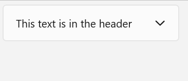

# Expander

The [Expander](/windows/windows-app-sdk/api/winrt/microsoft.ui.xaml.controls.expander) control lets you show or hide less important content that's related to a piece of primary content that's always visible. Items contained in the [Header](/windows/windows-app-sdk/api/winrt/microsoft.ui.xaml.controls.expander.header) are always visible. The user can expand and collapse the [Content](/windows/windows-app-sdk/api/winrt/microsoft.ui.xaml.controls.contentcontrol.content) area, where secondary content is displayed, by interacting with the header. When the content area is expanded, it pushes other UI elements out of the way; it does not overlay other UI. The `Expander` can expand upwards or downwards.

Both the `Header` and `Content` areas can contain any content, from simple text to complex UI layouts. For example, you can use the control to show additional options for an item.



## Is this the right control?

Use an `Expander` when some primary content should always be visible, but related secondary content may be hidden until needed. This UI is commonly used when display space is limited and when information or options can be grouped together. Hiding the secondary content until it's needed can also help to focus the user on the most important parts of your app.

## UWP and WinUI 2

[!INCLUDE [uwp-winui2-note](../../../includes/uwp-winui-2-note.md)]

The Expander for UWP apps requires WinUI 2. For more info, including installation instructions, see [WinUI 2](../../winui/winui2/index.md). APIs for this control exist in the [Microsoft.UI.Xaml.Controls](/windows/winui/api/microsoft.ui.xaml.controls) namespace.

> [!div class="checklist"]
>
> - **WinUI 2 Apis:** [Expander class](/windows/winui/api/microsoft.ui.xaml.controls.expander), [Header property](/windows/winui/api/microsoft.ui.xaml.controls.expander.header), [Content property](/uwp/api/windows.ui.xaml.controls.contentcontrol.content)
> - [Open the WinUI 2 Gallery app and see the Expander in action](winui2gallery:/item/Expander). [!INCLUDE [winui-2-gallery](../../../includes/winui-2-gallery.md)]

[!INCLUDE [muxc-alias-note](../../../includes/muxc-alias-note.md)]

```xaml
xmlns:muxc="using:Microsoft.UI.Xaml.Controls"

<muxc:Expander />
```

## Create an Expander

> [!div class="checklist"]
>
> - **Important APIs:** [Expander class](/windows/windows-app-sdk/api/winrt/microsoft.ui.xaml.controls.expander), [Header property](/windows/windows-app-sdk/api/winrt/microsoft.ui.xaml.controls.expander.header), [Content property](/windows/windows-app-sdk/api/winrt/microsoft.ui.xaml.controls.contentcontrol.content)

> [!div class="nextstepaction"]
> [Open the WinUI 3 Gallery app and see the Expander in action](winui3gallery:/item/Expander).

[!INCLUDE [winui-3-gallery](../../../includes/winui-3-gallery.md)]

This example shows how to create a simple [Expander](/windows/windows-app-sdk/api/winrt/microsoft.ui.xaml.controls.expander) with the default styling. The [Header](/windows/windows-app-sdk/api/winrt/microsoft.ui.xaml.controls.expander.header) property defines the element that is always visible. The [Content](/windows/windows-app-sdk/api/winrt/microsoft.ui.xaml.controls.contentcontrol.content) property defines the element that can be collapsed and expanded. This example creates an `Expander` that looks like the previous illustration.

```XAML
<Expander Header="This text is in the header"
               Content="This is in the content"/>
```

### Expander content

The [Content](/windows/windows-app-sdk/api/winrt/microsoft.ui.xaml.controls.contentcontrol.content) property of an `Expander` can be any type of object, but is typically a string or [UIElement](/windows/windows-app-sdk/api/winrt/microsoft.ui.xaml.uielement). For more details about setting the `Content` property, see the Remarks section of the [ContentControl](/windows/windows-app-sdk/api/winrt/microsoft.ui.xaml.controls.contentcontrol#remarks) class.

You can use complex, interactive UI as the content of the `Expander`, including nested `Expander` controls in the content of a parent `Expander` as shown here.

:::image type="content" source="images/expander-nested.png" alt-text="An open Expander with four Expander controls nested in its content. Each of the nested Expander controls has a Radio Button and text in its header":::

#### Content alignment

You can align content by setting the [HorizontalContentAlignment](/windows/windows-app-sdk/api/winrt/microsoft.ui.xaml.controls.control.horizontalcontentalignment) and [VerticalContentAlignment](/windows/windows-app-sdk/api/winrt/microsoft.ui.xaml.controls.control.verticalcontentalignment) properties on the `Expander` control. When you set these properties, the alignment applies only to the expanded content, not the header.

### Control the size of an Expander

By default, the [Header](/windows/windows-app-sdk/api/winrt/microsoft.ui.xaml.controls.expander.header) and [Content](/windows/windows-app-sdk/api/winrt/microsoft.ui.xaml.controls.contentcontrol.content) areas automatically size to fit their contents. It's important to use the correct techniques to control the size of the `Expander` to avoid undesirable appearance or behavior.

#### Width

If the content is wider than the header, the header width increases to match the content area when expanded, and shrinks when the content area is collapsed. To prevent the control width from changing when expanded or collapsed, you can set an explicit width, or, if the control is the child of a [Panel](/windows/windows-app-sdk/api/winrt/microsoft.ui.xaml.controls.panel), set [HorizontalAlignment](/windows/windows-app-sdk/api/winrt/microsoft.ui.xaml.frameworkelement.horizontalalignment) to [Stretch](/windows/windows-app-sdk/api/winrt/microsoft.ui.xaml.horizontalalignment) and let the layout panel control the sizing.

Here, a series of related `Expander` controls are placed in a [StackPanel](/windows/windows-app-sdk/api/winrt/microsoft.ui.xaml.controls.stackpanel). The `HorizontalAlignment` of each `Expander` in the `StackPanel` is set to `Stretch` using a [Style](/windows/windows-app-sdk/api/winrt/microsoft.ui.xaml.style) in the `StackPanel` [Resources](/windows/windows-app-sdk/api/winrt/microsoft.ui.xaml.frameworkelement.resources), and the width of the `StackPanel` determines the width of the `Expander` controls.

```xaml
<StackPanel x:Name="ExpanderStack" MaxWidth="600">
    <StackPanel.Resources>
        <Style TargetType="Expander">
            <Setter Property="HorizontalAlignment" Value="Stretch"/>
            <Setter Property="HorizontalContentAlignment" Value="Stretch"/>
        </Style>
    </StackPanel.Resources>
    <Expander Header="Choose your crust"> ... </Expander>
    <Expander Header="Choose your sauce"> ... </Expander>
    <Expander Header="Choose your toppings"> ... </Expander>
 </StackPanel>
```

:::image type="content" source="images/expander-stacked.png" alt-text="Three expander controls stacked vertically, all the same width":::

#### Height

Do not specify a [Height](/windows/windows-app-sdk/api/winrt/microsoft.ui.xaml.frameworkelement.height) on the `Expander`. If you do, the control will reserve that space even when the content area is collapsed, which defeats the purpose of the `Expander`. To specify the size of the expanded content area, set size dimensions on the content of the `Expander`. If you need to, you can constrain the `Height` of the content and make the content scrollable.

#### Scrollable content

If your content is too large for the size of the content area, you can wrap the content a [ScrollViewer](/windows/windows-app-sdk/api/winrt/microsoft.ui.xaml.controls.scrollviewer) to make the content area scrollable. The `Expander` control does not automatically provide scrolling capability.

When you place a `ScrollViewer` in the `Expander` content, set the height on the `ScrollViewer` control to the required height for the content area. If you instead set the height dimension on the content inside the `ScrollViewer`, `ScrollViewer` doesn't recognize this setting and therefore does not provide scrollable content.

The following example shows how to create an `Expander` control that contains scrollable text as its content.

```xaml
<Expander Header="Expander with scrollable content">
    <ScrollViewer MaxHeight="200">
        <Grid>
            <TextBlock TextWrapping="Wrap">
                Lorem ipsum dolor sit amet, consectetur adipisicing elit, 
                sed do eiusmod tempor incididunt ut labore et dolore magna
                aliqua. Ut enim ad minim veniam, quis nostrud exercitation
                ullamco laboris nisi ut aliquip ex ea commodo consequat.
                Duis aute irure dolor in reprehenderit in voluptate velit
                esse cillum dolore eu fugiat nulla pariatur. Excepteur sint
                occaecat cupidatat non proident, sunt in culpa qui officia
                deserunt mollit anim id est laborum.
            </TextBlock>
        </Grid>
    </ScrollViewer>
</Expander>
```

:::image type="content" source="images/expander-scrollable.png" alt-text="An Expander with scrollable text as its content":::

### Expanding and collapsing the content area

By default, the [Expander](/windows/windows-app-sdk/api/winrt/microsoft.ui.xaml.controls.expander) is collapsed and expands downwards.

-  Set the [IsExpanded](/windows/windows-app-sdk/api/winrt/microsoft.ui.xaml.controls.expander.isexpanded) property to `true` to have the content area initially expanded.
-  Set the [ExpandDirection](/windows/windows-app-sdk/api/winrt/microsoft.ui.xaml.controls.expander.expanddirection) property to [Up](/windows/windows-app-sdk/api/winrt/microsoft.ui.xaml.controls.expanddirection) to make the content expand upward.

```xaml
<Expander IsExpanded="True" ExpandDirection="Up">
```

An `Expander` is expanded or collapsed either programatically by setting the `IsExpanded` property, or by interacting with the `Header`; it cannot be light-dismissed.

> [!TIP]
> Transient UI, such as a `Flyout` or the open drop-down of a `ComboBox`, closes when you click or tap outside of it. This is called _light-dismiss_. The content area of an `Expander` is not considered transient and does not overlay other UI, so it does not support light-dismiss.

You can also handle the [Expanding](/windows/windows-app-sdk/api/winrt/microsoft.ui.xaml.controls.expander.expanding) and [Collapsed](/windows/windows-app-sdk/api/winrt/microsoft.ui.xaml.controls.expander.collapsed) events to take an action when the content is shown or hidden. Here are some examples of these events.

#### Expanding event

In this example, you have a group of expanders and want to have only one open at a time. When the user opens an `Expander`, you handle the [Expanding](/windows/windows-app-sdk/api/winrt/microsoft.ui.xaml.controls.expander.expanding) event and collapse all `Expander` controls in the group other than the one the user clicked.

> [!CAUTION]
> Depending on your app and user experience, it might be a convenience to automatically collapse `Expander` controls when the user expands a different one. However, this also takes control away from the user. If the behavior might be useful, consider making it an option that the user can easily set.

```xaml
<StackPanel x:Name="ExpanderStack">
    <Expander Header="Choose your crust"
                   Expanding="Expander_Expanding"> ... </Expander>
    <Expander Header="Choose your sauce"
                   Expanding="Expander_Expanding"> ... </Expander>
    <Expander Header="Choose your toppings"
                   Expanding="Expander_Expanding"> ... </Expander>
 </StackPanel>
```

```csharp
// Let the user opt out of custom behavior.
private bool _autoCollapse = true;

private void Expander_Expanding(muxc.Expander sender, 
                                muxc.ExpanderExpandingEventArgs args)
{
    if (_autoCollapse == true)
    {
        foreach (muxc.Expander ex in ExpanderStack.Children)
        {
            if (ex != sender && ex.IsExpanded)
                ex.IsExpanded = false;
        }
    }
}
```

#### Collapsed event

In this example, you handle the [Collapsed](/windows/windows-app-sdk/api/winrt/microsoft.ui.xaml.controls.expander.collapsed) event and populate the `Header` with a summary of options that are selected in the `Content`.

This image shows the `Expander` with the content expanded and options selected.

:::image type="content" source="images/expander-collapsed-event-open.png" alt-text="An expanded Expander control with selected options shown in the content area":::

When collapsed, the selected options are summarized in the header so that the user can still see them without opening the `Expander`.

:::image type="content" source="images/expander-collapsed-event-closed.png" alt-text="A collapsed Expander control with selected options summarized in the header":::

```xaml
<Expander IsExpanded="True"
        Expanding="Expander_Expanding"
        Collapsed="Expander_Collapsed">
    <Expander.Header>
        <Grid>
            <TextBlock Text="Choose your crust"/>
            <TextBlock x:Name="tbCrustSelections"
                       HorizontalAlignment="Right"
                       Style="{StaticResource CaptionTextBlockStyle}"/>
        </Grid>
    </Expander.Header>
    <StackPanel Orientation="Horizontal">
        <RadioButtons x:Name="rbCrustType" SelectedIndex="0">
            <x:String>Classic</x:String>
            <x:String>Whole wheat</x:String>
            <x:String>Gluten free</x:String>
        </RadioButtons>
        <RadioButtons x:Name="rbCrustStyle" SelectedIndex="0" 
                           Margin="48,0,0,0">
            <x:String>Regular</x:String>
            <x:String>Thin</x:String>
            <x:String>Pan</x:String>
            <x:String>Stuffed</x:String>
        </RadioButtons>
    </StackPanel>
</Expander>
```

```csharp
private void Expander_Collapsed(muxc.Expander sender, 
                                muxc.ExpanderCollapsedEventArgs args)
{
    // Update the header with options selected in the content.
    tbCrustSelections.Text = rbCrustType.SelectedItem.ToString() +
        ", " + rbCrustStyle.SelectedItem.ToString();
}
```

### Lightweight styling

You can modify the default `Style` and `ControlTemplate` to give the control a unique appearance. See the Control Style and Template section of the Expander API docs for a list of the available theme resources. For more info, see the [Light-weight styling section](../style/xaml-styles.md#lightweight-styling) of the [Styling controls](../style/xaml-styles.md) article.

## Recommendations

- Use an `Expander` when display space is limited and some secondary content may be hidden until the user requests it.

## Code examples

This XAML creates the group of `Expander` controls shown in other parts of this article. The code for the `Expanding` and `Collapsed` event handlers is also shown in previous sections.

```xaml
<StackPanel x:Name="ExpanderStack" MaxWidth="600">
    <StackPanel.Resources>
        <Style TargetType="Expander">
            <Setter Property="HorizontalAlignment" Value="Stretch"/>
            <Setter Property="HorizontalContentAlignment" Value="Stretch"/>
        </Style>
    </StackPanel.Resources>
    <Expander IsExpanded="True"
                   Expanding="Expander_Expanding"
                   Collapsed="Expander_Collapsed">
        <Expander.Header>
            <Grid>
                <TextBlock Text="Choose your crust"/>
                <TextBlock x:Name="tbCrustSelections" 
                           HorizontalAlignment="Right"
        Style="{StaticResource CaptionTextBlockStyle}"/>
            </Grid>
        </Expander.Header>
        <StackPanel Orientation="Horizontal">
            <RadioButtons x:Name="rbCrustType" SelectedIndex="0">
                <x:String>Classic</x:String>
                <x:String>Whole wheat</x:String>
                <x:String>Gluten free</x:String>
            </RadioButtons>
            <RadioButtons x:Name="rbCrustStyle" SelectedIndex="0" 
                   Margin="48,0,0,0">
                <x:String>Regular</x:String>
                <x:String>Thin</x:String>
                <x:String>Pan</x:String>
                <x:String>Stuffed</x:String>
            </RadioButtons>
        </StackPanel>
    </Expander>
    
    <Expander Header="Choose your sauce" Margin="24"
            Expanding="Expander_Expanding">
        <RadioButtons SelectedIndex="0" MaxColumns="2">
            <x:String>Classic red</x:String>
            <x:String>Garlic</x:String>
            <x:String>Pesto</x:String>
            <x:String>Barbecue</x:String>
        </RadioButtons>
    </Expander>

    <Expander Header="Choose your toppings"
                   Expanding="Expander_Expanding">
        <StackPanel>
            <Expander>
                <Expander.Header>
                    <RadioButton GroupName="Toppings" Content="House special"/>
                </Expander.Header>
                <TextBlock Text="Cheese, pepperoni, sausage, black olives, mushrooms"
                           TextWrapping="WrapWholeWords"/>
            </Expander>
            <Expander>
                <Expander.Header>
                    <RadioButton GroupName="Toppings" Content="Vegetarian"/>
                </Expander.Header>
                <TextBlock Text="Cheese, mushrooms, black olives, green peppers, artichoke hearts"
                           TextWrapping="WrapWholeWords"/>
            </Expander>
            <Expander>
                <Expander.Header>
                    <RadioButton GroupName="Toppings" Content="All meat"/>
                </Expander.Header>
                <TextBlock Text="Cheese, pepperoni, sausage, ground beef, salami"
                           TextWrapping="WrapWholeWords"/>
            </Expander>
            <Expander>
                <Expander.Header>
                    <RadioButton GroupName="Toppings" Content="Choose your own"/>
                </Expander.Header>
                <StackPanel Orientation="Horizontal">
                    <StackPanel>
                        <CheckBox Content="Cheese"/>
                        <CheckBox Content="Pepperoni"/>
                        <CheckBox Content="Sausage"/>
                    </StackPanel>
                    <StackPanel>
                        <CheckBox Content="Ground beef"/>
                        <CheckBox Content="Salami"/>
                        <CheckBox Content="Mushroom"/>
                    </StackPanel>
                    <StackPanel>
                        <CheckBox Content="Black olives"/>
                        <CheckBox Content="Green peppers"/>
                        <CheckBox Content="Artichoke hearts"/>
                    </StackPanel>
                </StackPanel>
            </Expander>
        </StackPanel>
    </Expander>
</StackPanel>
```

## Related articles

- [Page layout](../basics/app-silhouette.md)
- [Expander class](/windows/windows-app-sdk/api/winrt/microsoft.ui.xaml.controls.expander)