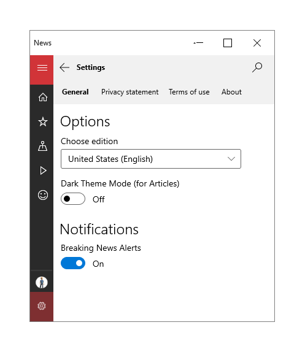
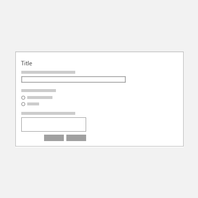
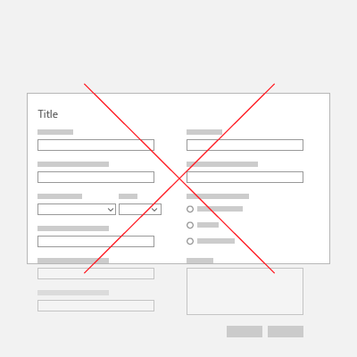
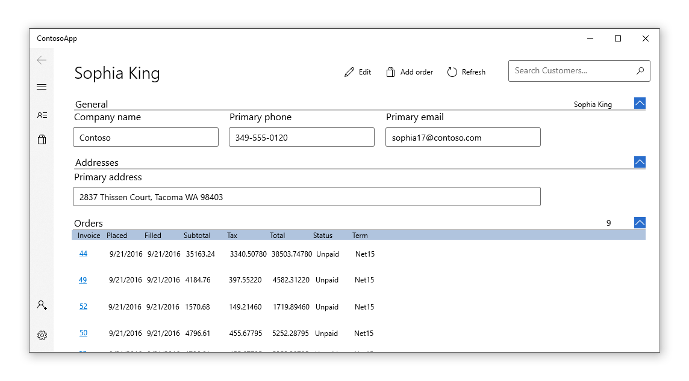

# Forms
A form is a group of controls that collect and submit data from users. Forms are typically used for settings pages, surveys, creating accounts, and much more. 

This article discusses design guidelines for creating XAML layouts for forms.


## When should you use a form?
A form is a dedicated page for collecting data inputs that are clearly related to each other. You should use a form when you need to explicitly collect data from a user. You might create a form for a user to:
- Log into an account
- Sign up for an account
- Change app settings, such as privacy or display options
- Take a survey
- Purchase an item
- Give feedback

## Types of forms

When thinking about how user input is submitted and displayed, there are two types of forms:

### 1. Instantly updating


Use an instantly updating form when you want users to immediately see the results of changing the values in the form. For example, in settings pages, the current selections are displayed, and any changes made to the selections are applied immediately. To acknowledge the changes in your app, you will need to [add an event handler](controls-and-events-intro.md) to each input control. If a user changes an input control, then your app can respond appropriately.

### 2. Submitting with button
The other type of form allows the user to choose when to submit data with a click of a button.


This type of form gives the user flexibility in responding. Typically, this type of form contains more free form input fields, and thus receives a greater variety of responses. To ensure valid user input and properly formatted data upon submission, consider the following recommendations:

- Make it impossible to submit invalid information by using the correct control (i.e., use a CalendarDatePicker rather than a TextBox for calendar dates). See more on selecting the appropriate input controls in your form in the Input Controls section later.
- When using TextBox controls, provide users a hint of the desired input format with the [PlaceholderText](/windows/windows-app-sdk/api/winrt/microsoft.UI.Xaml.Controls.TextBox.PlaceholderText) property.
- Provide users with the appropriate on-screen keyboard by stating the expected input of a control with the [InputScope](/windows/windows-app-sdk/api/winrt/microsoft.ui.xaml.input.inputscope) property.
- Mark required input with an asterisk * on the label.
- Disable the submit button until all required information is filled in.
- If there is invalid data upon submission, mark the controls with invalid input with highlighted fields or borders, and require the user to resubmit the form.
- For other errors, such as failed network connection, make sure to display an appropriate error message to the user. 


## Layout

To facilitate the user experience and ensure that users are able to enter the correct input, consider the following recommendations for designing layouts for forms. 

### Labels
[Labels](labels.md) should be left-aligned and placed above the input control. Many controls have a built-in Header property to display the label. For controls that don't have a Header property, or to label groups of controls, you can use a [TextBlock](/windows/windows-app-sdk/api/winrt/microsoft.UI.Xaml.Controls.TextBlock) instead.

To [design for accessibility](../accessibility/accessibility.md), label all individual and groups of controls for clarity for both human and screen readers. 

For font styles, use the default [Windows type ramp](../style/typography.md). Use `TitleTextBlockStyle` for page titles, `SubtitleTextBlockStyle` for group headings, and `BodyTextBlockStyle` for control labels.

<div class="mx-responsive-img">
<table>
<tr><th>Do</th><th>Don't</th></tr>
<tr>
<td></td>
<td></td>
</tr>
</table>
</div>

### Spacing
To visually separate groups of controls from each other, use [alignment, margins, and padding](../layout/alignment-margin-padding.md). Individual input controls are 80px in height and should be spaced 24px apart. Groups of input controls should be spaced 48px apart.


### Columns
Creating columns can reduce unnecessary white space in forms, especially with larger screen sizes. However, if you would like to create a multi-column form, the number of columns should depend on the number of input controls on the page and the screen size of the app window. Rather than overwhelm the screen with numerous input controls, consider creating multiple pages for your form.  

<div class="mx-responsive-img">
<table>
<tr><th>Do</th><th>Don't</th></tr>
<tr>
<td></td>
<td></td>
</tr>
<tr><td></td></tr>
</table>

</div>

### Responsive layout
Forms should resize as the screen or window size changes, so users don't overlook any input fields. For more information, see [responsive design techniques](../layout/responsive-design.md). For example, you might want to keep specific regions of the form always in view, no matter the screen size.


### Tab stops
Users can use the keyboard to navigate controls with [tab stops](../input/keyboard-interactions.md#tab-stops). By default, the tab order of controls reflects the order in which they are created in XAML. To override the default behavior, change the **IsTabStop** or **TabIndex** properties of the control. 


## Input controls
Input controls are the UI elements that allow users to enter information into forms. Some common controls that can be added to forms are listed below, as well as information about when to use them.

### Text input
Control | Use | Example
 - | - | -
[TextBox](text-box.md) | Capture one or multiple lines of text | Names, free form responses or feedback
[PasswordBox](password-box.md) | Collect private data by concealing the characters | Passwords, Social Security Numbers (SSN), PINs, credit card information 
[AutoSuggestBox](auto-suggest-box.md) | Show users a list of suggestions from a corresponding set of data as they type | Database search, mail to: line, previous queries
[RichEditBox](rich-edit-box.md) | Edit text files with formatted text, hyperlinks, and images | Upload file, preview, and edit in app

### Selection
Control | Use | Example
- | - | - 
| [CheckBox](checkbox.md) | Select or deselect one or more action items | Agree to terms and conditions, add optional items, select all that apply
[RadioButton](radio-button.md) | Select one option from two or more choices | Pick type, shipping method, etc.
[ToggleSwitch](toggles.md) | Choose one of two mutually exclusive options | On/off

> **Note**: If there are five or more selection items, use a list control.

### Lists
Control | Use | Example
- | - | -
[ComboBox](combo-box.md) | Start in compact state and expand to show list of selectable items | Select from a long list of items, such as states or countries
[ListView](./lists.md#list-view) | Categorize items and assign group headers, drag and drop items, curate content, and reorder items | Rank options
[GridView](./lists.md#grid-view) | Arrange and browse image-based collections | Pick a photo, color, display theme

### Numeric input
Control | Use | Example
- | - | -
[Slider](slider.md) | Select a number from a range of contiguous numerical values | Percentages, volume, playback speed
[Rating](rating.md) | Rate with stars | Customer feedback

### Date and Time

Control | Use 
- | - 
[CalendarView](calendar-view.md) | Pick a single date or a range of dates from an always visible calendar 
[CalendarDatePicker](calendar-date-picker.md) | Pick a single date from a contextual calendar 
[DatePicker](date-picker.md) | Pick a single localized date when contextual info isn't important
[TimePicker](time-picker.md) | Pick a single time value

### Additional Controls 
For a complete list of UWP controls, see [index of controls by function](./index.md).

For more complex and custom UI controls, look at resources available from companies such as [Telerik](https://www.telerik.com/), [SyncFusion](https://www.syncfusion.com/uwp-ui-controls), [DevExpress](https://www.devexpress.com/Products/NET/Controls/Win10Apps/),
[Infragistics](https://www.infragistics.com/products/universal-windows-platform), [ComponentOne](https://www.componentone.com/Studio/Platform/UWP), and [ActiPro](https://www.actiprosoftware.com/products/controls/universal).

## One column form example
This example uses an Acrylic [list/detail](list-details.md) [list view](lists.md) and [NavigationView](navigationview.md) control.

```xaml
<StackPanel>
    <TextBlock Text="New Customer" Style="{StaticResource TitleTextBlockStyle}"/>
    <Button Height="100" Width="100" Background="LightGray" Content="Add photo" Margin="0,24" Click="AddPhotoButton_Click"/>
    <TextBox x:Name="Name" Header= "Name" Margin="0,24,0,0" MaxLength="32" Width="400" HorizontalAlignment="Left" InputScope="PersonalFullName"/>
    <TextBox x:Name="PhoneNumber" Header="Phone Number" Margin="0,24,0,0" MaxLength="15" Width="400" HorizontalAlignment="Left" InputScope="TelephoneNumber" />
    <TextBox x:Name="Email" Header="Email" Margin="0,24,0,0" MaxLength="50" Width="400" HorizontalAlignment="Left" InputScope="EmailNameOrAddress" />
    <TextBox x:Name="Address" Header="Address" PlaceholderText="Address" Margin="0,24,0,0" MaxLength="50" Width="400" HorizontalAlignment="Left" InputScope="EmailNameOrAddress" />
    <TextBox x:Name="Address2" Margin="0,24,0,0" PlaceholderText="Address 2" MaxLength="50" Width="400" HorizontalAlignment="Left" InputScope="EmailNameOrAddress" />
    <RelativePanel>
        <TextBox x:Name="City" PlaceholderText="City" Margin="0,24,0,0" MaxLength="50" Width="200" HorizontalAlignment="Left" InputScope="EmailNameOrAddress" />
        <ComboBox x:Name="State" PlaceholderText="State" Margin="24,24,0,0"  Width="100" RelativePanel.RightOf="City">
             <x:String>WA</x:String>
        </ComboBox>
    </RelativePanel>
    <TextBox x:Name="ZipCode" PlaceholderText="Zip Code" Margin="0,24,0,0" MaxLength="6" Width="100" HorizontalAlignment="Left" InputScope="Number" />
    <StackPanel Orientation="Horizontal">
        <Button Content="Save" Margin="0,24" Click="SaveButton_Click"/>
        <Button Content="Cancel" Margin="24" Click="CancelButton_Click"/>
    </StackPanel>  
</StackPanel>
```

## Two column form example
This example uses the [Pivot](pivot.md) control, [Acrylic](../style/acrylic.md) background, and [CommandBar](command-bar.md) in addition to input controls.

```xaml
<Grid>
    <Pivot Background="{ThemeResource SystemControlAccentAcrylicWindowAccentMediumHighBrush}" >
        <Pivot.TitleTemplate>
            <DataTemplate>
                <Grid>
                    <TextBlock Text="Company Name" Style="{ThemeResource HeaderTextBlockStyle}"/>
                </Grid>
            </DataTemplate>
        </Pivot.TitleTemplate>
        <PivotItem Header="Orders" Margin="0"/>    
        <PivotItem Header="Customers" Margin="0">
            <!--Form Example-->
            <Grid Background="White">
                <RelativePanel>
                    <StackPanel x:Name="Customer" Margin="20">
                        <TextBox x:Name="CustomerName" Header= "Customer Name" Margin="0,24,0,0" MaxLength="320" Width="400" HorizontalAlignment="Left" InputScope="PersonalFullName"/>
                        <TextBox x:Name="CustomerPhoneNumber" Header="Phone Number" Margin="0,24,0,0" MaxLength="50" Width="400" HorizontalAlignment="Left" InputScope="TelephoneNumber" />
                        <TextBox x:Name="Address" Header="Address" PlaceholderText="Address" Margin="0,24,0,0" MaxLength="50" Width="400" HorizontalAlignment="Left" InputScope="AlphanumericFullWidth" />
                        <TextBox x:Name="Address2" Margin="0,24,0,0" PlaceholderText="Address 2" MaxLength="50" Width="400" HorizontalAlignment="Left" InputScope="AlphanumericFullWidth" />
                        <RelativePanel>
                            <TextBox x:Name="City" PlaceholderText="City" Margin="0,24,0,0" MaxLength="50" Width="200" HorizontalAlignment="Left" InputScope="Text" />
                            <ComboBox x:Name="State" PlaceholderText="State" Margin="24,24,0,0"  Width="100" RelativePanel.RightOf="City">
                                <x:String>WA</x:String>
                            </ComboBox>
                        </RelativePanel>
                        <TextBox x:Name="ZipCode" PlaceholderText="Zip Code" Margin="0,24,0,0" MaxLength="6" Width="100" HorizontalAlignment="Left" InputScope="Number" />
                    </StackPanel>
                    <StackPanel x:Name="Associate" Margin="20" RelativePanel.RightOf="Customer">
                        <TextBox x:Name="AssociateName" Header= "Associate" Margin="0,24,0,0" MaxLength="320" Width="400" HorizontalAlignment="Left" InputScope="PersonalFullName"/>
                        <TextBox x:Name="AssociatePhoneNumber" Header="Phone Number" Margin="0,24,0,0" MaxLength="50" Width="400" HorizontalAlignment="Left" InputScope="TelephoneNumber" />
                        <DatePicker x:Name="TargetInstallDate" Header="Target install Date" HorizontalAlignment="Left" Margin="0,24,0,0"></DatePicker>
                        <TimePicker x:Name="InstallTime" Header="Install Time" HorizontalAlignment="Left" Margin="0,24,0,0"></TimePicker>
                    </StackPanel>
                </RelativePanel>
            </Grid>
        </PivotItem>
        <PivotItem Header="Invoices"/>
        <PivotItem Header="Stock"/>
        <Pivot.RightHeader>
            <CommandBar OverflowButtonVisibility="Collapsed" Background="Transparent">
                <AppBarButton Icon="Add"/>
                <AppBarSeparator/>
                <AppBarButton Icon="Edit" />
                <AppBarButton Icon="Delete"/>
                <AppBarSeparator/>
                <AppBarButton Icon="Save"/>
            </CommandBar>
        </Pivot.RightHeader>
    </Pivot>
</Grid>
```

## Customer Orders Database Sample

To learn how to connect form input to an **Azure** database and see a fully implemented form, see the [Customers Orders Database](https://github.com/Microsoft/Windows-appsample-customers-orders-database) app sample.

## Related topics
- [Input controls](controls-and-events-intro.md)
- [Typography](../style/typography.md)