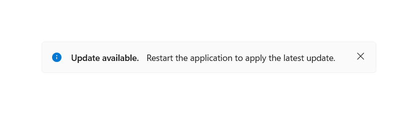
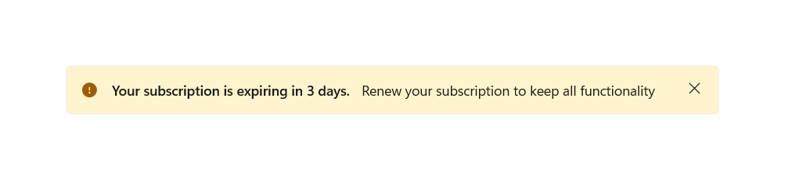
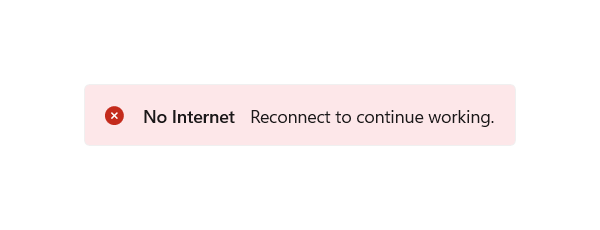
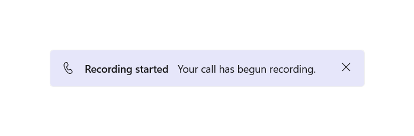
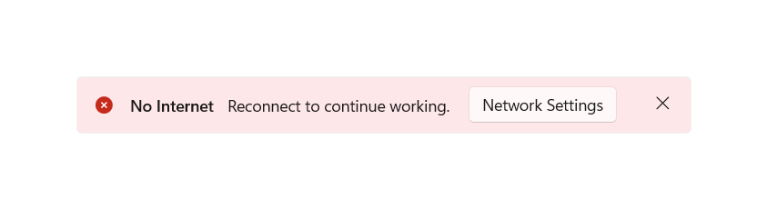
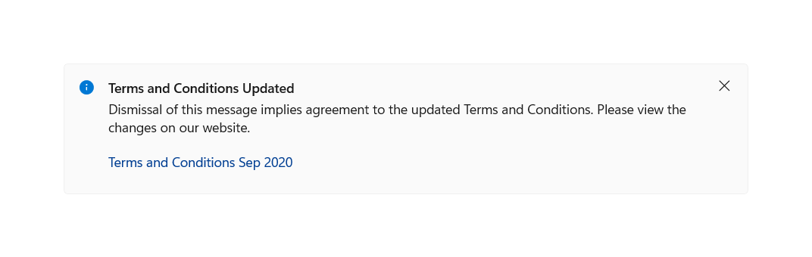
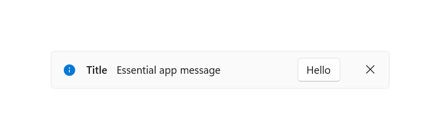
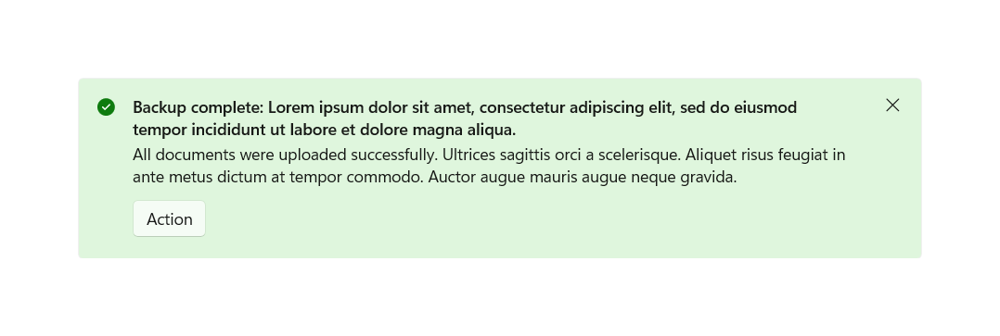
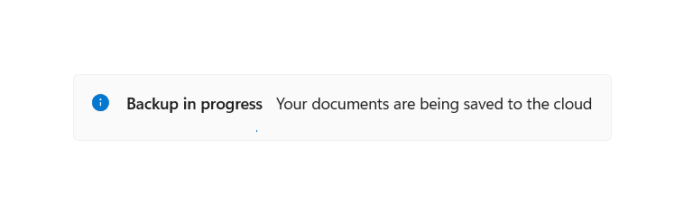

# InfoBar

The InfoBar control is for displaying app-wide status messages to users that are highly visible yet non-intrusive. There are built-in Severity levels to easily indicate the type of message shown as well as the option to include your own call to action or hyperlink button. Since the InfoBar is inline with other UI content the option is there for the control to always be visible or dismissed by the user.

**Get the Windows UI Library**

:::row:::
   :::column:::
      
   :::column-end:::
   :::column span="3":::
      The **InfoBar** control requires the Windows UI Library, a NuGet package that contains new controls and UI features for Windows apps. For more info, including installation instructions, see [Windows UI Library](/uwp/toolkits/winui/).
   :::column-end:::
   :::column:::

   :::column-end:::
:::row-end:::

> **Windows UI Library APIs:** [InfoBar class](/uwp/api/microsoft.ui.xaml.controls.infobar)

> [!TIP]
> Throughout this document, we use the **muxc** alias in XAML to represent the Windows UI Library APIs that we have included in our project. We have added this to our [Page](/uwp/api/windows.ui.xaml.controls.page) element: `xmlns:muxc="using:Microsoft.UI.Xaml.Controls"`
>
>In the code-behind, we also use the **muxc** alias in C# to represent the Windows UI Library APIs that we have included in our project. We have added this **using** statement at the top of the file: `using muxc = Microsoft.UI.Xaml.Controls;`

## Is this the right control?

Use an InfoBar control when a user should be informed of, acknowledge, or take action on a changed application state. By default the notification will remain in the content area until closed by the user but will not necessarily break user flow.

An InfoBar will take up space in your layout and behave like any other child elements. It will not cover up other content or float on top of it.

Do not use an InfoBar control to confirm or respond directly to a user action that doesn't change the state of the app, for time-sensitive alerts, or for non-essential messages.

### Remarks

Use an InfoBar that is closed by the user or when the status is resolved for scenarios that **directly** impact app perception or experience.

Here are some examples:

- Internet connectivity lost
- Error while saving a document when triggered automatically, not related to specific user action
- No microphone plugged in when attempting to record
- The subscription to the application is expired

Use an InfoBar that is closed by the user for scenarios that **indirectly** impact app perception or experience

Here are some examples:

- A call has begun recording
- Update applied with link to 'Release Notes'
- The terms of service have been updated and require acknowledgement
- An app-wide backup has successfully, asynchronously completed
- The subscription to the application is close to expiring

### When should a different control be used?

There are some scenarios where a [ContentDialog](/uwp/api/Windows.UI.Xaml.Controls.ContentDialog), [Flyout](/uwp/api/Windows.UI.Xaml.Controls.Flyout), or [TeachingTip](/uwp/api/Microsoft.UI.Xaml.Controls.TeachingTip) may be more appropriate to use.

- For scenarios where a persistent notification is not needed, e.g. displaying information in context of a specific UI element, a [Flyout](dialogs-and-flyouts/flyouts.md)
is a better option.
- For scenarios where the application is confirming a user action, showing information the user ***must*** read, use a [ContentDialog](dialogs-and-flyouts/dialogs.md).
  - Additionally, if a status change to the app is so severe that it needs to block all further ability for the user to interact with the app, use a ContentDialog.
- For scenarios where a notification is a transient teaching moment, a [TeachingTip](dialogs-and-flyouts/teaching-tip.md)
is a better option.

For more info about choosing the right notification control, see the [Dialogs and Flyouts](dialogs-and-flyouts/index.md)
article.

## Examples

<table>
<th align="left">XAML Controls Gallery<th>
<tr>
<td></img></td>
<td>
    <p>If you have the <strong style="font-weight: semi-bold">XAML Controls Gallery</strong> app installed, click here to <a href="xamlcontrolsgallery:/item/InfoBar">open the app and see the InfoBar in action</a>.</p>
    <ul>
    <li><a href="https://www.microsoft.com/store/productId/9MSVH128X2ZT">Get the XAML Controls Gallery app (Microsoft Store)</a></li>
    <li><a href="https://github.com/Microsoft/Xaml-Controls-Gallery">Get the source code (GitHub)</a></li>
    </ul>
</td>
</tr>
</table>

### Create an InfoBar

The XAML below describes an inline InfoBar with the default styling for an informational notification. An info bar can be placed like any other element and will follow base layout behavior. For example, in a vertical StackPanel, the InfoBar will horizontally expand to fill the available width.

By default, the InfoBar will not be visible. Set the IsOpen property to true in the XAML or code behind to display the InfoBar.

```xaml
<muxc:InfoBar x:Name="UpdateAvailableNotification"
    Title="Update available."
    Message="Restart the application to apply the latest update.">
</muxc:InfoBar>
```

```csharp
public MainPage()
{
    this.InitializeComponent();

    if(IsUpdateAvailable())
    {
        UpdateAvailableNotification.IsOpen = true;
    }
}
```



### Using pre-defined severity levels

The type of the info bar can be set via the Severity property to automatically set a consistent status color, icon, and assistive technology settings dependent on the criticality of the notification. If no Severity is set, the default informational styling is applied.

```xaml
<muxc:InfoBar x:Name="SubscriptionExpiringNotification"
    Severity="Warning"
    Title="Your subscription is expiring in 3 days."
    Message="Renew your subscription to keep all functionality" />
```



### Programmatic close in InfoBar

An InfoBar can be closed by the user via the close button or programmatically. If the notification is required to be in view until the status is resolved and you would like to remove the ability for the user to close the info bar, you can set the IsClosable property to false.

The default value of this property is true, in which case the close button is present and takes the form of an 'X'.

```xaml
<muxc:InfoBar x:Name="NoInternetNotification"
    Severity="Error"
    Title="No Internet"
    Message="Reconnect to continue working."
    IsClosable="False" />
```



### Customization: Background color and icon

Outside of the pre-defined severity levels, the Background and IconSource properties can be set to customize the icon and background color. The InfoBar will retain the assistive technology settings of the severity defined, or default if none was defined.

A custom background color can be set via the standard Background property and will override the color set by Severity. Please keep in mind content readability and accessibility when setting your own color.

A custom icon can be set via the IconSource property. By default, an icon will be visible (assuming the control isn't collapsed). This icon can be removed by setting the IsIconVisible property to false. For custom icons, the recommended icon size is 20px.

```xaml
<muxc:InfoBar x:Name="CallRecordingNotification"
    Title="Recording started"
    Message="Your call has begun recording."
    Background="{StaticResource LavenderBackgroundBrush}">
    <muxc:InfoBar.IconSource>
        <muxc:SymbolIconSource Symbol="Phone" />
    </muxc:InfoBar.IconSource>
</muxc:InfoBar>
```



### Add an action button

An additional action button can be added by defining your own button that inherits [ButtonBase](/uwp/api/Windows.UI.Xaml.Controls.Primitives.ButtonBase) and setting it in the ActionButton property. Custom styling will be applied to action buttons of type [Button](/uwp/api/Windows.UI.Xaml.Controls.Button) and [HyperlinkButton](/uwp/api/Windows.UI.Xaml.Controls.HyperlinkButton) for consistency and accessibility. Aside from the ActionButton property, additional action buttons can be added via custom content and will appear below the message.

```xaml
<muxc:InfoBar x:Name="NoInternetNotification"
    Severity="Error"
    Title="No Internet"
    Message="Reconnect to continue working.">
    <muxc:InfoBar.ActionButton>
        <Button Content="Network Settings" Click="InternetInfoBarButton_Click" />
    </muxc:InfoBar.ActionButton>
</muxc:InfoBar>
```



```xaml
<muxc:InfoBar x:Name="TermsAndConditionsUpdatedNotification"
    Title="Terms and Conditions Updated"
    Message="Dismissal of this message implies agreement to the updated Terms and Conditions. Please view the changes on our website.">
    <muxc:InfoBar.ActionButton>
        <HyperlinkButton Content="Terms and Conditions Sep 2020"
            NavigateUri="https://www.example.com"
            Click="UpdateInfoBarHyperlinkButton_Click" />
    </muxc:InfoBar.ActionButton>
</muxc:InfoBar>
```



### Right-aligned action button

By default, the action button is left-aligned in the available space directly to the right of the Message. Optionally, you can set HorizontalAlignment to "right" in your button to align this button to be directly to the left of the close button in the single line, horizontal, layout.

```xaml
<muxc:InfoBar x:Name="RightAlignedButtonNotification"
    Title="Title"
    Message="Essential app message">
    <muxc:InfoBar.ActionButton>
        <Button Content="Hello" HorizontalAlignment="Right"/>
    </muxc:InfoBar.ActionButton>
</muxc:InfoBar>
```



### Content wrapping

If the InfoBar content, excluding custom content, is unable to fit on a single horizontal line they will be laid out vertically. The Title, Message, and ActionButton — if present — will each appear on separate lines.

```xaml
<muxc:InfoBar x:Name="BackupCompleteNotification"
    Severity="Success"
    Title="Backup complete: Lorem ipsum dolor sit amet, consectetur adipiscing elit, sed do eiusmod tempor incididunt ut labore et dolore magna aliqua."
    Message="All documents were uploaded successfully. Ultrices sagittis orci a scelerisque. Aliquet risus feugiat in ante metus dictum at tempor commodo. Auctor augue mauris augue neque gravida.">
    <muxc:InfoBar.ActionButton>
        <Button Content="Action"
            Click="BackupInfoBarButton_Click" />
    </muxc:InfoBar.ActionButton>
</muxc:InfoBar>
```



### Custom content

XAML content can be added to an InfoBar using the Content property. It will appear in its own line below the rest of the control content. The InfoBar will expand to fit the content defined.

```xaml
<muxc:InfoBar x:Name="BackupInProgressNotification"
    Title="Backup in progress"
    Message="Your documents are being saved to the cloud"
    IsClosable="False">
    <muxc:InfoBar.Content>
        <muxc:ProgressBar IsIndeterminate="True" Margin="0,0,0,6" MaxWidth="200"/>
    </muxc:InfoBar.Content>
</muxc:InfoBar>
```



### Lightweight styling

You can modify the default Style and ControlTemplate to give the control a unique appearance.
See the [Control Style and Template](/windows/winui/api/microsoft.ui.xaml.controls.infobar#control-style-and-template) section of the InfoBar API docs for a list of the available theme resources.

For more info, see the [Light-weight styling section](../style/xaml-styles.md#lightweight-styling)
of the [Styling controls](../style/xaml-styles.md)
article.

For example, the following causes the background color for all informational InfoBars on a page to be blue:

```xaml
<Page.Resources>
    <x:SolidColorBrush x:Key="InfoBarInformationalSeverityBackgroundBrush" Color="LightBlue"></x:SolidColorBrush>
</Page.Resources>
```

### Canceling close

The Closing event can be used to cancel and/or defer the close of an InfoBar. This can be used to keep the InfoBar open or allow time for a custom action to occur. When the closing of an InfoBar is canceled, IsOpen will go back to true. A programmatic close can also be canceled.

```xaml
<muxc:InfoBar x:Name="UpdateAvailable"
    Title="Update Available"
    Message="Please close this tip to apply required security updates to this application"
    Closing="InfoBar_Closing">
</muxc:InfoBar>
```

```csharp
public void InfoBar_Closing(InfoBar sender, InfoBarClosingEventArgs args)
{
    if (args.Reason == InfoBarCloseReason.CloseButton) 
    {
        if (!ApplyUpdates()) 
        {
            // could not apply updates - do not close
            args.Cancel = true;
        }
    }
}
```

## Recommendations

### Enter and Exit Usability

#### Flashing content

The InfoBar should not appear and disappear from view rapidly to prevent flashing on the screen. Avoid flashing visuals for people with photosensitivities and to improve the usability of your application.

For InfoBars that automatically enter and exit the view via an app status condition, we recommend you include logic in your application to prevent content from appearing or disappearing rapidly or multiple times in a row. However, in general, this control should be used for long-lived status messages.

#### Updating the InfoBar

Once the control is open, any changes made to the various properties like updating the message or Severity will not raise a notification event. If you would like to inform users that use screen readers of the InfoBar's updated content we recommend you close and re-open the control to trigger the event.

#### Inline messages offsetting content

For InfoBars that are inline with other UI content, keep in mind how the rest of the page will responsively react to the addition of the element.

InfoBars with a substantial height could dramatically alter the layout of the other elements on the page. If the InfoBar appears or disappears rapidly, especially in succession, the user may be confused with the changing visual state.

### Color and Icon

When customizing the color and icon outside of the preset Severity levels, keep in mind user expectations for the connotations from the set of standard icons and colors.

Additionally, the preset Severity colors have already been designed for theme changes, high-contrast mode, color confusion accessibility, and contrast with foreground colors. We recommend to use these colors when possible and to include custom logic in your application to adapt to the various color states and accessibility features.

Please view the UX guidance for [Standard Icons](/windows/win32/uxguide/vis-std-icons) and [Color](/windows/win32/uxguide/vis-color) to ensure your message is communicated clearly and accessible to users.

#### Severity

 Avoid setting the Severity property for a notification that does not match the information communicated in the Title, Message, or custom content.

 The accompanying information should aim to communicate the following to use that Severity.

- Error: An error or problem that has occurred.
- Warning: A condition that might cause a problem in the future.
- Success: A long-running and/or background task has completed.
- Default: General information that requires the user's attention.

Icons and color should not be the only UI components signifying meaning for your notification. Text in the notification's Title and/or Message should be included to display information.

### Message

Text in your notification will not be a constant length in all languages. For the Title and Message property this may impact whether your notification will expand to a second line. We recommend you avoid positioning based on message length or other UI elements set to a specific language.

The notification will follow standard mirroring behavior when localized to/from languages that are right to left (RTL) or left to right (LTR). The icon will only mirror if there is directionality.

Please view the guidance for [Adjust layout and fonts, and support RTL](/uwp/design/globalizing/adjust-layout-and-fonts--and-support-rtl) for more information about text localization in your notification.

## Related articles

- [Dialogs and flyouts](./dialogs-and-flyouts/index.md)
