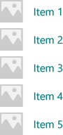
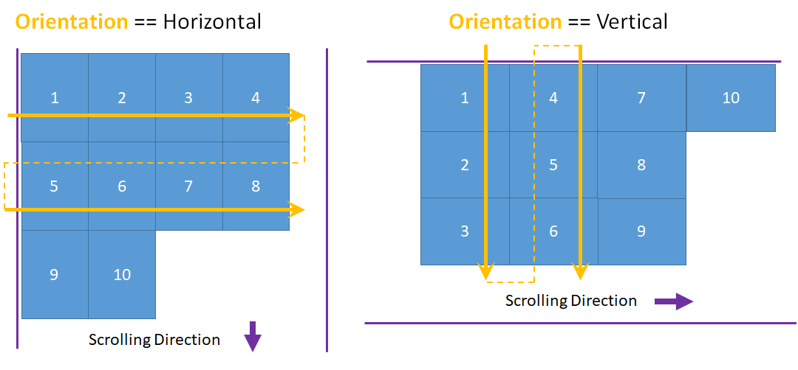
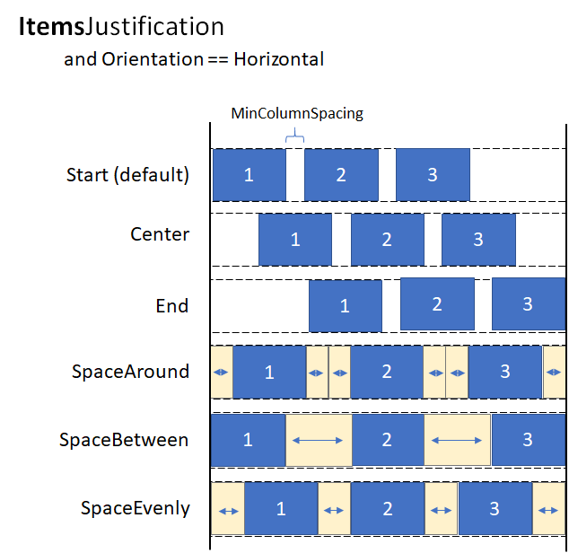

# ItemsRepeater

Use an [ItemsRepeater](/windows/windows-app-sdk/api/winrt/microsoft.ui.xaml.controls.itemsrepeater) to create custom collection experiences using a flexible layout system, custom views, and virtualization.

Unlike [ListView](/windows/windows-app-sdk/api/winrt/microsoft.ui.xaml.controls.listview), [ItemsRepeater](/windows/windows-app-sdk/api/winrt/microsoft.ui.xaml.controls.itemsrepeater) does not provide a comprehensive end-user experience – it has no default UI and provides no policy around focus, selection, or user interaction. Instead, it's a building block that you can use to create your own unique collection-based experiences and custom controls. While it has no built-in policy, it enables you to attach policy to build the experience you require. For example, you can define the layout to use, the keyboarding policy, the selection policy, etc.

You can think of [ItemsRepeater](/windows/windows-app-sdk/api/winrt/microsoft.ui.xaml.controls.itemsrepeater) conceptually as a data-driven panel, rather than as a complete control like ListView. You specify a collection of data items to be displayed, an item template that generates a UI element for each data item, and a layout that determines how the elements are sized and positioned. Then, ItemsRepeater produces child elements based on the data source, and displays them as specified by the item template and layout. The items displayed do not need to be homogenous because ItemsRepeater can load content to represent the data items based on criteria you specify in a data template selector.

## Is this the right control?

Use an [ItemsRepeater](/windows/windows-app-sdk/api/winrt/microsoft.ui.xaml.controls.itemsrepeater) to create custom displays for collections of data. While it can be used to present a basic set of items, you might often use it as the display element in the template of a custom control.

If you need an out-of-the-box control to display data in a list or grid with minimal customization, consider using a [ListView](/windows/windows-app-sdk/api/winrt/microsoft.ui.xaml.controls.listview) or [GridView](/windows/windows-app-sdk/api/winrt/microsoft.ui.xaml.controls.gridview).

ItemsRepeater does not have a built-in Items collection. If you need to provide an Items collection directly, rather than binding to a separate data source, then you're likely in need of a more high-policy experience and should use [ListView](/windows/windows-app-sdk/api/winrt/microsoft.ui.xaml.controls.listview) or [GridView](/windows/windows-app-sdk/api/winrt/microsoft.ui.xaml.controls.gridview).

[ItemsControl](/windows/windows-app-sdk/api/winrt/microsoft.ui.xaml.controls.itemscontrol) and ItemsRepeater both enable customizable collection experiences, but ItemsRepeater supports virtualizing UI layouts, while ItemsControl does not. We recommend using ItemsRepeater instead of ItemsControl, whether its for just presenting a few items from data or building a custom collection control.

## UWP and WinUI 2

[!INCLUDE [uwp-winui2-note](../../../includes/uwp-winui-2-note.md)]

The ItemsRepeater for UWP apps requires WinUI 2. For more info, including installation instructions, see [WinUI 2](../../winui/winui2/index.md). APIs for this control exist in the [Microsoft.UI.Xaml.Controls](/windows/winui/api/microsoft.ui.xaml.controls) namespace.

> [!div class="checklist"]
>
> - **UWP APIs:** [ScrollViewer class](/uwp/api/windows.ui.xaml.controls.scrollviewer)
> - **WinUI 2 Apis:** [ItemsRepeater class](/windows/winui/api/microsoft.ui.xaml.controls.itemsrepeater)
> - [Open the WinUI 2 Gallery app and see the ItemsRepeater in action](winui2gallery:/item/ItemsRepeater). [!INCLUDE [winui-2-gallery](../../../includes/winui-2-gallery.md)]

[!INCLUDE [muxc-alias-note](../../../includes/muxc-alias-note.md)]

```xaml
xmlns:muxc="using:Microsoft.UI.Xaml.Controls"

<muxc:ItemsRepeater />
```

## Scrolling with ItemsRepeater

[**ItemsRepeater**](/windows/windows-app-sdk/api/winrt/microsoft.ui.xaml.controls.itemsrepeater) does not derive from [**Control**](/windows/windows-app-sdk/api/winrt/microsoft.ui.xaml.controls.control), so it doesn't have a control template. Therefore, it doesn't contain any built-in scrolling like a ListView or other collection controls do.

When you use an **ItemsRepeater**, you should provide scrolling functionality by wrapping it in a [**ScrollViewer**](/windows/windows-app-sdk/api/winrt/microsoft.ui.xaml.controls.scrollviewer) control.

> [!NOTE]
> If your app will run on earlier versions of Windows - those released *before* Windows 10, version 1809 - then you also need to host the **ScrollViewer** inside the [**ItemsRepeaterScrollHost**](/windows/windows-app-sdk/api/winrt/microsoft.ui.xaml.controls.itemsrepeaterscrollhost). 
> ```xaml
> <muxc:ItemsRepeaterScrollHost>
>     <ScrollViewer>
>         <muxc:ItemsRepeater ... />
>     </ScrollViewer>
> </muxc:ItemsRepeaterScrollHost>
> ```
> If your app will only run on recent versions of Windows 10, version 1809 and later - then there is no need to use the [**ItemsRepeaterScrollHost**](/windows/windows-app-sdk/api/winrt/microsoft.ui.xaml.controls.itemsrepeaterscrollhost).
>
> Prior to Windows 10, version 1809, **ScrollViewer** did not implement the [**IScrollAnchorProvider**](/windows/windows-app-sdk/api/winrt/microsoft.ui.xaml.controls.iscrollanchorprovider) interface that the **ItemsRepeater** needs.  The **ItemsRepeaterScrollHost** enables the **ItemsRepeater** to coordinate with **ScrollViewer** on earlier releases to correctly preserve the visible location of items the user is viewing.  Otherwise, the items might appear to move or disappear suddenly when the items in the list are changed or the app is resized.

## Create an ItemsRepeater

> [!div class="checklist"]
>
> - **Important APIs**: [ItemsRepeater class](/windows/windows-app-sdk/api/winrt/microsoft.ui.xaml.controls.itemsrepeater), [ScrollViewer class](/windows/windows-app-sdk/api/winrt/microsoft.ui.xaml.controls.scrollviewer)

> [!div class="nextstepaction"]
> [Open the WinUI 3 Gallery app and see the ItemsRepeater in action](winui3gallery:/item/ItemsRepeater).

[!INCLUDE [winui-3-gallery](../../../includes/winui-3-gallery.md)]

To use an [**ItemsRepeater**](/windows/windows-app-sdk/api/winrt/microsoft.ui.xaml.controls.itemsrepeater), you need to give it the data to display by setting the **ItemsSource** property. Then, tell it how to display the items by setting the [**ItemTemplate**](/windows/windows-app-sdk/api/winrt/microsoft.ui.xaml.controls.itemsrepeater.itemtemplate) property.

### ItemsSource

To populate the view, set the [**ItemsSource**](/windows/windows-app-sdk/api/winrt/microsoft.ui.xaml.controls.itemsrepeater.itemssource) property to a collection of data items. Here, the **ItemsSource** is set in code directly to an instance of a collection.

```csharp
ObservableCollection<string> Items = new ObservableCollection<string>();

ItemsRepeater itemsRepeater1 = new ItemsRepeater();
itemsRepeater1.ItemsSource = Items;
```

You can also bind the **ItemsSource** property to a collection in XAML. For more info about data binding, see [Data binding overview](/windows/uwp/data-binding/data-binding-quickstart).


```xaml
<ItemsRepeater ItemsSource="{x:Bind Items}"/>
```

### ItemTemplate

To specify how a data item is visualized, set the [**ItemTemplate**](/windows/windows-app-sdk/api/winrt/microsoft.ui.xaml.controls.itemsrepeater.itemtemplate) property to a [**DataTemplate**](/windows/windows-app-sdk/api/winrt/microsoft.ui.xaml.datatemplate) or [**DataTemplateSelector**](/windows/windows-app-sdk/api/winrt/microsoft.ui.xaml.controls.datatemplateselector) you have defined. The data template defines how the data is visualized. By default, the item is displayed in the view with a **TextBlock** the uses the string representation of the data object.

However, you typically want to show a more rich presentation of your data by using a template that defines the layout and appearance of one or more controls that you'll use to display an individual item. The controls you use in the template can be bound to the properties of the data object, or have static content defined inline.

#### DataTemplate
In this example, the data object is a simple string. The **DataTemplate** includes an image to the left of the text, and styles the **TextBlock** to display the string in a teal color.

> [!NOTE]
> When you use the [x:Bind markup extension](/windows/uwp/xaml-platform/x-bind-markup-extension) in a **DataTemplate**, you have to specify the DataType (`x:DataType`) on the DataTemplate.

```xaml
<DataTemplate x:DataType="x:String">
    <Grid>
        <Grid.ColumnDefinitions>
            <ColumnDefinition Width="47"/>
            <ColumnDefinition/>
        </Grid.ColumnDefinitions>
        <Image Source="Assets/placeholder.png" Width="32" Height="32"
               HorizontalAlignment="Left"/>
        <TextBlock Text="{x:Bind}" Foreground="Teal"
                   FontSize="15" Grid.Column="1"/>
    </Grid>
</DataTemplate>
```

Here's how the items would appear when displayed with this **DataTemplate**.



The number of elements used in the **DataTemplate** for an item can have a significant impact on performance if your view displays a large number of items. For more info and examples of how to use **DataTemplate**s to define the look of items in your list, see [Item containers and templates](item-containers-templates.md).

> [!TIP]
> For convenience when you want to declare the template inline rather than referenced as a static resource, you can specify the **DataTemplate** or **DataTemplateSelector** as the direct child of the **ItemsRepeater**.  It will be assigned as the value of the **ItemTemplate** property. For example, this is valid:
> ```xaml
> <ItemsRepeater ItemsSource="{x:Bind Items}">
>     <DataTemplate>
>         <!-- ... -->
>     </DataTemplate>
> </ItemsRepeater>
> ```

> [!TIP]
> Unlike **ListView** and other collection controls, the **ItemsRepeater** doesn't wrap the elements from a **DataTemplate** with an additional item container that includes default policy such as margins, padding, selection visuals, or a pointer over visual state. Instead, **ItemsRepeater** only presents what is defined in the **DataTemplate**. If you want your items to have the same look as a list view item, you can explicitly include a container, like **ListViewItem**, in your data template. **ItemsRepeater** will show the **ListViewItem** visuals, but doesn't automatically make use of other functionality, like selection or showing the multi-select checkbox.
>
> Similarly, if your data collection is a collection of actual controls, like **Button** (`List<Button>`), you can put a **ContentPresenter** in your **DataTemplate** to display the control.

#### DataTemplateSelector

The items you display in your view do not need to be of the same type. You can provide the [**ItemTemplate**](/windows/windows-app-sdk/api/winrt/microsoft.ui.xaml.controls.itemsrepeater.itemtemplate) property with a [**DataTemplateSelector**](/windows/windows-app-sdk/api/winrt/microsoft.ui.xaml.controls.datatemplateselector) to select different **DataTemplate**s based on criteria you specify.

This example assumes a **DataTemplateSelector** has been defined that decides between two different **DataTemplate**s to represent a Large and Small item.

```xaml
<ItemsRepeater ...>
    <ItemsRepeater.ItemTemplate>
        <local:VariableSizeTemplateSelector Large="{StaticResource LargeItemTemplate}" 
                                            Small="{StaticResource SmallItemTemplate}"/>
    </ItemsRepeater.ItemTemplate>
</ItemsRepeater>
```

When defining a **DataTemplateSelector** to use with **ItemsRepeater** you only need to implement an override for the [**SelectTemplateCore(Object)**](/windows/windows-app-sdk/api/winrt/microsoft.ui.xaml.controls.datatemplateselector.selecttemplatecore#Windows_UI_Xaml_Controls_DataTemplateSelector_SelectTemplateCore_System_Object_) method. For more info and examples, see [**DataTemplateSelector**](/windows/windows-app-sdk/api/winrt/microsoft.ui.xaml.controls.datatemplateselector).

> [!NOTE]
> An alternative to **DataTemplate**s to manage how elements are created in more advanced scenarios is to implement your own [**IElementFactory**](/windows/windows-app-sdk/api/winrt/microsoft.ui.xaml.ielementfactory) to use as the **ItemTemplate**.  It will be responsible for generating content when requested.

## Configure the data source

Use the [ItemsSource](/windows/windows-app-sdk/api/winrt/microsoft.ui.xaml.controls.itemsrepeater.itemssource) property to specify the collection to use to generate the content of items. You can set the ItemsSource to any type that implements **IEnumerable**. Additional collection interfaces implemented by your data source determine what functionality is available to the ItemsRepeater to interact with your data.

This list shows available interfaces and when to consider using each one.

- [IEnumerable](/dotnet/api/system.collections.generic.ienumerable-1)(.NET) / [IIterable](/uwp/api/windows.foundation.collections.iiterable-1)

  - Can be used for small, static data sets.

    At a minimum, the data source must implement the IEnumerable / IIterable interface. If this is all that's supported then the control will iterate through everything once to create a copy that it can use to access items via an index value.

- [IReadonlyList](/dotnet/api/system.collections.generic.ireadonlylist-1)(.NET) / [IVectorView](/uwp/api/windows.foundation.collections.ivectorview-1)

  - Can be used for static, read-only data sets.

    Enables the control to access items by index and avoids the redundant internal copy.

- [IList](/dotnet/api/system.collections.generic.ilist-1)(.NET) / [IVector](/uwp/api/windows.foundation.collections.ivector-1)

  - Can be used for static data sets.

    Enables the control to access items by index and avoids the redundant internal copy.

    **Warning**:
    Changes to the list/vector without implementing [INotifyCollectionChanged](/dotnet/api/system.collections.specialized.inotifycollectionchanged) won't be reflected in the UI.

- [INotifyCollectionChanged](/dotnet/api/system.collections.specialized.inotifycollectionchanged)(.NET)

  - Recommended to support change notification.

    Enables the control to observe and react to changes in the data source and reflect those changes in the UI.

- [IObservableVector](/uwp/api/windows.foundation.collections.iobservablevector-1)

  - Supports change notification

    Like the **INotifyCollectionChanged** interface, this enables the control to observe and react to changes in the data source.

    **Warning**:
    The Windows.Foundation.IObservableVector\<T> doesn't support a 'Move' action. This can cause the UI for an item to lose its visual state.  For example, an item that is currently selected and/or has focus where the move is achieved by a 'Remove' followed by an 'Add' will lose focus and no longer be selected.

    The Platform.Collections.Vector\<T> uses IObservableVector\<T> and has this same limitation. If support for a 'Move' action is required then use the **INotifyCollectionChanged** interface.  The .NET ObservableCollection\<T> class uses **INotifyCollectionChanged**.

- [IKeyIndexMapping](/windows/windows-app-sdk/api/winrt/microsoft.ui.xaml.controls.ikeyindexmapping)

  - When a unique identifier can be associated with each item.  Recommended when using 'Reset' as the collection change action.

    Enables the control to very efficiently recover the existing UI after receiving a hard 'Reset' action as part of an **INotifyCollectionChanged** or **IObservableVector** event. After receiving a reset the control will use the provided unique ID to associate the current data with elements it had already created. Without the key to index mapping the control would have to assume it needs to start over from scratch in creating UI for the data.

The interfaces listed above, other than IKeyIndexMapping, provide the same behavior in ItemsRepeater as they do in ListView and GridView.


The following interfaces on an ItemsSource enable special functionality in the ListView and GridView controls, but currently have no effect on an ItemsRepeater:

- [ISupportIncrementalLoading](/windows/windows-app-sdk/api/winrt/microsoft.ui.xaml.data.isupportincrementalloading)
- [IItemsRangeInfo](/windows/windows-app-sdk/api/winrt/microsoft.ui.xaml.data.iitemsrangeinfo)
- [ISelectionInfo](/windows/windows-app-sdk/api/winrt/microsoft.ui.xaml.data.iselectioninfo)

> [!TIP]
> We want your feedback! Let us know what you think on the [WinUI GitHub project](https://github.com/Microsoft/microsoft-ui-xaml/issues). Consider adding your thoughts on existing proposals such as [#374](https://github.com/Microsoft/microsoft-ui-xaml/issues/374): Add incremental loading support for ItemsRepeater.

An alternative approach to incrementally load your data as the user scrolls up or down is to observe the position of the ScrollViewer's viewport and load more data as the viewport approaches the extent.

```xaml
<ScrollViewer ViewChanged="ScrollViewer_ViewChanged">
    <ItemsRepeater ItemsSource="{x:Bind MyItemsSource}" .../>
</ScrollViewer>
```

```csharp
private async void ScrollViewer_ViewChanged(object sender, ScrollViewerViewChangedEventArgs e)
{
    if (!e.IsIntermediate)
    {
        var scroller = (ScrollViewer)sender;
        var distanceToEnd = scroller.ExtentHeight - (scroller.VerticalOffset + scroller.ViewportHeight);

        // trigger if within 2 viewports of the end
        if (distanceToEnd <= 2.0 * scroller.ViewportHeight
                && MyItemsSource.HasMore && !itemsSource.Busy)
        {
            // show an indeterminate progress UI
            myLoadingIndicator.Visibility = Visibility.Visible;

            await MyItemsSource.LoadMoreItemsAsync(/*DataFetchSize*/);

            loadingIndicator.Visibility = Visibility.Collapsed;
        }
    }
}
```

## Change the layout of items

Items shown by the [ItemsRepeater](/windows/windows-app-sdk/api/winrt/microsoft.ui.xaml.controls.itemsrepeater) are arranged by a [Layout](/windows/windows-app-sdk/api/winrt/microsoft.ui.xaml.controls.layout) object that manages the sizing and positioning of its child elements. When used with an ItemsRepeater, the Layout object enables UI virtualization. The layouts provided are [StackLayout](/windows/windows-app-sdk/api/winrt/microsoft.ui.xaml.controls.stacklayout) and [UniformGridLayout](/windows/windows-app-sdk/api/winrt/microsoft.ui.xaml.controls.uniformgridlayout). By default, ItemsRepeater uses a StackLayout with vertical orientation.

### StackLayout

[StackLayout](/windows/windows-app-sdk/api/winrt/microsoft.ui.xaml.controls.stacklayout) arranges elements into a single line that you can orient horizontally or vertically.

You can set the [Spacing](/windows/windows-app-sdk/api/winrt/microsoft.ui.xaml.controls.stacklayout.spacing) property to adjust the amount of space between items. Spacing is applied in the direction of the layout's [Orientation](/windows/windows-app-sdk/api/winrt/microsoft.ui.xaml.controls.stacklayout.orientation).


This example shows how to set the ItemsRepeater.Layout property to a StackLayout with horizontal orientation and spacing of 8 pixels.

```xaml
<!-- xmlns:muxc="using:Microsoft.UI.Xaml.Controls" -->
<muxc:ItemsRepeater ItemsSource="{x:Bind Items}" ItemTemplate="{StaticResource MyTemplate}">
    <muxc:ItemsRepeater.Layout>
        <muxc:StackLayout Orientation="Horizontal" Spacing="8"/>
    </muxc:ItemsRepeater.Layout>
</muxc:ItemsRepeater>
```

### UniformGridLayout

The [UniformGridLayout](/windows/windows-app-sdk/api/winrt/microsoft.ui.xaml.controls.uniformgridlayout) positions elements sequentially in a wrapping layout. Items are layed out in order from left-to-right when the [Orientation](/windows/windows-app-sdk/api/winrt/microsoft.ui.xaml.controls.uniformgridlayout.orientation) is **Horizontal**, and layed out top-to-bottom when the Orientation is **Vertical**. Every item is sized equally.



The number of items in each row of a horizontal layout is influenced by the minimum item width. The number of items in each column of a vertical layout is influenced by the minimum item height.

- You can explicitly provide a minimum size to use by setting the [MinItemHeight](/windows/windows-app-sdk/api/winrt/microsoft.ui.xaml.controls.uniformgridlayout.minitemheight) and [MinItemWidth](/windows/windows-app-sdk/api/winrt/microsoft.ui.xaml.controls.uniformgridlayout.minitemwidth) properties.
- If you don't specify a minimum size, the measured size of the first item is considered the minimum size per item.

You can also set minimum spacing for the layout to include between rows and columns by setting the [MinColumnSpacing](/windows/windows-app-sdk/api/winrt/microsoft.ui.xaml.controls.uniformgridlayout.mincolumnspacing) and [MinRowSpacing](/windows/windows-app-sdk/api/winrt/microsoft.ui.xaml.controls.uniformgridlayout.minrowspacing) properties.


After the number of items in a row or column has been determined based on the item's minimum size and spacing, there might be unused space left after the last item in the row or column (as illustrated in the previous image). You can specify whether any extra space is ignored, used to increase the size of each item, or used to create extra space between the items. This is controlled by the [ItemsStretch](/windows/windows-app-sdk/api/winrt/microsoft.ui.xaml.controls.uniformgridlayout.itemsstretch) and [ItemsJustification](/windows/windows-app-sdk/api/winrt/microsoft.ui.xaml.controls.uniformgridlayout.itemsjustification) properties.

You can set the [ItemsStretch](/windows/windows-app-sdk/api/winrt/microsoft.ui.xaml.controls.uniformgridlayout.itemsstretch) property to specify how the item size is increased to fill the unused space.

This list shows the available values. The definitions assume the default **Orientation** of **Horizontal**.

- **None**: Extra space is left unused at the end of the row. This is the default.
- **Fill**: The items are given extra width to use up the available space (height if vertical).
- **Uniform**: The items are given extra width to use up the available space, and given extra height in order to maintain aspect ratio (height and width are switched if vertical).

This image shows the effect of the **ItemsStretch** values in a horizontal layout.


When **ItemsStretch** is **None**, you can set the [ItemsJustification](/windows/windows-app-sdk/api/winrt/microsoft.ui.xaml.controls.uniformgridlayout.itemsjustification) property to specify how extra space is used to align the items.

This list shows the available values. The definitions assume the default **Orientation** of **Horizontal**.

- **Start**: Items are aligned with the start of the row. Extra space is left unused at the end of the row. This is the default.
- **Center**: Items are aligned in the center of the row. Extra space is divided evenly at the start and end of the row.
- **End**: Items are aligned with the end of the row. Extra space is left unused at the start of the row.
- **SpaceAround**: Items are distributed evenly. An equal amount of space is added before and after each item.
- **SpaceBetween**: Items are distributed evenly. An equal amount of space is added between each item. No space is added at the start and end of the row.
- **SpaceEvenly**: Items are distributed evenly with an equal amount of space both between each item and at the start and end of the row.

This image shows the effect of the **ItemsStretch** values in a vertical layout (applied to columns instead of rows).



> [!TIP]
> The **ItemsStretch** property affects the _measure_ pass of layout. The **ItemsJustification** property affects the _arrange_ pass of layout.

This example shows how to set the **ItemsRepeater.Layout** property to a **UniformGridLayout**.

```xaml
<!-- xmlns:muxc="using:Microsoft.UI.Xaml.Controls" -->
<muxc:ItemsRepeater ItemsSource="{x:Bind Items}"
                    ItemTemplate="{StaticResource MyTemplate}">
    <muxc:ItemsRepeater.Layout>
        <muxc:UniformGridLayout MinItemWidth="200"
                                MinColumnSpacing="28"
                                ItemsJustification="SpaceAround"/>
    </muxc:ItemsRepeater.Layout>
</muxc:ItemsRepeater>
```

## Lifecycle events

When you host items in an [ItemsRepeater](/windows/windows-app-sdk/api/winrt/microsoft.ui.xaml.controls.itemsrepeater), you might need to take some action when an item is shown or stops being shown, such as start an asynchronous download of some content, associate the element with a mechanism to track selection, or stop some background task.

In a virtualizing control, you cannot rely on Loaded/Unloaded events because the element might not be removed from the live visual tree when it's recycled. Instead, other events are provided to manage the lifecycle of elements. This diagram shows the lifecycle of an element in an ItemsRepeater, and when the related events are raised.


- [**ElementPrepared**](/windows/windows-app-sdk/api/winrt/microsoft.ui.xaml.controls.itemsrepeater.elementprepared) occurs each time an element is made ready for use. This occurs for both a newly created element as well as an element that already exists and is being re-used from the recycle queue.
- [**ElementClearing**](/windows/windows-app-sdk/api/winrt/microsoft.ui.xaml.controls.itemsrepeater.elementclearing) occurs immediately each time an element has been sent to the recycle queue, such as when it falls outside the range of realized items.
- [**ElementIndexChanged**](/windows/windows-app-sdk/api/winrt/microsoft.ui.xaml.controls.itemsrepeater.elementindexchanged
) occurs for each realized UIElement where the index for the item it represents has changed. For example, when another item is added or removed in the data source, the index for items that come after in the ordering receive this event.

This example shows how you could use these events to attach a custom selection service to track item selection in a custom control that uses ItemsRepeater to display items.

```xaml
<!-- xmlns:muxc="using:Microsoft.UI.Xaml.Controls" -->
<UserControl ...>
    ...
    <ScrollViewer>
        <muxc:ItemsRepeater ItemsSource="{x:Bind Items}"
                            ItemTemplate="{StaticResource MyTemplate}"
                            ElementPrepared="OnElementPrepared"
                            ElementIndexChanged="OnElementIndexChanged"
                            ElementClearing="OnElementClearing">
        </muxc:ItemsRepeater>
    </ScrollViewer>
    ...
</UserControl>
```

```csharp
interface ISelectable
{
    int SelectionIndex { get; set; }
    void UnregisterSelectionModel(SelectionModel selectionModel);
    void RegisterSelectionModel(SelectionModel selectionModel);
}

private void OnElementPrepared(ItemsRepeater sender, ElementPreparedEventArgs args)
{
    var selectable = args.Element as ISelectable;
    if (selectable != null)
    {
        // Wire up this item to recognize a 'select' and listen for programmatic
        // changes to the selection model to know when to update its visual state.
        selectable.SelectionIndex = args.Index;
        selectable.RegisterSelectionModel(this.SelectionModel);
    }
}

private void OnElementIndexChanged(ItemsRepeater sender, ElementIndexChangedEventArgs args)
{
    var selectable = args.Element as ISelectable;
    if (selectable != null)
    {
        // Sync the ID we use to notify the selection model when the item
        // we represent has changed location in the data source.
        selectable.SelectionIndex = args.NewIndex;
    }
}

private void OnElementClearing(ItemsRepeater sender, ElementClearingEventArgs args)
{
    var selectable = args.Element as ISelectable;
    if (selectable != null)
    {
        // Disconnect handlers to recognize a 'select' and stop
        // listening for programmatic changes to the selection model.
        selectable.UnregisterSelectionModel(this.SelectionModel);
        selectable.SelectionIndex = -1;
    }
}
```

## Sorting, Filtering and Resetting the Data

When you perform actions such as filtering or sorting your data set, you traditionally may have compared the previous set of data to the new data, then issued granular change notifications via [INotifyCollectionChanged](/windows/windows-app-sdk/api/winrt/microsoft.ui.xaml.interop.inotifycollectionchanged). However, it is often easier to completely replace the old data with the new data and trigger a collection change notification using the [Reset](/windows/windows-app-sdk/api/winrt/microsoft.ui.xaml.interop.notifycollectionchangedaction) action instead.

Typically, a reset causes a control to release existing child elements and start over, building the UI from the beginning at scroll position 0 as it has no awareness of exactly how the data has changed during the reset.

However, if the collection assigned as the ItemsSource supports unique identifiers by implementing the [IKeyIndexMapping](/windows/windows-app-sdk/api/winrt/microsoft.ui.xaml.controls.ikeyindexmapping) interface, then the ItemsRepeater can quickly identify:

- reusable UIElements for data that existed both before and after the reset
- previously visible items that were removed
- new items added that will be visible

This lets the ItemsRepeater avoid starting over from scroll position 0. It also lets it quickly restore the UIElements for data that didn't change in a reset, resulting in better performance.

This example shows how to display a list of items in a vertical stack where _MyItemsSource_ is a custom data source that wraps an underlying list of items. It exposes a _Data_ property that can be used to re-assign a new list to use as the items source, which then triggers a reset.

```xaml
<ScrollViewer x:Name="sv">
    <ItemsRepeater x:Name="repeater"
                ItemsSource="{x:Bind MyItemsSource}"
                ItemTemplate="{StaticResource MyTemplate}">
       <ItemsRepeater.Layout>
           <StackLayout ItemSpacing="8"/>
       </ItemsRepeater.Layout>
   </ItemsRepeater>
</ScrollViewer>
```

```csharp
public MainPage()
{
    this.InitializeComponent();

    // Similar to an ItemsControl, a developer sets the ItemsRepeater's ItemsSource.
    // Here we provide our custom source that supports unique IDs which enables
    // ItemsRepeater to be smart about handling resets from the data.
    // Unique IDs also make it easy to do things apply sorting/filtering
    // without impacting any state (i.e. selection).
    MyItemsSource myItemsSource = new MyItemsSource(data);

    repeater.ItemsSource = myItemsSource;

    // ...

    // We can sort/filter the data using whatever mechanism makes the
    // most sense (LINQ, database query, etc.) and then reassign
    // it, which in our implementation triggers a reset.
    myItemsSource.Data = someNewData;
}

// ...


public class MyItemsSource : IReadOnlyList<ItemBase>, IKeyIndexMapping, INotifyCollectionChanged
{
    private IList<ItemBase> _data;

    public MyItemsSource(IEnumerable<ItemBase> data)
    {
        if (data == null) throw new ArgumentNullException();

        this._data = data.ToList();
    }

    public IList<ItemBase> Data
    {
        get { return _data; }
        set
        {
            _data = value;

            // Instead of tossing out existing elements and re-creating them,
            // ItemsRepeater will reuse the existing elements and match them up
            // with the data again.
            this.CollectionChanged?.Invoke(
                this,
                new NotifyCollectionChangedEventArgs(NotifyCollectionChangedAction.Reset));
        }
    }

    #region IReadOnlyList<T>

    public ItemBase this[int index] => this.Data != null
        ? this.Data[index]
        : throw new IndexOutOfRangeException();

    public int Count => this.Data != null ? this.Data.Count : 0;
    public IEnumerator<ItemBase> GetEnumerator() => this.Data.GetEnumerator();
    IEnumerator IEnumerable.GetEnumerator() => this.GetEnumerator();

    #endregion

    #region INotifyCollectionChanged

    public event NotifyCollectionChangedEventHandler CollectionChanged;

    #endregion

    #region IKeyIndexMapping

    private int lastRequestedIndex = IndexNotFound;
    private const int IndexNotFound = -1;

    // When UniqueIDs are supported, the ItemsRepeater caches the unique ID for each item
    // with the matching UIElement that represents the item.  When a reset occurs the
    // ItemsRepeater pairs up the already generated UIElements with items in the data
    // source.
    // ItemsRepeater uses IndexForUniqueId after a reset to probe the data and identify
    // the new index of an item to use as the anchor.  If that item no
    // longer exists in the data source it may try using another cached unique ID until
    // either a match is found or it determines that all the previously visible items
    // no longer exist.
    public int IndexForUniqueId(string uniqueId)
    {
        // We'll try to increase our odds of finding a match sooner by starting from the
        // position that we know was last requested and search forward.
        var start = lastRequestedIndex;
        for (int i = start; i < this.Count; i++)
        {
            if (this[i].PrimaryKey.Equals(uniqueId))
                return i;
        }

        // Then try searching backward.
        start = Math.Min(this.Count - 1, lastRequestedIndex);
        for (int i = start; i >= 0; i--)
        {
            if (this[i].PrimaryKey.Equals(uniqueId))
                return i;
        }

        return IndexNotFound;
    }

    public string UniqueIdForIndex(int index)
    {
        var key = this[index].PrimaryKey;
        lastRequestedIndex = index;
        return key;
    }

    #endregion
}

```

## Create a custom collection control

You can use the [ItemsRepeater](/windows/windows-app-sdk/api/winrt/microsoft.ui.xaml.controls.itemsrepeater) to create a custom collection control complete with its own type of control to present each item.

> [!NOTE]
> This is similar to using **ItemsControl**, but instead of deriving from **ItemsControl** and putting an **ItemsPresenter** in the control template, you derive from **Control** and insert an **ItemsRepeater** in the control template. The custom collection control "has an" **ItemsRepeater** versus "is an" **ItemsControl**. This implies that you must also explicitly choose which properties to expose, rather than which inherited properties to not support.

This example shows how to place an [ItemsRepeater](/windows/windows-app-sdk/api/winrt/microsoft.ui.xaml.controls.itemsrepeater) in the template of a custom control named _MediaCollectionView_ and expose its properties.

```xaml
<!-- xmlns:muxc="using:Microsoft.UI.Xaml.Controls" -->
<Style TargetType="local:MediaCollectionView">
    <Setter Property="Template">
        <Setter.Value>
            <ControlTemplate TargetType="local:MediaCollectionView">
                <Border
                    Background="{TemplateBinding Background}"
                    BorderBrush="{TemplateBinding BorderBrush}"
                    BorderThickness="{TemplateBinding BorderThickness}">
                    <ScrollViewer x:Name="ScrollViewer">
                        <muxc:ItemsRepeater x:Name="ItemsRepeater"
                                            ItemsSource="{TemplateBinding ItemsSource}"
                                            ItemTemplate="{TemplateBinding ItemTemplate}"
                                            Layout="{TemplateBinding Layout}"
                                            TabFocusNavigation="{TemplateBinding TabFocusNavigation}"/>
                    </ScrollViewer>
                </Border>
            </ControlTemplate>
        </Setter.Value>
    </Setter>
</Style>
```

```csharp
public sealed class MediaCollectionView : Control
{
    public object ItemsSource
    {
        get { return (object)GetValue(ItemsSourceProperty); }
        set { SetValue(ItemsSourceProperty, value); }
    }

    // Using a DependencyProperty as the backing store for ItemsSource.  This enables animation, styling, binding, etc...
    public static readonly DependencyProperty ItemsSourceProperty =
        DependencyProperty.Register(nameof(ItemsSource), typeof(object), typeof(MediaCollectionView), new PropertyMetadata(0));

    public DataTemplate ItemTemplate
    {
        get { return (DataTemplate)GetValue(ItemTemplateProperty); }
        set { SetValue(ItemTemplateProperty, value); }
    }

    // Using a DependencyProperty as the backing store for ItemTemplate.  This enables animation, styling, binding, etc...
    public static readonly DependencyProperty ItemTemplateProperty =
        DependencyProperty.Register(nameof(ItemTemplate), typeof(DataTemplate), typeof(MediaCollectionView), new PropertyMetadata(0));

    public Layout Layout
    {
        get { return (Layout)GetValue(LayoutProperty); }
        set { SetValue(LayoutProperty, value); }
    }

    // Using a DependencyProperty as the backing store for Layout.  This enables animation, styling, binding, etc...
    public static readonly DependencyProperty LayoutProperty =
        DependencyProperty.Register(nameof(Layout), typeof(Layout), typeof(MediaCollectionView), new PropertyMetadata(0));

    public MediaCollectionView()
    {
        this.DefaultStyleKey = typeof(MediaCollectionView);
    }
}
```

## Display grouped items

You can nest an [ItemsRepeater](/windows/windows-app-sdk/api/winrt/microsoft.ui.xaml.controls.itemsrepeater) in the [ItemTemplate](/windows/windows-app-sdk/api/winrt/microsoft.ui.xaml.controls.itemsrepeater.itemtemplate) of another ItemsRepeater to create nested virtualizing layouts. The framework will make efficient use of resources by minimizing unnecessary realization of elements that aren't visible or near the current viewport.

This example shows how you can display a list of grouped items in a vertical stack. The outer ItemsRepeater generates each group. In the template for each group, another ItemsRepeater generates the items.

```xaml
<!-- xmlns:muxc="using:Microsoft.UI.Xaml.Controls" -->

<Page.Resources>
    <muxc:StackLayout x:Key="MyGroupLayout"/>
    <muxc:StackLayout x:Key="MyItemLayout" Orientation="Horizontal"/>
</Page.Resources>

<ScrollViewer>
  <muxc:ItemsRepeater ItemsSource="{x:Bind AppNotifications}"
                      Layout="{StaticResource MyGroupLayout}">
    <muxc:ItemsRepeater.ItemTemplate>
      <DataTemplate x:DataType="ExampleApp:AppNotifications">
        <!-- Group -->
        <StackPanel>
          <!-- Header -->
          <TextBlock Text="{x:Bind AppTitle}"/>
          <!-- Items -->
          <muxc:ItemsRepeater ItemsSource="{x:Bind Notifications}"
                              Layout="{StaticResource MyItemLayout}"
                              ItemTemplate="{StaticResource MyTemplate}"/>
          <!-- Footer -->
          <Button Content="{x:Bind FooterText}"/>
        </StackPanel>
      </DataTemplate>
    </muxc:ItemsRepeater.ItemTemplate>
  </muxc:ItemsRepeater>
</ScrollViewer>
```
The image below shows the basic layout that's created using the above sample as a guideline.


This next example shows a layout for an app that has various categories that can change with user preference and are presented as horizontally scrolling lists. The layout of this example is also represented by the image above.

```xaml
<!-- xmlns:muxc="using:Microsoft.UI.Xaml.Controls" -->
<!-- Include the <muxc:ItemsRepeaterScrollHost> if targeting Windows 10 versions earlier than 1809. -->
<ScrollViewer>
  <muxc:ItemsRepeater ItemsSource="{x:Bind Categories}"
                      Background="LightGreen">
    <muxc:ItemsRepeater.ItemTemplate>
      <DataTemplate x:DataType="local:Category">
        <StackPanel Margin="12,0">
          <TextBlock Text="{x:Bind Name}" Style="{ThemeResource TitleTextBlockStyle}"/>
          <!-- Include the <muxc:ItemsRepeaterScrollHost> if targeting Windows 10 versions earlier than 1809. -->
          <ScrollViewer HorizontalScrollMode="Enabled"
                                          VerticalScrollMode="Disabled"
                                          HorizontalScrollBarVisibility="Auto" >
            <muxc:ItemsRepeater ItemsSource="{x:Bind Items}"
                                Background="Orange">
              <muxc:ItemsRepeater.ItemTemplate>
                <DataTemplate x:DataType="local:CategoryItem">
                  <Grid Margin="10"
                        Height="60" Width="120"
                        Background="LightBlue">
                    <TextBlock Text="{x:Bind Name}"
                               Style="{StaticResource SubtitleTextBlockStyle}"
                               Margin="4"/>
                  </Grid>
                </DataTemplate>
              </muxc:ItemsRepeater.ItemTemplate>
              <muxc:ItemsRepeater.Layout>
                <muxc:StackLayout Orientation="Horizontal"/>
              </muxc:ItemsRepeater.Layout>
            </muxc:ItemsRepeater>
          </ScrollViewer>
        </StackPanel>
      </DataTemplate>
    </muxc:ItemsRepeater.ItemTemplate>
  </muxc:ItemsRepeater>
</ScrollViewer>
```

## Bringing an Element Into View

The XAML framework already handles bringing a FrameworkElement into view when it either 1) receives keyboard focus or 2) receives Narrator focus. There may be other cases where you need to explicitly bring an element into view. For example, in response to a user action or to restore the state of the UI after a page navigation.

Bringing a virtualized element into view involves the following:
1. Realize a UIElement for an item
2. Run the layout to ensure the element has a valid position
3. Initiate a request to bring the realized element into view

The example below demonstrates these steps as part of restoring the scroll position of an item in a flat, vertical list after a page navigation. In the case of hierarchical data using nested ItemsRepeaters the approach is essentially the same, but must be done at each level of the hierarchy.

```xaml
<ScrollViewer x:Name="scrollviewer">
  <ItemsRepeater x:Name="repeater" .../>
</ScrollViewer>
```

```csharp
public class MyPage : Page
{
    // ...

     protected override void OnNavigatedTo(NavigationEventArgs e)
    {
        base.OnNavigatedTo(e);

        // retrieve saved offset + index(es) of the tracked element and then bring it into view.
        // ... 
        
        var element = repeater.GetOrCreateElement(index);

        // ensure the item is given a valid position
        element.UpdateLayout();

        element.StartBringIntoView(new BringIntoViewOptions()
        {
            VerticalOffset = relativeVerticalOffset
        });
    }

    protected override void OnNavigatingFrom(NavigatingCancelEventArgs e)
    {
        base.OnNavigatingFrom(e);

        // retrieve and save the relative offset and index(es) of the scrollviewer's current anchor element ...
        var anchor = this.scrollviewer.CurrentAnchor;
        var index = this.repeater.GetElementIndex(anchor);
        var anchorBounds = anchor.TransformToVisual(this.scrollviewer).TransformBounds(new Rect(0, 0, anchor.ActualSize.X, anchor.ActualSize.Y));
        relativeVerticalOffset = this.scrollviewer.VerticalOffset - anchorBounds.Top;
    }
}

```

## Enable Accessibility

[ItemsRepeater](/windows/windows-app-sdk/api/winrt/microsoft.ui.xaml.controls.itemsrepeater) does not provide a default accessibility experience. The documentation on [Usability for Windows apps](../usability/index.md) provides a wealth of information to help you ensure your app provides an inclusive user experience. If you're using the ItemsRepeater to create a custom control then be sure to see the documentation on [Custom automation peers](../accessibility/custom-automation-peers.md).

### Keyboarding
The minimal keyboarding support for focus movement that ItemsRepeater provides is based on XAML's [2D Directional Navigation for Keyboarding](../input/focus-navigation.md#2d-directional-navigation-for-keyboard).


The ItemsRepeater's [XYFocusKeyboardNavigation mode](/windows/windows-app-sdk/api/winrt/microsoft.ui.xaml.input.xyfocuskeyboardnavigationmode) is _Enabled_ by default. Depending on the intended experience, consider adding support for common [Keyboard Interactions](../input/keyboard-interactions.md) such as Home, End, PageUp, and PageDown.

The ItemsRepeater does automatically ensure that the default tab order for its items (whether virtualized or not) follows the same order that the items are given in the data. By default the ItemsRepeater has its [TabFocusNavigation](/windows/windows-app-sdk/api/winrt/microsoft.ui.xaml.uielement.tabfocusnavigation) property set to [Once](/windows/windows-app-sdk/api/winrt/microsoft.ui.xaml.input.keyboardnavigationmode) instead of the common default of _Local_.

> [!NOTE]
> The ItemsRepeater does not automatically remember the last focused item.  This means that when a user is using Shift+Tab they may be taken to the last realized item.

### Announcing "Item _X_ of _Y_" in Screen Readers

You need to manage setting the appropriate automation properties, such as values for **PositionInSet** and **SizeOfSet**, and ensure they remain up-to-date when items are added, moved, removed, etc.

In some custom layouts there may not be an obvious sequence to the visual order.  Users minimally expect that the values for the PositionInSet and SizeOfSet properties used by screen readers will match the order the items appear in the data (offset by 1 to match natural counting versus being 0-based).

The best way to achieve this is by having the automation peer for the item control implement the [GetPositionInSetCore](/windows/windows-app-sdk/api/winrt/microsoft.ui.xaml.automation.peers.automationpeer.getpositioninsetcore) and [GetSizeOfSetCore](/windows/windows-app-sdk/api/winrt/microsoft.ui.xaml.automation.peers.automationpeer.getsizeofsetcore) methods and report the position of the item in the data set represented by the control. The value is only computed at run-time when accessed by an assistive technology and keeping it up-to-date becomes a non-issue. The value matches the data order.

This example shows how you could do this when presenting a custom control called _CardControl_.

```xaml
<ScrollViewer >
    <ItemsRepeater x:Name="repeater" ItemsSource="{x:Bind MyItemsSource}">
       <ItemsRepeater.ItemTemplate>
           <DataTemplate x:DataType="local:CardViewModel">
               <local:CardControl Item="{x:Bind}"/>
           </DataTemplate>
       </ItemsRepeater.ItemTemplate>
   </ItemsRepeater>
</ScrollViewer>
```

```csharp
internal sealed class CardControl : CardControlBase
{
    protected override AutomationPeer OnCreateAutomationPeer() => new CardControlAutomationPeer(this);

    private sealed class CardControlAutomationPeer : FrameworkElementAutomationPeer
    {
        private readonly CardControl owner;

        public CardControlAutomationPeer(CardControl owner) : base(owner) => this.owner = owner;

        protected override int GetPositionInSetCore()
          => ((ItemsRepeater)owner.Parent)?.GetElementIndex(this.owner) + 1 ?? base.GetPositionInSetCore();

        protected override int GetSizeOfSetCore()
          => ((ItemsRepeater)owner.Parent)?.ItemsSourceView?.Count ?? base.GetSizeOfSetCore();
    }
}
```

## Related articles

- [Lists](lists.md)
- [ItemsRepeater](/windows/windows-app-sdk/api/winrt/microsoft.ui.xaml.controls.itemsrepeater)
- [ScrollViewer](/windows/windows-app-sdk/api/winrt/microsoft.ui.xaml.controls.scrollviewer)