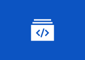
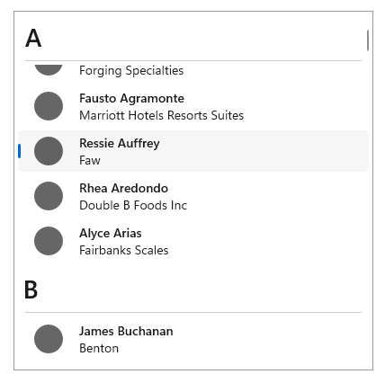
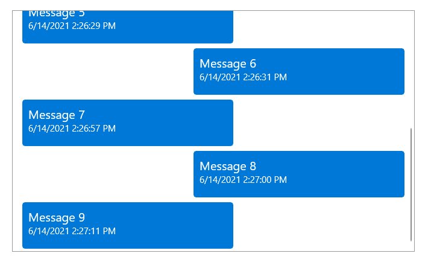
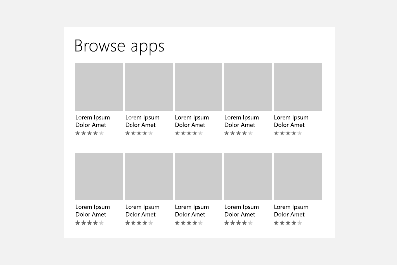
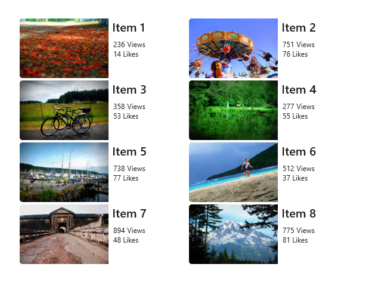
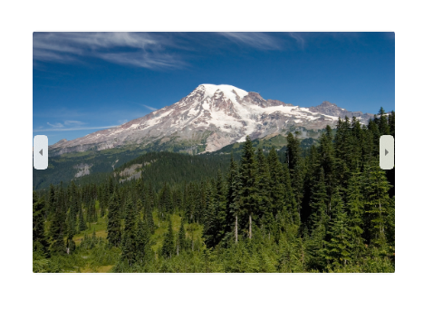
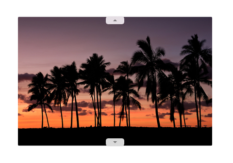
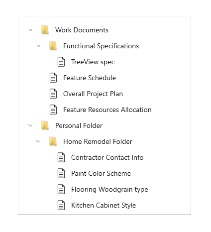
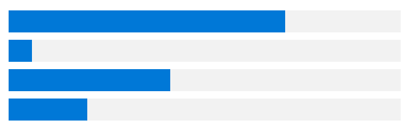

# Collections and lists

Collections and lists both refer to the representation of multiple related data items that appear together. Collections can be represented in multiple ways, by different collection controls (also may be referred to as collection views). Collection controls display and enable interactions with collection-based content, such as a list of contacts, a list of dates, a collection of images, and so on.

> **Important APIs**: [ItemsView](/windows/windows-app-sdk/api/winrt/microsoft.ui.xaml.controls.itemsview), [ListView class](/windows/windows-app-sdk/api/winrt/microsoft.UI.Xaml.Controls.ListView), [GridView class](/windows/windows-app-sdk/api/winrt/microsoft.UI.Xaml.Controls.GridView), [FlipView class](/windows/windows-app-sdk/api/winrt/microsoft.ui.xaml.controls.flipview), [TreeView class](/windows/windows-app-sdk/api/winrt/microsoft.ui.xaml.controls.treeview), [ItemsRepeater class](/windows/windows-app-sdk/api/winrt/microsoft.ui.xaml.controls.itemsrepeater)

The controls covered in this article include:

| Control | Primary use |
| -- | -- |
|  **ItemsView**  |  to display collections using a flexible layout system  |
|  **ListView**  |  to display text-heavy content collections  |
|  **GridView**  |  to display image-heavy content collections  |
|  **FlipView**  |  to display image-heavy content collections that require exactly one item to be in focus at a time  |
|  **TreeView**  |  to display text-heavy content collections in a specific hierarchy  |
|  **ItemsRepeater**  |  as a customizable building block to create custom collection controls  |

Design guidelines, features, and examples are given below for each control.

Each of these controls (with the exception of ItemsRepeater) provide built-in styling and interaction. However, to further customize the visual look of your collection view and the items inside it, a [DataTemplate](/windows/windows-app-sdk/api/winrt/microsoft.ui.xaml.datatemplate) is used. Detailed information on data templates and customizing the look of a collection view can be found on the [Item containers and templates](./item-containers-templates.md) page.

Each of these controls (with the exception of ItemsRepeater) also have built-in behavior to allow for the selection of single or multiple items. See [Selection modes overview](selection-modes.md) to learn more.

One of the scenarios not covered in this article is displaying collections in a table or across multiple columns. If you're looking to display a collection in this format, consider using the [DataGrid control](/windows/communitytoolkit/controls/datagrid) from the [Windows Community Toolkit](/dotnet/communitytoolkit/windows/).

## Examples

<table>
<th align="left">WinUI 2 Gallery<th>
<tr>
<td></img></td>
<td>
    
If you have the <strong>WinUI 2 Gallery</strong> app installed, see the <a href="winui2gallery:/item/ListView">ListView</a>, <a href="winui2gallery:/item/GridView">GridView</a>, <a href="winui2gallery:/item/FlipView">FlipView</a>, <a href="winui2gallery:/item/TreeView">TreeView</a>, and <a href="winui2gallery:/item/ItemsRepeater">ItemsRepeater</a> in action.

    <ul>
    <li><a href="https://www.microsoft.com/store/productId/9MSVH128X2ZT">Get the WinUI 2 Gallery app (Microsoft Store)</a></li>
    <li><a href="https://github.com/Microsoft/WinUI-Gallery">Get the source code (GitHub)</a></li>
    </ul>
</td>
</tr>
</table>

## Items view

You can use an items view to display text- or image-heavy data items in a variety of flexible layouts that can be swapped at run-time.

### Is this the right control?

Use an items view to:

- Display a collection that primarily consists of text-based items, where all of the items should have the same visual and interaction behavior.
- Display a content collection in which the focal point of each item is an image, and each item should have the same visual and interaction behavior.
- Display content libraries.
- Accommodate a variety of use cases, including the following common ones:
  - Create a contacts list.
  - Storefront-type user interface (i.e. browsing apps, songs, products)
  - Interactive photo libraries

### Examples

Here's an items view that shows a collection of photos in a uniform grid layout.

:::image type="content" source="images/itemsview/itemsview-uniform-grid.png" alt-text="A collection of photos shown in a uniform grid layout where each item is the same size.":::

This is the same collection shown in a stack layout. The focus here is on the text rather than on the photo.

:::image type="content" source="images/itemsview/itemsview-stack.png" alt-text="A collection of small photos shown in a vertical list with several rows of text below each photo.":::

### Related articles

|Topic  |Description  |
|---------|---------|
|[Items view](itemsview.md) | Learn the essentials of using an items view in your app. |
|[Item containers and templates](item-containers-templates.md) | The items you display in a list or grid can play a major role in the overall look of your app. Make your app look great by customizing the look of your collection items through modifying control templates and data templates. |

## List view

List views represent text-heavy items, typically in a single-column, vertically-stacked layout. They let you categorize items and assign group headers, drag and drop items, curate content, and reorder items.

### Is this the right control?

Use a list view to:

- Display a collection that primarily consists of text-based items, where all of the items should have the same visual and interaction behavior.
- Represent a single or categorized collection of content.
- Accommodate a variety of use cases, including the following common ones:
  - Create a list of messages or message log.
  - Create a contacts list.
  - Create the list pane in the [list/details pattern](list-details.md). A list/details pattern is often used in email apps, in which one pane has a list of selectable items while the other pane (details) has a detailed view of the selected item.

> [!NOTE]
> If you need to handle pointer events for a [UIElement](/windows/windows-app-sdk/api/winrt/microsoft.UI.Xaml.UIElement) in a scrollable view (such as a ScrollViewer or ListView), you must explicitly disable support for manipulation events on the element in the view by calling [UIElement.CancelDirectmanipulation](/windows/windows-app-sdk/api/winrt/microsoft.ui.xaml.uielement.canceldirectmanipulations). To re-enable manipulation events in the view, call [UIElement.TryStartDirectManipulation](/windows/windows-app-sdk/api/winrt/microsoft.ui.xaml.uielement.trystartdirectmanipulation).

### Examples

Here's a simple list view that shows a contacts list, and groups the data items alphabetically. The group headers (each letter of the alphabet in this example) can also be customized to stay "sticky", as in they will always appear at the top of the ListView while scrolling.

This is a ListView that has been inverted to display a log of messages, with the newest messages appearing at the bottom. With an inverted ListView, items appear at the bottom of the screen with a built-in animation.

### Related articles

|Topic  |Description  |
|---------|---------|
|[List view and grid view](listview-and-gridview.md) | Learn the essentials of using a list view or grid view in your app. |
|[Item containers and templates](item-containers-templates.md) | The items you display in a list or grid view can play a major role in the overall look of your app. Make your app look great by customizing the look of your collection items through modifying control templates and data templates. |
|[Item templates for list view](item-templates-listview.md) | Use these example item templates for a ListView to get the look of common app types. |
|[Inverted lists](inverted-lists.md) | Inverted lists have new items added at the bottom, like in a chat app. Follow this article's guidance to use an inverted list in your app. |
|[Pull-to-refresh](pull-to-refresh.md) | The pull-to-refresh mechanism lets a user pull down on a list of data using touch in order to retrieve more data. Use this article to implement pull-to-refresh in your list view. |
|[Nested UI](nested-ui.md) | Nested UI is a user interface (UI) that exposes actionable controls enclosed inside a container that a user can also take action on. For example, you might have list view item that contains a button, and the user can select the list item, or press the button nested within it. Follow these best practices to provide the best nested UI experience for your users. |

## Grid view

Grid views are suited for arranging and browsing image-based content collections. A grid view layout scrolls vertically and pans horizontally. Items are in a wrapped layout, as they appear in a left-to-right, then top-to-bottom reading order.

### Is this the right control?

Use a grid view to:

- Display a content collection in which the focal point of each item is an image, and each item should have the same visual and interaction behavior.
- Display content libraries.
- Format the two content views associated with [semantic zoom](semantic-zoom.md).
- Accommodate a variety of use cases, including the following common ones:
  - Storefront-type user interface (i.e. browsing apps, songs, products)
  - Interactive photo libraries

> [!NOTE]
> If you need to handle pointer events for a [**UIElement**](/windows/windows-app-sdk/api/winrt/microsoft.UI.Xaml.UIElement) in a scrollable view (such as a ScrollViewer or ListView), you must explicitly disable support for manipulation events on the element in the view by calling [UIElement.CancelDirectmanipulation()](/windows/windows-app-sdk/api/winrt/microsoft.ui.xaml.uielement.canceldirectmanipulations). To re-enable manipulation events in the view, call [UIElement.TryStartDirectManipulation()](/windows/windows-app-sdk/api/winrt/microsoft.ui.xaml.uielement.trystartdirectmanipulation).

### Examples

This example shows a typical grid view layout, in this case for browsing apps. Metadata for grid view items is usually restricted to a few lines of text and an item rating.

A grid view is an ideal solution for a content library, which is often used to present media such as pictures and videos. In a content library, users expect to be able to tap an item to invoke an action.

### Related articles

|Topic  |Description  |
|---------|---------|
|[List view and grid view](listview-and-gridview.md) | Learn the essentials of using a list view or grid view in your app. |
|[Item containers and templates](item-containers-templates.md) | The items you display in a list or grid view can play a major role in the overall look of your app. Make your app look great by customizing the look of your collection items through modifying control templates and data templates. |
|[Item templates for grid view](item-templates-gridview.md) | Use these example item templates for a ListView to get the look of common app types. |
|[Nested UI](nested-ui.md) | Nested UI is a user interface (UI) that exposes actionable controls enclosed inside a container that a user can also take action on. For example, you might have list view item that contains a button, and the user can select the list item, or press the button nested within it. Follow these best practices to provide the best nested UI experience for your users. |

## Flip view

Flip views are suited for browsing image-based content collections, specifically where the desired experience is for only one image to be visible at a time. A flip view allows the user to move or "flip" through the collection items (either vertically or horizontally), having each item appear one at a time  after the user interaction.

### Is this the right control?

Use a flip view to:

- Display a small to medium (less than 25 items) collection, where the collection is made up of images with little to no metadata.
- Display items one at a time, and allow the end-user to flip through the items at their own pace.
- Accommodate a variety of use cases, including the following common ones:
  - Photo galleries
  - Product galleries or showcases

### Examples

The following two examples show a FlipView that flips horizontally and vertically, respectively.

### Related articles

|Topic  |Description  |
|---------|---------|
| [Flip view](flipview.md)  | Learn the essentials of using a flip view in your app, along with how to customize the look of your items within a flip view. |

## Tree view

Tree views are suited for displaying text-based collections that have an important hierarchy that needs to be showcased. Tree view items are collapsible/expandable, are shown in a visual hierarchy, can be supplemented with icons, and can be dragged and dropped between tree views. Tree views allow for N-level nesting.

### Is this the right control?

Use a tree view to:

- Display a collection of nested items whose context and meaning is dependent on a hierarchy or specific organizational chain.
- Accommodate a variety of use cases, including the following common ones:
  - File browser
  - Company organizational chart

### Examples

Here is an example of a tree view that represents a file explorer, and displays many different nested items supplemented by icons.

### Related articles

|Topic  |Description  |
|---------|---------|
| [Tree view](tree-view.md)  | Learn the essentials of using a tree view in your app, along with how to customize the look and interaction behavior of your items within a tree view. |

## ItemsRepeater

ItemsRepeater is different from the rest of the collection controls shown on this page because it does not provide any styling or interaction out-of-box, i.e. when simply placed on a page without defining any properties. ItemsRepeater is rather a building block that you as a developer can use to create your own custom collections control, specifically one that cannot be achieved by using the other controls in this article. ItemsRepeater is a data-driven and high-performance panel that can be tailored to fit your exact needs.

> [!TIP]
> The ItemsView control is built on top of ItemsRepeater and provides many of the benefits of ItemsRepeater without the need to create your own custom collection control.

### Is this the right control?

Use an ItemsRepeater if:

- You have a specific user interface and user experience in mind that cannot be created using existing collection controls.
- You have an existing data source for your items (such as data pulled from the internet, a database, or a pre-existing collection in your code-behind).

### Examples

The following three examples are all ItemsRepeater controls that are bound to the same data source (a collection of numbers). The collection of numbers is represented in three ways, with each of the ItemsRepeaters below using a different custom [Layout](/uwp/api/microsoft.ui.xaml.controls.layout) and a different custom [ItemTemplate](/uwp/api/microsoft.ui.xaml.controls.itemsrepeater.itemtemplate).

### Related articles

|Topic  |Description  |
|---------|---------|
| [ItemsRepeater](items-repeater.md)  | Learn the essentials of using an ItemsRepeater in your app, along with how to implement all of the necessary interaction and visual components for your collection view. |

## Globalization and localization checklist

- **Wrapping**: Allow two lines for the list label.
- **Horizontal expansion**: Make sure fields can accommodate text expansion and are scrollable.
- **Vertical spacing**: Use non-Latin characters for vertical spacing to ensure non-Latin scripts will display properly.

## Get the sample code

- [WinUI Gallery sample](https://github.com/Microsoft/WinUI-Gallery) - See all the XAML controls in an interactive format.

## Related articles

**Design and UX Guidelines**

- [List/details](list-details.md)
- [Nav pane](navigationview.md)
- [Semantic zoom](semantic-zoom.md)
- [Drag and drop](../input/drag-and-drop.md)
- [Thumbnail images](/windows/uwp/files/thumbnails)

**API reference**

- [ListView class](/windows/windows-app-sdk/api/winrt/microsoft.UI.Xaml.Controls.ListView)
- [GridView class](/windows/windows-app-sdk/api/winrt/microsoft.UI.Xaml.Controls.GridView)
- [ComboBox class](/windows/windows-app-sdk/api/winrt/microsoft.UI.Xaml.Controls.ComboBox)
- [ListBox class](/windows/windows-app-sdk/api/winrt/microsoft.UI.Xaml.Controls.ListBox)
