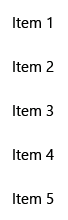

# List view and grid view

Most applications manipulate and display sets of data, such as a gallery of images or a set of email messages. The XAML UI framework provides ListView and GridView controls that make it easy to display and manipulate data in your app.

> [!NOTE]  
> ListView and GridView both derive from the [ListViewBase](/windows/winui/api/microsoft.ui.xaml.controls.listviewbase) class, so they have the same functionality but display data differently. In this article, discussions about *list view* apply to both the ListView and GridView controls, unless otherwise specified. We may refer to classes like ListView or ListViewItem, but the *List* prefix can be replaced with *Grid* for the corresponding grid equivalent (GridView or GridViewItem).

ListView and GridView controls provide many benefits as you work with collections. Both are easy to implement and provide basic UI, interaction, and scrolling while being easily customizable. And both can be bound to existing dynamic data sources or to hard-coded data that's provided in the XAML itself or the code-behind.

Both controls are flexible to use in a variety of scenarios but, overall, they work best with collections in which all items have the same basic structure and appearance, as well as the same interaction behavior. That is, they all should perform the same action when they're clicked (for example, to open a link or browse).

## Compare ListView and GridView

### ListView

The ListView control displays data stacked vertically in a single column. ListView works better for items that have text as a focal point, and for collections that are meant to be read top to bottom (for example, alphabetically ordered). A few common use cases for ListView include lists of messages and search results. If you need to display collections in multiple columns or in a table-like format, you should _not_ use ListView. Instead, consider using a [DataGrid](/windows/communitytoolkit/controls/datagrid) control.


### GridView

The GridView control presents a collection of items in rows and columns that can be scrolled vertically. Data is stacked horizontally until it fills a column, and then continues with the next row in the column. GridView works better for collections that have images as their focal point or whose items can be read from side-to-side or are not sorted in a specific order. A common use case for GridView is a photo or product gallery.


## Which collection control should you use? A Comparison with ItemsRepeater

It's important to understand the differences between these types of controls before you decide which one to use.

### ListView and GridView

The feature-rich ListView and GridView controls work *out of box*. They require no customization, but they can be customized easily. Each has its own built-in UI and UX and is designed to display nearly any type of collection as is. 

### ItemsRepeater

The [ItemsRepeater](./items-repeater.md) control also is used to display collections, but it's designed as a building block for creating a custom control to suit your particular UI requirements. It doesn't have the same built-in features and functionality as ListView and GridView, so you'll need to implement any necessary features or interactions. Use ItemsRepeater if you have a highly customized UI that you can't create by using either ListView or GridView, or if your data source requires different behavior for each item.

Learn more about ItemsRepeater by reading its [Guidelines](./items-repeater.md) and [API documentation](/uwp/api/microsoft.ui.xaml.controls.itemsrepeater).

## UWP and WinUI 2

[!INCLUDE [uwp-winui2-note](../../../includes/uwp-winui-2-note.md)]

APIs for these controls exist in the [Windows.UI.Xaml.Controls](/uwp/api/Windows.UI.Xaml.Controls) namespace.

> [!div class="checklist"]
>
> - **UWP APIs:** [ListView class](/uwp/api/windows.ui.xaml.controls.listview), [GridView class](/uwp/api/windows.ui.xaml.controls.gridview), [ItemsSource property](/uwp/api/windows.ui.xaml.controls.itemscontrol.itemssource), [Items property](/uwp/api/windows.ui.xaml.controls.itemscontrol.items)
> - Open the WinUI 2 Gallery app and see the [ListView](winui2gallery:/item/ListView) or the [GridView](winui2gallery:/item/GridView) in action. [!INCLUDE [winui-2-gallery](../../../includes/winui-2-gallery.md)]

We recommend using the latest [WinUI 2](/windows/apps/winui/winui2/) to get the most current styles and templates for all controls.

## Create a list view or a grid view

> [!div class="checklist"]
>
> - **Important APIs**: [ListView class](/windows/winui/api/microsoft.ui.xaml.controls.listview), [GridView class](/windows/winui/api/microsoft.ui.xaml.controls.gridview), [ItemsSource property](/windows/winui/api/microsoft.ui.xaml.controls.itemscontrol.itemssource), [Items property](/windows/winui/api/microsoft.ui.xaml.controls.itemscontrol.items)

> [!div class="nextstepaction"]
> Open the WinUI 3 Gallery app and see the [ListView](winui3gallery:/item/ListView) or the [GridView](winui3gallery:/item/GridView) in action.

[!INCLUDE [winui-3-gallery](../../../includes/winui-3-gallery.md)]

ListView and GridView are both [ItemsControl](/windows/winui/api/microsoft.ui.xaml.controls.itemscontrol) types, so they can contain a collection of items of any type. A ListView or GridView control must have items in its [Items](/windows/winui/api/microsoft.ui.xaml.controls.itemscontrol.items) collection before it can display anything on the screen. To populate the view, you can [add items directly to the collection](/windows/winui/api/microsoft.ui.xaml.controls.itemscontrol.items) or set the [ItemsSource](/windows/winui/api/microsoft.ui.xaml.controls.itemscontrol.itemssource) property to a data source.

> [!CAUTION]
> You can use either the Items or ItemsSource property to populate the list, but you can't use both at the same time. If you set the ItemsSource property and you add an item in XAML, the added item is ignored. If you set the ItemsSource property and you add an item to the Items collection in code, an exception is thrown.

Many of the examples in this article populate the Items collection directly for the sake of simplicity. However, it's more common for the items in a list to come from a dynamic source, such as a list of books from an online database. You use the ItemsSource property for this purpose.

### Add items to a ListView or GridView control

You can add items to the ListView or GridView [Items](/windows/winui/api/microsoft.ui.xaml.controls.itemscontrol.items) collection by using either XAML or code to yield the same result. You would ordinarily add items through XAML if you have a small number of items that don't change and are easily defined, or if you generate the items in code at runtime.

**Method 1: Add items to the Items collection**

* Option 1: Add items through XAML

    ```xaml
    <!-- No corresponding C# code is needed for this example. -->

    <ListView x:Name="Fruits">
    <x:String>Apricot</x:String>
    <x:String>Banana</x:String>
    <x:String>Cherry</x:String>
    <x:String>Orange</x:String>
    <x:String>Strawberry</x:String>
    </ListView>
    ```

* Option 2: Add items through code

    ```xaml
    <StackPanel Name="FruitsPanel"></StackPanel>
    ```

    ```csharp
    // Create a new ListView and add content.
    ListView Fruits = new ListView();
    Fruits.Items.Add("Apricot");
    Fruits.Items.Add("Banana");
    Fruits.Items.Add("Cherry");
    Fruits.Items.Add("Orange");
    Fruits.Items.Add("Strawberry");

    // Add the ListView to a parent container in the visual tree (which you created in the corresponding XAML file).
    FruitsPanel.Children.Add(Fruits);
    ```

Both of these options produce the same list view, as shown here:


**Method 2: Add items by setting the ItemsSource property**

You would ordinarily use a ListView or GridView to display data from a source such as a database or the internet. To populate a ListView or GridView control from a data source, you set its [ItemsSource](/windows/winui/api/microsoft.ui.xaml.controls.itemscontrol.itemssource) property to a collection of data items. This method works better if ListView or GridView is going to hold custom class objects, as shown in the following examples.

* Option 1: Set ItemsSource in code

    Here, the ListView ItemsSource property is set in code directly to an instance of a collection.

    ```xaml
    <StackPanel x:Name="ContactPanel"></StackPanel>
    ```

    ```csharp
    // Class definition should be provided within the namespace being used, outside of any other classes.

    this.InitializeComponent();

    // Instead of adding hard coded items to an ObservableCollection as shown here,
    //the data could be pulled asynchronously from a database or the internet.
    ObservableCollection<Contact> Contacts = new ObservableCollection<Contact>();

    // You create Contact objects by providing a first name, last name, and company for the Contact constructor.
    // They are then added to the ObservableCollection Contacts.
    Contacts.Add(new Contact("John", "Doe", "Contoso, LTD."));
    Contacts.Add(new Contact("Jane", "Doe", "Fabrikam, Inc."));
    Contacts.Add(new Contact("Santa", "Claus", "Alpine Ski House"));

    // Create a new ListView (or GridView) for the UI, and add content by setting ItemsSource
    ListView ContactsLV = new ListView();
    ContactsLV.ItemsSource = Contacts;

    // Add the ListView to a parent container in the visual tree (which you created in the corresponding XAML file)
    ContactPanel.Children.Add(ContactsLV);
    ```

* Option 2: Set ItemsSource in XAML

    You can also bind the ItemsSource property to a collection in the XAML. Here, ItemsSource is bound to a public property named Contacts, which exposes the page's private data collection, named *_contacts*.

    ```xaml
    <ListView x:Name="ContactsLV" ItemsSource="{x:Bind Contacts}"/>
    ```

    ```csharp
    // Provide a class definition within the namespace being used, outside of any other classes.
    // These two declarations belong outside the main page class.
    private ObservableCollection<Contact> _contacts = new ObservableCollection<Contact>();

    public ObservableCollection<Contact> Contacts
    {
        get { return this._contacts; }
    }

    // Define this method within your main page class.
    protected override void OnNavigatedTo(NavigationEventArgs e)
    {
        base.OnNavigatedTo(e);

        // Instead of hard coded items, the data could be pulled
        // asynchronously from a database or the internet.
        Contacts.Add(new Contact("John", "Doe", "Contoso, LTD."));
        Contacts.Add(new Contact("Jane", "Doe", "Fabrikam, Inc."));
        Contacts.Add(new Contact("Santa", "Claus", "Alpine Ski House"));
    }
    ```

Both of these options will produce the same list view, as shown in the following screenshot. (The list view shows the string representation of each item, because a data template isn't defined for this exercise.)


> [!IMPORTANT]
> Without a defined data template, custom class objects will appear in the list view with their string value only if they have a defined [ToString()](/windows/winui/api/microsoft.foundation.istringable.tostring) method.

The next section goes into greater detail about how to visually represent simple and custom class items properly in a ListView or GridView template.

For more info about data binding, see [Data binding overview](/windows/uwp/data-binding/data-binding-quickstart).

> [!NOTE]
> If you need to show grouped data in your list view, you must bind to a [CollectionViewSource](/windows/winui/api/microsoft.UI.Xaml.Data.CollectionViewSource) class. CollectionViewSource acts as a proxy for the collection class in XAML and enables grouping support. For more info, see [CollectionViewSource](/windows/winui/api/microsoft.UI.Xaml.Data.CollectionViewSource).

## Customize the look with a data template

By using a data template in a ListView or GridView control, you can define how the items and data are to be visualized. By default, a data item is displayed in the list view as the string representation of the data object it's bound to. You can show the string representation of a particular property of the data item by setting [DisplayMemberPath](/windows/winui/api/microsoft.ui.xaml.controls.itemscontrol.displaymemberpath) to that property.

However, you might ordinarily want to show a richer presentation of your data. To specify how items in the list view or grid view are to be displayed, you create a [DataTemplate](/windows/winui/api/microsoft.UI.Xaml.DataTemplate) class. The XAML in DataTemplate defines the layout and appearance of the controls that are used to display an individual item. The controls in the layout can be bound to the properties of a data object, or they can have static content that's defined inline.

> [!IMPORTANT]
> When you use the [x:Bind markup extension](/windows/uwp/xaml-platform/x-bind-markup-extension) in DataTemplate, you have to specify the data type (`x:DataType`) on the data template.

#### A simple ListView data template

In this example, the data item is a simple string. To add an image to the left of the string, and to display the string in teal, you define DataTemplate inline within the ListView definition. This is the same ListView control that you created earlier by using option 1 under method 1.

```xaml
<!--No corresponding code is needed for this example.-->
<ListView x:Name="FruitsList">
                <ListView.ItemTemplate>
                    <DataTemplate x:DataType="x:String">
                        <Grid>
                            <Grid.ColumnDefinitions>
                                <ColumnDefinition Width="47"/>
                                <ColumnDefinition/>
                            </Grid.ColumnDefinitions>
                            <Image Source="Assets/placeholder.png" Width="32" Height="32"
                                HorizontalAlignment="Left" VerticalAlignment="Center"/>
                            <TextBlock Text="{x:Bind}" Foreground="Teal" FontSize="14"
                                Grid.Column="1" VerticalAlignment="Center"/>
                        </Grid>
                    </DataTemplate>
                </ListView.ItemTemplate>
                <x:String>Apricot</x:String>
                <x:String>Banana</x:String>
                <x:String>Cherry</x:String>
                <x:String>Orange</x:String>
                <x:String>Strawberry</x:String>
            </ListView>

```

Here's how the data items are displayed when you apply a simple ListView data template:


#### A ListView data template for custom class objects

In the following example, the data item is a Contact object. To add the contact image to the left of the Contact name and company, you define DataTemplate inline within the ListView definition. This ListView data template was created in option 2 under method 2, as shown earlier.

```xaml
<ListView x:Name="ContactsLV" ItemsSource="{x:Bind Contacts}">
    <ListView.ItemTemplate>
        <DataTemplate x:DataType="local:Contact">
            <Grid>
                <Grid.RowDefinitions>
                    <RowDefinition Height="*"/>
                    <RowDefinition Height="*"/>
                </Grid.RowDefinitions>
                <Grid.ColumnDefinitions>
                    <ColumnDefinition Width="Auto"/>
                    <ColumnDefinition Width="*"/>
                </Grid.ColumnDefinitions>
                <Image Grid.Column="0" Grid.RowSpan="2" Source="Assets/grey-placeholder.png" Width="32"
                    Height="32" HorizontalAlignment="Center" VerticalAlignment="Center"></Image>
                <TextBlock Grid.Column="1" Text="{x:Bind Name}" Margin="12,6,0,0"
                    Style="{ThemeResource BaseTextBlockStyle}"/>
                <TextBlock  Grid.Column="1" Grid.Row="1" Text="{x:Bind Company}" Margin="12,0,0,6"
                    Style="{ThemeResource BodyTextBlockStyle}"/>
            </Grid>
        </DataTemplate>
    </ListView.ItemTemplate>
</ListView>
```

Here's how the data items are displayed when you apply a ListView data template for custom class objects:


Data templates are the primary way you define the look of your ListView. They can also significantly affect performance if your list holds a large number of items.

You can define your data template inline within the ListView or GridView definition, as shown in the preceding code, or separately in a Resources section. If you define it outside the ListView or GridView definition, you must give the data template an [x:Key](/windows/uwp/xaml-platform/x-key-attribute.md) attribute and assign it to the [ItemTemplate](/windows/winui/api/microsoft.ui.xaml.controls.itemscontrol.itemtemplate) property of the ListView or GridView by using that key.

For more info and examples of how to use data templates and item containers to define the look of items in your list or grid, see [Item containers and templates](item-containers-templates.md).

## Change the layout of items

When you add items to a ListView or GridView control, it automatically wraps each item in an item container and then lays out all of the item containers. How these item containers are laid out depends on the [ItemsPanel](/windows/winui/api/microsoft.ui.xaml.controls.itemscontrol.itemspanel) property of the control.

- **ListView**, by default, uses [ItemsStackPanel](/windows/winui/api/microsoft.ui.xaml.controls.itemsstackpanel), which produces a vertical list:

  

- **GridView** uses [ItemsWrapGrid](/windows/winui/api/microsoft.ui.xaml.controls.itemswrapgrid), which adds items horizontally, and wraps and scrolls vertically:

   

You can modify the layout of items by adjusting the properties on the items panel, or you can replace the default panel with another panel.

> [!NOTE]
> If you change ItemsPanel, do *not* disable virtualization. Both ItemsStackPanel and ItemsWrapGrid support virtualization, so these classes are safe to use. If you use any other panel, you might disable virtualization and slow the performance of the list view. For more info, see the list view articles under [Performance](/windows/uwp/debug-test-perf/performance-and-xaml-ui).

This example shows how to make a ListView control lay out its item containers in a horizontal list by changing the [Orientation](/windows/winui/api/microsoft.ui.xaml.controls.itemsstackpanel.orientation) property of ItemsStackPanel.

Because the list view scrolls vertically, by default, you also need to adjust some properties on the list view's internal [ScrollViewer](/windows/winui/api/microsoft.ui.xaml.controls.scrollviewer) to make it scroll horizontally.

- Change [ScrollViewer.HorizontalScrollMode](/windows/winui/api/microsoft.ui.xaml.controls.scrollviewer.horizontalscrollmode) to **Enabled** or **Auto**.
- Change [ScrollViewer.HorizontalScrollBarVisibility](/windows/winui/api/microsoft.ui.xaml.controls.scrollviewer.horizontalscrollbarvisibility) to **Auto**.
- Change [ScrollViewer.VerticalScrollMode](/windows/winui/api/microsoft.ui.xaml.controls.scrollviewer.verticalscrollmode) to **Disabled**.
- Change [ScrollViewer.VerticalScrollBarVisibility](/windows/winui/api/microsoft.ui.xaml.controls.scrollviewer.verticalscrollbarvisibility) to **Hidden**.

> [!IMPORTANT]
> The following examples are shown with the list view width unconstrained, so the horizontal scrollbars aren't displayed. If you run this code, you can set `Width="180"` for ListView to display the scrollbars.

```xaml
<ListView Height="60"
          ScrollViewer.HorizontalScrollMode="Enabled"
          ScrollViewer.HorizontalScrollBarVisibility="Auto"
          ScrollViewer.VerticalScrollMode="Disabled"
          ScrollViewer.VerticalScrollBarVisibility="Hidden">
    <ListView.ItemsPanel>
        <ItemsPanelTemplate>
            <ItemsStackPanel Orientation="Horizontal"/>
        </ItemsPanelTemplate>
    </ListView.ItemsPanel>
    <x:String>Apricot</x:String>
    <x:String>Banana</x:String>
    <x:String>Cherry</x:String>
    <x:String>Orange</x:String>
    <x:String>Strawberry</x:String>
</ListView>
```

Here's how the list is displayed:


In the next example, ListView lays out items in a vertical wrapping list by using ItemsWrapGrid instead of ItemsStackPanel.

> [!IMPORTANT]
> You must constrain the height of the list view to force the control to wrap the containers.

```xaml
<ListView Height="100"
          ScrollViewer.HorizontalScrollMode="Enabled"
          ScrollViewer.HorizontalScrollBarVisibility="Auto"
          ScrollViewer.VerticalScrollMode="Disabled"
          ScrollViewer.VerticalScrollBarVisibility="Hidden">
    <ListView.ItemsPanel>
        <ItemsPanelTemplate>
            <ItemsWrapGrid/>
        </ItemsPanelTemplate>
    </ListView.ItemsPanel>
    <x:String>Apricot</x:String>
    <x:String>Banana</x:String>
    <x:String>Cherry</x:String>
    <x:String>Orange</x:String>
    <x:String>Strawberry</x:String>
</ListView>
```

Here's how the list is displayed:


If you show grouped data in your list view, ItemsPanel determines how the item groups are laid out, not how the individual items are laid out. For example, if you use the previously shown horizontal ItemsStackPanel to show grouped data, the groups are arranged horizontally, but the items in each group are still stacked vertically, as shown here:

.

## Item selection and interaction

You can choose from a variety of ways to let users interact with a list view. By default, users can select a single item. You can change the [SelectionMode](/windows/winui/api/microsoft.ui.xaml.controls.listviewbase.selectionmode) property to enable multi-selection or to disable selection. You can set the [IsItemClickEnabled](/windows/winui/api/microsoft.ui.xaml.controls.listviewbase.isitemclickenabled) property so that users click an item (for example, a button) to invoke an action instead of selecting the item.

> [!NOTE]
> Both ListView and GridView use the [ListViewSelectionMode](/windows/winui/api/microsoft.ui.xaml.controls.listviewselectionmode) enumeration for their SelectionMode properties. IsItemClickEnabled is set to **False** by default, so you need only to set it to enable click mode.

This table shows the ways a user can interact with a list view, and how you can respond to the interaction.

| To enable this interaction: | Use these settings: | Handle this event: | Use this property to get the selected item: |
| --- |--- |--- |--- |
| No interaction | [SelectionMode](/windows/winui/api/microsoft.ui.xaml.controls.listviewbase.selectionmode)="None"<br>[IsItemClickEnabled](/windows/winui/api/microsoft.ui.xaml.controls.listviewbase.isitemclickenabled)="False" | N/A | N/A |
| Single selection | SelectionMode="Single"<br>IsItemClickEnabled="False" | [SelectionChanged](/windows/winui/api/microsoft.ui.xaml.controls.primitives.selector.selectionchanged) | [SelectedItem](/windows/winui/api/microsoft.ui.xaml.controls.primitives.selector.selecteditem)<br>[SelectedIndex](/windows/winui/api/microsoft.ui.xaml.controls.primitives.selector.selectedindex) |
| Multiple selection | SelectionMode="Multiple"<br>IsItemClickEnabled="False" | [SelectionChanged](/windows/winui/api/microsoft.ui.xaml.controls.primitives.selector.selectionchanged) | [SelectedItems](/windows/winui/api/microsoft.ui.xaml.controls.listviewbase.selecteditems) |
| Extended selection | SelectionMode="Extended"<br>IsItemClickEnabled="False" | [SelectionChanged](/windows/winui/api/microsoft.ui.xaml.controls.primitives.selector.selectionchanged) | [SelectedItems](/windows/winui/api/microsoft.ui.xaml.controls.listviewbase.selecteditems) |
| Click | SelectionMode="None"<br>IsItemClickEnabled="True" | [ItemClick](/windows/winui/api/microsoft.ui.xaml.controls.listviewbase.itemclick) | N/A |

> [!NOTE]
> You can enable IsItemClickEnabled to raise an ItemClick event while SelectionMode is also set to **Single**, **Multiple**, or **Extended**. If you do this, the ItemClick event is raised first, and then the SelectionChanged event is raised. In some cases (for example, if you go to another page in the ItemClick event handler), the SelectionChanged event isn't raised and the item isn't selected.

You can set these properties in XAML or in code, as shown here:

```xaml
<ListView x:Name="myListView" SelectionMode="Multiple"/>

<GridView x:Name="myGridView" SelectionMode="None" IsItemClickEnabled="True"/>
```

```csharp
myListView.SelectionMode = ListViewSelectionMode.Multiple;

myGridView.SelectionMode = ListViewSelectionMode.None;
myGridView.IsItemClickEnabled = true;
```

### Read-only

You can set the SelectionMode property to **ListViewSelectionMode.None** to disable item selection. This puts the control in read-only mode, so that it's used for displaying data, but not for interacting with it. That is, the item selection is disabled, but the control itself is not.

### Single selection

This table describes keyboard, mouse, and touch interactions when SelectionMode is set to **Single**.

| Modifier key | Interaction |
| -------------|------------ |
| None | <li>Users can select a single item by using the space bar, mouse clicks, or taps. |
| Ctrl | <li>Users can deselect a single item by using the space bar, mouse clicks, or taps.<li>By using the arrow keys, users can move the focus independent of the selection. |


When SelectionMode is set to **Single**, you can get the selected data item from the [SelectedItem](/windows/winui/api/microsoft.ui.xaml.controls.primitives.selector.selecteditem) property. You can get the index in the collection of the selected item by using the [SelectedIndex](/windows/winui/api/microsoft.ui.xaml.controls.primitives.selector.selectedindex) property. If no item is selected, SelectedItem is **null**, and SelectedIndex is -1.

If you try to set an item that's not in the Items collection as SelectedItem, the operation is ignored and SelectedItem is **null**. However, if you try to set SelectedIndex to an index that's out of the range of the items in the list, a System.ArgumentException exception occurs.

### Multiple selection

This table describes the keyboard, mouse, and touch interactions when SelectionMode is set to **Multiple**.

| Modifier key | Interaction |
| -------------|------------ |
| None | <li>Users can select multiple items by using the space bar, mouse clicks, or taps to select the focused item.<li>By using the arrow keys, users can move the focus independent of their selection. |
| Shift | <li>Users can select multiple contiguous items by clicking or tapping the first item in the selection and then clicking or tapping the last item in the selection.<li>By using the arrow keys, users can select contiguous items starting with the item that's selected when they select the Shift key. |


### Extended selection

This table describes the keyboard, mouse, and touch interactions when SelectionMode is set to **Extended**.

| Modifier key | Interaction |
-------------|------------ |
| None | <li>The behavior is the same as **Single** selection.
Ctrl | <li>Users can select multiple items by using the space bar, mouse clicks, or taps to select the focused item.<li>By using the arrow keys, users can move the focus independent of the selection. |
| Shift | <li>Users can select multiple contiguous items by clicking or tapping the first item in the selection and then clicking or tapping the last item in the selection.<li>By using the arrow keys, users can select contiguous items starting with the item that's selected when they select the Shift key. |

When SelectionMode is set to **Multiple** or **Extended**, you can get the selected data items from the [SelectedItems](/windows/winui/api/microsoft.ui.xaml.controls.listviewbase.selecteditems) property.

The SelectedIndex, SelectedItem, and SelectedItems properties are synchronized. For example, if you set SelectedIndex to -1, SelectedItem is set to **null** and SelectedItems is empty. And if you set SelectedItem to **null**, SelectedIndex is set to -1 and SelectedItems is empty.

In multi-select mode, SelectedItem contains the item that was selected first, and Selectedindex contains the index of the item that was selected first.

### Respond to selection changes

To respond to selection changes in a list view, handle the [SelectionChanged](/windows/winui/api/microsoft.ui.xaml.controls.primitives.selector.selectionchanged) event. In the event handler code, you can get the list of selected items from the [SelectionChangedEventArgs.AddedItems](/windows/winui/api/microsoft.ui.xaml.controls.selectionchangedeventargs.addeditems) property. You can get any items that were deselected from the [SelectionChangedEventArgs.RemovedItems](/windows/winui/api/microsoft.ui.xaml.controls.selectionchangedeventargs.removeditems) property. The AddedItems and RemovedItems collections contain at most one item, unless users select a range of items by holding down the Shift key.

The following example shows how to handle the SelectionChanged event and access the various Item collections:

```xaml
<StackPanel HorizontalAlignment="Right">
    <ListView x:Name="listView1" SelectionMode="Multiple"
              SelectionChanged="ListView1_SelectionChanged">
        <x:String>Apricot</x:String>
        <x:String>Banana</x:String>
        <x:String>Cherry</x:String>
        <x:String>Orange</x:String>
        <x:String>Strawberry</x:String>
    </ListView>
    <TextBlock x:Name="selectedItem"/>
    <TextBlock x:Name="selectedIndex"/>
    <TextBlock x:Name="selectedItemCount"/>
    <TextBlock x:Name="addedItems"/>
    <TextBlock x:Name="removedItems"/>
</StackPanel>
```

```csharp
private void ListView1_SelectionChanged(object sender, SelectionChangedEventArgs e)
{
    if (listView1.SelectedItem != null)
    {
        selectedItem.Text =
            "Selected item: " + listView1.SelectedItem.ToString();
    }
    else
    {
        selectedItem.Text =
            "Selected item: null";
    }
    selectedIndex.Text =
        "Selected index: " + listView1.SelectedIndex.ToString();
    selectedItemCount.Text =
        "Items selected: " + listView1.SelectedItems.Count.ToString();
    addedItems.Text =
        "Added: " + e.AddedItems.Count.ToString();
    removedItems.Text =
        "Removed: " + e.RemovedItems.Count.ToString();
}
```

### Click mode

You can change a list view so that users click buttons and other items instead of selecting them. For example, this is useful if your app opens a new page when users click an item in a list or grid.

To enable this behavior:

- Set SelectionMode to **None**.
- Set IsItemClickEnabled to **True**.
- Handle the ItemClick event to do something when users click an item.

Here's a list view with clickable items. The code in the ItemClick event handler opens a new page in the app.

```xaml
<ListView SelectionMode="None"
          IsItemClickEnabled="True"
          ItemClick="ListView1_ItemClick">
    <x:String>Page 1</x:String>
    <x:String>Page 2</x:String>
    <x:String>Page 3</x:String>
    <x:String>Page 4</x:String>
    <x:String>Page 5</x:String>
</ListView>
```

```csharp
private void ListView1_ItemClick(object sender, ItemClickEventArgs e)
{
    switch (e.ClickedItem.ToString())
    {
        case "Page 1":
            this.Frame.Navigate(typeof(Page1));
            break;

        case "Page 2":
            this.Frame.Navigate(typeof(Page2));
            break;

        case "Page 3":
            this.Frame.Navigate(typeof(Page3));
            break;

        case "Page 4":
            this.Frame.Navigate(typeof(Page4));
            break;

        case "Page 5":
            this.Frame.Navigate(typeof(Page5));
            break;

        default:
            break;
    }
}
```

### Select a range of items programmatically

Sometimes, you might need to manipulate a ListView item selection programmatically. For example, you might display a **Select all** button to let users select all items in a list. In this case, it's usually not very efficient to add and remove items from the SelectedItems collection one by one. Each item change causes a SelectionChanged event, and when you work with the items directly instead of working with index values, the item is de-virtualized.

It's more efficient to use the [SelectAll](/windows/winui/api/microsoft.ui.xaml.controls.listviewbase.selectall), [SelectRange](/windows/winui/api/microsoft.ui.xaml.controls.listviewbase.selectrange), and [DeselectRange](/windows/winui/api/microsoft.ui.xaml.controls.listviewbase.deselectrange) methods to modify the selection than to use the SelectedItems property. These methods select (or deselect) items by using ranges of item indexes. Items that are virtualized remain virtualized, because only the index is used. All items in the specified range are selected (or deselected), regardless of their original selection state. The SelectionChanged event occurs only once for each call to these methods.

> [!IMPORTANT]
> You should call these methods only when the SelectionMode property is set to **Multiple** or **Extended**. If you call SelectRange when SelectionMode is **Single** or **None**, an exception is thrown.

When you select items by using index ranges, use the [SelectedRanges](/windows/winui/api/microsoft.ui.xaml.controls.listviewbase.selectedranges) property to get all selected ranges in the list.

If the ItemsSource property implements [IItemsRangeInfo](/windows/winui/api/microsoft.ui.xaml.data.iitemsrangeinfo), and you use these methods to modify the selection, the AddedItems and RemovedItems properties aren't set in SelectionChangedEventArgs. Setting these properties requires de-virtualizing the item object. Use the SelectedRanges property to get the items instead.

You can select all items in a collection by calling the SelectAll method. However, there is no corresponding method to deselect all items. You can deselect all items by calling DeselectRange and passing an [ItemIndexRange](/windows/winui/api/microsoft.ui.xaml.data.itemindexrange) with a [FirstIndex](/windows/winui/api/microsoft.ui.xaml.data.itemindexrange.firstindex) value of 0 and a [Length](/windows/winui/api/microsoft.ui.xaml.data.itemindexrange.length) value equal to the number of items in the collection. This is shown in the following example, along with an option to select all items.

```xaml
<StackPanel Width="160">
    <Button Content="Select all" Click="SelectAllButton_Click"/>
    <Button Content="Deselect all" Click="DeselectAllButton_Click"/>
    <ListView x:Name="listView1" SelectionMode="Multiple">
        <x:String>Apricot</x:String>
        <x:String>Banana</x:String>
        <x:String>Cherry</x:String>
        <x:String>Orange</x:String>
        <x:String>Strawberry</x:String>
    </ListView>
</StackPanel>
```

```csharp
private void SelectAllButton_Click(object sender, RoutedEventArgs e)
{
    if (listView1.SelectionMode == ListViewSelectionMode.Multiple ||
        listView1.SelectionMode == ListViewSelectionMode.Extended)
    {
        listView1.SelectAll();
    }
}

private void DeselectAllButton_Click(object sender, RoutedEventArgs e)
{
    if (listView1.SelectionMode == ListViewSelectionMode.Multiple ||
        listView1.SelectionMode == ListViewSelectionMode.Extended)
    {
        listView1.DeselectRange(new ItemIndexRange(0, (uint)listView1.Items.Count));
    }
}
```

For info about how to change the look of selected items, see [Item containers and templates](item-containers-templates.md).

### Drag and drop

ListView and GridView controls support dragging and dropping items within their own controls, and between themselves and other ListView and GridView controls. For more info about implementing drag and drop functionality, see [Drag and drop](../input/drag-and-drop.md).

## Get the sample code

- [XAML ListView and GridView sample](https://github.com/Microsoft/Windows-universal-samples/tree/master/Samples/XamlListView): Demonstrates the ListView and GridView controls.
- [XAML drag and drop sample](https://github.com/Microsoft/Windows-universal-samples/tree/master/Samples/XamlDragAndDrop): Demonstrates drag and drop with the ListView control.
- [WinUI Gallery sample](https://github.com/Microsoft/WinUI-Gallery) - See all the XAML controls in an interactive format.

## Related articles

- [Lists](lists.md)
- [Item containers and templates](item-containers-templates.md)
- [Drag and drop](../input/drag-and-drop.md)
