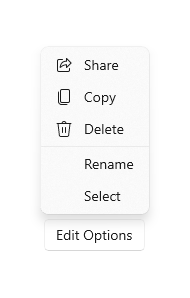
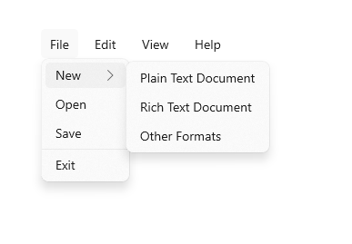

# Menu flyout and menu bar

Menu flyouts are used in menu and context menu scenarios to display a list of commands or options when requested by the user. A menu flyout shows a single, inline, top-level menu that can have menu items and sub-menus. To show a set of multiple top-level menus in a horizontal row, use menu bar (which you typically position at the top of the app window).



## Is this the right control?

See [menus and context menus](menus-and-context-menus.md) for help identifying menu vs. context menu scenarios and guidance on when to use menu flyout vs. [command bar flyout](command-bar-flyout.md).

Menu flyouts can be used as menus and context menus to organize commands. To display arbitrary content, such as a notification or confirmation request, use a [dialog or a flyout](./dialogs-and-flyouts/index.md).

If a particular command will be used frequently and you have the space available, see [collection commanding](collection-commanding.md) for examples on placing a command directly in its own element so that users don't have to go through a menu to get to it.

## UWP and WinUI 2

[!INCLUDE [uwp-winui2-note](../../../includes/uwp-winui-2-note.md)]

MenuBar requires Windows 10, version 1809 ([SDK 17763](https://developer.microsoft.com/windows/downloads/windows-10-sdk)) or later, or [WinUI 2](../../winui/winui2/index.md).

The MenuFlyout and MenuBar controls for UWP apps are included as part of WinUI 2. For more info, including installation instructions, see [WinUI 2](../../winui/winui2/index.md). APIs for these controls exist in both the [Windows.UI.Xaml.Controls](/uwp/api/Windows.UI.Xaml.Controls) and [Microsoft.UI.Xaml.Controls](/windows/winui/api/microsoft.ui.xaml.controls) namespaces.

> [!div class="checklist"]
>
> - **UWP APIs:** [MenuFlyout class](/uwp/api/windows.ui.xaml.controls.menuflyout), [MenuBar class](/uwp/api/windows.ui.xaml.controls.menubar), [ContextFlyout property](/uwp/api/windows.ui.xaml.uielement.contextflyout), [FlyoutBase.AttachedFlyout property](/uwp/api/windows.ui.xaml.controls.primitives.flyoutbase.attachedflyout)
> - **WinUI 2 Apis:** [MenuBar class](/windows/winui/api/microsoft.ui.xaml.controls.menubar), [ContextFlyout property](/uwp/api/windows.ui.xaml.uielement.contextflyout), [FlyoutBase.AttachedFlyout property](/uwp/api/windows.ui.xaml.controls.primitives.flyoutbase.attachedflyout)
> - [Open the WinUI 2 Gallery app and see MenuBar in action](winui2gallery:/item/MenuBar). [!INCLUDE [winui-2-gallery](../../../includes/winui-2-gallery.md)]

We recommend using the latest [WinUI 2](../../winui/winui2/index.md) to get the most current styles and templates for all controls. WinUI 2.2 or later includes a new template for these controls that uses rounded corners. For more info, see [Corner radius](../style/rounded-corner.md).

[!INCLUDE [muxc-alias-note](../../../includes/muxc-alias-note.md)]

```xaml
xmlns:muxc="using:Microsoft.UI.Xaml.Controls"

<muxc:MenuFlyout />
<muxc:MenuBar />
```

## Create a menu flyout

> [!div class="checklist"]
>
> - **Important APIs:** [MenuFlyout class](/windows/windows-app-sdk/api/winrt/microsoft.ui.xaml.controls.menuflyout), [ContextFlyout property](/windows/windows-app-sdk/api/winrt/microsoft.ui.xaml.uielement.contextflyout), [FlyoutBase.AttachedFlyout property](/windows/windows-app-sdk/api/winrt/microsoft.ui.xaml.controls.primitives.flyoutbase.attachedflyout)

> [!div class="nextstepaction"]
> [Open the WinUI 3 Gallery app and see MenuBar in action](winui3gallery:/item/MenuBar).

[!INCLUDE [winui-3-gallery](../../../includes/winui-3-gallery.md)]

To create a menu flyout, you use the [MenuFlyout class](/windows/windows-app-sdk/api/winrt/microsoft.ui.xaml.controls.menuflyout). You define the contents of the menu by adding [MenuFlyoutItem](/windows/windows-app-sdk/api/winrt/microsoft.ui.xaml.controls.menuflyoutitem), [MenuFlyoutSubItem](/windows/windows-app-sdk/api/winrt/microsoft.ui.xaml.controls.menuflyoutsubitem), [ToggleMenuFlyoutItem](/windows/windows-app-sdk/api/winrt/microsoft.ui.xaml.controls.togglemenuflyoutitem), [RadioMenuFlyoutItem](/windows/windows-app-sdk/api/winrt/microsoft.ui.xaml.controls.radiomenuflyoutitem) and [MenuFlyoutSeparator](/windows/windows-app-sdk/api/winrt/microsoft.ui.xaml.controls.menuflyoutseparator) objects to the MenuFlyout.

These objects are for:

- [MenuFlyoutItem](/windows/windows-app-sdk/api/winrt/microsoft.ui.xaml.controls.menuflyoutitem)—Performing an immediate action.
- [MenuFlyoutSubItem](/windows/windows-app-sdk/api/winrt/microsoft.ui.xaml.controls.menuflyoutsubitem)—Containing a cascading list of menu items.
- [ToggleMenuFlyoutItem](/windows/windows-app-sdk/api/winrt/microsoft.ui.xaml.controls.togglemenuflyoutitem)—Switching an option on or off.
- [RadioMenuFlyoutItem](/windows/windows-app-sdk/api/winrt/microsoft.ui.xaml.controls.radiomenuflyoutitem)—Switching between mutually-exclusive menu items.
- [MenuFlyoutSeparator](/windows/windows-app-sdk/api/winrt/microsoft.ui.xaml.controls.menuflyoutseparator)—Visually separating menu items.

This example creates a [MenuFlyout](/windows/windows-app-sdk/api/winrt/microsoft.ui.xaml.controls.menuflyout) and uses the [ContextFlyout](/windows/windows-app-sdk/api/winrt/microsoft.ui.xaml.uielement.contextflyout) property, a property available to most controls, to show the MenuFlyout as a context menu.

````xaml
<Rectangle
  Height="100" Width="100">
  <Rectangle.ContextFlyout>
    <MenuFlyout>
      <MenuFlyoutItem Text="Change color" Click="ChangeColorItem_Click" />
    </MenuFlyout>
  </Rectangle.ContextFlyout>
  <Rectangle.Fill>
    <SolidColorBrush x:Name="rectangleFill" Color="Red" />
  </Rectangle.Fill>
</Rectangle>
````

````csharp
private void ChangeColorItem_Click(object sender, RoutedEventArgs e)
{
    // Change the color from red to blue or blue to red.
    if (rectangleFill.Color == Windows.UI.Colors.Red)
    {
        rectangleFill.Color = Windows.UI.Colors.Blue;
    }
    else
    {
        rectangleFill.Color = Windows.UI.Colors.Red;
    }
}
````

The next example is nearly identical, but instead of using the [ContextFlyout](/windows/windows-app-sdk/api/winrt/microsoft.ui.xaml.uielement.contextflyout) property to show the [MenuFlyout class](/windows/windows-app-sdk/api/winrt/microsoft.ui.xaml.controls.menuflyout) as a context menu, the example uses the [FlyoutBase.ShowAttachedFlyout](/windows/windows-app-sdk/api/winrt/microsoft.ui.xaml.controls.primitives.flyoutbase.showattachedflyout) property to show it as a menu.

````xaml
<Rectangle
  Height="100" Width="100"
  Tapped="Rectangle_Tapped">
  <FlyoutBase.AttachedFlyout>
    <MenuFlyout>
      <MenuFlyoutItem Text="Change color" Click="ChangeColorItem_Click" />
    </MenuFlyout>
  </FlyoutBase.AttachedFlyout>
  <Rectangle.Fill>
    <SolidColorBrush x:Name="rectangleFill" Color="Red" />
  </Rectangle.Fill>
</Rectangle>
````

````csharp
private void Rectangle_Tapped(object sender, TappedRoutedEventArgs e)
{
    FlyoutBase.ShowAttachedFlyout((FrameworkElement)sender);
}

private void ChangeColorItem_Click(object sender, RoutedEventArgs e)
{
    // Change the color from red to blue or blue to red.
    if (rectangleFill.Color == Windows.UI.Colors.Red)
    {
        rectangleFill.Color = Windows.UI.Colors.Blue;
    }
    else
    {
        rectangleFill.Color = Windows.UI.Colors.Red;
    }
}
````

## Icons

Consider providing menu item icons for:

- The most commonly used items.
- Menu items whose icon is standard or well known.
- Menu items whose icon well illustrates what the command does.

Don't feel obligated to provide icons for commands that don't have a standard visualization. Cryptic icons aren't helpful, create visual clutter, and prevent users from focusing on the important menu items.


````xaml
<MenuFlyout>
  <MenuFlyoutItem Text="Share" >
    <MenuFlyoutItem.Icon>
      <FontIcon Glyph="&#xE72D;" />
    </MenuFlyoutItem.Icon>
  </MenuFlyoutItem>
  <MenuFlyoutItem Text="Copy" Icon="Copy" />
  <MenuFlyoutItem Text="Delete" Icon="Delete" />
  <MenuFlyoutSeparator />
  <MenuFlyoutItem Text="Rename" />
  <MenuFlyoutItem Text="Select" />
</MenuFlyout>
````

> [!TIP]
> The size of the icon in a MenuFlyoutItem is 16x16px. If you use SymbolIcon, FontIcon, or PathIcon, the icon automatically scales to the correct size with no loss of fidelity. If you use BitmapIcon, ensure that your asset is 16x16px.


### Light dismiss

Light dismiss controls such as menus, context menus, and other flyouts, trap keyboard and gamepad focus inside the transient UI until dismissed. To provide a visual cue for this behavior, light dismiss controls on Xbox will draw an overlay that dims the visibility of out of scope UI. This behavior can be modified with the  [LightDismissOverlayMode](/windows/windows-app-sdk/api/winrt/microsoft.ui.xaml.controls.primitives.flyoutbase.lightdismissoverlaymode) property. By default, transient UIs will draw the light dismiss overlay on Xbox (**Auto**) but not other device families. You can choose to force the overlay to be always **On** or always **Off**.

```xaml
<MenuFlyout LightDismissOverlayMode="Off" />
```

## Create a menu bar

> [!div class="checklist"]
>
> - **Important APIs:** [MenuBar class](/windows/windows-app-sdk/api/winrt/microsoft.ui.xaml.controls.menubar). [MenuBarItem class](/windows/windows-app-sdk/api/winrt/microsoft.ui.xaml.controls.menubaritem)

> [!div class="nextstepaction"]
> [Open the WinUI 3 Gallery app and see MenuBar in action](winui3gallery:/item/MenuBar).

[!INCLUDE [winui-3-gallery](../../../includes/winui-3-gallery.md)]

You use the same elements to create menus in a menu bar as in a menu flyout. However, instead of grouping MenuFlyoutItem objects in a MenuFlyout, you group them in a MenuBarItem element. Each MenuBarItem is added to the MenuBar as a top level menu.



> [!NOTE]
> This example shows only how to create the UI structure, but does not show implementation of any of the commands.

```xaml
<muxc:MenuBar>
    <muxc:MenuBarItem Title="File">
        <MenuFlyoutSubItem Text="New">
            <MenuFlyoutItem Text="Plain Text Document"/>
            <MenuFlyoutItem Text="Rich Text Document"/>
            <MenuFlyoutItem Text="Other Formats..."/>
        </MenuFlyoutSubItem>
        <MenuFlyoutItem Text="Open..."/>
        <MenuFlyoutItem Text="Save"/>
        <MenuFlyoutSeparator />
        <MenuFlyoutItem Text="Exit"/>
    </muxc:MenuBarItem>

    <muxc:MenuBarItem Title="Edit">
        <MenuFlyoutItem Text="Undo"/>
        <MenuFlyoutItem Text="Cut"/>
        <MenuFlyoutItem Text="Copy"/>
        <MenuFlyoutItem Text="Paste"/>
    </muxc:MenuBarItem>

    <muxc:MenuBarItem Title="View">
        <MenuFlyoutItem Text="Output"/>
        <MenuFlyoutSeparator/>
        <muxc:RadioMenuFlyoutItem Text="Landscape" GroupName="OrientationGroup"/>
        <muxc:RadioMenuFlyoutItem Text="Portrait" GroupName="OrientationGroup" IsChecked="True"/>
        <MenuFlyoutSeparator/>
        <muxc:RadioMenuFlyoutItem Text="Small icons" GroupName="SizeGroup"/>
        <muxc:RadioMenuFlyoutItem Text="Medium icons" IsChecked="True" GroupName="SizeGroup"/>
        <muxc:RadioMenuFlyoutItem Text="Large icons" GroupName="SizeGroup"/>
    </muxc:MenuBarItem>

    <muxc:MenuBarItem Title="Help">
        <MenuFlyoutItem Text="About"/>
    </muxc:MenuBarItem>
</muxc:MenuBar>
```

## Get the sample code

- [WinUI Gallery sample](https://github.com/Microsoft/WinUI-Gallery) - See all the XAML controls in an interactive format.
- [XAML Context Menu sample](https://github.com/Microsoft/Windows-universal-samples/tree/master/Samples/XamlContextMenu)

## Related articles

- [Command design basics for Windows apps](../basics/commanding-basics.md)
- [Menus and context menus](menus-and-context-menus.md)
- [Contextual commanding for collections and lists](collection-commanding.md)
- [MenuFlyout class](/windows/windows-app-sdk/api/winrt/microsoft.ui.xaml.controls.menuflyout)
- [MenuBar class](/windows/windows-app-sdk/api/winrt/microsoft.ui.xaml.controls.menubar)