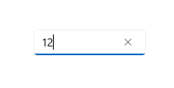
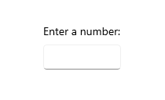
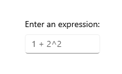
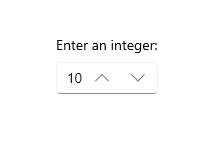
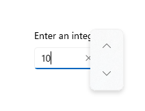
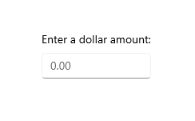

# Number box

Represents a control that can be used to display and edit numbers. This supports validation, increment stepping, and computing inline calculations of basic equations, such as multiplication, division, addition, and subtraction.



## Is this the right control?

You can use a NumberBox control to capture and display mathematic input. If you need an editable text box that accepts more than numbers, use the [TextBox](/windows/windows-app-sdk/api/winrt/microsoft.UI.Xaml.Controls.TextBox) control. If you need an editable text box that accepts passwords or other sensitive input, see [PasswordBox](/windows/windows-app-sdk/api/winrt/microsoft.ui.xaml.controls.passwordbox). If you need a text box to enter search terms, see [AutoSuggestBox](/windows/windows-app-sdk/api/winrt/microsoft.ui.xaml.controls.autosuggestbox). If you need to enter or edit formatted text, see [RichEditBox](/windows/windows-app-sdk/api/winrt/microsoft.ui.xaml.controls.richeditbox).

## Recommendations

- `Text` and `Value` make it easy to capture the value of a NumberBox as a String or as a Double without needing to convert the value between types. When programmatically altering the value of a NumberBox, it is recommended to do so through the `Value` property. `Value` will overwrite `Text` in initial set up. After the initial set up, changes to one will be propagated to the other, but consistently making programmatic changes through `Value` helps avoid any conceptual misunderstanding that NumberBox will accept non-numeric characters through `Text`.
- Use `Header` or `PlaceholderText` to inform users that NumberBox accepts only numerical characters as input. Spelled representation of numbers, such as "one", will not resolve to an accepted value.

## UWP and WinUI 2

[!INCLUDE [uwp-winui2-note](../../../includes/uwp-winui-2-note.md)]

The NumberBox for UWP apps requires WinUI 2. For more info, including installation instructions, see [WinUI 2](../../winui/winui2/index.md). APIs for this control exist in the [Microsoft.UI.Xaml.Controls](/windows/winui/api/microsoft.ui.xaml.controls) namespace.

> [!div class="checklist"]
>
> - **WinUI 2 Apis:** [NumberBox class](/windows/winui/api/microsoft.ui.xaml.controls.NumberBox)
> - [Open the WinUI 2 Gallery app and see NumberBox in action](winui2gallery:/item/NumberBox). [!INCLUDE [winui-2-gallery](../../../includes/winui-2-gallery.md)]

[!INCLUDE [muxc-alias-note](../../../includes/muxc-alias-note.md)]

```xaml
xmlns:muxc="using:Microsoft.UI.Xaml.Controls"

<muxc:NumberBox />
```

### Create a NumberBox

> [!div class="checklist"]
>
> - **Important APIs:** [NumberBox class](/windows/windows-app-sdk/api/winrt/microsoft.ui.xaml.controls.NumberBox)

> [!div class="nextstepaction"]
> [Open the WinUI 3 Gallery app and see NumberBox in action](winui3gallery:/item/NumberBox).

[!INCLUDE [winui-3-gallery](../../../includes/winui-3-gallery.md)]

Here's the XAML for a basic NumberBox that demonstrates the default look. Use [x:Bind](/windows/uwp/xaml-platform/x-bind-markup-extension#property-path) to ensure the data displayed to the user remains in sync with the data stored in your app.

```xaml
<NumberBox Value="{x:Bind Path=ViewModel.NumberBoxValue, Mode=TwoWay}" />
```


### Labeling NumberBox

Use `Header` or `PlaceholderText` if the purpose of the NumberBox isn't clear. `Header` is visible whether or not the NumberBox has a value.

```xaml
<NumberBox Header="Enter a number:"
    Value="{x:Bind Path=ViewModel.NumberBoxValue, Mode=TwoWay}" />
```



`PlaceholderText` is displayed inside the NumberBox and will only appear when `Value` is set to `NaN` or when the input is cleared by the user.

```xaml
<NumberBox PlaceholderText="1+2^2"
    Value="{x:Bind Path=ViewModel.NumberBoxValue, Mode=TwoWay}" />
```



### Enable calculation support

Setting the `AcceptsExpression` property to true enables NumberBox to evaluate basic inline expressions such as multiplication, division, addition, and subtraction using standard order of operations. Evaluation is triggered on loss of focus or when the user presses the "Enter" key. Once an expression is evaluated, the original form of the expression is not preserved.

```xaml
<NumberBox Value="{x:Bind Path=ViewModel.NumberBoxValue, Mode=TwoWay}"
    AcceptsExpression="True" />
```

### Increment and decrement stepping

Use the `SmallChange` property to configure how much the value inside a NumberBox is changed when the NumberBox is in focus and the user:

- scrolls
- presses the up arrow key
- presses the down arrow key

Use the `LargeChange` property to configure how much the value inside a NumberBox is changed when the NumberBox is in focus and the user press the PageUp or PageDown key.

Use the `SpinButtonPlacementMode` property to enable buttons that can be clicked to increment or decrement the value in the NumberBox by the amount specified by the `SmallChange` property. These buttons will be disabled if a Maximum or Minimum value would be surpassed with another step.

Set `SpinButtonPlacementMode` to `Inline` to enable the buttons to appear beside the control.

```xaml
<NumberBox Value="{x:Bind Path=ViewModel.NumberBoxValue, Mode=TwoWay}"
    SmallChange="10"
    LargeChange="100"
    SpinButtonPlacementMode="Inline" />
```



Set `SpinButtonPlacementMode` to `Compact` to enable the buttons to appear as a Flyout only when the NumberBox is in focus.

```xaml
<NumberBox Value="{x:Bind Path=ViewModel.NumberBoxValue, Mode=TwoWay}"
    SmallChange="10"
    LargeChange="100"
    SpinButtonPlacementMode="Compact" />
```




### Enabling input validation

Setting `ValidationMode` to `InvalidInputOverwritten` will enable NumberBox to overwrite invalid input that is not numerical nor legally formulaic with the last valid value when evaluation is triggered on loss of focus or a press of the "Enter" key.

```xaml
<NumberBox Header="Quantity"
    Value="{x:Bind Path=ViewModel.NumberBoxValue, Mode=TwoWay}"
    ValidationMode="InvalidInputOverwritten" />
```

Setting `ValidationMode` to `Disabled` allows custom input validation to be configured.

With regard to decimal points and commas, the formatting used by a user will be replaced by the formatting configured for the NumberBox. An input validation error will not be triggered.

### Formatting input

[Number formatting](/uwp/api/windows.globalization.numberformatting) can be used to format the value of a NumberBox by configuring an instance of a formatting class and assigning it to the `NumberFormatter` property. Decimal, currency, percent, and significant figures are few of the number formatting classes available. Note that rounding is also defined by number formatting properties.

Here is an example of using DecimalFormatter to format a NumberBox's value to have one integer digit, two fraction digits, and round up to the nearest 0.25:

```xaml
<NumberBox  x:Name="FormattedNumberBox"
    Value="{x:Bind Path=ViewModel.NumberBoxValue, Mode=TwoWay}" />
```

```csharp
private void SetNumberBoxNumberFormatter()
{
    IncrementNumberRounder rounder = new IncrementNumberRounder();
    rounder.Increment = 0.25;
    rounder.RoundingAlgorithm = RoundingAlgorithm.RoundUp;

    DecimalFormatter formatter = new DecimalFormatter();
    formatter.IntegerDigits = 1;
    formatter.FractionDigits = 2;
    formatter.NumberRounder = rounder;
    FormattedNumberBox.NumberFormatter = formatter;
}
```



With regard to decimal points and commas, the formatting used by a user will be replaced by the formatting configured for the NumberBox. An input validation error will not be triggered.

## Remarks

### Input Scope

`Number` will be used for the [input scope](/windows/windows-app-sdk/api/winrt/microsoft.UI.Xaml.Input.InputScopeNameValue). This input scope is intended for working with digits 0-9. This may be overwritten but alternative InputScope types will not be explicitly supported.

### Not a Number

When a NumberBox is cleared of input, `Value` will be set to `NaN` to indicate no numerical value is present.

### Expression evaluation

NumberBox uses infix notation to evaluate expressions. In order of precedence, the allowable operators are:

- ^
- */
- +-

Note that parentheses can be used to override precedence rules.