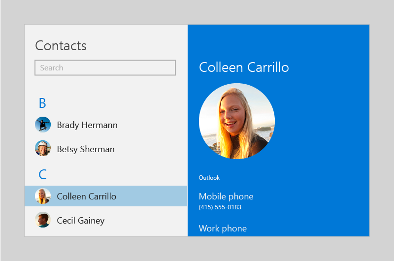

# Person picture control

The person picture control displays the avatar image for a person, if one is available; if not, it displays the person's initials or a generic glyph. You can use the control to display a [Contact object](/uwp/api/Windows.ApplicationModel.Contacts.Contact),  an object that manages a person's contact info, or you can manually provide contact information, such as a display name and profile picture.

 Here are two person picture controls accompanied by two [text block](text-block.md) elements that display the users' names.


## Is this the right control?

Use the person picture when you want to represent a person and their contact information. Here are some examples of when you might use the control:

* To display the current user
* To display contacts in an address book
* To display the sender of a message
* To display a social media contact

The illustration shows the person picture control in a list of contacts:


## UWP and WinUI 2

[!INCLUDE [uwp-winui2-note](../../../includes/uwp-winui-2-note.md)]

The PersonPicture control for UWP apps is included as part of WinUI 2. For more info, including installation instructions, see [WinUI 2](../../winui/winui2/index.md). APIs for this control exist in both the [Windows.UI.Xaml.Controls](/uwp/api/Windows.UI.Xaml.Controls) and [Microsoft.UI.Xaml.Controls](/windows/winui/api/microsoft.ui.xaml.controls) namespaces.

> [!div class="checklist"]
>
> - **UWP APIs:** [PersonPicture class](/uwp/api/windows.ui.xaml.controls.personpicture), [Contact class](/uwp/api/Windows.ApplicationModel.Contacts.Contact), [ContactManager class](/uwp/api/Windows.ApplicationModel.Contacts.ContactManager)
> - **WinUI 2 Apis:** [PersonPicture class](/windows/winui/api/microsoft.ui.xaml.controls.personpicture)
> - [Open the WinUI 2 Gallery app and see PersonPicture in action](winui2gallery:/item/PersonPicture). [!INCLUDE [winui-2-gallery](../../../includes/winui-2-gallery.md)]

We recommend using the latest [WinUI 2](../../winui/winui2/index.md) to get the most current styles, templates, and features for all controls.

[!INCLUDE [muxc-alias-note](../../../includes/muxc-alias-note.md)]

```xaml
xmlns:muxc="using:Microsoft.UI.Xaml.Controls"

<muxc:PersonPicture />
```

## Create a person picture

> [!div class="checklist"]
>
> - **Important APIs:** [PersonPicture class](/windows/windows-app-sdk/api/winrt/microsoft.ui.xaml.controls.personpicture)

> [!div class="nextstepaction"]
> [Open the WinUI 3 Gallery app and see PersonPicture in action](winui3gallery:/item/PersonPicture).

[!INCLUDE [winui-3-gallery](../../../includes/winui-3-gallery.md)]

To create a person picture, you use the PersonPicture class. This example creates a PersonPicture control and manually provides the person's display name, profile picture, and initials:

```xaml
<PersonPicture
    DisplayName="Betsy Sherman"
    ProfilePicture="Assets\BetsyShermanProfile.png"
    Initials="BS" />
```

## Using the person picture control to display a Contact object

You can use the person picture control to display a [Contact](/uwp/api/Windows.ApplicationModel.Contacts.Contact) object:

```xaml
<Page
    x:Class="SampleApp.PersonPictureContactExample"
    xmlns="http://schemas.microsoft.com/winfx/2006/xaml/presentation"
    xmlns:x="http://schemas.microsoft.com/winfx/2006/xaml"
    xmlns:local="using:SampleApp"
    xmlns:d="http://schemas.microsoft.com/expression/blend/2008"
    xmlns:mc="http://schemas.openxmlformats.org/markup-compatibility/2006"
    mc:Ignorable="d">

    <StackPanel Background="{ThemeResource ApplicationPageBackgroundThemeBrush}">

        <PersonPicture
            Contact="{x:Bind CurrentContact, Mode=OneWay}" />

        <Button Click="LoadContactButton_Click">Load contact</Button>
    </StackPanel>
</Page>
```

```csharp
using System;
using System.Collections.Generic;
using System.IO;
using System.Linq;
using System.Runtime.InteropServices.WindowsRuntime;
using Windows.Foundation;
using Windows.Foundation.Collections;
using Windows.UI.Xaml;
using Windows.UI.Xaml.Controls;
using Windows.UI.Xaml.Controls.Primitives;
using Windows.UI.Xaml.Data;
using Windows.UI.Xaml.Input;
using Windows.UI.Xaml.Media;
using Windows.UI.Xaml.Navigation;
using Windows.ApplicationModel.Contacts;

namespace SampleApp
{
    public sealed partial class PersonPictureContactExample : Page, System.ComponentModel.INotifyPropertyChanged
    {
        public PersonPictureContactExample()
        {
            this.InitializeComponent();
        }

        private Windows.ApplicationModel.Contacts.Contact _currentContact;
        public Windows.ApplicationModel.Contacts.Contact CurrentContact
        {
            get => _currentContact;
            set
            {
                _currentContact = value;
                PropertyChanged?.Invoke(this,
                    new System.ComponentModel.PropertyChangedEventArgs(nameof(CurrentContact)));
            }

        }
        public event System.ComponentModel.PropertyChangedEventHandler PropertyChanged;

        public static async System.Threading.Tasks.Task<Windows.ApplicationModel.Contacts.Contact> CreateContact()
        {

            var contact = new Windows.ApplicationModel.Contacts.Contact();
            contact.FirstName = "Betsy";
            contact.LastName = "Sherman";

            // Get the app folder where the images are stored.
            var appInstalledFolder =
                Windows.ApplicationModel.Package.Current.InstalledLocation;
            var assets = await appInstalledFolder.GetFolderAsync("Assets");
            var imageFile = await assets.GetFileAsync("betsy.png");
            contact.SourceDisplayPicture = imageFile;

            return contact;
        }

        private async void LoadContactButton_Click(object sender, RoutedEventArgs e)
        {
            CurrentContact = await CreateContact();
        }
    }
}
```

> [!NOTE]
> To keep the code simple, this example creates a new Contact object. In a real app, you'd let the user select a contact or you'd use a [ContactManager](/uwp/api/Windows.ApplicationModel.Contacts.ContactManager) to query for a list of contacts. For info on retrieving and managing contacts, see the [Contacts and calendar articles](/windows/uwp/contacts-and-calendar/index).

## Determining which info to display

When you provide a [Contact](/uwp/api/Windows.ApplicationModel.Contacts.Contact) object, the person picture control evaluates it to determine which info it can display.

If an image is available, the control displays the first image it finds, in this order:

1. LargeDisplayPicture
1. SmallDisplayPicture
1. Thumbnail

You can change which image is chosen by setting the PreferSmallImage property to true; this gives the SmallDisplayPicture a higher priority than LargeDisplayPicture.

If there isn't an image, the control displays the contact's name or initials; if there's isn't any name data, the control displays contact data, such as an email address or phone number.

## Get the sample code

- [WinUI Gallery sample](https://github.com/Microsoft/WinUI-Gallery) - See all the XAML controls in an interactive format.

## Related articles

* [Contacts and calendar](/windows/uwp/contacts-and-calendar/index)
* [Contact cards sample](https://github.com/Microsoft/Windows-universal-samples/tree/master/Samples/ContactCards)