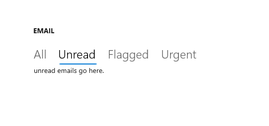

# Pivot

The Pivot control enables touch-swiping between a small set of content sections.



## Is this the right control?

> [!WARNING]
>The Pivot control is not recommended for [Windows 11 design patterns](../basics/app-silhouette.md). We strongly recommend using one of these alternatives instead:
>
> - **WinUI 3** - Use the [SelectorBar](/windows/windows-app-sdk/api/winrt/microsoft.ui.xaml.controls.selectorbar) control.
> - **WinUI 2/UWP** - Use a [NavigationView](navigationview.md) or [TabView](tab-view.md) control instead of a Pivot control. See the [Use NavigationView instead of Pivot](#use-navigationview-instead-of-pivot) section for an example.

To create a Pivot-like UI when using WinUI 3 and the Windows App SDK, use the [SelectorBar](/windows/windows-app-sdk/api/winrt/microsoft.ui.xaml.controls.selectorbar) control.

To create a tabbed UI, use a [TabView](tab-view.md) control.

To achieve common top navigation patterns, we recommend using [NavigationView](navigationview.md), which automatically adapts to different screen sizes and allows for greater customization.

Some key differences between the NavigationView and Pivot are listed here:

- Pivot supports touch-swiping to switch between items.
- Overflow items in a Pivot carousel, while NavigationView uses a menu dropdown overflow so that users can see all items.
- Pivot handles navigation between content sections, while NavigationView allows for more control over navigation behavior.

## UWP and WinUI 2

[!INCLUDE [uwp-winui2-note](../../../includes/uwp-winui-2-note.md)]

APIs for this control exist in the [Windows.UI.Xaml.Controls](/uwp/api/windows.ui.xaml.controls) namespace.

> [!div class="checklist"]
>
> - **UWP APIs:** [Pivot class](/uwp/api/windows.ui.xaml.controls.pivot)
> - [Open the WinUI 2 Gallery app and see the Pivot in action](winui2gallery:/item/Pivot). [!INCLUDE [winui-2-gallery](../../../includes/winui-2-gallery.md)]

We recommend using the latest [WinUI 2](../../winui/winui2/index.md) to get the most current styles and templates for all controls.

## Use NavigationView instead of Pivot

If your app's UI uses the Pivot control, you can convert Pivot to [NavigationView](/windows/winui/api/microsoft.ui.xaml.controls.navigationview) following this example.

This XAML creates a NavigationView with 3 sections of content, like the example Pivot in [Create a pivot control](#create-a-pivot-control).

```xaml
<NavigationView x:Name="rootNavigationView" Header="Category Title"
 ItemInvoked="NavView_ItemInvoked">
    <NavigationView.MenuItems>
        <NavigationViewItem Content="Section 1" x:Name="Section1Content" />
        <NavigationViewItem Content="Section 2" x:Name="Section2Content" />
        <NavigationViewItem Content="Section 3" x:Name="Section3Content" />
    </NavigationView.MenuItems>
    
    <Frame x:Name="ContentFrame" />
</NavigationView>

<Page x:Class="AppName.Section1Page">
    <TextBlock Text="Content of section 1."/>
</Page>

<Page x:Class="AppName.Section2Page">
    <TextBlock Text="Content of section 2."/>
</Page>

<Page x:Class="AppName.Section3Page">
    <TextBlock Text="Content of section 3."/>
</Page>
```

NavigationView provides more control over navigation customization and requires corresponding code-behind. To accompany the above XAML, use the following code-behind:

```csharp
private void NavView_ItemInvoked(NavigationView sender, NavigationViewItemInvokedEventArgs args)
{
   var navOptions = new FrameNavigationOptions
   {
      TransitionInfoOverride = args.RecommendedNavigationTransitionInfo,
      IsNavigationStackEnabled = false,
   };

   switch (args.InvokedItemContainer.Name)
   {
      case nameof(Section1Content):
         ContentFrame.NavigateToType(typeof(Section1Page), null, navOptions);
         break;

      case nameof(Section2Content):
         ContentFrame.NavigateToType(typeof(Section2Page), null, navOptions);
         break;

      case nameof(Section3Content):
         ContentFrame.NavigateToType(typeof(Section3Page), null, navOptions);
         break;
   }  
}
```

This code mimics the Pivot control's built-in navigation experience, minus the touch-swiping experience between content sections. However, as you can see, you could also customize several points, including the animated transition, navigation parameters, and stack capabilities.

## Create a pivot control

> [!WARNING]
>The Pivot control is not recommended for [Windows 11 design patterns](../basics/app-silhouette.md). We strongly recommend using one of these alternatives instead:
>
> - **WinUI 3** - Use the [SelectorBar](/windows/windows-app-sdk/api/winrt/microsoft.ui.xaml.controls.selectorbar) control.
> - **WinUI 2/UWP** - Use a [NavigationView](navigationview.md) or [TabView](tab-view.md) control instead of a Pivot control. See the [Use NavigationView instead of Pivot](#use-navigationview-instead-of-pivot) section for an example.

This XAML creates a basic Pivot control with 3 sections of content.

```xaml
<Pivot x:Name="rootPivot" Title="Category Title">
    <PivotItem Header="Section 1">
        <!--Pivot content goes here-->
        <TextBlock Text="Content of section 1."/>
    </PivotItem>
    <PivotItem Header="Section 2">
        <!--Pivot content goes here-->
        <TextBlock Text="Content of section 2."/>
    </PivotItem>
    <PivotItem Header="Section 3">
        <!--Pivot content goes here-->
        <TextBlock Text="Content of section 3."/>
    </PivotItem>
</Pivot>
```

### Pivot items

Pivot is an [ItemsControl](/windows/windows-app-sdk/api/winrt/microsoft.ui.xaml.controls.itemscontrol), so it can contain a collection of items of any type. Any item you add to the Pivot that is not explicitly a [PivotItem](/windows/windows-app-sdk/api/winrt/microsoft.ui.xaml.controls.pivotitem) is implicitly wrapped in a PivotItem. Because a Pivot is often used to navigate between pages of content, it's common to populate the [Items](/windows/windows-app-sdk/api/winrt/microsoft.ui.xaml.controls.itemscontrol.items) collection directly with XAML UI elements. Or, you can set the [ItemsSource](/windows/windows-app-sdk/api/winrt/microsoft.ui.xaml.controls.itemscontrol.itemssource) property to a data source. Items bound in the ItemsSource can be of any type, but if they aren't explicitly PivotItems, you must define an [ItemTemplate](/windows/windows-app-sdk/api/winrt/microsoft.ui.xaml.controls.itemscontrol.itemtemplate) and [HeaderTemplate](/windows/windows-app-sdk/api/winrt/microsoft.ui.xaml.controls.pivot.headertemplate) to specify how the items are displayed.

You can use the [SelectedItem](/windows/windows-app-sdk/api/winrt/microsoft.ui.xaml.controls.pivot.selecteditem) property to get or set the Pivot's active item. Use the [SelectedIndex](/windows/windows-app-sdk/api/winrt/microsoft.ui.xaml.controls.pivot.selectedindex) property to get or set the index of the active item.

### Pivot headers

You can use the [LeftHeader](/windows/windows-app-sdk/api/winrt/microsoft.ui.xaml.controls.pivot.leftheader) and [RightHeader](/windows/windows-app-sdk/api/winrt/microsoft.ui.xaml.controls.pivot.rightheader) properties to add other controls to the Pivot header.

For example, you can add a [CommandBar](./command-bar.md) in the Pivot's RightHeader.

```xaml
<Pivot>
    <Pivot.RightHeader>
        <CommandBar>
                <AppBarButton Icon="Add"/>
                <AppBarSeparator/>
                <AppBarButton Icon="Edit"/>
                <AppBarButton Icon="Delete"/>
                <AppBarSeparator/>
                <AppBarButton Icon="Save"/>
        </CommandBar>
    </Pivot.RightHeader>
</Pivot>
```

### Pivot interaction

The control features these touch gesture interactions:

- Tapping on a pivot item header navigates to that header's section content.
- Swiping left or right on a pivot item header navigates to the adjacent section.
- Swiping left or right on section content navigates to the adjacent section.

The control comes in two modes:

**Stationary**

- Pivots are stationary when all pivot headers fit within the allowed space.
- Tapping on a pivot label navigates to the corresponding page, though the pivot itself will not move. The active pivot is highlighted.

**Carousel**

- Pivots carousel when all pivot headers don't fit within the allowed space.
- Tapping a pivot label navigates to the corresponding page, and the active pivot label will carousel into the first position.
- Pivot items in a carousel loop from last to first pivot section.

> [!TIP]
>
> - Avoid using more than 5 headers when using carousel mode, as looping more than 5 can become confusing.
> - Pivot headers should not carousel in a [10ft environment](../devices/designing-for-tv.md). Set the [IsHeaderItemsCarouselEnabled](/windows/windows-app-sdk/api/winrt/microsoft.ui.xaml.controls.pivot.IsHeaderItemsCarouselEnabled) property to `false` if your app will run on Xbox.

## Related topics

- [Pivot class](/windows/windows-app-sdk/api/winrt/microsoft.ui.xaml.controls.pivot)
- [Navigation design basics](../basics/navigation-basics.md)
