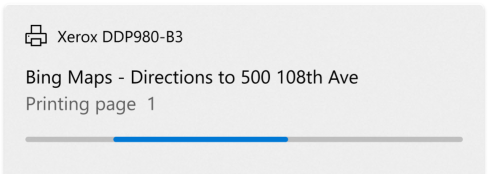

# Progress controls

A progress control provides feedback to the user that a long-running operation is underway. It can mean that the user cannot interact with the app when the progress indicator is visible, and can also indicate how long the wait time might be, depending on the indicator used.

## Types of progress

There are two controls to show the user that an operation is underway – either through a ProgressBar or through a ProgressRing. Both ProgressBar and ProgressRing have two states that communicate if the user can interact with the application or not.

- The *determinate* state for both ProgressBar and ProgressRing shows the percentage completed of a task. This should be used during an operation whose duration is known, but its progress should not block the user's interaction with the app.
- The *indeterminate* state for ProgressBar shows that an operation is underway, does not block user interaction with the app, and its completion time is unknown.
- The *indeterminate* state for ProgressRing shows that an operation is underway, blocks user interaction with the app, and its completion time is unknown.

Additionally, a progress control is read only and not interactive. Meaning that the user cannot invoke or use these controls directly.

|Control|Display|
|---|---|
| Indeterminate ProgressBar |  |
| Determinate ProgressBar | |
| Indeterminate ProgressRing | |
| Determinate ProgressRing | |

## Is this the right control?

It's not always obvious what control or what state (determinate vs indeterminate) to use when trying to show something is happening. Sometimes a task is obvious enough that it doesn't require a progress control at all – and sometimes even if a progress control is used, a line of text is still necessary in order to explain to the user what operation is underway.

### ProgressBar

- **Does the control have a defined duration or predictable end?**

    Use a determinate ProgressBar then, and update the percentage or value accordingly.

- **Can the user continue without having to monitor the operation's progress?**

    When a ProgressBar is in use, interaction is non-modal, typically meaning that the user is not blocked by that operation's completion, and can continue to use the app in other ways until that aspect has completed.

- **Keywords**

    If your operation falls around these keywords, or if you're showing text that alongside the progress operation that matches these keywords; consider using a ProgressBar:

    - *Loading...*
    - *Retrieving*
    - *Working...*

### ProgressRing

- **Will the operation cause the user to wait to continue?**

    If an operation requires all (or a large portion of) interaction with the app to wait until it has been completed, then the indeterminate ProgressRing is the better choice.

    - **Does the control have a defined duration or predictable end?**

    Use a determinate ProgressRing if you want the visual to be a ring instead of a bar, and update the percentage or value accordingly.

- **Is the app waiting for the user to complete a task?**

    If so, use an indeterminate ProgressRing, as they're meant to indicate an unknown wait time for the user.

- **Keywords**

    If your operation falls around these keywords, or if you're showing text alongside the progress operation that matches these keywords; consider using a ProgressRing:

    - *Refreshing*
    - *Signing in...*
    - *Connecting...*

### No progress indication necessary

- **Does the user need to know that something is happening?**

    For example, if the app is downloading something in the background and the user didn't initiate the download, the user doesn't necessarily need to know about it.

- **Is the operation a background activity that doesn't block user activity and is of minimal (but still some) interest to the user?**

    Use text when your app is performing tasks that don't have to be visible all the time, but you still need to show the status.

- **Does the user only care about the completion of the operation?**

    Sometimes it's best to show a notice only when the operation is completed, or give a visual that the operation has been completed immediately, and run the finishing touches in the background.

## Progress controls best practices

Sometimes it's best to see some visual representations of when and where to use these different progress controls:

### ProgressBar - Determinate


The first example is the determinate ProgressBar. When the duration of the operation is known, when installing, downloading, setting up, etc; a determinate ProgressBar is best.

### ProgressBar - Indeterminate



When it is not known how long the operation will take, use an indeterminate ProgressBar. Indeterminate ProgressBars are also good when filling a virtualized list, and creating a smooth visual transition between an indeterminate to determinate ProgressBar.

- **Is the operation in a virtualized collection?**

    If so, do not put a progress indicator on each list item as they appear. Instead, use a ProgressBar and place it at the top of the collection of items being loaded in, to show that the items are being fetched.

### ProgressRing - Indeterminate


The indeterminate ProgressRing is used when any further user interaction with the app is halted, or the app is waiting for the user's input to continue. The "signing in…" example above is a perfect scenario for the ProgressRing, the user cannot continue using the app until the sign is has completed.

### ProgressRing - Determinate


When the duration of the operation is known and the ring visual is desired, when installing, downloading, setting up, etc; a determinate ProgressRing is best.

## UWP and WinUI 2

[!INCLUDE [uwp-winui2-note](../../../includes/uwp-winui-2-note.md)]

The progress controls for UWP apps are included as part of WinUI 2. For more info, including installation instructions, see [WinUI 2](../../winui/winui2/index.md). APIs for this control exist in both the [Windows.UI.Xaml.Controls](/uwp/api/Windows.UI.Xaml.Controls) and [Microsoft.UI.Xaml.Controls](/windows/winui/api/microsoft.ui.xaml.controls) namespaces.

> [!div class="checklist"]
>
> - **UWP APIs:** [ProgressBar class](/uwp/api/Windows.UI.Xaml.Controls.ProgressBar), [IsIndeterminate property](/uwp/api/windows.ui.xaml.controls.progressbar.isindeterminate), [ProgressRing class](/uwp/api/Windows.UI.Xaml.Controls.ProgressRing), [IsActive property](/uwp/api/windows.ui.xaml.controls.progressring.isactive)
> - **WinUI 2 Apis:** [ProgressBar class](/windows/winui/api/microsoft.UI.Xaml.Controls.ProgressBar), [IsIndeterminate property](/windows/winui/api/microsoft.ui.xaml.controls.progressbar.isindeterminate), [ProgressRing class](/windows/winui/api/microsoft.UI.Xaml.Controls.ProgressRing), [IsActive property](/windows/winui/api/microsoft.ui.xaml.controls.progressring.isactive)
> - Open the WinUI 2 Gallery app and see the [ProgressBar](winui2gallery:/item/ProgressBar) or [ProgressRing](winui2gallery:/item/ProgressRing). [!INCLUDE [winui-2-gallery](../../../includes/winui-2-gallery.md)]

We recommend using the latest [WinUI 2](../../winui/winui2/index.md) to get the most current styles, templates, and features for all controls. WinUI 2.2 or later includes a new template for this control that uses rounded corners. For more info, see [Corner radius](../style/rounded-corner.md).

[!INCLUDE [muxc-alias-note](../../../includes/muxc-alias-note.md)]

```xaml
xmlns:muxc="using:Microsoft.UI.Xaml.Controls"

<muxc:ProgressBar />
<muxc:ProgressRing />
```

## Create a progress control

> [!div class="checklist"]
>
> - **Important APIs:** [ProgressBar class](/windows/windows-app-sdk/api/winrt/microsoft.UI.Xaml.Controls.ProgressBar), [IsIndeterminate property](/windows/windows-app-sdk/api/winrt/microsoft.ui.xaml.controls.progressbar.isindeterminate), [ProgressRing class](/windows/windows-app-sdk/api/winrt/microsoft.UI.Xaml.Controls.ProgressRing), [IsActive property](/windows/windows-app-sdk/api/winrt/microsoft.ui.xaml.controls.progressring.isactive)

> [!div class="nextstepaction"]
> Open the WinUI 3 Gallery app and see the [ProgressBar](winui3gallery:/item/ProgressBar) or [ProgressRing](winui3gallery:/item/ProgressRing).

[!INCLUDE [winui-3-gallery](../../../includes/winui-3-gallery.md)]

Both progress controls are rather simple; but some visual features of the controls are not obvious to customize.

### Sizing the ProgressRing

The ProgressRing can be sized as large as you want, but can only be as small as 20x20epx. In order to resize a ProgressRing, you must set its height and width. If only height or width are set, the control will assume minimum sizing (20x20epx) – conversely if the height and width are set to two different sizes, the smaller of the sizes will be assumed.
To ensure your ProgressRing is correct for your needs, set both the height and the width to the same value:

```xaml
<ProgressRing Height="100" Width="100"/>
```

To make your ProgressRing visible, and animate, you must set the IsActive property to true:

```xaml
<ProgressRing IsActive="True" Height="100" Width="100"/>
```

```csharp
progressRing.IsActive = true;
```

### Coloring the progress controls

By default, the main coloring of the progress controls is set to the accent color of the system. To override this brush simply change the foreground property on either control.

```xaml
<ProgressRing IsActive="True" Height="100" Width="100" Foreground="Blue"/>
<ProgressBar Width="100" Foreground="Green"/>
```

Changing the foreground color for the ProgressRing will change the fill color of the ring. The foreground property for the ProgressBar will change the fill color of the bar – to alter the unfilled portion of the bar, simply override the background property.

### Showing a wait cursor

Sometimes it's best to just show a brief wait cursor, when the app or operation needs time to think, and you need to indicate to the user that the app or area where the wait cursor is visible should not be interacted with until the wait cursor has disappeared.

```csharp
Window.Current.CoreWindow.PointerCursor = new Windows.UI.Core.CoreCursor(Windows.UI.Core.CoreCursorType.Wait, 10);
```

## Get the sample code

- [WinUI Gallery sample](https://github.com/Microsoft/WinUI-Gallery) - See all the XAML controls in an interactive format.

## Related articles

- [ProgressBar class](/windows/windows-app-sdk/api/winrt/microsoft.UI.Xaml.Controls.ProgressBar)
- [ProgressRing class](/windows/windows-app-sdk/api/winrt/microsoft.UI.Xaml.Controls.ProgressRing)