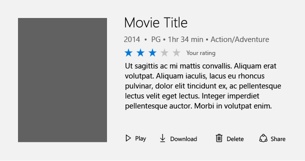
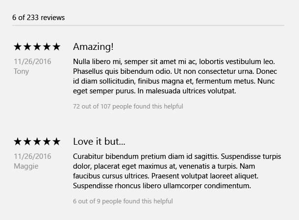

# Rating control

The rating control allows users to view and set ratings that reflect degrees of satisfaction with content and services. Users can interact with the rating control with touch, pen, mouse, gamepad, or keyboard. The follow guidance shows how to use the rating control's features to provide flexibility and customization.


## Overview

The rating control can be used to enter a rating, or made read-only to display a rating.

### Editable rating with placeholder value

Perhaps the most common way to use the rating control is to display an average rating while still allowing the user to enter their own rating value. In this scenario, the rating control is initially set to reflect the average satisfaction rating of all users of a particular service or type of content (such as a music, videos, books, etc.). It remains in this state until a user interacts with the control with the goal of individually rating an item. This interaction changes the state of the ratings control to reflect the user's personal satisfaction rating.

#### Initial average rating state


#### Representation of user rating once set



### Read-only rating mode

Sometimes you need to show ratings of secondary content, such as that displayed in recommended content or when displaying a list of comments and their corresponding ratings. In this case, the user shouldn't be able to edit the rating, so you can make the control read-only.
The read only mode is also the recommended way of using the rating control when it is used in very large virtualized lists of content, for both UI design and performance reasons.



## UWP and WinUI 2

[!INCLUDE [uwp-winui2-note](../../../includes/uwp-winui-2-note.md)]

The RatingControl for UWP apps is included as part of WinUI 2. For more info, including installation instructions, see [WinUI 2](../../winui/winui2/index.md). APIs for this control exist in both the [Windows.UI.Xaml.Controls](/uwp/api/Windows.UI.Xaml.Controls) and [Microsoft.UI.Xaml.Controls](/windows/winui/api/microsoft.ui.xaml.controls) namespaces.

> [!div class="checklist"]
>
> - **UWP APIs:** [RatingControl class](/uwp/api/windows.ui.xaml.controls.ratingcontrol)
> - **WinUI 2 Apis:** [RatingControl class](/uwp/api/windows.ui.xaml.controls.ratingcontrol)
> - [Open the WinUI 2 Gallery app and see RatingControl in action](winui2gallery:/item/RatingControl). [!INCLUDE [winui-2-gallery](../../../includes/winui-2-gallery.md)]


We recommend using the latest [WinUI 2](../../winui/winui2/index.md) to get the most current styles, templates, and features for all controls.

[!INCLUDE [muxc-alias-note](../../../includes/muxc-alias-note.md)]

```xaml
xmlns:muxc="using:Microsoft.UI.Xaml.Controls"

<muxc:RatingControl />
```

## Create a rating control

> [!div class="checklist"]
>
> - **Important APIs**: [RatingControl class](/windows/windows-app-sdk/api/winrt/microsoft.ui.xaml.controls.ratingcontrol)

> [!div class="nextstepaction"]
> [Open the WinUI 3 Gallery app and see RatingControl in action](winui3gallery:/item/RatingControl).

[!INCLUDE [winui-3-gallery](../../../includes/winui-3-gallery.md)]

### Editable rating control

This code shows how to create an editable rating control with a placeholder value.

```xaml
<RatingControl x:Name="MyRating" ValueChanged="RatingChanged"/>
```

```csharp
private void RatingChanged(RatingControl sender, object args)
{
    if (sender.Value == null)
    {
        MyRating.Caption = "(" + SomeWebService.HowManyPreviousRatings() + ")";
    }
    else
    {
        MyRating.Caption = "Your rating";
    }
}
```

### Read-only rating control

This code shows how to create a read-only rating control.

```xaml
<RatingControl IsReadOnly="True"/>
```

## Additional functionality

The rating control has many additional features which can be used. Details for using these features can be found in our reference documentation. Here is a non-comprehensive list of additional functionality:

- Great long list performance
- Compact sizing for tight UI scenarios
- Continuous value fill and rating
- Spacing customization
- Disable growth animations
- Customization of the number of stars

## Get the sample code

- [WinUI Gallery sample](https://github.com/Microsoft/WinUI-Gallery) - See all the XAML controls in an interactive format.