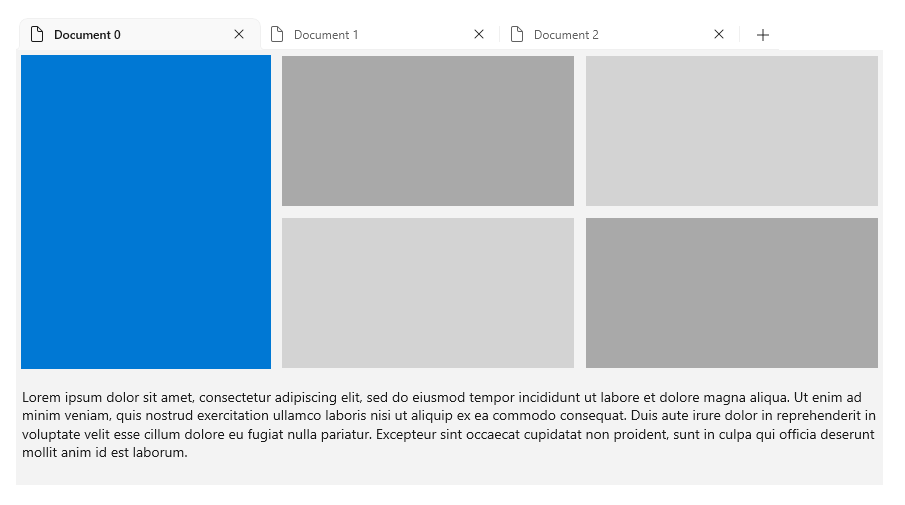
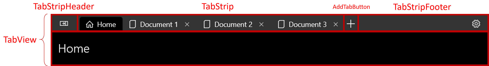
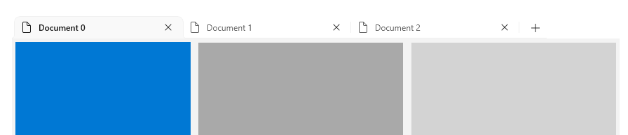
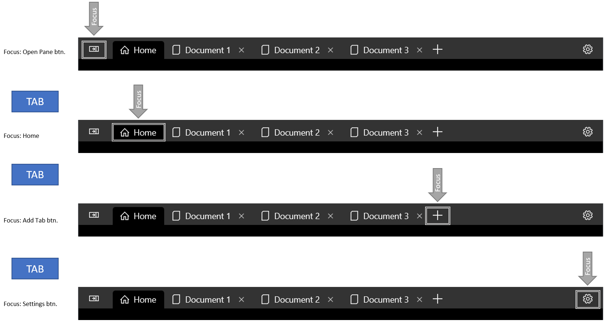

# TabView

The TabView control is a way to display a set of tabs and their respective content. TabViews are useful for displaying several pages (or documents) of content while giving a user the capability to rearrange, open, or close new tabs.



**Get WinUI**

:::row:::
   :::column:::
      
   :::column-end:::
   :::column span="3":::
      The **TabView** control requires WinUI, a NuGet package that contains new controls and UI features for Windows apps. For more info, including installation instructions, see [WinUI](/uwp/toolkits/winui/).
   :::column-end:::
   :::column:::

   :::column-end:::
:::row-end:::

> **WinUI APIs**: [TabView class](/uwp/api/microsoft.ui.xaml.controls.tabview), [TabViewItem class](/uwp/api/microsoft.ui.xaml.controls.tabviewitem)

> [!TIP]
> Throughout this document, we use the **muxc** alias in XAML to represent WinUI APIs that we have included in our project. We have added this to our [Page](/uwp/api/windows.ui.xaml.controls.page) element: `xmlns:muxc="using:Microsoft.UI.Xaml.Controls"`
>
>In the code-behind, we also use the **muxc** alias in C# to represent WinUI APIs that we have included in our project. We have added this **using** statement at the top of the file: `using muxc = Microsoft.UI.Xaml.Controls;`

## Is this the right control?

In general, tabbed UIs come in one of two distinct styles which differ in function and appearance:
**Static tabs** are the sort of tabs often found in settings windows. They contain a set number of pages in a fixed order that usually contain predefined content.
**Document tabs** are the sort of tabs found in a browser, such as Microsoft Edge. Users can create, remove, and rearrange tabs; move tabs between windows; and change the content of tabs.

[TabView](/uwp/api/microsoft.ui.xaml.controls.tabview) offers document tabs for UWP apps. Use a TabView when:

- Users will be able to dynamically open, close, or rearrange tabs.
- Users will be able to open documents or web pages directly into tabs.
- Users will be able to drag and drop tabs between windows.

If a TabView is not appropriate for your app, consider using a [NavigationView](./navigationview.md) control.

## Anatomy

The image below shows the parts of the [TabView](/uwp/api/microsoft.ui.xaml.controls.tabview) control. The TabStrip has a header and footer, but unlike a document, TabStrip's header and footer are on the far left and far right of the strip, respectively.



The next image shows the parts of the [TabViewItem](/uwp/api/microsoft.ui.xaml.controls.tabviewitem) control. Note that although the content is displayed inside of the TabView control, the content is actually a part of the TabViewItem.


### Create a tab view

This example creates a simple [TabView](/uwp/api/microsoft.ui.xaml.controls.tabview) along with event handlers to support opening and closing tabs.

```xaml
 <muxc:TabView AddTabButtonClick="TabView_AddTabButtonClick"
               TabCloseRequested="TabView_TabCloseRequested"/>
```

```csharp
// Add a new Tab to the TabView
private void TabView_AddTabButtonClick(muxc.TabView sender, object args)
{
    var newTab = new muxc.TabViewItem();
    newTab.IconSource = new muxc.SymbolIconSource() { Symbol = Symbol.Document };
    newTab.Header = "New Document";

    // The Content of a TabViewItem is often a frame which hosts a page.
    Frame frame = new Frame();
    newTab.Content = frame;
    frame.Navigate(typeof(Page1));

    sender.TabItems.Add(newTab);
}

// Remove the requested tab from the TabView
private void TabView_TabCloseRequested(muxc.TabView sender, muxc.TabViewTabCloseRequestedEventArgs args)
{
    sender.TabItems.Remove(args.Tab);
}
```

## Behavior

There are a number of ways to take advantage of or extend a [TabView](/uwp/api/microsoft.ui.xaml.controls.tabview)'s functionality.

### Bind TabItemsSource to a TabViewItemCollection

```xaml
<muxc:TabView TabItemsSource="{x:Bind TabViewItemCollection}" />
```

### Display TabView tabs in a window's titlebar

Instead of having tabs occupy their own row below a Window's titlebar, you can merge the two into the same area. This saves vertical space for your content, and gives your app a modern feel.

Because a user can drag a window by its titlebar to reposition the Window, it is important that the titlebar is not completely filled with Tabs. Therefore, when displaying tabs in a titlebar, you must specify a portion of the titlebar to be reserved as a draggable area. If you do not specify a draggable region, the entire titlebar will be draggable, which will prevent your tabs from receiving input events. If your TabView will display in a window's titlebar, you should always include a [TabStripFooter](/uwp/api/microsoft.ui.xaml.controls.tabview.tabstripfooter) in your [TabView](/uwp/api/microsoft.ui.xaml.controls.tabview) and mark it as a draggable region.

For more information, see [Title bar customization](../../develop/title-bar.md)



```xaml
<muxc:TabView HorizontalAlignment="Stretch" VerticalAlignment="Stretch">
    <muxc:TabViewItem Header="Home" IsClosable="False">
        <muxc:TabViewItem.IconSource>
            <muxc:SymbolIconSource Symbol="Home" />
        </muxc:TabViewItem.IconSource>
    </muxc:TabViewItem>
    <muxc:TabViewItem Header="Document 0">
        <muxc:TabViewItem.IconSource>
            <muxc:SymbolIconSource Symbol="Document" />
        </muxc:TabViewItem.IconSource>
    </muxc:TabViewItem>
    <muxc:TabViewItem Header="Document 1">
        <muxc:TabViewItem.IconSource>
            <muxc:SymbolIconSource Symbol="Document" />
        </muxc:TabViewItem.IconSource>
    </muxc:TabViewItem>
    <muxc:TabViewItem Header="Document 2">
        <muxc:TabViewItem.IconSource>
            <muxc:SymbolIconSource Symbol="Document" />
        </muxc:TabViewItem.IconSource>
    </muxc:TabViewItem>

    <muxc:TabView.TabStripHeader>
        <Grid x:Name="ShellTitlebarInset" Background="Transparent" />
    </muxc:TabView.TabStripHeader>
    <muxc:TabView.TabStripFooter>
        <Grid x:Name="CustomDragRegion" Background="Transparent" />
    </muxc:TabView.TabStripFooter>
</muxc:TabView>
```

```csharp
public MainPage()
{
    this.InitializeComponent();

    var coreTitleBar = CoreApplication.GetCurrentView().TitleBar;
    coreTitleBar.ExtendViewIntoTitleBar = true;
    coreTitleBar.LayoutMetricsChanged += CoreTitleBar_LayoutMetricsChanged;

    Window.Current.SetTitleBar(CustomDragRegion);
}

private void CoreTitleBar_LayoutMetricsChanged(CoreApplicationViewTitleBar sender, object args)
{
    if (FlowDirection == FlowDirection.LeftToRight)
    {
        CustomDragRegion.MinWidth = sender.SystemOverlayRightInset;
        ShellTitlebarInset.MinWidth = sender.SystemOverlayLeftInset;
    }
    else
    {
        CustomDragRegion.MinWidth = sender.SystemOverlayLeftInset;
        ShellTitlebarInset.MinWidth = sender.SystemOverlayRightInset;
    }

    CustomDragRegion.Height = ShellTitlebarInset.Height = sender.Height;
}
```

>[!NOTE]
> To ensure that the tabs in the titlebar are not occluded by shell content, you must account for left and right overlays. In LTR layouts, the right inset includes the caption buttons and the drag region. The reverse is true in RTL. The SystemOverlayLeftInset and SystemOverlayRightInset values are in terms of physical left and right, so reverse these too when in RTL.

### Control overflow behavior

As the tab bar becomes crowded with tabs, you can control how tabs are displayed by setting [TabView.TabWidthMode](/uwp/api/microsoft.ui.xaml.controls.tabview.tabwidthmode).

| TabWidthMode Value | Behavior                                                                                                                                                    |
|--------------------|-------------------------------------------------------------------------------------------------------------------------------------------------------------|
| Equal              | As new tabs are added, all tabs will shrink horizontally until they reach a very small minimum width.                                                       |
| SizeToContent      | Tabs will always be their "natural size," the minimum size necessary to display their icon and header. They will not expand or shrink as tabs are added or closed. |

Whichever value you choose, eventually there may be too many tabs to display in your tab strip. In this case, scroll bumpers will appear which allow the user to scroll the TabStrip left and right.

### Guidance for Tab selection

Most users have experience using document tabs simply by using a web browser. When they use document tabs in your app, their experience informs their expectations for how your tabs should behave.

No matter how the user interacts with a set of document tabs, there should always be an active tab. If the user closes the selected tab or breaks the selected tab out into another window, another tab should become the active tab. [TabView](/uwp/api/microsoft.ui.xaml.controls.tabview) attempts to do this automatically selecting the next tab. If you have a good reason that your app should allow a TabView with an unselected tab, the TabView's content area will simply be blank.

## Keyboard navigation

[TabView](/uwp/api/microsoft.ui.xaml.controls.tabview) supports many common keyboard navigation scenarios by default. This section explains the built-in functionality, and provides recommendations on additional functionality that might be helpful for some apps.

### Tab and cursor key behavior

When focus moves into the _TabStrip_ area, the selected [TabViewItem](/uwp/api/microsoft.ui.xaml.controls.tabviewitem) gains focus. The user can then use the Left and Right arrow keys to move focus (not selection) to other tabs in the TabStrip. Arrow focus is trapped inside the tab strip and the add tab (+) button, if one is present. To move focus out of the TabStrip area, the user can press the Tab key which will move focus to the next focusable element.

Move focus via Tab



Arrow keys do not cycle focus


### Selecting a tab

When a TabViewItem has focus, pressing Space or Enter will select that TabViewItem.

Use arrow keys to move focus, then press Space to select tab.


### Shortcuts for selecting adjacent tabs

Ctrl+Tab will select the next [TabViewItem](/uwp/api/microsoft.ui.xaml.controls.tabviewitem). Ctrl+Shift+Tab will select the previous TabViewItem. For these purposes, the tab list is "looped," so selecting the next tab wile the last tab is selected will cause the first tab to become selected.

### Closing a tab

Pressing Ctrl + F4 will raise  the [TabCloseRequested](/uwp/api/microsoft.ui.xaml.controls.tabview.tabcloserequested) event. Handle the event and close the tab if appropriate.

### Keyboard guidance for App Developers

Some applications may require more advanced keyboard control. Consider implementing the following shortcuts if they are appropriate for your app.

> [!WARNING]
> If you are adding a [TabView](/uwp/api/microsoft.ui.xaml.controls.tabview) to an existing app, you may have already created keyboard shortcuts that map to the key combinations of the recommended TabView keyboard shortcuts. In this case, you will have to consider whether to keep your existing shortcuts or offer an intuitive tab experience for the user.

- Ctrl + T should open a new tab. Generally this tab is populated with a predefined document, or is created empty with a simple way to choose its content. If the user must choose content for a new tab, consider giving input focus to the content selection control.
- Ctrl + W should close the selected tab. Remember, TabView will select the next tab automatically.
- Ctrl + Shift + T should open recently closed tabs (or more accurately, open new tabs with the same content as recently closed tabs). Start with the most recently closed tab, and move backwards in time for each subsequent time the shortcut is invoked. Note that this will require maintaining a list of recently closed tabs.
- Ctrl + 1 should select the first tab in the tab list. Likewise, Ctrl + 2 should select the second tab, Ctrl + 3 should select the third, and so on through Ctrl + 8.
- Ctrl + 9 should select the last tab in the tab list, regardless of how many tabs are in the list.
- If tabs offer more than just the close command (such as duplicating or pinning a tab), use a context menu to show all available actions that can be performed on a tab.

### Implement browser-style keyboarding behavior

This example implements a number of the above recommendations on a [TabView](/uwp/api/microsoft.ui.xaml.controls.tabview). Specifically, This example implements Ctrl + T, Ctrl + W, Ctrl + 1-8, and Ctrl + 9.

```xaml
<muxc:TabView x:Name="TabRoot">
    <muxc:TabView.KeyboardAccelerators>
        <KeyboardAccelerator Key="T" Modifiers="Control" Invoked="NewTabKeyboardAccelerator_Invoked" />
        <KeyboardAccelerator Key="W" Modifiers="Control" Invoked="CloseSelectedTabKeyboardAccelerator_Invoked" />
        <KeyboardAccelerator Key="Number1" Modifiers="Control" Invoked="NavigateToNumberedTabKeyboardAccelerator_Invoked" />
        <KeyboardAccelerator Key="Number2" Modifiers="Control" Invoked="NavigateToNumberedTabKeyboardAccelerator_Invoked" />
        <KeyboardAccelerator Key="Number3" Modifiers="Control" Invoked="NavigateToNumberedTabKeyboardAccelerator_Invoked" />
        <KeyboardAccelerator Key="Number4" Modifiers="Control" Invoked="NavigateToNumberedTabKeyboardAccelerator_Invoked" />
        <KeyboardAccelerator Key="Number5" Modifiers="Control" Invoked="NavigateToNumberedTabKeyboardAccelerator_Invoked" />
        <KeyboardAccelerator Key="Number6" Modifiers="Control" Invoked="NavigateToNumberedTabKeyboardAccelerator_Invoked" />
        <KeyboardAccelerator Key="Number7" Modifiers="Control" Invoked="NavigateToNumberedTabKeyboardAccelerator_Invoked" />
        <KeyboardAccelerator Key="Number8" Modifiers="Control" Invoked="NavigateToNumberedTabKeyboardAccelerator_Invoked" />
        <KeyboardAccelerator Key="Number9" Modifiers="Control" Invoked="NavigateToNumberedTabKeyboardAccelerator_Invoked" />
    </muxc:TabView.KeyboardAccelerators>
    <!-- ... some tabs ... -->
</muxc:TabView>
```

```csharp
private void NewTabKeyboardAccelerator_Invoked(KeyboardAccelerator sender, KeyboardAcceleratorInvokedEventArgs args)
{
    // Create new tab.
    var newTab = new muxc.TabViewItem();
    newTab.IconSource = new muxc.SymbolIconSource() { Symbol = Symbol.Document };
    newTab.Header = "New Document";

    // The Content of a TabViewItem is often a frame which hosts a page.
    Frame frame = new Frame();
    newTab.Content = frame;
    frame.Navigate(typeof(Page1));

    TabRoot.TabItems.Add(newTab);
}

private void CloseSelectedTabKeyboardAccelerator_Invoked(KeyboardAccelerator sender, KeyboardAcceleratorInvokedEventArgs args)
{
    // Only remove the selected tab if it can be closed.
    if (((muxc.TabViewItem)TabRoot.SelectedItem).IsClosable)
    {
        TabRoot.TabItems.Remove(TabRoot.SelectedItem);
    }
}

private void NavigateToNumberedTabKeyboardAccelerator_Invoked(KeyboardAccelerator sender, KeyboardAcceleratorInvokedEventArgs args)
{
    int tabToSelect = 0;

    switch (sender.Key)
    {
        case Windows.System.VirtualKey.Number1:
            tabToSelect = 0;
            break;
        case Windows.System.VirtualKey.Number2:
            tabToSelect = 1;
            break;
        case Windows.System.VirtualKey.Number3:
            tabToSelect = 2;
            break;
        case Windows.System.VirtualKey.Number4:
            tabToSelect = 3;
            break;
        case Windows.System.VirtualKey.Number5:
            tabToSelect = 4;
            break;
        case Windows.System.VirtualKey.Number6:
            tabToSelect = 5;
            break;
        case Windows.System.VirtualKey.Number7:
            tabToSelect = 6;
            break;
        case Windows.System.VirtualKey.Number8:
            tabToSelect = 7;
            break;
        case Windows.System.VirtualKey.Number9:
            // Select the last tab
            tabToSelect = TabRoot.TabItems.Count - 1;
            break;
    }

    // Only select the tab if it is in the list
    if (tabToSelect < TabRoot.TabItems.Count)
    {
        TabRoot.SelectedIndex = tabToSelect;
    }
}
```

## Related articles

- [List/Details](./list-details.md)
- [NavigationView](./navigationview.md)