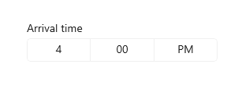
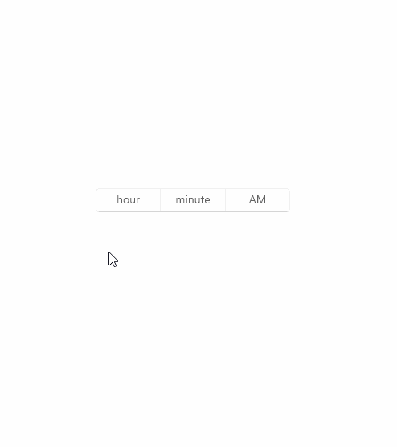

# Time picker
 
The time picker gives you a standardized way to let users pick a time value using touch, mouse, or keyboard input.



**Get the Windows UI Library**

:::row:::
   :::column:::
      
   :::column-end:::
   :::column span="3":::
       Windows UI Library 2.2 or later includes a new template for this control that uses rounded corners. For more info, see [Corner radius](../style/rounded-corner.md). WinUI is a NuGet package that contains new controls and UI features for Windows apps. For more info, including installation instructions, see [Windows UI Library](/uwp/toolkits/winui/).
   :::column-end:::
   :::column:::

   :::column-end:::
:::row-end:::

> **Platform APIs**: [TimePicker class](/uwp/api/Windows.UI.Xaml.Controls.TimePicker), [SelectedTime property](/uwp/api/windows.ui.xaml.controls.timepicker.selectedtime)


## Is this the right control?
Use a time picker to let a user pick a single time value.

For more info about choosing the right control, see the [Date and time controls](date-and-time.md) article.

## Examples

<table>
<th align="left">XAML Controls Gallery<th>
<tr>
<td></img></td>
<td>
    <p>If you have the <strong style="font-weight: semi-bold">XAML Controls Gallery</strong> app installed, click here to <a href="xamlcontrolsgallery:/item/TimePicker">open the app and see the TimePicker in action</a>.</p>
    <ul>
    <li><a href="https://www.microsoft.com/store/productId/9MSVH128X2ZT">Get the XAML Controls Gallery app (Microsoft Store)</a></li>
    <li><a href="https://github.com/Microsoft/Xaml-Controls-Gallery">Get the source code (GitHub)</a></li>
    </ul>
</td>
</tr>
</table>

The entry point displays the chosen time, and when the user selects the entry point, a picker surface expands vertically from the middle for the user to make a selection. The time picker overlays other UI; it doesn't push other UI out of the way.



## Create a time picker

This example shows how to create a simple time picker with a header.

```xaml
<TimePicker x:Name="arrivalTimePicker" Header="Arrival time"/>
```

```csharp
TimePicker arrivalTimePicker = new TimePicker();
arrivalTimePicker.Header = "Arrival time";
```

The resulting time picker looks like this:


### Formatting the time picker

By default, the time picker shows a 12-hour clock with an AM/PM selector. You can set the [ClockIdentifier](/uwp/api/windows.ui.xaml.controls.timepicker.clockidentifier) property to "24HourClock" to show a 24-hour clock instead.

```xaml
<TimePicker Header="24HourClock" SelectedTime="18:21" ClockIdentifier="24HourClock"/>
```

:::image type="content" source="images/date-time/time-picker-clocks.png" alt-text="A time picker 24 hour clock.":::

You can set the [MinuteIncrement](/uwp/api/windows.ui.xaml.controls.timepicker.minuteincrement) property to indicate the time increments shown in the minute picker. For example, 15 specifies that the `TimePicker` minute control displays only the choices 00, 15, 30, 45.

```xaml
<TimePicker MinuteIncrement="15"/>
```

:::image type="content" source="images/date-time/time-picker-minute-increment.png" alt-text="A time picker showing 15 minute increments.":::

### Time values

The time picker control has both [Time](/uwp/api/windows.ui.xaml.controls.timepicker.time)/[TimeChanged](/uwp/api/windows.ui.xaml.controls.timepicker.timechanged) and [SelectedTime](/uwp/api/windows.ui.xaml.controls.timepicker.selectedtime)/[SelectedTimeChanged](/uwp/api/windows.ui.xaml.controls.timepicker.selectedtimechanged) APIs. The difference between these is that `Time` is not nullable, while `SelectedTime` is nullable.

The value of `SelectedTime` is used to populate the time picker and is `null` by default. If `SelectedTime` is `null`, the `Time` property is set to a [TimeSpan](/dotnet/api/system.timespan?view=dotnet-uwp-10.0&preserve-view=true) of 0; otherwise, the `Time` value is synchronized with the `SelectedTime` value. When `SelectedTime` is `null`, the picker is 'unset' and shows the field names instead of a time.

:::image type="content" source="images/date-time/time-picker-no-selected-time.png" alt-text="A time picker with no time selected.":::

#### Initializing a time value

In code, you can initialize the time properties to a value of type `TimeSpan`:

```csharp
TimePicker timePicker = new TimePicker
{
    SelectedTime = new TimeSpan(14, 15, 00) // Seconds are ignored.
};
```

You can set the time value as an attribute in XAML. This is probably easiest if you're already declaring the `TimePicker` object in XAML and aren't using bindings for the time value. Use a string in the form *Hh:Mm* where *Hh* is hours and can be between 0 and 23 and *Mm* is minutes and can be between 0 and 59.

```xaml
<TimePicker SelectedTime="14:15"/>
```

> [!NOTE]
> For important info about date and time values, see [DateTime and Calendar values](date-and-time.md#datetime-and-calendar-values) in the *Date and time controls* article.

### Using the time values

To use the time value in your app, you typically use a data binding to the [SelectedTime](/uwp/api/windows.ui.xaml.controls.timepicker.selectedtime) or [Time](/uwp/api/windows.ui.xaml.controls.timepicker.time) property, use the time properties directly in your code, or handle the [SelectedTimeChanged](/uwp/api/windows.ui.xaml.controls.timepicker.selectedtimechanged) or [TimeChanged](/uwp/api/windows.ui.xaml.controls.timepicker.timechanged) event.

> For an example of using a `DatePicker` and `TimePicker` together to update a single `DateTime` value, see [Calendar, date, and time controls - Use a date picker and time picker together](./date-and-time.md#use-a-date-picker-and-time-picker-together).

Here, the `SelectedTime` property is used to compare the selected time to the current time.

Notice that because the `SelectedTime` property is nullable, you have to explicitly cast it to `DateTime`, like this: `DateTime myTime = (DateTime)(DateTime.Today + checkTimePicker.SelectedTime);`. The `Time` property, however, could be used without a cast, like this: `DateTime myTime = DateTime.Today + checkTimePicker.Time;`.

:::image type="content" source="images/date-time/time-picker-check.png" alt-text="A time picker, button, and text label.":::

```xaml
<StackPanel>
    <TimePicker x:Name="checkTimePicker"/>
    <Button Content="Check time" Click="{x:Bind CheckTime}"/>
    <TextBlock x:Name="resultText"/>
</StackPanel>
```

```csharp
private void CheckTime()
{
    // Using the Time property.
    // DateTime myTime = DateTime.Today + checkTimePicker.Time;
    // Using the SelectedTime property (nullable requires cast to DateTime).
    DateTime myTime = (DateTime)(DateTime.Today + checkTimePicker.SelectedTime);
    if (DateTime.Now >= myTime)
    {
        resultText.Text = "Your selected time has already past.";
    }
    else
    {
        string hrs = (myTime - DateTime.Now).Hours.ToString();
        string mins = (myTime - DateTime.Now).Minutes.ToString();
        resultText.Text = string.Format("Your selected time is {0} hours, {1} minutes from now.", hrs, mins);
    }
}
```

## Get the sample code

- [XAML Controls Gallery sample](https://github.com/Microsoft/Xaml-Controls-Gallery) - See all the XAML controls in an interactive format.

## Related topics

- [Date and time controls](date-and-time.md)
- [Calendar date picker](calendar-date-picker.md)
- [Calendar view](calendar-view.md)
- [Date picker](date-picker.md)