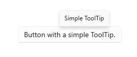

# Tooltips

A tooltip is a popup that contains additional information about another control or object. Tooltips display automatically when the user moves focus to, presses and holds, or hovers the pointer over the associated control. The tooltip disappears when the user moves focus from, stops pressing on, or stops hovering the pointer over the associated control (unless the pointer is moving towards the tooltip).

> [!NOTE]
> Starting with Windows 11 version 21H2, a tooltip can also be dismissed by pressing the CTRL key.



## Is this the right control?

Use a tooltip to reveal more info about a control before asking the user to perform an action. Tooltips should be used sparingly, and only when they are adding distinct value for the user who is trying to complete a task. One rule of thumb is that if the information is available elsewhere in the same experience, you do not need a tooltip. A valuable tooltip will clarify an unclear action.

When should you use a tooltip? To decide, consider these questions:

- **Should info become visible based on pointer hover?**
    If not, use another control. Display tips only as the result of user interaction, never display them on their own.

- **Does a control have a text label?**
    If not, use a tooltip to provide the label. It is a good UX design practice to label most controls inline and for these you don't need tooltips. Toolbar controls and command buttons showing only icons need tooltips.

- **Does an object benefit from a description or further info?**
    If so, use a tooltip. But the text must be supplemental — that is, not essential to the primary tasks. If it is essential, put it directly in the UI so that users don't have to discover or hunt for it.

- **Is the supplemental info an error, warning, or status?**
    If so, use another UI element, such as a flyout.

- **Do users need to interact with the tip?**
    If so, use another control. Users can't interact with tips because moving the mouse makes them disappear.

- **Do users need to print the supplemental info?**
    If so, use another control.

- **Will users find the tips annoying or distracting?**
    If so, consider using another solution — including doing nothing at all. If you do use tips where they might be distracting, allow users to turn them off.

## Recommendations

- Use tooltips sparingly (or not at all). Tooltips are an interruption. A tooltip can be as distracting as a pop-up, so don't use them unless they add significant value.
- Keep the tooltip text concise. Tooltips are perfect for short sentences and sentence fragments. Large blocks of text can be overwhelming and the tooltip may time out before the user has finished reading.
- Create helpful, supplemental tooltip text. Tooltip text must be informative. Don't make it obvious or just repeat what is already on the screen. Because tooltip text isn't always visible, it should be supplemental info that users don't have to read. Communicate important info using self-explanatory control labels or in-place supplemental text.
- Use images when appropriate. Sometimes it's better to use an image in a tooltip. For example, when the user hovers over a hyperlink, you can use a tooltip to show a preview of the linked page.
- [Keyboard accelerators](../input/keyboard-accelerators.md#tooltips) are displayed in tooltips by default. If you add your own tooltip, make sure that it includes information about the keyboard accelerators which are available.
- Don't use a tooltip to display text already visible in the UI. For example, don't put a tooltip on a button that shows the same text of the button.
- Don't put interactive controls inside the tooltip.
- Don't put images that look like they are interactive inside the tooltip.

## UWP and WinUI 2

[!INCLUDE [uwp-winui2-note](../../../includes/uwp-winui-2-note.md)]

APIs for this control exist in the [Windows.UI.Xaml.Controls](/uwp/api/Windows.UI.Xaml.Controls) namespace.

> [!div class="checklist"]
>
> - **UWP APIs:** [ToolTip class](/uwp/api/Windows.UI.Xaml.Controls.ToolTip), [ToolTipService class](/uwp/api/windows.ui.xaml.controls.tooltipservice)
> - [Open the WinUI 2 Gallery app and see the ToolTip in action](winui2gallery:/item/ToolTip). [!INCLUDE [winui-2-gallery](../../../includes/winui-2-gallery.md)]

We recommend using the latest [WinUI 2](/windows/apps/winui/winui2/) to get the most current styles and templates for all controls. WinUI 2.2 or later includes a new template for this control that uses rounded corners. For more info, see [Corner radius](../style/rounded-corner.md).

## Create a tooltip

> [!div class="checklist"]
>
> - **Important APIs:** [ToolTip class](/windows/winui/api/microsoft.UI.Xaml.Controls.ToolTip), [ToolTipService class](/windows/winui/api/microsoft.ui.xaml.controls.tooltipservice)
> - [Open the WinUI 3 Gallery app and see the ToolTip in action](winui3gallery:/item/ToolTip). [!INCLUDE [winui-3-gallery](../../../includes/winui-3-gallery.md)]

A [ToolTip](/windows/winui/api/microsoft.UI.Xaml.Controls.ToolTip) must be assigned to another UI element that is its owner. The [ToolTipService](/windows/winui/api/microsoft.ui.xaml.controls.tooltipservice) class provides static methods to display a ToolTip.

In XAML, use the **ToolTipService.Tooltip** attached property to assign the ToolTip to an owner.

```xaml
<Button Content="New" ToolTipService.ToolTip="Create a new document"/>
```

In code, use the [ToolTipService.SetToolTip](/windows/winui/api/microsoft.ui.xaml.controls.tooltipservice.settooltip) method to assign the ToolTip to an owner.

```xaml
<Button x:Name="submitButton" Content="New"/>
```

```csharp
ToolTip toolTip = new ToolTip();
toolTip.Content = "Create a new document";
ToolTipService.SetToolTip(submitButton, toolTip);
```

### Content

You can use any object as the [Content](/windows/winui/api/microsoft.ui.xaml.controls.contentcontrol.content) of a ToolTip. Here's an example of using an [Image](/windows/winui/api/microsoft.ui.xaml.controls.image) in a ToolTip.

```xaml
<TextBlock Text="store logo">
    <ToolTipService.ToolTip>
        <Image Source="Assets/StoreLogo.png"/>
    </ToolTipService.ToolTip>
</TextBlock>
```

### Placement

By default, a ToolTip is displayed centered above the pointer. The placement is not constrained by the app window, so the ToolTip might be displayed partially or completely outside of the app window bounds.

For broad adjustments, use the [Placement](/windows/winui/api/microsoft.ui.xaml.controls.tooltip.placement) property or **ToolTipService.Placement** attached property to specify whether the ToolTip should draw above, below, left, or right of the pointer. You can set the [VerticalOffset](/windows/winui/api/microsoft.ui.xaml.controls.tooltip.verticaloffset) or [HorizontalOffset](/windows/winui/api/microsoft.ui.xaml.controls.tooltip.horizontaloffset) properties to change the distance between the pointer and the ToolTip. Only one of the two offset values will influence the final position - VerticalOffset when Placement is Top or Bottom, HorizontalOffset when Placement is Left or Right.

```xaml
<!-- An Image with an offset ToolTip. -->
<Image Source="Assets/StoreLogo.png">
    <ToolTipService.ToolTip>
        <ToolTip Content="Offset ToolTip."
                 Placement="Right"
                 HorizontalOffset="20"/>
    </ToolTipService.ToolTip>
</Image>
```

If a ToolTip obscures the content it is referring to, you can adjust its placement precisely using the **PlacementRect** property. PlacementRect anchors the ToolTip's position and also serves as an area that ToolTip will not occlude, provided there's sufficient screen space to draw ToolTip outside this area. You can specify the origin of the rectangle relative to the ToolTip's owner, and the height and width of the exclusion area. The [Placement](/windows/winui/api/microsoft.ui.xaml.controls.tooltip.placement) property will define if ToolTip should draw above, below, left, or right of the PlacementRect.

```xaml
<!-- An Image with a non-occluding ToolTip. -->
<Image Source="Assets/StoreLogo.png" Height="64" Width="96">
    <ToolTipService.ToolTip>
        <ToolTip Content="Non-occluding ToolTip."
                 PlacementRect="0,0,96,64"/>
    </ToolTipService.ToolTip>
</Image>
```

## Get the sample code

- [WinUI Gallery sample](https://github.com/Microsoft/WinUI-Gallery) - See all the XAML controls in an interactive format.

## Related articles

- [ToolTip class](/windows/winui/api/microsoft.UI.Xaml.Controls.ToolTip)
