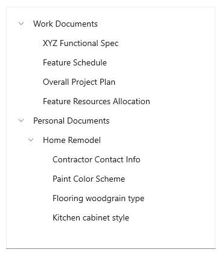

# Tree view

The tree view control enables a hierarchical list with expanding and collapsing nodes that contain nested items. It can be used to illustrate a folder structure or nested relationships in your UI.

The tree view uses a combination of indentation and icons to represent the nested relationship between parent nodes and child nodes. Collapsed nodes use a chevron pointing to the right, and expanded nodes use a chevron pointing down.



You can include an icon in the tree view item data template to represent nodes. For example, if you show a file system hierarchy, you could use folder icons for the parent notes and file icons for the leaf nodes.


The **TreeView** APIs support the following features:

- N-level nesting
- Selection of single or multiple nodes
- Data binding to the **ItemsSource** property on **TreeView** and [TreeViewItem](/windows/windows-app-sdk/api/winrt/microsoft.ui.xaml.controls.treeviewitem)
- **TreeViewItem** as the root of the **TreeView** item template
- Arbitrary types of content in a **TreeViewItem**
- Drag and drop between tree views

## Is this the right control?

- Use a **TreeView** when items have nested list items, and if it is important to illustrate the hierarchical relationship of items to their peers and nodes.

- Avoid using **TreeView** if highlighting the nested relationship of an item is not a priority. For most drill-in scenarios, a regular list view is appropriate.

## UWP and WinUI 2

[!INCLUDE [uwp-winui2-note](../../../includes/uwp-winui-2-note.md)]

The TreeView for UWP apps is included as part of WinUI 2. For more info, including installation instructions, see [WinUI 2](../../winui/winui2/index.md). APIs for this control exist in both the [Windows.UI.Xaml.Controls](/uwp/api/Windows.UI.Xaml.Controls) (UWP) and [Microsoft.UI.Xaml.Controls](/windows/winui/api/microsoft.ui.xaml.controls) (WinUI) namespaces.

> [!div class="checklist"]
>
> - **UWP APIs:** [TreeView class](/uwp/api/windows.ui.xaml.controls.treeview), [TreeViewNode class](/uwp/api/windows.ui.xaml.controls.treeviewnode), [TreeView.ItemsSource property](/uwp/api/windows.ui.xaml.controls.treeview.itemssource)
> - **WinUI 2 Apis:** [TreeView class](/windows/winui/api/microsoft.ui.xaml.controls.treeview), [TreeViewNode class](/windows/winui/api/microsoft.ui.xaml.controls.treeviewnode), [TreeView.ItemsSource property](/windows/winui/api/microsoft.ui.xaml.controls.treeview.itemssource)
> - [Open the WinUI 2 Gallery app and see the TreeView in action](winui2gallery:/item/TreeView). [!INCLUDE [winui-2-gallery](../../../includes/winui-2-gallery.md)]

We recommend using the latest [WinUI 2](../../winui/winui2/index.md) to get the most current styles, templates, and features for all controls.

[!INCLUDE [muxc-alias-note](../../../includes/muxc-alias-note.md)]

```xaml
xmlns:muxc="using:Microsoft.UI.Xaml.Controls"

<muxc:TreeView>
    <muxc:TreeView.RootNodes>
        <muxc:TreeViewNode Content="Flavors">
            <muxc:TreeViewNode.Children>
                <muxc:TreeViewNode Content="Vanilla"/>
            </muxc:TreeViewNode.Children>
        </muxc:TreeViewNode>
    </muxc:TreeView.RootNodes>
</muxc:TreeView>
```

## Create a tree view

You can create a tree view by binding the [ItemsSource](/windows/windows-app-sdk/api/winrt/microsoft.ui.xaml.controls.treeview.itemssource) to a hierarchical data source, or you can create and manage **TreeViewNode** objects yourself.

To create a tree view, you use a [TreeView](/windows/windows-app-sdk/api/winrt/microsoft.ui.xaml.controls.treeview) control and a hierarchy of [TreeViewNode](/windows/windows-app-sdk/api/winrt/microsoft.ui.xaml.controls.treeviewnode) objects. You create the node hierarchy by adding one or more root nodes to the **TreeView** control's [RootNodes](/windows/windows-app-sdk/api/winrt/microsoft.ui.xaml.controls.treeview.rootnodes) collection. Each **TreeViewNode** can then have more nodes added to its [Children](/windows/windows-app-sdk/api/winrt/microsoft.ui.xaml.controls.treeviewnode.children) collection. You can nest tree view nodes to whatever depth you require.

You can bind a hierarchical data source to the [ItemsSource](/windows/windows-app-sdk/api/winrt/microsoft.ui.xaml.controls.treeview.itemssource) property to provide the tree view content, just as you would with [ListView](/windows/windows-app-sdk/api/winrt/microsoft.ui.xaml.controls.listview)'s **ItemsSource**. Similarly, use [ItemTemplate](/windows/windows-app-sdk/api/winrt/microsoft.ui.xaml.controls.treeview.itemtemplate) (and the optional [ItemTemplateSelector](/windows/windows-app-sdk/api/winrt/microsoft.ui.xaml.controls.treeview.itemtemplate)) to provide a [DataTemplate](/windows/windows-app-sdk/api/winrt/microsoft.ui.xaml.datatemplate) that renders the item.

> [!IMPORTANT]
> **ItemsSource** and its related APIs require Windows 10, version 1809 ([SDK 17763](https://developer.microsoft.com/windows/downloads/windows-sdk)) or later, or [WinUI 2](../../winui/winui2/index.md).
>
> **ItemsSource** is an alternative mechanism to **TreeView.RootNodes** for putting content into the **TreeView** control. You cannot set both **ItemsSource** and **RootNodes** at the same time. When you use **ItemsSource**, nodes are created for you, and you can access them from the **TreeView.RootNodes** property.

Here's an example of a simple tree view declared in XAML. You typically add the nodes in code, but we show the XAML hierarchy here because it can be helpful for visualizing how the hierarchy of nodes is created.

```xaml
<muxc:TreeView>
    <muxc:TreeView.RootNodes>
        <muxc:TreeViewNode Content="Flavors"
                           IsExpanded="True">
            <muxc:TreeViewNode.Children>
                <muxc:TreeViewNode Content="Vanilla"/>
                <muxc:TreeViewNode Content="Strawberry"/>
                <muxc:TreeViewNode Content="Chocolate"/>
            </muxc:TreeViewNode.Children>
        </muxc:TreeViewNode>
    </muxc:TreeView.RootNodes>
</muxc:TreeView>
```

In most cases, your tree view displays data from a data source, so you typically declare the root **TreeView** control in XAML, but add the **TreeViewNode** objects in code or using data binding.

### Bind to a hierarchical data source

To create a tree view using data binding, set a hierarchical collection to the **TreeView.ItemsSource** property. Then in the **ItemTemplate**, set the child items collection to the **TreeViewItem.ItemsSource** property.

```xaml
<muxc:TreeView ItemsSource="{x:Bind DataSource}">
    <muxc:TreeView.ItemTemplate>
        <DataTemplate x:DataType="local:Item">
            <muxc:TreeViewItem ItemsSource="{x:Bind Children}"
                               Content="{x:Bind Name}"/>
        </DataTemplate>
    </muxc:TreeView.ItemTemplate>
</muxc:TreeView>
```

See [Tree view using data binding](#tree-view-using-data-binding) for the full code.

#### Items and item containers

If you use **TreeView.ItemsSource**, these APIs are available to get the node or data item from the container, and vice versa.

| [TreeViewItem](/windows/windows-app-sdk/api/winrt/microsoft.ui.xaml.controls.treeviewitem) | Description |
| ------------------------------------------------------------------ | ----------- |
| [TreeView.ItemFromContainer](/windows/windows-app-sdk/api/winrt/microsoft.ui.xaml.controls.treeview.itemfromcontainer) | Gets the data item for the specified **TreeViewItem** container. |
| [TreeView.ContainerFromItem](/windows/windows-app-sdk/api/winrt/microsoft.ui.xaml.controls.treeview.containerfromitem) | Gets the **TreeViewItem** container for the specified data item. |

| [TreeViewNode](/windows/windows-app-sdk/api/winrt/microsoft.ui.xaml.controls.treeviewnode) | Description |
| -------------------------------------------------------------- | ----------- |
| [TreeView.NodeFromContainer](/windows/windows-app-sdk/api/winrt/microsoft.ui.xaml.controls.treeview.nodefromcontainer) | Gets the **TreeViewNode** for the specified **TreeViewItem** container. |
| [TreeView.ContainerFromNode](/windows/windows-app-sdk/api/winrt/microsoft.ui.xaml.controls.treeview.containerfromnode) | Gets the **TreeViewItem** container for the specified **TreeViewNode**. |

### Manage tree view nodes

This tree view is the same as the one created previously in XAML, but the nodes are created in code instead.

```xaml
<muxc:TreeView x:Name="sampleTreeView"/>
```

```csharp
private void InitializeTreeView()
{
    muxc.TreeViewNode rootNode = new muxc.TreeViewNode() { Content = "Flavors" };
    rootNode.IsExpanded = true;
    rootNode.Children.Add(new muxc.TreeViewNode() { Content = "Vanilla" });
    rootNode.Children.Add(new muxc.TreeViewNode() { Content = "Strawberry" });
    rootNode.Children.Add(new muxc.TreeViewNode() { Content = "Chocolate" });

    sampleTreeView.RootNodes.Add(rootNode);
}
```

```vb
Private Sub InitializeTreeView()
    Dim rootNode As New muxc.TreeViewNode With {.Content = "Flavors", .IsExpanded = True}
    With rootNode.Children
        .Add(New muxc.TreeViewNode With {.Content = "Vanilla"})
        .Add(New muxc.TreeViewNode With {.Content = "Strawberry"})
        .Add(New muxc.TreeViewNode With {.Content = "Chocolate"})
    End With
    sampleTreeView.RootNodes.Add(rootNode)
End Sub
```

These APIs are available for managing the data hierarchy of your tree view.

| [TreeView](/windows/windows-app-sdk/api/winrt/microsoft.ui.xaml.controls.treeview) | Description |
| ------------------------------------------------------ | ----------- |
| [RootNodes](/windows/windows-app-sdk/api/winrt/microsoft.ui.xaml.controls.treeview.rootnodes) | A tree view can have one or more root nodes. Add a **TreeViewNode** object to the **RootNodes** collection to create a root node. The **Parent** of a root node is always **null**. The **Depth** of a root node is 0. |

| [TreeViewNode](/windows/windows-app-sdk/api/winrt/microsoft.ui.xaml.controls.treeviewnode) | Description |
| -------------------------------------------------------------- | ----------- |
| [Children](/windows/windows-app-sdk/api/winrt/microsoft.ui.xaml.controls.treeviewnode.children) | Add **TreeViewNode** objects to the **Children** collection of a parent node to create your node hierarchy. A node is the **Parent** of all nodes in its **Children** collection. |
| [HasChildren](/windows/windows-app-sdk/api/winrt/microsoft.ui.xaml.controls.treeviewnode.haschildren) | **true** if the node has realized children. **false** indicates an empty folder or an item. |
| [HasUnrealizedChildren](/windows/windows-app-sdk/api/winrt/microsoft.ui.xaml.controls.treeviewnode.hasunrealizedchildren) | Use this property if you're filling nodes as they're expanded. See [Fill a node when it's expanding](#fill-a-node-when-its-expanding) later in this article. |
| [Depth](/windows/windows-app-sdk/api/winrt/microsoft.ui.xaml.controls.treeviewnode.depth) | Indicates how far from the root node a child node is. |
| [Parent](/windows/windows-app-sdk/api/winrt/microsoft.ui.xaml.controls.treeviewnode.parent) | Gets the **TreeViewNode** that owns the **Children** collection that this node is part of. |

The tree view uses the **HasChildren** and **HasUnrealizedChildren** properties to determine whether the expand/collapse icon is shown. If either property is **true**, the icon is shown; otherwise, it's not shown.

## Tree view node content

You can store the data item that a tree view node represents in its [Content](/windows/windows-app-sdk/api/winrt/microsoft.ui.xaml.controls.treeviewnode.content) property.

In the previous examples, the content was a simple string value. Here, a tree view node represents the user's **Pictures** folder, so the pictures library [StorageFolder](/uwp/api/windows.storage.storagefolder) is assigned to the node's **Content** property.

```csharp
StorageFolder picturesFolder = KnownFolders.PicturesLibrary;
muxc.TreeViewNode pictureNode = new muxc.TreeViewNode();
pictureNode.Content = picturesFolder;
```

```vb
Dim picturesFolder As StorageFolder = KnownFolders.PicturesLibrary
Dim pictureNode As New muxc.TreeViewNode With {.Content = picturesFolder}
```

> [!NOTE]
> To get access to the **Pictures** folder, you need to specify the **Pictures Library** capability in the app manifest. See [App capability declarations](/windows/uwp/packaging/app-capability-declarations) for more information.

You can provide a [DataTemplate](/windows/windows-app-sdk/api/winrt/microsoft.ui.xaml.datatemplate) to specify how the data item is displayed in the tree view.

> [!NOTE]
> In Windows 10, version 1803, you have to re-template the **TreeView** control and specify a custom **ItemTemplate** if your content is not a string. In later versions, set the **ItemTemplate** property. For more info, see [TreeView.ItemTemplate](/windows/windows-app-sdk/api/winrt/microsoft.ui.xaml.controls.treeview.itemtemplate).

### Item container style

Whether you use **ItemsSource** or **RootNodes**, the actual element used to display each node – called the "container" – is a [TreeViewItem](/windows/windows-app-sdk/api/winrt/microsoft.ui.xaml.controls.treeviewitem) object. You can modify **TreeViewItem** properties to style the container using the **TreeView**'s [ItemContainerStyle](/windows/windows-app-sdk/api/winrt/microsoft.ui.xaml.controls.treeview.itemcontainerstyle) or [ItemContainerStyleSelector](/windows/windows-app-sdk/api/winrt/microsoft.ui.xaml.controls.treeview.itemcontainerstyleselector) properties.

This example shows how to change the expanded/collapsed glyphs to orange +/- signs. In the default **TreeViewItem** template, the glyphs are set to use the `Segoe MDL2 Assets` font. You can set the **Setter.Value** property by providing the Unicode character value in the format used by XAML, like this: `Value="&#xE948;"`.

```xaml
<muxc:TreeView>
    <muxc:TreeView.ItemContainerStyle>
        <Style TargetType="muxc:TreeViewItem">
            <Setter Property="CollapsedGlyph" Value="&#xE948;"/>
            <Setter Property="ExpandedGlyph" Value="&#xE949;"/>
            <Setter Property="GlyphBrush" Value="DarkOrange"/>
        </Style>
    </muxc:TreeView.ItemContainerStyle>
    <muxc:TreeView.RootNodes>
        <muxc:TreeViewNode Content="Flavors"
               IsExpanded="True">
            <muxc:TreeViewNode.Children>
                <muxc:TreeViewNode Content="Vanilla"/>
                <muxc:TreeViewNode Content="Strawberry"/>
                <muxc:TreeViewNode Content="Chocolate"/>
            </muxc:TreeViewNode.Children>
        </muxc:TreeViewNode>
    </muxc:TreeView.RootNodes>
</muxc:TreeView>
```

### Item template selectors

By default, the [TreeView](/windows/windows-app-sdk/api/winrt/microsoft.ui.xaml.controls.treeview) shows the string representation of the data item for each node. You can set the [ItemTemplate](/windows/windows-app-sdk/api/winrt/microsoft.ui.xaml.controls.treeview.itemtemplate) property to change what is displayed for all nodes. Or, you can use an [ItemTemplateSelector](/windows/windows-app-sdk/api/winrt/microsoft.ui.xaml.controls.treeview.itemtemplateselector) to choose a different [DataTemplate](/windows/windows-app-sdk/api/winrt/microsoft.ui.xaml.datatemplate) for the tree view items based on the type of item or some other criteria you specify.

For example, in a file explorer app, you could use one data template for folders, and another for files.


Here is an example of how to create and use an item template selector.  For more info, see the [DataTemplateSelector](/windows/windows-app-sdk/api/winrt/microsoft.ui.xaml.controls.datatemplateselector) class.

> [!NOTE]
> This code is part of a larger example and won't work on its own. To see the full example, including the code that defines `ExplorerItem`, check out the [Xaml-Controls-Gallery repository](https://github.com/Microsoft/WinUI-Gallery) on GitHub. [TreeViewPage.xaml](https://github.com/Microsoft/WinUI-Gallery/blob/1ecd85c908a8a1cb9a8201e548f58db379801e69/XamlControlsGallery/ControlPages/TreeViewPage.xaml) and [TreeViewPage.xaml.cs](https://github.com/Microsoft/WinUI-Gallery/blob/1ecd85c908a8a1cb9a8201e548f58db379801e69/XamlControlsGallery/ControlPages/TreeViewPage.xaml.cs) contain the relevant code.

```xaml
<Page.Resources>
    <DataTemplate x:Key="FolderTemplate" x:DataType="local:ExplorerItem">
        <muxc:TreeViewItem ItemsSource="{x:Bind Children}">
            <StackPanel Orientation="Horizontal">
                <Image Width="20" Source="Assets/folder.png"/>
                <TextBlock Text="{x:Bind Name}" />
            </StackPanel>
        </muxc:TreeViewItem>
    </DataTemplate>

    <DataTemplate x:Key="FileTemplate" x:DataType="local:ExplorerItem">
        <muxc:TreeViewItem>
            <StackPanel Orientation="Horizontal">
                <Image Width="20" Source="Assets/file.png"/>
                <TextBlock Text="{x:Bind Name}"/>
            </StackPanel>
        </muxc:TreeViewItem>
    </DataTemplate>

    <local:ExplorerItemTemplateSelector
            x:Key="ExplorerItemTemplateSelector"
            FolderTemplate="{StaticResource FolderTemplate}"
            FileTemplate="{StaticResource FileTemplate}" />
</Page.Resources>

<Grid>
    <muxc:TreeView
        ItemsSource="{x:Bind DataSource}"
        ItemTemplateSelector="{StaticResource ExplorerItemTemplateSelector}"/>
</Grid>
```

```csharp
public class ExplorerItemTemplateSelector : DataTemplateSelector
{
    public DataTemplate FolderTemplate { get; set; }
    public DataTemplate FileTemplate { get; set; }

    protected override DataTemplate SelectTemplateCore(object item)
    {
        var explorerItem = (ExplorerItem)item;
        if (explorerItem.Type == ExplorerItem.ExplorerItemType.Folder) return FolderTemplate;

        return FileTemplate;
    }
}
```

The type of object passed to the [SelectTemplateCore](/windows/windows-app-sdk/api/winrt/microsoft.ui.xaml.controls.datatemplateselector.selecttemplatecore) method depends on whether you create the tree view by setting the **ItemsSource** property, or by creating and managing **TreeViewNode** objects yourself.

- If **ItemsSource** is set, the object will be of whatever type the data item is. In the previous example, the object was an `ExplorerItem`, so it could be used after a simple cast to `ExplorerItem`: `var explorerItem = (ExplorerItem)item;`.
- If **ItemsSource** is not set and you manage the tree view nodes yourself, the object passed to **SelectTemplateCore** is a **TreeViewNode**. In this case, you can get the data item from the [TreeViewNode.Content](/windows/windows-app-sdk/api/winrt/microsoft.ui.xaml.controls.treeviewnode.content) property.

Here's a data template selector from the [Pictures and Music library tree view](#pictures-and-music-library-tree-view) example shown later. The **SelectTemplateCore** method receives a **TreeViewNode**, which might have either a [StorageFolder](/uwp/api/windows.storage.storagefolder) or a [StorageFile](/uwp/api/windows.storage.storagefile) as its content. Based on the content, you can return a default template, or a specific template for the music folder, the picture folder, music files, or picture files.

```csharp
protected override DataTemplate SelectTemplateCore(object item)
{
    var node = (TreeViewNode)item;
    if (node.Content is StorageFolder)
    {
        var content = node.Content as StorageFolder;
        if (content.DisplayName.StartsWith("Pictures")) return PictureFolderTemplate;
        if (content.DisplayName.StartsWith("Music")) return MusicFolderTemplate;
    }
    else if (node.Content is StorageFile)
    {
        var content = node.Content as StorageFile;
        if (content.ContentType.StartsWith("image")) return PictureItemTemplate;
        if (content.ContentType.StartsWith("audio")) return MusicItemTemplate;
    }
    return DefaultTemplate;
}
```

```vb
Protected Overrides Function SelectTemplateCore(ByVal item As Object) As DataTemplate
    Dim node = CType(item, muxc.TreeViewNode)

    If TypeOf node.Content Is StorageFolder Then
        Dim content = TryCast(node.Content, StorageFolder)
        If content.DisplayName.StartsWith("Pictures") Then Return PictureFolderTemplate
        If content.DisplayName.StartsWith("Music") Then Return MusicFolderTemplate
    ElseIf TypeOf node.Content Is StorageFile Then
        Dim content = TryCast(node.Content, StorageFile)
        If content.ContentType.StartsWith("image") Then Return PictureItemTemplate
        If content.ContentType.StartsWith("audio") Then Return MusicItemTemplate
    End If

    Return DefaultTemplate
End Function
```

## Interacting with a tree view

You can configure a tree view to let a user interact with it in several different ways:

- Expand or collapse nodes
- Single- or multi-select items
- Click to invoke an item

### Expand/collapse

Any tree view node that has children can always be expanded or collapsed by clicking the expand/collapse glyph. You can also expand or collapse a node programmatically, and respond when a node changes state.

#### Expand/collapse a node programmatically

There are 2 ways you can expand or collapse a tree view node in your code.

- The [TreeView](/windows/windows-app-sdk/api/winrt/microsoft.ui.xaml.controls.treeview) class has the [Collapse](/windows/windows-app-sdk/api/winrt/microsoft.ui.xaml.controls.treeview.collapse) and [Expand](/windows/windows-app-sdk/api/winrt/microsoft.ui.xaml.controls.treeview.expand) methods. When you call these methods, you pass in the **TreeViewNode** that you want to expand or collapse.

- Each [TreeViewNode](/windows/windows-app-sdk/api/winrt/microsoft.ui.xaml.controls.treeviewnode) has the [IsExpanded](/windows/windows-app-sdk/api/winrt/microsoft.ui.xaml.controls.treeviewnode.isexpanded) property. You can use this property to check the state of a node, or set it to change the state. You can also set this property in XAML to set the initial state of a node.

### Fill a node when it's expanding

You might need to show a large number of nodes in your tree view, or you might not know ahead of time how many nodes it will have. The **TreeView** control is not virtualized, so you can manage resources by filling each node as it's expanded, and removing the child nodes when it's collapsed.

Handle the [Expanding](/windows/windows-app-sdk/api/winrt/microsoft.ui.xaml.controls.treeview.expand) event and use the [HasUnrealizedChildren](/windows/windows-app-sdk/api/winrt/microsoft.ui.xaml.controls.treeviewnode.hasunrealizedchildren) property to add children to a node when it's being expanded. The **HasUnrealizedChildren** property indicates whether the node needs to be filled, or if its **Children** collection has already been populated. It's important to remember that the **TreeViewNode** doesn't set this value, you need to manage it in your app code.

Here's an example of these APIs in use. See the complete example code at the end of this article for context, including the implementation of **FillTreeNode**.

```csharp
private void SampleTreeView_Expanding(muxc.TreeView sender, muxc.TreeViewExpandingEventArgs args)
{
    if (args.Node.HasUnrealizedChildren)
    {
        FillTreeNode(args.Node);
    }
}
```

```vb
Private Sub SampleTreeView_Expanding(sender As muxc.TreeView, args As muxc.TreeViewExpandingEventArgs)
    If args.Node.HasUnrealizedChildren Then
        FillTreeNode(args.Node)
    End If
End Sub
```

It's not required, but you might want to also handle the [Collapsed](/windows/windows-app-sdk/api/winrt/microsoft.ui.xaml.controls.treeview.collapsed) event and remove the child nodes when the parent node is closed. This can be important if your tree view has many nodes, or if the node data uses a lot of resources. You should consider the performance impact of filling a node each time it's opened versus leaving the children on a closed node. The best option will depend on your app.

Here's an example of a handler for the **Collapsed** event.

```csharp
private void SampleTreeView_Collapsed(muxc.TreeView sender, muxc.TreeViewCollapsedEventArgs args)
{
    args.Node.Children.Clear();
    args.Node.HasUnrealizedChildren = true;
}
```

```vb
Private Sub SampleTreeView_Collapsed(sender As muxc.TreeView, args As muxc.TreeViewCollapsedEventArgs)
    args.Node.Children.Clear()
    args.Node.HasUnrealizedChildren = True
End Sub
```

### Invoking an item

A user can invoke an action (treating the item like a button) instead of selecting the item. You handle the [ItemInvoked](/windows/windows-app-sdk/api/winrt/microsoft.ui.xaml.controls.treeview.iteminvoked) event to respond to this user interaction.

> [!NOTE]
> Unlike **ListView**, which has the [IsItemClickEnabled](/windows/windows-app-sdk/api/winrt/microsoft.ui.xaml.controls.listviewbase.isitemclickenabled) property, invoking an item is always enabled on the tree view. You can still choose whether to handle the event or not.

**[TreeViewItemInvokedEventArgs](/windows/windows-app-sdk/api/winrt/microsoft.ui.xaml.controls.treeviewiteminvokedeventargs) class**

The **ItemInvoked** event args give you access to the invoked item. The [InvokedItem](/windows/windows-app-sdk/api/winrt/microsoft.ui.xaml.controls.treeviewiteminvokedeventargs.invokeditem) property has the node that was invoked. You can cast it to a **TreeViewNode** and get the data item from the **TreeViewNode.Content** property.

Here's an example of an **ItemInvoked** event handler. The data item is an [IStorageItem](/uwp/api/windows.storage.istorageitem), and this example just displays some info about the file and tree. Also, if the node is a folder node, it expands or collapses the node at the same time. Otherwise, the node expands or collapses only when the chevron is clicked.

```csharp
private void SampleTreeView_ItemInvoked(muxc.TreeView sender, muxc.TreeViewItemInvokedEventArgs args)
{
    var node = args.InvokedItem as muxc.TreeViewNode;
    if (node.Content is IStorageItem item)
    {
        FileNameTextBlock.Text = item.Name;
        FilePathTextBlock.Text = item.Path;
        TreeDepthTextBlock.Text = node.Depth.ToString();

        if (node.Content is StorageFolder)
        {
            node.IsExpanded = !node.IsExpanded;
        }
    }
}
```

```vb
Private Sub SampleTreeView_ItemInvoked(sender As muxc.TreeView, args As muxc.TreeViewItemInvokedEventArgs)
    Dim node = TryCast(args.InvokedItem, muxc.TreeViewNode)
    Dim item = TryCast(node.Content, IStorageItem)
    If item IsNot Nothing Then
        FileNameTextBlock.Text = item.Name
        FilePathTextBlock.Text = item.Path
        TreeDepthTextBlock.Text = node.Depth.ToString()
        If TypeOf node.Content Is StorageFolder Then
            node.IsExpanded = Not node.IsExpanded
        End If
    End If
End Sub
```

### Item selection

The **TreeView** control supports both single-selection and multi-selection. By default, selection of nodes is turned off, but you can set the [TreeView.SelectionMode](/windows/windows-app-sdk/api/winrt/microsoft.ui.xaml.controls.treeview.selectionmode) property to allow selection of nodes. The [TreeViewSelectionMode](/windows/windows-app-sdk/api/winrt/microsoft.ui.xaml.controls.treeviewselectionmode) values are **None**, **Single**, and **Multiple**.

#### Multiple selection

When multiple selection is enabled, a checkbox is shown next to each tree view node, and selected items are highlighted. A user can select or de-select an item by using the checkbox; clicking the item still causes it to be invoked.

Selecting or de-selecting a parent node will select or de-select all children under that node. If some, but not all, of the children under a parent node are selected, the checkbox for the parent node is shown in the indeterminate state.


Selected nodes are added to the tree view's [SelectedNodes](/windows/windows-app-sdk/api/winrt/microsoft.ui.xaml.controls.treeview.selectednodes) collection. You can call the [SelectAll](/windows/windows-app-sdk/api/winrt/microsoft.ui.xaml.controls.treeview.selectall) method to select all the nodes in a tree view.

> [!NOTE]
> If you call **SelectAll**, all realized nodes are selected, regardless of the **SelectionMode**. To provide a consistent user experience, you should only call **SelectAll** if **SelectionMode** is **Multiple**.

#### Selection and realized/unrealized nodes

If your tree view has unrealized nodes, they are not taken into account for selection. Here are some things you need to keep in mind regarding selection with unrealized nodes.

- If a user selects a parent node, all the realized children under that parent are also selected. Similarly, if all the child nodes are selected, the parent node also becomes selected.
- The **SelectAll** method only adds realized nodes to the **SelectedNodes** collection.
- If a parent node with unrealized children is selected, the children will be selected as they are realized.

#### SelectedItem/SelectedItems

TreeView has the [SelectedItem](/windows/windows-app-sdk/api/winrt/microsoft.ui.xaml.controls.treeview.selecteditem) and [SelectedItems](/windows/windows-app-sdk/api/winrt/microsoft.ui.xaml.controls.treeview.selecteditems) properties. You can use these properties to get the content of selected nodes directly. If multiple selection is enabled, SelectedItem contains the first item in the SelectedItems collection.

#### SelectionChanged

You can handle the [SelectionChanged](/windows/windows-app-sdk/api/winrt/microsoft.ui.xaml.controls.treeview.selectionchanged) event to respond when the collection of selected items changes, either programmatically or through user interaction.

```xaml
<TreeView ItemsSource="{x:Bind Folders}"
          SelectionMode="Multiple"
          SelectionChanged="TreeView_SelectionChanged"/>
```

```csharp
public void TreeView_SelectionChanged(TreeView sender, TreeViewSelectionChangedEventArgs args)
{
    foreach (object item in args.RemovedItems)
    {
        this.SelectedFolders.Remove((Folder)item);
    }

    foreach (object item in args.AddedItems)
    {
        this.SelectedFolders.Add((Folder)item);
    }
}
```

## Code examples

The following code examples demonstrate various features of the tree view control.

### Tree view using XAML

This example shows how to create a simple tree view structure in XAML. The tree view shows ice cream flavors and toppings that the user can choose from, arranged in categories. Multi-selection is enabled, and when the user clicks a button, the selected items are displayed in the main app UI.

```xaml
<Page
    x:Class="TreeViewTest.MainPage"
    xmlns="http://schemas.microsoft.com/winfx/2006/xaml/presentation"
    xmlns:x="http://schemas.microsoft.com/winfx/2006/xaml"
    xmlns:d="http://schemas.microsoft.com/expression/blend/2008"
    xmlns:mc="http://schemas.openxmlformats.org/markup-compatibility/2006"
    xmlns:muxc="using:Microsoft.UI.Xaml.Controls"
    mc:Ignorable="d"
    Background="{ThemeResource ApplicationPageBackgroundThemeBrush}">

    <Grid Background="{ThemeResource ApplicationPageBackgroundThemeBrush}"
          Padding="100">
        <SplitView IsPaneOpen="True"
               DisplayMode="Inline"
               OpenPaneLength="296">
            <SplitView.Pane>
                <muxc:TreeView x:Name="DessertTree" SelectionMode="Multiple">
                    <muxc:TreeView.RootNodes>
                        <muxc:TreeViewNode Content="Flavors" IsExpanded="True">
                            <muxc:TreeViewNode.Children>
                                <muxc:TreeViewNode Content="Vanilla"/>
                                <muxc:TreeViewNode Content="Strawberry"/>
                                <muxc:TreeViewNode Content="Chocolate"/>
                            </muxc:TreeViewNode.Children>
                        </muxc:TreeViewNode>

                        <muxc:TreeViewNode Content="Toppings">
                            <muxc:TreeViewNode.Children>
                                <muxc:TreeViewNode Content="Candy">
                                    <muxc:TreeViewNode.Children>
                                        <muxc:TreeViewNode Content="Chocolate"/>
                                        <muxc:TreeViewNode Content="Mint"/>
                                        <muxc:TreeViewNode Content="Sprinkles"/>
                                    </muxc:TreeViewNode.Children>
                                </muxc:TreeViewNode>
                                <muxc:TreeViewNode Content="Fruits">
                                    <muxc:TreeViewNode.Children>
                                        <muxc:TreeViewNode Content="Mango"/>
                                        <muxc:TreeViewNode Content="Peach"/>
                                        <muxc:TreeViewNode Content="Kiwi"/>
                                    </muxc:TreeViewNode.Children>
                                </muxc:TreeViewNode>
                                <muxc:TreeViewNode Content="Berries">
                                    <muxc:TreeViewNode.Children>
                                        <muxc:TreeViewNode Content="Strawberry"/>
                                        <muxc:TreeViewNode Content="Blueberry"/>
                                        <muxc:TreeViewNode Content="Blackberry"/>
                                    </muxc:TreeViewNode.Children>
                                </muxc:TreeViewNode>
                            </muxc:TreeViewNode.Children>
                        </muxc:TreeViewNode>
                    </muxc:TreeView.RootNodes>
                </muxc:TreeView>
            </SplitView.Pane>

            <StackPanel Grid.Column="1" Margin="12,0">
                <Button Content="Select all" Click="SelectAllButton_Click"/>
                <Button Content="Create order" Click="OrderButton_Click" Margin="0,12"/>
                <TextBlock Text="Your flavor selections:" Style="{StaticResource CaptionTextBlockStyle}"/>
                <TextBlock x:Name="FlavorList" Margin="0,0,0,12"/>
                <TextBlock Text="Your topping selections:" Style="{StaticResource CaptionTextBlockStyle}"/>
                <TextBlock x:Name="ToppingList"/>
            </StackPanel>
        </SplitView>
    </Grid>
</Page>
```

```csharp
using Windows.UI.Xaml;
using Windows.UI.Xaml.Controls;
using muxc = Microsoft.UI.Xaml.Controls;

namespace TreeViewTest
{
    public sealed partial class MainPage : Page
    {
        public MainPage()
        {
            this.InitializeComponent();
        }

        private void OrderButton_Click(object sender, RoutedEventArgs e)
        {
            FlavorList.Text = string.Empty;
            ToppingList.Text = string.Empty;

            foreach (muxc.TreeViewNode node in DessertTree.SelectedNodes)
            {
                if (node.Parent.Content?.ToString() == "Flavors")
                {
                    FlavorList.Text += node.Content + "; ";
                }
                else if (node.HasChildren == false)
                {
                    ToppingList.Text += node.Content + "; ";
                }
            }
        }

        private void SelectAllButton_Click(object sender, RoutedEventArgs e)
        {
            if (DessertTree.SelectionMode == muxc.TreeViewSelectionMode.Multiple)
            {
                DessertTree.SelectAll();
            }
        }
    }
}
```

```vb
Private Sub OrderButton_Click(sender As Object, e As RoutedEventArgs)
    FlavorList.Text = String.Empty
    ToppingList.Text = String.Empty
    For Each node As muxc.TreeViewNode In DessertTree.SelectedNodes
        If node.Parent.Content?.ToString() = "Flavors" Then
            FlavorList.Text += node.Content & "; "
        ElseIf node.HasChildren = False Then
            ToppingList.Text += node.Content & "; "
        End If
    Next
End Sub

Private Sub SelectAllButton_Click(sender As Object, e As RoutedEventArgs)
    If DessertTree.SelectionMode = muxc.TreeViewSelectionMode.Multiple Then
        DessertTree.SelectAll()
    End If
End Sub
```

### Tree view using data binding

This example shows how to create the same tree view as the previous example. However, instead of creating the data hierarchy in XAML, the data is created in code and bound to the tree view's **ItemsSource** property. (The button event handlers shown in the previous example apply to this example also.)

```xaml
<Page
    x:Class="TreeViewTest.MainPage"
    xmlns="http://schemas.microsoft.com/winfx/2006/xaml/presentation"
    xmlns:x="http://schemas.microsoft.com/winfx/2006/xaml"
    xmlns:d="http://schemas.microsoft.com/expression/blend/2008"
    xmlns:mc="http://schemas.openxmlformats.org/markup-compatibility/2006"
    xmlns:muxc="using:Microsoft.UI.Xaml.Controls"
    xmlns:local="using:TreeViewTest"
    mc:Ignorable="d"
    Background="{ThemeResource ApplicationPageBackgroundThemeBrush}">

    <Grid Background="{ThemeResource ApplicationPageBackgroundThemeBrush}"
          Padding="100">
        <SplitView IsPaneOpen="True"
                   DisplayMode="Inline"
                   OpenPaneLength="296">
            <SplitView.Pane>
                <muxc:TreeView Name="DessertTree"
                                      SelectionMode="Multiple"
                                      ItemsSource="{x:Bind DataSource}">
                    <muxc:TreeView.ItemTemplate>
                        <DataTemplate x:DataType="local:Item">
                            <muxc:TreeViewItem
                                ItemsSource="{x:Bind Children}"
                                Content="{x:Bind Name}"/>
                        </DataTemplate>
                    </muxc:TreeView.ItemTemplate>
                </muxc:TreeView>
            </SplitView.Pane>

            <StackPanel Grid.Column="1" Margin="12,0">
                <Button Content="Select all"
                        Click="SelectAllButton_Click"/>
                <Button Content="Create order"
                        Click="OrderButton_Click"
                        Margin="0,12"/>
                <TextBlock Text="Your flavor selections:"
                           Style="{StaticResource CaptionTextBlockStyle}"/>
                <TextBlock x:Name="FlavorList" Margin="0,0,0,12"/>
                <TextBlock Text="Your topping selections:"
                           Style="{StaticResource CaptionTextBlockStyle}"/>
                <TextBlock x:Name="ToppingList"/>
            </StackPanel>
        </SplitView>
    </Grid>

</Page>
```

```csharp
using System.Collections.ObjectModel;
using Windows.UI.Xaml;
using Windows.UI.Xaml.Controls;
using muxc = Microsoft.UI.Xaml.Controls;

namespace TreeViewTest
{
    public sealed partial class MainPage : Page
    {
        private ObservableCollection<Item> DataSource = new ObservableCollection<Item>();

        public MainPage()
        {
            this.InitializeComponent();
            DataSource = GetDessertData();
        }

        private ObservableCollection<Item> GetDessertData()
        {
            var list = new ObservableCollection<Item>();

            Item flavorsCategory = new Item()
            {
                Name = "Flavors",
                Children =
                {
                    new Item() { Name = "Vanilla" },
                    new Item() { Name = "Strawberry" },
                    new Item() { Name = "Chocolate" }
                }
            };

            Item toppingsCategory = new Item()
            {
                Name = "Toppings",
                Children =
                {
                    new Item()
                    {
                        Name = "Candy",
                        Children =
                        {
                            new Item() { Name = "Chocolate" },
                            new Item() { Name = "Mint" },
                            new Item() { Name = "Sprinkles" }
                        }
                    },
                    new Item()
                    {
                        Name = "Fruits",
                        Children =
                        {
                            new Item() { Name = "Mango" },
                            new Item() { Name = "Peach" },
                            new Item() { Name = "Kiwi" }
                        }
                    },
                    new Item()
                    {
                        Name = "Berries",
                        Children =
                        {
                            new Item() { Name = "Strawberry" },
                            new Item() { Name = "Blueberry" },
                            new Item() { Name = "Blackberry" }
                        }
                    }
                }
            };

            list.Add(flavorsCategory);
            list.Add(toppingsCategory);
            return list;
        }

        private void OrderButton_Click(object sender, RoutedEventArgs e)
        {
            FlavorList.Text = string.Empty;
            ToppingList.Text = string.Empty;

            foreach (muxc.TreeViewNode node in DessertTree.SelectedNodes)
            {
                if (node.Parent.Content?.ToString() == "Flavors")
                {
                    FlavorList.Text += node.Content + "; ";
                }
                else if (node.HasChildren == false)
                {
                    ToppingList.Text += node.Content + "; ";
                }
            }
        }

        private void SelectAllButton_Click(object sender, RoutedEventArgs e)
        {
            if (DessertTree.SelectionMode == muxc.TreeViewSelectionMode.Multiple)
            {
                DessertTree.SelectAll();
            }
        }
    }

    public class Item
    {
        public string Name { get; set; }
        public ObservableCollection<Item> Children { get; set; } = new ObservableCollection<Item>();

        public override string ToString()
        {
            return Name;
        }
    }
}

```

### Pictures and Music library tree view

This example shows how to create a tree view that shows the contents and structure of the user's **Pictures** and **Music** libraries. The number of items can't be known ahead of time, so each node is filled when it's expanded, and emptied when it's collapsed.

A custom item template is used to display the data items, which are of type [IStorageItem](/uwp/api/windows.storage.istorageitem).

> [!IMPORTANT]
> The code in this example requires the **picturesLibrary** and **musicLibrary** capabilities. For more info about file access, see [File access permissions](/windows/uwp/files/file-access-permissions), [Enumerate and query files and folders](/windows/uwp/files/quickstart-listing-files-and-folders), and [Files and folders in the Music, Pictures, and Videos libraries](/windows/uwp/files/quickstart-managing-folders-in-the-music-pictures-and-videos-libraries).

```xaml
<Page
    x:Class="TreeViewTest.MainPage"
    xmlns="http://schemas.microsoft.com/winfx/2006/xaml/presentation"
    xmlns:x="http://schemas.microsoft.com/winfx/2006/xaml"
    xmlns:local="using:TreeViewTest"
    xmlns:muxc="using:Microsoft.UI.Xaml.Controls"
    xmlns:storage="using:Windows.Storage"
    xmlns:d="http://schemas.microsoft.com/expression/blend/2008"
    xmlns:mc="http://schemas.openxmlformats.org/markup-compatibility/2006"
    mc:Ignorable="d">
    <Page.Resources>
        <DataTemplate x:Key="TreeViewItemDataTemplate" x:DataType="muxc:TreeViewNode">
            <Grid Height="44">
                <TextBlock Text="{x:Bind ((storage:IStorageItem)Content).Name}"
                           HorizontalAlignment="Left"
                           VerticalAlignment="Center"
                           Style="{ThemeResource BodyTextBlockStyle}"/>
            </Grid>
        </DataTemplate>

        <DataTemplate x:Key="MusicItemDataTemplate" x:DataType="muxc:TreeViewNode">
            <StackPanel Height="44" Orientation="Horizontal">
                <SymbolIcon Symbol="Audio" Margin="0,0,4,0"/>
                <TextBlock Text="{x:Bind ((storage:StorageFile)Content).DisplayName}"
                           HorizontalAlignment="Left"
                           VerticalAlignment="Center"
                           Style="{ThemeResource BodyTextBlockStyle}"/>
            </StackPanel>
        </DataTemplate>

        <DataTemplate x:Key="PictureItemDataTemplate" x:DataType="muxc:TreeViewNode">
            <StackPanel Height="44" Orientation="Horizontal">
                <FontIcon FontFamily="Segoe MDL2 Assets" Glyph="&#xEB9F;"
                          Margin="0,0,4,0"/>
                <TextBlock Text="{x:Bind ((storage:StorageFile)Content).DisplayName}"
                           HorizontalAlignment="Left"
                           VerticalAlignment="Center"
                           Style="{ThemeResource BodyTextBlockStyle}"/>
            </StackPanel>
        </DataTemplate>

        <DataTemplate x:Key="MusicFolderDataTemplate" x:DataType="muxc:TreeViewNode">
            <StackPanel Height="44" Orientation="Horizontal">
                <SymbolIcon Symbol="MusicInfo" Margin="0,0,4,0"/>
                <TextBlock Text="{x:Bind ((storage:StorageFolder)Content).DisplayName}"
                           HorizontalAlignment="Left"
                           VerticalAlignment="Center"
                           Style="{ThemeResource BodyTextBlockStyle}"/>
            </StackPanel>
        </DataTemplate>

        <DataTemplate x:Key="PictureFolderDataTemplate" x:DataType="muxc:TreeViewNode">
            <StackPanel Height="44" Orientation="Horizontal">
                <SymbolIcon Symbol="Pictures" Margin="0,0,4,0"/>
                <TextBlock Text="{x:Bind ((storage:StorageFolder)Content).DisplayName}"
                           HorizontalAlignment="Left"
                           VerticalAlignment="Center"
                           Style="{ThemeResource BodyTextBlockStyle}"/>
            </StackPanel>
        </DataTemplate>

        <local:ExplorerItemTemplateSelector
            x:Key="ExplorerItemTemplateSelector"
            DefaultTemplate="{StaticResource TreeViewItemDataTemplate}"
            MusicItemTemplate="{StaticResource MusicItemDataTemplate}"
            MusicFolderTemplate="{StaticResource MusicFolderDataTemplate}"
            PictureItemTemplate="{StaticResource PictureItemDataTemplate}"
            PictureFolderTemplate="{StaticResource PictureFolderDataTemplate}"/>
    </Page.Resources>

    <Grid Background="{ThemeResource ApplicationPageBackgroundThemeBrush}">
        <SplitView IsPaneOpen="True"
                   DisplayMode="Inline"
                   OpenPaneLength="296">
            <SplitView.Pane>
                <Grid>
                    <Grid.RowDefinitions>
                        <RowDefinition Height="Auto"/>
                        <RowDefinition/>
                    </Grid.RowDefinitions>
                    <Button Content="Refresh tree" Click="RefreshButton_Click" Margin="24,12"/>
                    <muxc:TreeView x:Name="sampleTreeView" Grid.Row="1" SelectionMode="Single"
                              ItemTemplateSelector="{StaticResource ExplorerItemTemplateSelector}"
                              Expanding="SampleTreeView_Expanding"
                              Collapsed="SampleTreeView_Collapsed"
                              ItemInvoked="SampleTreeView_ItemInvoked"/>
                </Grid>
            </SplitView.Pane>

            <StackPanel Grid.Column="1" Margin="12,72">
                <TextBlock Text="File name:" Style="{StaticResource CaptionTextBlockStyle}"/>
                <TextBlock x:Name="FileNameTextBlock" Margin="0,0,0,12"/>

                <TextBlock Text="File path:" Style="{StaticResource CaptionTextBlockStyle}"/>
                <TextBlock x:Name="FilePathTextBlock" Margin="0,0,0,12"/>

                <TextBlock Text="Tree depth:" Style="{StaticResource CaptionTextBlockStyle}"/>
                <TextBlock x:Name="TreeDepthTextBlock" Margin="0,0,0,12"/>
            </StackPanel>
        </SplitView>
    </Grid>
</Page>
```

```csharp
using System;
using System.Collections.Generic;
using Windows.Storage;
using Windows.UI.Xaml;
using Windows.UI.Xaml.Controls;
using muxc = Microsoft.UI.Xaml.Controls;

namespace TreeViewTest
{
    public sealed partial class MainPage : Page
    {
        public MainPage()
        {
            this.InitializeComponent();
            InitializeTreeView();
        }

        private void InitializeTreeView()
        {
            // A TreeView can have more than 1 root node. The Pictures library
            // and the Music library will each be a root node in the tree.
            // Get Pictures library.
            StorageFolder picturesFolder = KnownFolders.PicturesLibrary;
            muxc.TreeViewNode pictureNode = new muxc.TreeViewNode();
            pictureNode.Content = picturesFolder;
            pictureNode.IsExpanded = true;
            pictureNode.HasUnrealizedChildren = true;
            sampleTreeView.RootNodes.Add(pictureNode);
            FillTreeNode(pictureNode);

            // Get Music library.
            StorageFolder musicFolder = KnownFolders.MusicLibrary;
            muxc.TreeViewNode musicNode = new muxc.TreeViewNode();
            musicNode.Content = musicFolder;
            musicNode.IsExpanded = true;
            musicNode.HasUnrealizedChildren = true;
            sampleTreeView.RootNodes.Add(musicNode);
            FillTreeNode(musicNode);
        }

        private async void FillTreeNode(muxc.TreeViewNode node)
        {
            // Get the contents of the folder represented by the current tree node.
            // Add each item as a new child node of the node that's being expanded.

            // Only process the node if it's a folder and has unrealized children.
            StorageFolder folder = null;

            if (node.Content is StorageFolder && node.HasUnrealizedChildren == true)
            {
                folder = node.Content as StorageFolder;
            }
            else
            {
                // The node isn't a folder, or it's already been filled.
                return;
            }

            IReadOnlyList<IStorageItem> itemsList = await folder.GetItemsAsync();

            if (itemsList.Count == 0)
            {
                // The item is a folder, but it's empty. Leave HasUnrealizedChildren = true so
                // that the chevron appears, but don't try to process children that aren't there.
                return;
            }

            foreach (var item in itemsList)
            {
                var newNode = new muxc.TreeViewNode();
                newNode.Content = item;

                if (item is StorageFolder)
                {
                    // If the item is a folder, set HasUnrealizedChildren to true.
                    // This makes the collapsed chevron show up.
                    newNode.HasUnrealizedChildren = true;
                }
                else
                {
                    // Item is StorageFile. No processing needed for this scenario.
                }

                node.Children.Add(newNode);
            }

            // Children were just added to this node, so set HasUnrealizedChildren to false.
            node.HasUnrealizedChildren = false;
        }

        private void SampleTreeView_Expanding(muxc.TreeView sender, muxc.TreeViewExpandingEventArgs args)
        {
            if (args.Node.HasUnrealizedChildren)
            {
                FillTreeNode(args.Node);
            }
        }

        private void SampleTreeView_Collapsed(muxc.TreeView sender, muxc.TreeViewCollapsedEventArgs args)
        {
            args.Node.Children.Clear();
            args.Node.HasUnrealizedChildren = true;
        }

        private void SampleTreeView_ItemInvoked(muxc.TreeView sender, muxc.TreeViewItemInvokedEventArgs args)
        {
            var node = args.InvokedItem as muxc.TreeViewNode;

            if (node.Content is IStorageItem item)
            {
                FileNameTextBlock.Text = item.Name;
                FilePathTextBlock.Text = item.Path;
                TreeDepthTextBlock.Text = node.Depth.ToString();

                if (node.Content is StorageFolder)
                {
                    node.IsExpanded = !node.IsExpanded;
                }
            }
        }

        private void RefreshButton_Click(object sender, RoutedEventArgs e)
        {
            sampleTreeView.RootNodes.Clear();
            InitializeTreeView();
        }
    }

    public class ExplorerItemTemplateSelector : DataTemplateSelector
    {
        public DataTemplate DefaultTemplate { get; set; }
        public DataTemplate MusicItemTemplate { get; set; }
        public DataTemplate PictureItemTemplate { get; set; }
        public DataTemplate MusicFolderTemplate { get; set; }
        public DataTemplate PictureFolderTemplate { get; set; }

        protected override DataTemplate SelectTemplateCore(object item)
        {
            var node = (muxc.TreeViewNode)item;

            if (node.Content is StorageFolder)
            {
                var content = node.Content as StorageFolder;
                if (content.DisplayName.StartsWith("Pictures")) return PictureFolderTemplate;
                if (content.DisplayName.StartsWith("Music")) return MusicFolderTemplate;
            }
            else if (node.Content is StorageFile)
            {
                var content = node.Content as StorageFile;
                if (content.ContentType.StartsWith("image")) return PictureItemTemplate;
                if (content.ContentType.StartsWith("audio")) return MusicItemTemplate;

            }
            return DefaultTemplate;
        }
    }
}
```

```vb
Public NotInheritable Class MainPage
    Inherits Page

    Public Sub New()
        InitializeComponent()
        InitializeTreeView()
    End Sub

    Private Sub InitializeTreeView()
        ' A TreeView can have more than 1 root node. The Pictures library
        ' and the Music library will each be a root node in the tree.
        ' Get Pictures library.
        Dim picturesFolder As StorageFolder = KnownFolders.PicturesLibrary
        Dim pictureNode As New muxc.TreeViewNode With {
        .Content = picturesFolder,
        .IsExpanded = True,
        .HasUnrealizedChildren = True
    }
        sampleTreeView.RootNodes.Add(pictureNode)
        FillTreeNode(pictureNode)

        ' Get Music library.
        Dim musicFolder As StorageFolder = KnownFolders.MusicLibrary
        Dim musicNode As New muxc.TreeViewNode With {
        .Content = musicFolder,
        .IsExpanded = True,
        .HasUnrealizedChildren = True
    }
        sampleTreeView.RootNodes.Add(musicNode)
        FillTreeNode(musicNode)
    End Sub

    Private Async Sub FillTreeNode(node As muxc.TreeViewNode)
        ' Get the contents of the folder represented by the current tree node.
        ' Add each item as a new child node of the node that's being expanded.

        ' Only process the node if it's a folder and has unrealized children.
        Dim folder As StorageFolder = Nothing
        If TypeOf node.Content Is StorageFolder AndAlso node.HasUnrealizedChildren Then
            folder = TryCast(node.Content, StorageFolder)
        Else
            ' The node isn't a folder, or it's already been filled.
            Return
        End If

        Dim itemsList As IReadOnlyList(Of IStorageItem) = Await folder.GetItemsAsync()
        If itemsList.Count = 0 Then
            ' The item is a folder, but it's empty. Leave HasUnrealizedChildren = true so
            ' that the chevron appears, but don't try to process children that aren't there.
            Return
        End If

        For Each item In itemsList
            Dim newNode As New muxc.TreeViewNode With {
            .Content = item
        }
            If TypeOf item Is StorageFolder Then
                ' If the item is a folder, set HasUnrealizedChildren to True.
                ' This makes the collapsed chevron show up.
                newNode.HasUnrealizedChildren = True
            Else
                ' Item is StorageFile. No processing needed for this scenario.
            End If
            node.Children.Add(newNode)
        Next

        ' Children were just added to this node, so set HasUnrealizedChildren to False.
        node.HasUnrealizedChildren = False
    End Sub

    Private Sub SampleTreeView_Expanding(sender As muxc.TreeView, args As muxc.TreeViewExpandingEventArgs)
        If args.Node.HasUnrealizedChildren Then
            FillTreeNode(args.Node)
        End If
    End Sub

    Private Sub SampleTreeView_Collapsed(sender As muxc.TreeView, args As muxc.TreeViewCollapsedEventArgs)
        args.Node.Children.Clear()
        args.Node.HasUnrealizedChildren = True
    End Sub

    Private Sub SampleTreeView_ItemInvoked(sender As muxc.TreeView, args As muxc.TreeViewItemInvokedEventArgs)
        Dim node = TryCast(args.InvokedItem, muxc.TreeViewNode)
        Dim item = TryCast(node.Content, IStorageItem)
        If item IsNot Nothing Then
            FileNameTextBlock.Text = item.Name
            FilePathTextBlock.Text = item.Path
            TreeDepthTextBlock.Text = node.Depth.ToString()
            If TypeOf node.Content Is StorageFolder Then
                node.IsExpanded = Not node.IsExpanded
            End If
        End If
    End Sub

    Private Sub RefreshButton_Click(sender As Object, e As RoutedEventArgs)
        sampleTreeView.RootNodes.Clear()
        InitializeTreeView()
    End Sub

End Class

Public Class ExplorerItemTemplateSelector
    Inherits DataTemplateSelector

    Public Property DefaultTemplate As DataTemplate
    Public Property MusicItemTemplate As DataTemplate
    Public Property PictureItemTemplate As DataTemplate
    Public Property MusicFolderTemplate As DataTemplate
    Public Property PictureFolderTemplate As DataTemplate

    Protected Overrides Function SelectTemplateCore(ByVal item As Object) As DataTemplate
        Dim node = CType(item, muxc.TreeViewNode)

        If TypeOf node.Content Is StorageFolder Then
            Dim content = TryCast(node.Content, StorageFolder)
            If content.DisplayName.StartsWith("Pictures") Then Return PictureFolderTemplate
            If content.DisplayName.StartsWith("Music") Then Return MusicFolderTemplate
        ElseIf TypeOf node.Content Is StorageFile Then
            Dim content = TryCast(node.Content, StorageFile)
            If content.ContentType.StartsWith("image") Then Return PictureItemTemplate
            If content.ContentType.StartsWith("audio") Then Return MusicItemTemplate
        End If

        Return DefaultTemplate
    End Function
End Class
```

### Drag and drop items between tree views

The following example demonstrates how to create two tree views whose items can be dragged and dropped between each other. When an item is dragged to the other tree view, it is added to the end of the list. However, items can be re-ordered within a tree view. This example also only takes into account tree views with one root node.

```xaml
<Page
    x:Class="TreeViewTest.MainPage"
    xmlns="http://schemas.microsoft.com/winfx/2006/xaml/presentation"
    xmlns:d="http://schemas.microsoft.com/expression/blend/2008"
    xmlns:x="http://schemas.microsoft.com/winfx/2006/xaml"
    xmlns:mc="http://schemas.openxmlformats.org/markup-compatibility/2006"
    mc:Ignorable="d">

    <Grid Background="{ThemeResource ApplicationPageBackgroundThemeBrush}">
        <Grid.ColumnDefinitions>
            <ColumnDefinition/>
            <ColumnDefinition/>
        </Grid.ColumnDefinitions>

        <TreeView x:Name="treeView1"
                  AllowDrop="True"
                  CanDragItems="True"
                  CanReorderItems="True"
                  DragOver="TreeView_DragOver"
                  Drop="TreeView_Drop"
                  DragItemsStarting="TreeView_DragItemsStarting"
                  DragItemsCompleted="TreeView_DragItemsCompleted"/>
        <TreeView x:Name="treeView2"
                  AllowDrop="True"
                  Grid.Column="1"
                  CanDragItems="True"
                  CanReorderItems="True"
                  DragOver="TreeView_DragOver"
                  Drop="TreeView_Drop"
                  DragItemsStarting="TreeView_DragItemsStarting"
                  DragItemsCompleted="TreeView_DragItemsCompleted"/>

    </Grid>

</Page>
```

```csharp
using System;
using Windows.ApplicationModel.DataTransfer;
using Windows.UI.Xaml;
using Windows.UI.Xaml.Controls;

namespace TreeViewTest
{
    public sealed partial class MainPage : Page
    {
        private TreeViewNode deletedItem;
        private TreeView sourceTreeView;

        public MainPage()
        {
            this.InitializeComponent();
            InitializeTreeView();
        }

        private void InitializeTreeView()
        {
            TreeViewNode parentNode1 = new TreeViewNode() { Content = "tv1" };
            TreeViewNode parentNode2 = new TreeViewNode() { Content = "tv2" };

            parentNode1.Children.Add(new TreeViewNode() { Content = "tv1FirstChild" });
            parentNode1.Children.Add(new TreeViewNode() { Content = "tv1SecondChild" });
            parentNode1.Children.Add(new TreeViewNode() { Content = "tv1ThirdChild" });
            parentNode1.Children.Add(new TreeViewNode() { Content = "tv1FourthChild" });
            parentNode1.IsExpanded = true;
            treeView1.RootNodes.Add(parentNode1);

            parentNode2.Children.Add(new TreeViewNode() { Content = "tv2FirstChild" });
            parentNode2.Children.Add(new TreeViewNode() { Content = "tv2SecondChild" });
            parentNode2.IsExpanded = true;
            treeView2.RootNodes.Add(parentNode2);
        }

        private void TreeView_DragOver(object sender, DragEventArgs e)
        {
            if (e.DataView.Contains(StandardDataFormats.Text))
            {
                e.AcceptedOperation = DataPackageOperation.Move;
            }
        }

        private async void TreeView_Drop(object sender, DragEventArgs e)
        {
            if (e.DataView.Contains(StandardDataFormats.Text))
            {
                string text = await e.DataView.GetTextAsync();
                TreeView destinationTreeView = sender as TreeView;

                if (destinationTreeView.RootNodes != null)
                {
                    TreeViewNode newNode = new TreeViewNode() { Content = text };
                    destinationTreeView.RootNodes[0].Children.Add(newNode);
                    deletedItem = newNode;
                }
            }
        }

        private void TreeView_DragItemsStarting(TreeView sender, TreeViewDragItemsStartingEventArgs args)
        {
            if (args.Items.Count == 1)
            {
                args.Data.RequestedOperation = DataPackageOperation.Move;
                sourceTreeView = sender;

                foreach (var item in args.Items)
                {
                    args.Data.SetText(item.ToString());
                }
            }
        }

        private void TreeView_DragItemsCompleted(TreeView sender, TreeViewDragItemsCompletedEventArgs args)
        {
            var children = sourceTreeView.RootNodes[0].Children;

            if (deletedItem != null)
            {
                for (int i = 0; i < children.Count; i++)
                {
                    if (children[i].Content.ToString() == deletedItem.Content.ToString())
                    {
                        children.RemoveAt(i);
                        break;
                    }
                }
            }

            sourceTreeView = null;
            deletedItem = null;
        }
    }
}
```

## Related articles

- [TreeView class](/windows/windows-app-sdk/api/winrt/microsoft.ui.xaml.controls.treeview)
- [ListView class](/windows/windows-app-sdk/api/winrt/microsoft.ui.xaml.controls.listview)
- [ListView and GridView](listview-and-gridview.md)
