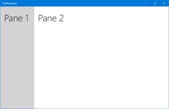
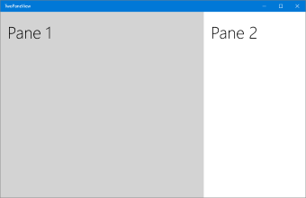
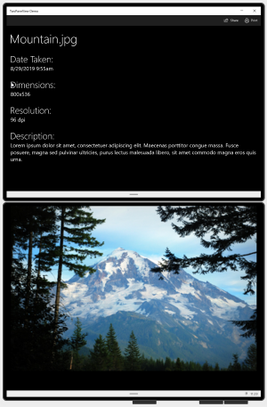

# Two-pane view

[TwoPaneView](/uwp/api/microsoft.ui.xaml.controls.twopaneview) is a layout control that helps you manage the display of apps that have 2 distinct areas of content, like a list/detail view.

> [!IMPORTANT]
> This article describes functionality and guidance that is in public preview and may be substantially modified before it's generally available. Microsoft makes no warranties, express or implied, with respect to the information provided here.

While it works on all Windows devices, the TwoPaneView control is designed to help you take full advantage of dual-screen devices automatically, with no special coding needed. On a dual-screen device, the two-pane view ensures that the user interface (UI) is split cleanly when it spans the gap between screens, so that your content is presented on either side of the gap.

> [!NOTE]
> A _dual-screen device_ is a special kind of device with unique capabilities. It's not equivalent to a desktop device with multiple monitors. For more info about dual-screen devices, see [Introduction to dual-screen devices](/dual-screen/introduction). (See [Show multiple views](../layout/show-multiple-views.md) for more info about ways you can optimize your app for multiple monitors.)

**Get WinUI**

:::row:::
   :::column:::
      
   :::column-end:::
   :::column span="3":::
      The **TwoPaneView** control is included as part of WinUI, a NuGet package that contains new controls and UI features for Windows apps. For more info, including installation instructions, see [WinUI](/uwp/toolkits/winui/).
   :::column-end:::
   :::column:::

   :::column-end:::
:::row-end:::

> **WinUI APIs:** [TwoPaneView class](/uwp/api/microsoft.ui.xaml.controls.twopaneview)

> [!TIP]
> Throughout this document, we use the **muxc** alias in XAML to represent WinUI APIs that we have included in our project. We have added this to our [Page](/windows/windows-app-sdk/api/winrt/microsoft.ui.xaml.controls.page) element: `xmlns:muxc="using:Microsoft.UI.Xaml.Controls"`
>
>In the code-behind, we also use the **muxc** alias in C# to represent WinUI APIs that we have included in our project. We have added this **using** statement at the top of the file: `using muxc = Microsoft.UI.Xaml.Controls;`

## Is this the right control?

Use the two-pane view when you have 2 distinct areas of content and:

- The content should automatically rearrange and resize to best fit the window.
- The secondary area of content should show/hide based on available space.
- The content should split cleanly between the 2 screens of a dual-screen device.

## Examples

These images show an app running on a single-screen and spanned across dual-screens. The two-pane view adapts the app UI to the various screen configurations.


> _App on a single-screen._


> _App spanning a dual-screen device in wide mode._


> _App spanning a dual-screen device in tall mode._

## How it works

The two-pane view has two panes where you place your content. It adjusts the size and arrangement of the panes depending on the space available to the window. The possible pane layouts are defined by the [TwoPaneViewMode](/uwp/api/microsoft.ui.xaml.controls.twopaneviewmode) enumeration:

| Enum&nbsp;value | Description |
| - | - |
| `SinglePane` | Only one pane is shown, as specified by the [PanePriority](/uwp/api/microsoft.ui.xaml.controls.twopaneview.panepriority) property. |
| `Wide` | Panes are shown side-by-side, or a single pane is shown, as specified by the [WideModeConfiguration](/uwp/api/microsoft.ui.xaml.controls.twopaneview.widemodeconfiguration) property. |
| `Tall` | Panes are shown top-bottom, or a single pane is shown, as specified by the [TallModeConfiguration](/uwp/api/microsoft.ui.xaml.controls.twopaneview.tallmodeconfiguration) property. |

You configure the two-pane view by setting the [PanePriority](/uwp/api/microsoft.ui.xaml.controls.twopaneview.panepriority) to specify which pane is shown when there is space for only one pane. Then, you specify whether `Pane1` is shown on the top or bottom for tall windows, or on the left or right for wide windows.

The two-pane view handles the size and arrangement of the panes, but you still need to make the content inside the pane adapt to the changes in size and orientation. See [Responsive layouts with XAML](../layout/layouts-with-xaml.md) and [Layout panels](../layout/layout-panels.md) for more info about creating an adaptive UI.

The [TwoPaneView](/uwp/api/microsoft.ui.xaml.controls.twopaneview) manages the display of the panes based on the spanning state of the app.

- On a single-screen

    When your app is on only a single screen, the `TwoPaneView` adjusts the size and position of its panes based on property settings you specify. We explain these properties in more detail in the next section. The only difference between devices is that some devices, like desktop PCs, allow re-sizable windows, while other devices don't.

- Spanned across dual-screens

    The `TwoPaneView` is designed to make it easy to optimize your UI for spanning on dual-screen devices. The window sizes itself to use all the available space on the screens. When your app spans both screens of a dual-screen device, each screen displays the content of one of the panes and properly spans content across the gap. Spanning-awareness is built-in when you use two-pane view. You only need to set the tall/wide configuration to specify which pane is shown on which screen. The two-pane view takes care of the rest.

## How to use the two-pane view control

The [TwoPaneView](/uwp/api/microsoft.ui.xaml.controls.twopaneview) doesn't have to be the root element of your page layout. In fact, you'll often use it inside a [NavigationView](/uwp/api/microsoft.ui.xaml.controls.navigationview) control that provides the overall navigation for your app. The `TwoPaneView` adapts appropriately regardless of where it is in the XAML tree; however, we do recommend that you not nest a `TwoPaneView` inside another `TwoPaneView`. (If you do, only the outer `TwoPaneView` is spanning-aware.)

### Add content to the panes

Each pane of a two-pane view can hold a single XAML `UIElement`. To add content, you typically place a XAML layout panel in each pane, and then add other controls and content to the panel. The panes can change size and switch between wide and tall modes, so you need to make sure the content in each pane can adapt to these changes. See [Responsive layouts with XAML](../layout/layouts-with-xaml.md) and [Layout panels](../layout/layout-panels.md) for more info about creating an adaptive UI.

This example creates the simple picture/info app UI shown previously in the _Examples_ section. When the app is spanned across dual-screens, the picture and the info are shown on separate screens. On a single screen, the content can be shown in two panes, or combined into a single pane, depending on how much space is available. (When there's only space for one pane, you move the content of Pane2 into Pane1, and let the user scroll to see any hidden content. You'll see the code for this later in the _Responding to mode changes_ section.)


```xaml
<Grid>
    <Grid.RowDefinitions>
        <RowDefinition Height="Auto" MinHeight="40"/>
        <RowDefinition Height="*"/>
    </Grid.RowDefinitions>

    <CommandBar DefaultLabelPosition="Right">
        <AppBarButton x:Name="Share" Icon="Share" Label="Share" Click="Share_Click"/>
        <AppBarButton x:Name="Print" Icon="Print" Label="Print" Click="Print_Click"/>
    </CommandBar>

    <muxc:TwoPaneView
        x:Name="MyTwoPaneView"
        Grid.Row="1"
        MinWideModeWidth="959"
        MinTallModeHeight="863"
        ModeChanged="TwoPaneView_ModeChanged">

        <muxc:TwoPaneView.Pane1>
            <Grid x:Name="Pane1Root">
                <ScrollViewer>
                    <StackPanel x:Name="Pane1StackPanel">
                        <Image Source="Assets\LandscapeImage8.jpg"
                               VerticalAlignment="Top" HorizontalAlignment="Center"
                               Margin="16,0"/>
                    </StackPanel>
                </ScrollViewer>
            </Grid>
        </muxc:TwoPaneView.Pane1>

        <muxc:TwoPaneView.Pane2>
            <Grid x:Name="Pane2Root">
                <ScrollViewer x:Name="DetailsContent">
                    <StackPanel Padding="16">
                        <TextBlock Text="Mountain.jpg" MaxLines="1"
                                       Style="{ThemeResource HeaderTextBlockStyle}"/>
                        <TextBlock Text="Date Taken:"
                                       Style="{ThemeResource SubheaderTextBlockStyle}"
                                       Margin="0,24,0,0"/>
                        <TextBlock Text="8/29/2019 9:55am"
                                       Style="{ThemeResource SubtitleTextBlockStyle}"/>
                        <TextBlock Text="Dimensions:"
                                       Style="{ThemeResource SubheaderTextBlockStyle}"
                                       Margin="0,24,0,0"/>
                        <TextBlock Text="800x536"
                                       Style="{ThemeResource SubtitleTextBlockStyle}"/>
                        <TextBlock Text="Resolution:"
                                       Style="{ThemeResource SubheaderTextBlockStyle}"
                                       Margin="0,24,0,0"/>
                        <TextBlock Text="96 dpi"
                                       Style="{ThemeResource SubtitleTextBlockStyle}"/>
                        <TextBlock Text="Description:"
                                       Style="{ThemeResource SubheaderTextBlockStyle}"
                                       Margin="0,24,0,0"/>
                        <TextBlock Text="Lorem ipsum dolor sit amet, consectetuer adipiscing elit. Maecenas porttitor congue massa. Fusce posuere, magna sed pulvinar ultricies, purus lectus malesuada libero, sit amet commodo magna eros quis urna."
                                       Style="{ThemeResource SubtitleTextBlockStyle}"
                                       TextWrapping="Wrap"/>
                    </StackPanel>
                </ScrollViewer>
            </Grid>
        </muxc:TwoPaneView.Pane2>
    </muxc:TwoPaneView>

    <VisualStateManager.VisualStateGroups>
        <VisualStateGroup x:Name="TwoPaneViewStates">
            <VisualState x:Name="Normal"/>
            <VisualState x:Name="Wide">
                <VisualState.Setters>
                    <Setter Target="MyTwoPaneView.Pane1Length"
                            Value="2*"/>
                </VisualState.Setters>
            </VisualState>
        </VisualStateGroup>
    </VisualStateManager.VisualStateGroups>
</Grid>
```

### Specify which pane to display

When the two-pane view can only display a single pane, it uses the [PanePriority](/uwp/api/microsoft.ui.xaml.controls.twopaneview.panepriority) property to determine which pane to display. By default, PanePriority is set to **Pane1**. Here's how you can set this property in XAML or in code.

```xaml
<muxc:TwoPaneView x:Name="MyTwoPaneView" PanePriority="Pane2">
```

```csharp
MyTwoPaneView.PanePriority = Microsoft.UI.Xaml.Controls.TwoPaneViewPriority.Pane2;
```

### Pane sizing

On a single screen, the size of the panes is determined by the [Pane1Length](/uwp/api/microsoft.ui.xaml.controls.twopaneview.pane1length) and [Pane2Length](/uwp/api/microsoft.ui.xaml.controls.twopaneview.pane2length) properties. These use [GridLength](/windows/windows-app-sdk/api/winrt/microsoft.ui.xaml.gridlength) values that support _auto_ and _star_(\*) sizing. See the _Layout properties_ section of [Responsive layouts with XAML](../layout/layouts-with-xaml.md#layout-properties) for an explanation of auto and star sizing.

By default, `Pane1Length` is set to `Auto` and it sizes itself to fit its content. `Pane2Length` is set to `*` and it uses all the remaining space.



> _Panes with default sizing_

The default values are useful for a typical list/detail layout, where you have a list of items in `Pane1`, and a lot of details in `Pane2`. However, depending on your content, you might prefer to divide the space differently. Here, `Pane1Length` is set to `2*` so it gets twice as much space as `Pane2`.

```xaml
<muxc:TwoPaneView x:Name="MyTwoPaneView" Pane1Length="2*">
```



> _Panes sized 2* and *_

> [!NOTE]
> As mentioned previously, when the app is spanned across dual-screens, these properties are ignored and each pane fills one of the screens.

If you set a pane to use auto sizing, you can control the size by setting the height and width of the Panel that holds the pane's content. In this case, you might need to handle the ModeChanged event and set the height and width constraints of the content as appropriate for the current mode.

### Display in wide or tall mode

On a single screen, the two-pane view's display [Mode](/uwp/api/microsoft.ui.xaml.controls.twopaneview.mode) is determined by the [MinWideModeWidth](/uwp/api/microsoft.ui.xaml.controls.twopaneview.minwidemodewidth) and [MinTallModeHeight](/uwp/api/microsoft.ui.xaml.controls.twopaneview.mintallmodeheight) properties. Both properties have a default value of 641px, the same as [NavigationView.CompactThresholdWidth](/windows/windows-app-sdk/api/winrt/microsoft.ui.xaml.controls.navigationview.compactmodethresholdwidth).

This table shows how the Height and Width of the TwoPaneView determine which display mode is used.

| TwoPaneView condition  | Mode |
|---------|---------|
| `Width` > `MinWideModeWidth` | `Wide` mode is used |
| `Width` <= `MinWideModeWidth`, and `Height` > `MinTallModeHeight` | `Tall` mode is used |
| `Width` <= `MinWideModeWidth`, and `Height` <= `MinTallModeHeight` | `SinglePane` mode is used |


> [!NOTE]
> As mentioned previously, when the app is spanned across dual-screens, these properties are ignored and display mode is determined based on the device _posture_.

#### Wide configuration options

The two-pane view enters `Wide` mode when there's a single display that's wider than the `MinWideModeWidth` property. `MinWideModeWidth` controls when the two-pane view enters wide mode. The default value is 641px, but you can change it to whatever you want. In general, you should set this property to whatever you want the minimum width of your pane to be.

When the two-pane view is in wide mode, the [WideModeConfiguration](/uwp/api/microsoft.ui.xaml.controls.twopaneview.widemodeconfiguration) property determines what to show:

| [Enum&nbsp;value](/uwp/api/microsoft.ui.xaml.controls.twopaneviewwidemodeconfiguration) | Description |
|---------|---------|
| `SinglePane` | A single pane (as determined by `PanePriority`). The pane takes up the full size of the `TwoPaneView` (ie, it's star sized in both directions). |
| `LeftRight` | `Pane1` on the left/`Pane2` on the right. Both panes are star sized vertically, `Pane1`'s width is autosized, and `Pane2`'s width is star sized. |
| `RightLeft` | `Pane1` on the right/`Pane2` on the left. Both panes are star sized vertically, `Pane2`'s width is autosized, and `Pane1`'s width is star sized. |

The default setting is `LeftRight`.

| LeftRight | RightLeft |
| - | - |
|   |   |

> **TIP:** When the device uses a right-to-left (RTL) language, the two-pane view automatically swaps the order: `RightLeft` renders as `LeftRight`, and `LeftRight` renders as `RightLeft`.

#### Tall configuration options

The two-pane view enters `Tall` mode when there's a single display that's narrower than `MinWideModeWidth`, and taller than `MinTallModeHeight`. The default value is 641px, but you can change it to whatever you want. In general, you should set this property to whatever you want the minimum height of your pane to be.

When the two-pane view is in tall mode, the [TallModeConfiguration](/uwp/api/microsoft.ui.xaml.controls.twopaneview.tallmodeconfiguration) property determines what to show:

| [Enum&nbsp;value](/uwp/api/microsoft.ui.xaml.controls.twopaneviewtallmodeconfiguration) | Description |
|---------|---------|
| `SinglePane` | A single pane (as determined by `PanePriority`). The pane takes up the full size of the `TwoPaneView` (ie, it's star sized in both directions). |
| `TopBottom` | `Pane1` on the top/`Pane2` on the bottom. Both panes are star sized horizontally, `Pane1`'s height is autosized, and `Pane2`'s height is star sized. |
| `BottomTop` | `Pane1` on the bottom/`Pane2` on the top. Both panes are star sized horizontally, `Pane2`'s height is autosized, and `Pane1`'s height is star sized. |

The default is `TopBottom`.

| TopBottom | BottomTop |
| - | - |
|   |   |

#### Special values for MinWideModeWidth and MinTallModeHeight

You can use the `MinWideModeWidth` property to prevent the two-pane view from entering Wide mode - just set `MinWideModeWidth` to [Double.PositiveInfinity](/dotnet/api/system.double.positiveinfinity?view=dotnet-uwp-10.0&preserve-view=true).

If you set `MinTallModeHeight` to [Double.PositiveInfinity](/dotnet/api/system.double.positiveinfinity?view=dotnet-uwp-10.0&preserve-view=true), it prevents the two-pane view from entering Tall mode.

If you set `MinTallModeHeight` to 0, it prevents the two-pane view from entering `SinglePane` mode.

#### Responding to mode changes

You can use the read-only [Mode](/uwp/api/microsoft.ui.xaml.controls.twopaneview.mode) property to get the current display mode. Whenever the two-pane view changes which pane or panes it's displaying, the [ModeChanged](/uwp/api/microsoft.ui.xaml.controls.twopaneview.modechanged) event occurs before it renders the updated content. You can handle the event to respond to changes in the display mode.

> [!TIP]
> The `ModeChanged` event does not occur when the page is initially loaded, so your default XAML should represent the UI as it should appear when first loaded.

One way you can use this event is to update your app's UI so users can view all the content in `SinglePane` mode. For example, the example app has a primary pane (the image) and an info pane.


> _Tall mode_

When there's only enough space to display one pane, you can move the content of `Pane2` into `Pane1` so the user can scroll to see all the content. It looks like this.


> _SinglePane mode_

Remember that the `MinWideModeWidth` and `MinTallModeHeight` properties determine when the display mode changes, so you can change when the content is moved between panes by adjusting the values of these properties.

Here's the `ModeChanged` event handler code that moves the content between `Pane1` and `Pane2`. It also sets a [VisualState](/windows/windows-app-sdk/api/winrt/microsoft.ui.xaml.visualstate) to constrain the width of the image in Wide mode.

```csharp
private void TwoPaneView_ModeChanged(Microsoft.UI.Xaml.Controls.TwoPaneView sender, object args)
{
    // Remove details content from it's parent panel.
    ((Panel)DetailsContent.Parent).Children.Remove(DetailsContent);
    // Set Normal visual state.
    Windows.UI.Xaml.VisualStateManager.GoToState(this, "Normal", true);

    // Single pane
    if (sender.Mode == Microsoft.UI.Xaml.Controls.TwoPaneViewMode.SinglePane)
    {
        // Add the details content to Pane1.
        Pane1StackPanel.Children.Add(DetailsContent);
    }
    // Dual pane.
    else
    {
        // Put details content in Pane2.
        Pane2Root.Children.Add(DetailsContent);

        // If also in Wide mode, set Wide visual state
        // to constrain the width of the image to 2*.
        if (sender.Mode == Microsoft.UI.Xaml.Controls.TwoPaneViewMode.Wide)
        {
            Windows.UI.Xaml.VisualStateManager.GoToState(this, "Wide", true);
        }
    }
}
```

## Dos and don'ts

- Do use the two-pane view whenever you can so that your app can take advantage of dual-screens and large screens.
- Don't put a two-pane view inside another two-pane view.

## Related articles

- [Layout overview](../layout/index.md)
- [Dual-screen development](/dual-screen)
- [Introduction to dual-screen devices](/dual-screen/introduction)
