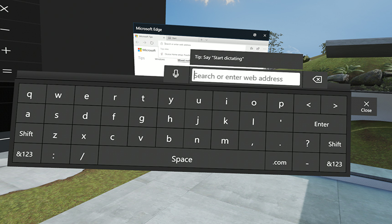

# Designing for Mixed Reality

Design your app to look good in Mixed Reality, and take advantage of new input methods.

## Overview

[Mixed Reality](https://developer.microsoft.com/windows/mixed-reality/mixed_reality) is the result of blending the physical world with the digital world. The spectrum of mixed reality experiences includes at one extreme devices such as the HoloLens (a device that mixes computer generated content with the real world), and at the other a completely immersive view of Virtual Reality (as viewed with a Windows Mixed Reality headset). See [Types of mixed reality apps](https://developer.microsoft.com/windows/mixed-reality/types_of_mixed_reality_apps) for examples of how experiences will vary.

Almost all existing UWP apps will run in the Mixed Reality environment as 2D apps with no changes, although the experience for the user can be improved by following some of the guidance in this topic.


Both the HoloLens and Windows Mixed Reality headsets support applications running on the UWP platform, and both support two distinct types of experience. 

### 2D vs. Immersive Experience

An immersive app takes over the entire display visible to the user, placing her at the center of a view created by the app. For example, an immersive game might place the user on the surface of an alien planet, or a tour guide app might place the user in a South American village. Creating an immersive app requires 3D graphics or captured stereographic video. Immersive apps are often developed using a 3rd party game engine such as Unity, or with DirectX.

If you are creating immersive apps, you should visit the [Windows Mixed Reality Dev Center](https://developer.microsoft.com/mixed-reality) for more information.

A 2D app runs as a traditional flat window within the user's view. On the HoloLens, that means a view pinned to the wall or a point in space in the users own real-world living room or office. In a Windows Mixed Reality headset, the app is pinned to a wall in the [mixed reality home](/windows/mixed-reality/enthusiast-guide/your-mixed-reality-home) (sometimes called the *Cliff House*).


These 2D apps do not take over the entire view: they are placed within it. Multiple 2D apps can exist in the environment at once.

The remainder of this topic discusses design considerations for the 2D experience.

## Launching 2D apps


All apps are launched from the Start Menu, but it's also possible to create a 3D object to act as an app launcher. See the [Creating 3D App Launchers for Windows Mixed Reality](https://www.youtube.com/watch?v=TxIslHsEXno) video for details.

## The 2D App Input Overview

Keyboards and mice are supported on both HoloLens and Mixed Reality platforms. You can pair a keyboard and mouse directly with the HoloLens over Bluetooth. Mixed Reality apps support the mouse and keyboard connected to the host computer. Both may be useful in situations when a fine-level of control is necessary.

Other, more natural, input methods are also supported, and these may be particularly useful when the user isn't sitting at a desk with a real keyboard in front of them, or when fine control is needed.

Without any extra hardware or coding, apps will use gaze - the vector your user is looking along - as a mouse pointer when working with 2D apps. It is implemented as if a mouse pointer was hovering over something in the virtual scene.

In a typical interaction, your user will look at a control in your app, causing it to highlight. The user will when trigger an action, using either a gesture (on the HoloLens), or a controller or by giving a voice command. If the user selects a text input field, the software keyboard will appear. 




It's important to note that all these interactions will happen automatically with no extra coding on your part, as a consequence of running on the UWP platform. Input from the HoloLens and Mixed Reality headset will appear as touch input to the 2D app. This means that many UWP apps will run and be usable in Mixed Reality, by default. 

That said, with some extra work, the experience can be improved greatly. For example, [voice control](https://developer.microsoft.com/windows/mixed-reality/voice_design) can be especially effective. Both HoloLens and Mixed Reality environments support voice commands for launching and interacting with apps, and including voice support will appear as a natural extension of this approach. See [Speech interactions]( ../input/speech-interactions.md) for more information on adding voice support to your UWP app. 


### Selecting the right controller


Several novel input methods have been designed especially for use with Mixed Reality, specifically:

* [Hand gestures](https://developer.microsoft.com/windows/mixed-reality/gestures) (HoloLens only, but only used for launching 2D apps)
* [Gamepad support](https://developer.microsoft.com/windows/mixed-reality/hardware_accessories) (both environments)
* [Clicker device](https://developer.microsoft.com/windows/mixed-reality/hardware_accessories) (HoloLens only)
* [Motion Controllers](/windows/mixed-reality/motion-controllers) (Mixed Reality devices only, shown above.)

These controllers make interacting with virtual objects seem natural and precise. Some of the interactions you get for free. For example, the HoloLens select gesture or clicking on the Motion Controller's Windows key or trigger will generate the input response you would expect, again, with no coding on your part.

At other times, you will want to add code to take advantage of the extra information and inputs that are made available. For example, the Motion Controllers can be used to manipulate objects with a fine level of control, if you write code that takes their position and button presses into account.

> [!NOTE]
> In summary: the guiding principal should be to always provide the user with as natural and frictionless an input method as possible.


## 2D App Design considerations: Functionality

When creating a UWP app that will potentially be used on a Mixed Reality platform, there are several things to keep in mind.

* Drag and drop may not work well when used with Motion Controllers, gamepads or gestures. If your application depends heavily on drag and drop, you will need to provide an alternative method of supporting this action, such as presenting a dialog confirming if objects to be moved to a new location.

* Be aware how sound changes. If your app generates sound effects, the source of the sound will appear to be your app's pinned location in the virtual world. As the user moves away from the app, sound will diminish. See [Spatial sound](/windows/mixed-reality/spatial-sound) for more information.

* Consider the field of view and provide affordances. Not every device will provide as large a field of view as a computer monitor. See [Holographic frame](https://developer.microsoft.com/windows/mixed-reality/holographic_frame) for complete details. Furthermore, the user may be some distance away from a running app. That is, the app may appear pinned to the wall at a different location in the world (real or virtual). Your app may need to get the users attention, or take into account that the entire view is not visible at all times. Toast notifications are available, but another way to get the user's attention might be to generate a sound or [speech](https://github.com/Microsoft/Windows-universal-samples/blob/master/Samples/SpeechRecognitionAndSynthesis/cs/Scenario_SynthesizeText.xaml.cs) alert.

* A 2D app is automatically given an [app bar](https://developer.microsoft.com/windows/mixed-reality/app_bar_and_bounding_box)  to allow the user to move and scale them in the virtual environment. The views can be resized vertically, or resized maintaining the same aspect ratio.


## 2D app design considerations: UI/UX

* XAML controls which implement the [Fluent Design System](/windows/uwp/design/fluent-design-system/) such as the [Navigation view](../controls/navigationview.md), and effects such as [Acrylic](../style/acrylic.md) all work especially well in 2D Mixed Reality apps.

* Test your app's text and windows size in a Mixed Reality device, or at the very least in the Mixed Reality Simulator. Your app will have a default windows size of 853x480 effective pixels. Use larger font sizes (a point size of approximately 32 is recommended), and read [Updating 2D UWP apps for Windows Mixed Reality](/windows/mixed-reality/develop/porting-apps/building-2d-apps). The article [Typography](https://developer.microsoft.com/windows/mixed-reality/typography) covers this topic in detail. When working in Visual Studio, there is a XAML design editor setting for a 57" HoloLens 2D App which provides a view with the correct scale and dimensions.


* [Your gaze is your mouse](/windows/mixed-reality/design/gaze-and-commit). When the user looks at something, it acts as a **touch hover** event, so simply looking at an object may trigger an inadvertent pop-up or other unwanted interaction. You may need to detect if the app is currently running in Mixed Reality and change this behavior. See **Runtime support**, below. 

* When a user gazes towards something or points with a motion controller, a **touch hover** event will occur. This consists of a **PointerPoint** where **PointerType** is **Touch**, but **IsInContact** is **false**. When some form of commit occurs (for example, gamepad A button is pressed, a clicker device is pressed, a motion controller trigger pressed, or voice recognition heads "Select"), a **touch press** occurs, with the **PointerPoint** having **IsInContact** become **true**. See [Touch interactions](../input/touch-interactions.md) for more information on these input events.

* Remember, gaze is not as accurate as mouse pointing. Smaller mouse targets or buttons may cause frustration for your users, so resize controls accordingly. If they are designed for touch, they will work in Mixed Reality, but you may decide to enlarge some buttons at runtime. See [Updating 2D UWP apps for Windows Mixed Reality](/windows/mixed-reality/develop/porting-apps/building-2d-apps).

* The HoloLens defines the color black as the absence of light. It's simply not rendered, allowing the "real world" so show through. Your application should not use black if this is would cause confusion. In a Mixed Reality headset, black is black.

* The HoloLens does not support color themes in apps, and defaults to blue to ensure the best experience for users. For more advice about selecting colors, you should consult [this topic](https://developer.microsoft.com/windows/mixed-reality/color_light_and_materials) which discusses the use of color and material in Mixed Reality designs.


## Other points to consider

* Although the [Desktop Bridge](/windows/msix/desktop/source-code-overview) can help bring existing (Win32) desktop apps to Windows and the Microsoft Store, it cannot create apps that run on HoloLens at this time. As of Windows 10 version 1903, Win32 Desktop apps can run on Mixed Reality headsets.

## Runtime support

It is possible for your app to determine if it is running on a Mixed Reality device at runtime, and use this as an opportunity to resize controls or in other ways optimize the app for use on a headset.

Here's a short piece of code that resizes the text inside a XAML TextBlock control only if the app is being used on a Mixed Reality device.

```csharp

bool isViewingInMR = Windows.ApplicationModel.Preview.Holographic.HolographicApplicationPreview.IsCurrentViewPresentedOnHolographicDisplay();

            if (isViewingInMR)
            {
                // Running on headset, resize the XAML text
                textBlock.Text = "I'm running in Mixed Reality!";
                textBlock.FontSize = 32;
            }
            else
            {
                // Running on desktop
                textBlock.Text = "I'm running on the desktop.";
                textBlock.FontSize = 14;
            }

```


## Related articles


* [Current limitations for apps using APIs from the shell](https://developer.microsoft.com/windows/mixed-reality/current_limitations_for_apps_using_apis_from_the_shell)
* [Building 2D apps](https://developer.microsoft.com/windows/mixed-reality/building_2d_apps)
* [Conditional XAML](/windows/uwp/debug-test-perf/conditional-xaml)
