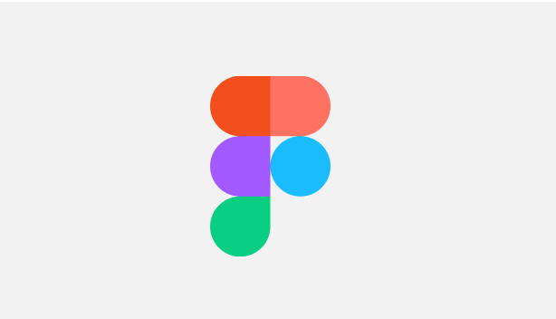
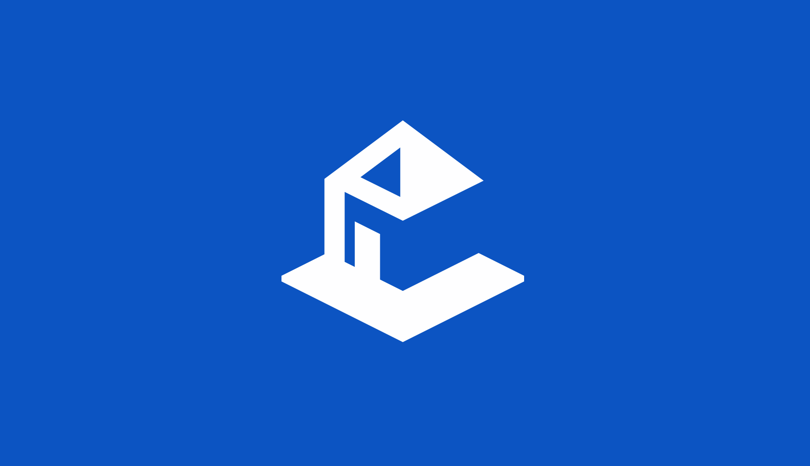
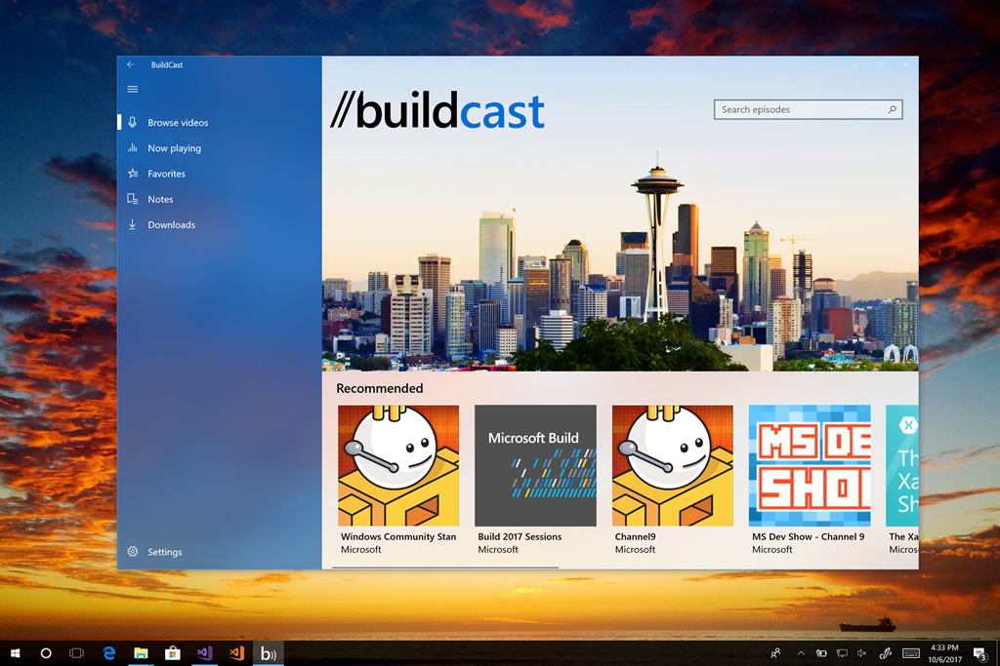
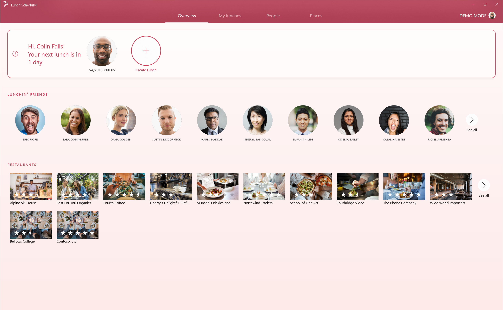

# Design toolkits and samples for Windows apps

Design and UI-related downloads for Fluent Design/Windows apps. For additional tools, such as Visual Studio, see <a href="https://developer.microsoft.com/windows/downloads">our main downloads page</a>.

## Toolkits and libraries

:::row:::
    :::column:::
        
        **Figma Toolkit** 
        WinUI 3 in WinAppSDK 1.1, October 2022 
        [Download](https://aka.ms/WinUI/3.0-figma-toolkit)
    :::column-end:::
    :::column:::
        
        **Windows UI Library** 
        Controls and other UI elements for Windows apps. 
        [Installation instructions](/uwp/toolkits/winui/getting-started)
    :::column-end:::
    :::column:::
        
        **Windows Community Toolkit** 
        Helper functions, custom controls, and app services. 
        [Installation instructions](/windows/uwpcommunitytoolkit/getting-started)
    :::column-end:::
    :::column:::
        
        **Template Studio** 
        Quickly scaffold apps using a wizard-based UI. 
        [Installation instructions](https://github.com/microsoft/TemplateStudio#template-studio)
    :::column-end:::
:::row-end:::

## WinUI Gallery

Get the _WinUI Gallery_ apps from the Microsoft Store to see XAML controls and the Fluent Design System in action. The **WinUI 3 Gallery** and **WinUI 2 Gallery** apps include interactive examples of most WinUI 3 and WinUI 2 controls, features, and functionality. The apps are an interactive companion to this website. When you have them installed, you can use links on individual control pages to launch the app and see the control in action.

> [!div class="checklist"]
>
> - Get the [**WinUI 3 Gallery**](https://www.microsoft.com/store/productId/9P3JFPWWDZRC) and the [**WinUI 2 Gallery**](https://www.microsoft.com/store/productId/9MSVH128X2ZT) from the Microsoft Store.
> - Get the source code for both from [GitHub](https://github.com/Microsoft/WinUI-Gallery) (use the *main* branch for WinUI 3 and the *winui2* branch for WinUI 2).

## Fonts

- [Segoe UI Variable](https://aka.ms/SegoeUIVariable)
- [Segoe Fluent Icons](https://aka.ms/SegoeFluentIcons)
- [Segoe UI](https://aka.ms/segoeuifont)
- [Segoe MDL2](https://aka.ms/segoemdl2)
- [Hololens icon font (Windows only)](https://aka.ms/hololensiconfont)

## Tools

:::row:::
    :::column:::

    :::column-end:::
    :::column span="2":::
      **Tile and icon generator for Adobe Photoshop**
      This set of actions for Adobe Photoshop generates the 68 recommended tile and icon assets from just 7 files.  <a href="https://download.microsoft.com/download/B/5/F/B5F22952-44DF-46EC-820B-11951AE01AEC/UWP tile and icon asset generator.zip">Download the tile and icon generator</a>

    :::column-end:::
:::row-end:::

    
## Samples

**Fluent XAML Theme Editor** 
The Fluent XAML Theme Editor is a tool that helps demonstrate the flexibility of the Fluent Design System as well as supports the app development process by generating XAML markup for our ResourceDictionary framework used in Windows applications.
<a href="https://github.com/Microsoft/fluent-xaml-theme-editor/archive/master.zip">Download the tool sample</a>  <a href="https://github.com/Microsoft/fluent-xaml-theme-editor">Check out the tool on GitHub</a>

**VanArsdel** 
The Van Arsdel, Ltd. end-to-end Windows sample app was built to showcase the next wave of the Microsoft Fluent Design System. It makes extensive use of the improved density and new controls in the <a href="/windows/apps/winui/">Windows UI Library</a> as well as powerful underlying features of the UX framework and composition. The sample shows how you can build a rich, productive experience for managing and purchasing IoT devices (in this case, lamps). 
<a href="https://github.com/Microsoft/VanArsdel/archive/master.zip">Download the VanArsdel sample</a>  <a href="https://github.com/microsoft/vanarsdel">Check out the VanArsdel sample on GitHub</a>

**BuildCast** 
BuildCast is an end-to-end sample built to showcase the Fluent Design System and Windows. It permits browsing, downloading, and playback of select video podcasts, including some Windows tech enthusiast feeds. It also features ink notes, bookmarks, and remote playback. This sample was initially shown at the 2017 Build conference during the Build Amazing Apps with Fluent Design talk.  
<a href="https://github.com/Microsoft/BuildCast/archive/master.zip">Download the BuildCast sample</a>  <a href="https://github.com/Microsoft/BuildCast">Check out the BuildCast sample on GitHub</a>

**Lunch Scheduler** 
A Windows app sample that schedules lunches with your friends and coworkers. You create a lunch, invite friends to a restaurant of interest, and the app takes care of the lunch management for all involved parties. This app incorporates elements of the Fluent Design System in a Windows app, including acrylic, reveal, and connected animations.  <a href="https://github.com/Microsoft/Windows-appsample-lunch-scheduler/archive/master.zip">Download the Lunch Scheduler sample</a> <a href="https://github.com/Microsoft/Windows-appsample-lunch-scheduler">Check out the Lunch Scheduler sample on GitHub</a>
  

## Want more code?

Check out the Windows sample page for complete list of all our Windows app samples. <a href="https://developer.microsoft.com/windows/samples">Go to the samples portal</a>
