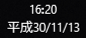

# Prepare your application for the Japanese era change

> [!NOTE]
> On April 1, 2019, the new era name was announced: Reiwa (令和). On April 25, Microsoft released packages for different Windows operating systems containing the updated registry key with the new era name. Update your device and check your registry to see if it has the new key, and then test your application. Check [this support article](https://support.microsoft.com/help/4469068/summary-of-new-japanese-era-updates-kb4469068) to make sure your operating system should have received the updated registry key.

The Japanese calendar is divided into eras, and for most of the modern age of computing, we've been in the Heisei era; however, on May 1, 2019, a new era will begin. Because this is the first time in decades for an era to change, software that supports the Japanese calendar will need to be tested to ensure it will function properly when the new era begins.

In the following sections, you will learn what you can do to prepare and test your application for the upcoming new era.

> [!NOTE]
> We recommend that you use a test machine for this, because the changes you make will impact the behavior of the entire machine.

## Add a registry key for the new era

> [!NOTE]
> The following instructions are meant for devices that have not yet been updated with the new registry key. First check if your device contains the new registry key, and if not, test using the following instructions.

It is important to test for compatibility problems before the era has changed, and you can do so now using the new era name. To do this, add a registry key for the new era using **Registry Editor**:

1. Navigate to **Computer\HKEY_LOCAL_MACHINE\SYSTEM\CurrentControlSet\Control\Nls\Calendars\Japanese\Eras**.
2. Select **Edit > New > String Value**, and give it the name **2019 05 01**.
3. Right-click the key and select **Modify**.
4. In the **Value data** field, enter **令和_令_Reiwa_R** (you can copy and paste from here to make it easier).

See [Era Handling for the Japanese Calendar](/windows/desktop/Intl/era-handling-for-the-japanese-calendar) to read more about the format for these registry keys.

On April 1, 2019, the new era name was announced. On April 25, an update with a new registry key for supported Windows versions containing the name was released, allowing you to validate that your application handles it properly. This update is being propagated to supported earlier releases of Windows 10, as well as Windows 8 and 7.

You can delete your placeholder registry key once you're finished testing your application. This will ensure it doesn't interfere with the new registry key that will be added when Windows is updated.

## Change your device's calendar format

Once you've added the registry key for the new era, you need to configure your device to use the Japanese calendar. You don't need to have a Japanese-language device to do this. For thorough testing, you may want to install the Japanese language pack as well, but it isn't required for basic testing.

To configure your device to use the Japanese calendar:

1. Open **intl.cpl** (search for it from the Windows search bar).
2. From the **Format** dropdown, select **Japanese (Japan)**.
3. Select **Additional settings**.
4. Select the **Date** tab.
5. From the **Calendar type** dropdown, select **和暦** (*wareki*, the Japanese calendar). It should be the second option.
6. Click **OK**.
7. Click **OK** in the **Region** window.

Your device should now be configured to use the Japanese calendar, and it will reflect whichever eras are in the registry. Below is an example of what you might see now in the lower-right corner of the screen:

## Adjust your device's clock

To test that your application works with the new era, you must advance your computer's clock to May 1, 2019 or later. The following instructions are for Windows 10, but Windows 8 and 7 should work similarly:

1. Right-click the date and time area in the lower-right corner of the screen.
2. Select **Adjust date/time**.
3. In the Settings app, under **Change date and time**, select **Change**.
4. Change the date to on or after May 1, 2019.

> [!NOTE]
> You may not be able to change the date based on organization settings; if this is the case, talk to your admin. Alternatively, you can edit your placeholder registry key to have a date that has already passed.

## Test your application

Now, test out how your application handles the new era. Check places where the date is displayed, such as timestamps and date pickers. Make sure that the era is correct before May 1, 2019 (Heisei, 平成) and after (Reiwa, 令和).

### *Gannen* (元年)

The format for the Japanese calendar is generally **&lt;Era name&gt; &lt;Year of era&gt;**. For example, the year 2018 is **Heisei 30** (平成30年).  However, the first year of an era is special; instead of being **&lt;Era name&gt; 1**, it is **&lt;Era name&gt; 元年** (*gannen*). So, the first year of the Heisei era would be 平成元年 (*Heisei gannen*). Make sure that your application properly handles the first year of the new era, and correctly outputs 令和元年.

## Related APIs

There are several WinRT, .NET, and Win32 APIs that will be updated to handle the era change, so if you use them, you shouldn't have to worry too much. However, even if you do rely entirely on these APIs, it's still a good idea to test your application and make sure you get the desired behavior, especially if you are doing anything special with them like parsing.

You can follow along with updates to the OS and SDKs at [Updates for May 2019 Japan Era Change](https://support.microsoft.com/help/4470918/updates-for-may-2019-japan-era-change).

The following APIs will be impacted:

### WinRT

* [Windows.Globalization Namespace](/uwp/api/windows.globalization)
  * [Calendar Class](/uwp/api/windows.globalization.calendar)
    * [AddDays Method](/uwp/api/windows.globalization.calendar.adddays)
    * [AddEras Method](/uwp/api/windows.globalization.calendar.adderas)
    * [AddHours Method](/uwp/api/windows.globalization.calendar.addhours)
    * [AddMinutes Method](/uwp/api/windows.globalization.calendar.addminutes)
    * [AddMonths Method](/uwp/api/windows.globalization.calendar.addmonths)
    * [AddNanoseconds Method](/uwp/api/windows.globalization.calendar.addnanoseconds)
    * [AddPeriods Method](/uwp/api/windows.globalization.calendar.addperiods)
    * [AddSeconds Method](/uwp/api/windows.globalization.calendar.addseconds)
    * [AddWeeks Method](/uwp/api/windows.globalization.calendar.addweeks)
    * [AddYears Method](/uwp/api/windows.globalization.calendar.addyears)
    * [Era Property](/uwp/api/windows.globalization.calendar.era)
    * [EraAsString Method](/uwp/api/windows.globalization.calendar.eraasstring)
    * [FirstYearInThisEra Property](/uwp/api/windows.globalization.calendar.firstyearinthisera)
    * [LastEra Property](/uwp/api/windows.globalization.calendar.lastera)
    * [LastYearInThisEra Property](/uwp/api/windows.globalization.calendar.lastyearinthisera)
    * [NumberOfYearsInThisEra Property](/uwp/api/windows.globalization.calendar.numberofyearsinthisera)
* [Windows.Globalization.DateTimeFormatting Namespace](/uwp/api/windows.globalization.datetimeformatting)
  * [DateTimeFormatter Class](/uwp/api/windows.globalization.datetimeformatting.datetimeformatter)
    * [Format Method](/uwp/api/windows.globalization.datetimeformatting.datetimeformatter.format)

### .NET

* [System Namespace](/dotnet/api/system)
  * [DateTime Struct](/dotnet/api/system.datetime)
  * [DateTimeOffset Struct](/dotnet/api/system.datetimeoffset)
* [System.Globalization Namespace](/dotnet/api/system.globalization)
  * [Calendar Class](/dotnet/api/system.globalization.calendar)
  * [DateTimeFormatInfo Class](/dotnet/api/system.globalization.datetimeformatinfo)
  * [JapaneseCalendar Class](/dotnet/api/system.globalization.japanesecalendar)
  * [JapaneseLunisolarCalendar Class](/dotnet/api/system.globalization.japaneselunisolarcalendar)

### Win32

* [datetimeapi.h header](/windows/desktop/api/datetimeapi/)
  * [GetDateFormatA function](/windows/desktop/api/datetimeapi/nf-datetimeapi-getdateformata)
  * [GetDateFormatEx function](/windows/desktop/api/datetimeapi/nf-datetimeapi-getdateformatex)
  * [GetDateFormatW function](/windows/desktop/api/datetimeapi/nf-datetimeapi-getdateformatw)
* [winnls.h header](/windows/desktop/api/winnls/)
  * [EnumDateFormatsA function](/windows/desktop/api/winnls/nf-winnls-enumdateformatsa)
  * [EnumDateFormatsExA function](/windows/desktop/api/winnls/nf-winnls-enumdateformatsexa)
  * [EnumDateFormatsExEx function](/windows/desktop/api/winnls/nf-winnls-enumdateformatsexex)
  * [EnumDateFormatsExW function](/windows/desktop/api/winnls/nf-winnls-enumdateformatsexw)
  * [EnumDateFormatsW function](/windows/desktop/api/winnls/nf-winnls-enumdateformatsw)
  * [GetCalendarInfoA function](/windows/desktop/api/winnls/nf-winnls-getcalendarinfoa)
  * [GetCalendarInfoEx function](/windows/desktop/api/winnls/nf-winnls-getcalendarinfoex)
  * [GetCalendarInfoW function](/windows/desktop/api/winnls/nf-winnls-getcalendarinfow)

## See also

* [Era Handling for the Japanese Calendar](/windows/desktop/Intl/era-handling-for-the-japanese-calendar)
* [The Japanese Calendar’s Y2K Moment](/archive/blogs/shawnste/the-japanese-calendars-y2k-moment)
* [Using the Registry to Test the New Japanese Era on Windows](/archive/blogs/shawnste/using-the-registry-to-test-the-new-japanese-era-on-windows)
* [Gannen vs Ichinen](/archive/blogs/shawnste/gannen-vs-ichinen)
* [Updates for May 2019 Japan Era Change](https://support.microsoft.com/help/4470918/updates-for-may-2019-japan-era-change)
* [Handling a new era in the Japanese calendar in .NET](https://devblogs.microsoft.com/dotnet/handling-a-new-era-in-the-japanese-calendar-in-net/)