# Design guidelines

The Guidelines section covers the core building blocks of Windows app design. These topics define the patterns, rules, and behaviors that ensure your app feels intuitive, polished, and aligned with Fluent Design. From color and typography to motion, layout, and materials, each foundation helps you make consistent decisions that scale across pages, features, and form factors.

Use these fundamentals as a guide throughout your design process—whether you're mapping out your first screens, refining interaction patterns, or ensuring your UI matches Windows conventions. Exploring these foundations early can save development time, reduce rework, and lead to better experiences for your users.

---

:::row:::
    :::column:::
       [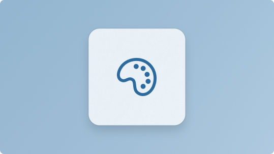](./signature-experiences/color.md) 
        **[Color](./signature-experiences/color.md)** 
        Use color to establish hierarchy, communicate meaning, and create a cohesive visual identity..
    :::column-end:::
    :::column:::
       [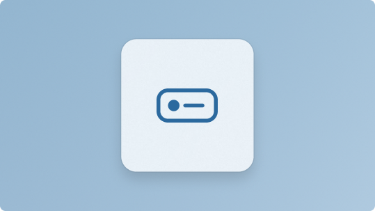](./basics/commanding-basics.md) 
        **[Commanding](./basics/commanding-basics.md)** 
        Present actions in clear, consistent patterns that help users understand what they can do.
    :::column-end:::
    :::column:::
       [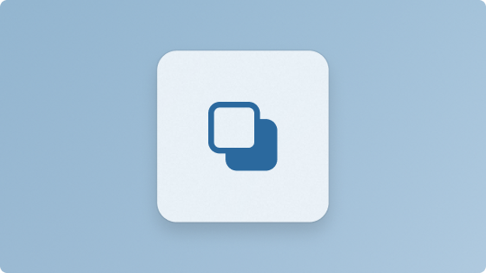](./signature-experiences/layering.md) 
        **[Elevation](./signature-experiences/layering.md)** 
        Apply depth and layering to guide focus and reinforce the structure of your interface.
    :::column-end:::
:::row-end:::

:::row:::
    :::column:::
       [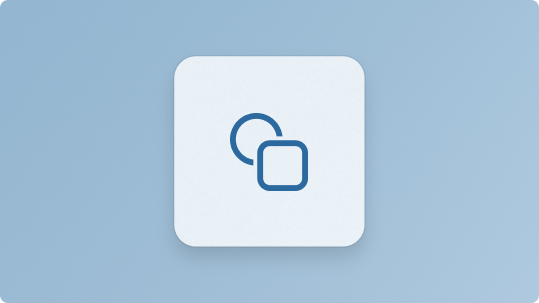](./signature-experiences/geometry.md) 
        **[Geometry](./signature-experiences/geometry.md)** 
        Use shape, sizing, and spatial relationships to create balanced, predictable layouts.
    :::column-end:::
    :::column:::
       [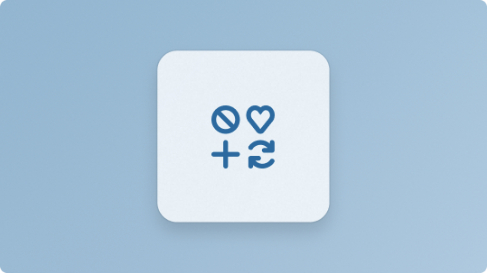](./signature-experiences/iconography.md) 
        **[Iconography](./signature-experiences/iconography.md)** 
        Communicate actions and concepts quickly with familiar, purposeful icons.
    :::column-end:::
    :::column:::
       [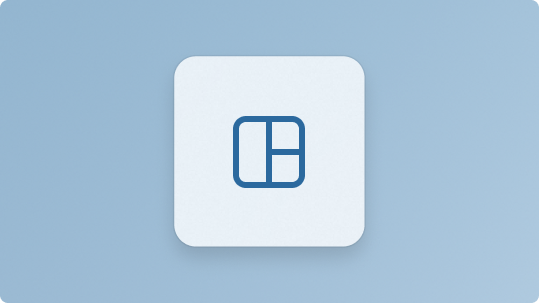](layout/index.md) 
        **[Layout](./layout/index.md)** 
        Organize content with grids, spacing, and alignment patterns that improve clarity and flow.
    :::column-end:::
:::row-end:::

:::row:::
    :::column:::
        
        **[Materials](./signature-experiences/materials.md)** 
        Enhance your UI with Fluent materials like Mica and Acrylic to add depth and warmth.
    :::column-end:::
    :::column:::
       [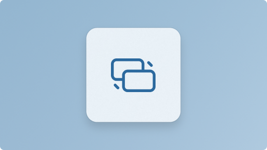](./signature-experiences/motion.md) 
        **[Motion](./signature-experiences/motion.md)** 
        Use motion to provide feedback, guide attention, and create smooth, responsive interactions.
    :::column-end:::
    :::column:::
       [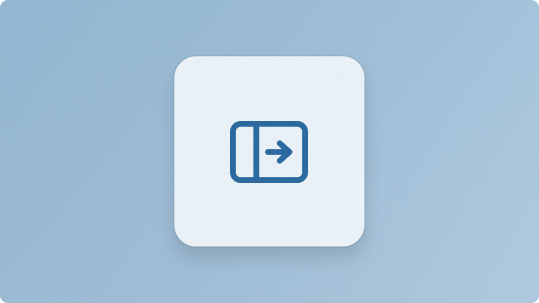](./basics/navigation-basics.md) 
        **[Navigation](./basics/navigation-basics.md)** 
        Help users move through your app with predictable, well-structured navigation patterns.
    :::column-end:::
:::row-end:::
:::row:::
    :::column:::
        
        **[Sound](./style/sound.md)** 
        Use audio cues to provide feedback, reinforce actions, and support accessibility.
    :::column-end:::
    :::column:::
       [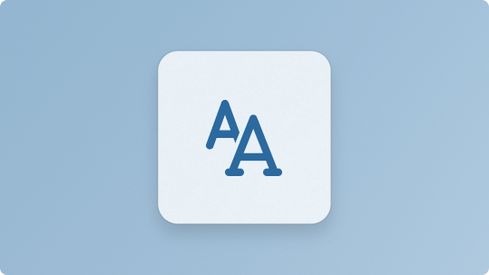](./signature-experiences/typography.md) 
        **[Typography](./signature-experiences/typography.md)** 
        Set the tone and improve readability with consistent type choices and hierarchy.
    :::column-end:::
    :::column:::
       [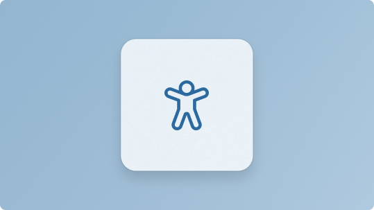](./usability/index.md) 
        **[Usability](./usability/index.md)** 
        Ensure your app is easy to use through intuitive interactions, clear affordances, and accessibility.
    :::column-end:::
:::row-end:::

:::row:::
    :::column:::
       [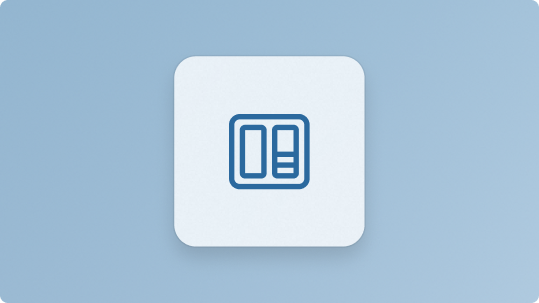](./widgets/index.md) 
        **[Widgets](./widgets/index.md)** 
        Extend your app with glanceable, interactive surfaces that surface key information and actions.
    :::column-end:::
    :::column:::
       [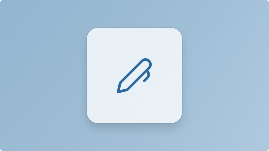](style/writing-style.md ) 
        **[Writing](./style/writing-style.md )** 
        Use clear, concise, and helpful language to improve understanding and reduce cognitive load.
    :::column-end:::
:::row-end:::