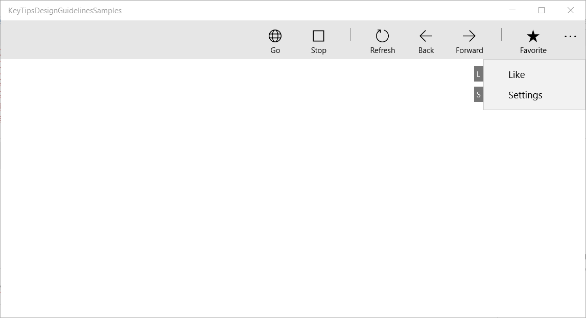
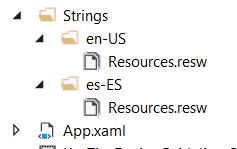
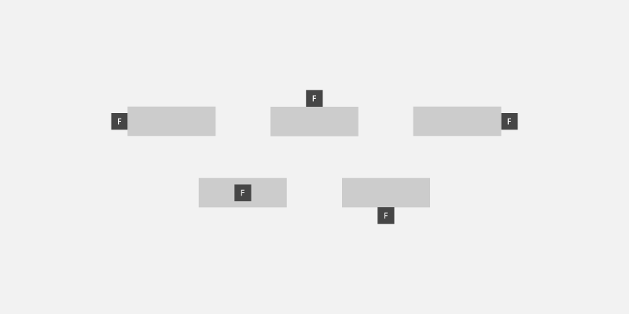
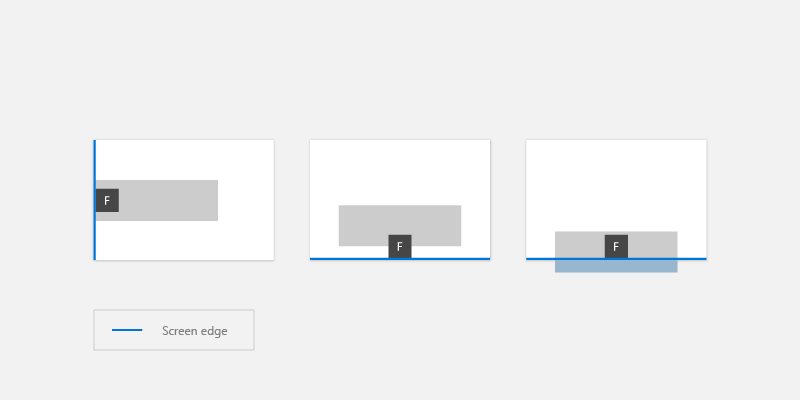

# Access keys

Access keys are keyboard shortcuts that improve the usability and the accessibility of your Windows applications by providing an intuitive way for users to quickly navigate and interact with an app's visible UI through a keyboard instead of a pointer device (such as touch or mouse).

The Windows app provides built-in support across platform controls for both keyboard-based access keys and associated UI feedback through visual cues called keytips.

> [!NOTE]
> A keyboard is indispensable for users with certain disabilities (see [Keyboard accessibility](../accessibility/keyboard-accessibility.md)), and is also an important tool for users who prefer it as a more efficient way to interact with an app.

See the [Accelerator keys](keyboard-accelerators.md) topic for details on invoking common actions in a Windows application with keyboard shortcuts. 

To create your own custom keyboard shortcuts, see the [Keyboard events](keyboard-events.md) topic.

## Overview

An access key is a combination of the Alt key and one or more alphanumeric keys—sometimes called a *mnemonic*—typically pressed sequentially, rather than simultaneously.

Keytips are badges displayed next to controls that support access keys when the user presses the Alt key. Each keytip contains the alphanumeric keys that activate the associated control.

> [!NOTE]
> Keyboard shortcuts are automatically supported for access keys with a single alphanumeric character. For example, simultaneously pressing Alt+F in Word opens the File menu without displaying keytips.

Pressing the Alt key initializes access key functionality and displays all currently available key combinations in keytips. Subsequent keystrokes are handled by the access key framework, which rejects invalid keys until either a valid access key is pressed, or the Enter, Esc, Tab, or Arrow keys are pressed to deactivate access keys and return keystroke handling to the app.

Microsoft Office apps provide extensive support for access keys. The following image shows the Home tab of Word with access keys activated (note the support for both numbers and multiple keystrokes).


_KeyTip badges for access keys in Microsoft Word_

To add an access key to a control, use the **AccessKey property**. The value of this property specifies the access key sequence, the shortcut (if a single alphanumeric), and the keytip.

``` xaml
<Button Content="Accept" AccessKey="A" Click="AcceptButtonClick" />
```

## When to use access keys

We recommend that you specify access keys wherever appropriate in your UI, and support access keys in all custom controls.

1.  **Access keys make your app more accessible** for users with motor disabilities, including those users who can press only one key at a time or have difficulty using a mouse.

    A well-designed keyboard UI is an important aspect of software accessibility. It enables users with vision impairments or who have certain motor disabilities to navigate an app and interact with its features. Such users might not be able to operate a mouse and instead rely on various assistive technologies such as keyboard enhancement tools, on-screen keyboards, screen enlargers, screen readers, and voice input utilities. For these users, comprehensive command coverage is crucial.

2.  **Access keys make your app more usable** for power users who prefer
    to interact through the keyboard.

    Experienced users often have a strong preference for using the keyboard because keyboard-based commands can be entered more quickly and don't require them to remove their hands from the keyboard. For these users, efficiency and consistency are crucial; comprehensiveness is important only for the most frequently used commands.

## Set access key scope

When there are many elements on the screen that support access keys, we recommend scoping the access keys to reduce **cognitive load**. This minimizes the number of access keys on the screen, which makes them easier to locate, and improves efficiency and productivity.

For example, Microsoft Word provides two access key scopes: a primary scope for the Ribbon tabs and a secondary scope for commands on the selected tab.

The following images demonstrate the two access key scopes in Word. The first shows the primary access keys that let a user select a tab and other top level commands, and the second shows the secondary access keys for the Home tab.


_Primary access keys in Microsoft Word_


_Secondary access keys in Microsoft Word_

Access keys can be duplicated for elements in different scopes. In the preceding example, "2" is the access key for Undo in the primary scope, and also "Italics" in the secondary scope.

Here, we show how to define an access key scope.

``` xaml
<CommandBar x:Name="MainCommandBar" AccessKey="M" >
    <AppBarButton AccessKey="G" Icon="Globe" Label="Go"/>
    <AppBarButton AccessKey="S" Icon="Stop" Label="Stop"/>
    <AppBarSeparator/>
    <AppBarButton AccessKey="R" Icon="Refresh" Label="Refresh" IsAccessKeyScope="True">
        <AppBarButton.Flyout>
            <MenuFlyout>
                <MenuFlyoutItem AccessKey="A" Icon="Globe" Text="Refresh A" />
                <MenuFlyoutItem AccessKey="B" Icon="Globe" Text="Refresh B" />
                <MenuFlyoutItem AccessKey="C" Icon="Globe" Text="Refresh C" />
                <MenuFlyoutItem AccessKey="D" Icon="Globe" Text="Refresh D" />
            </MenuFlyout>
        </AppBarButton.Flyout>
    </AppBarButton>
    <AppBarButton AccessKey="B" Icon="Back" Label="Back"/>
    <AppBarButton AccessKey="F" Icon="Forward" Label="Forward"/>
    <AppBarSeparator/>
    <AppBarToggleButton AccessKey="T" Icon="Favorite" Label="Favorite"/>
    <CommandBar.SecondaryCommands>
        <AppBarToggleButton Icon="Like" AccessKey="L" Label="Like"/>
        <AppBarButton Icon="Setting" AccessKey="S" Label="Settings" />
    </CommandBar.SecondaryCommands>
</CommandBar>
```


_CommandBar primary scope and supported access keys_



_CommandBar secondary scope and supported access keys_

### Windows 10 Creators Update and older

Prior to Windows 10 Fall Creators Update, some controls, such as the CommandBar, didn't support built-in access key scopes.

The following example shows how to support CommandBar SecondaryCommands with access keys, which are available once a parent command is invoked (similar to the Ribbon in Word).

```xaml
<local:CommandBarHack x:Name="MainCommandBar" AccessKey="M" >
    <AppBarButton AccessKey="G" Icon="Globe" Label="Go"/>
    <AppBarButton AccessKey="S" Icon="Stop" Label="Stop"/>
    <AppBarSeparator/>
    <AppBarButton AccessKey="R" Icon="Refresh" Label="Refresh" IsAccessKeyScope="True">
        <AppBarButton.Flyout>
            <MenuFlyout>
                <MenuFlyoutItem AccessKey="A" Icon="Globe" Text="Refresh A" />
                <MenuFlyoutItem AccessKey="B" Icon="Globe" Text="Refresh B" />
                <MenuFlyoutItem AccessKey="C" Icon="Globe" Text="Refresh C" />
                <MenuFlyoutItem AccessKey="D" Icon="Globe" Text="Refresh D" />
            </MenuFlyout>
        </AppBarButton.Flyout>
    </AppBarButton>
    <AppBarButton AccessKey="B" Icon="Back" Label="Back"/>
    <AppBarButton AccessKey="F" Icon="Forward" Label="Forward"/>
    <AppBarSeparator/>
    <AppBarToggleButton AccessKey="T" Icon="Favorite" Label="Favorite"/>
    <CommandBar.SecondaryCommands>
        <AppBarToggleButton Icon="Like" AccessKey="L" Label="Like"/>
        <AppBarButton Icon="Setting" AccessKey="S" Label="Settings" />
    </CommandBar.SecondaryCommands>
</local:CommandBarHack>
```

```csharp
public class CommandBarHack : CommandBar
{
    CommandBarOverflowPresenter secondaryItemsControl;
    Popup overflowPopup;

    public CommandBarHack()
    {
        this.ExitDisplayModeOnAccessKeyInvoked = false;
        AccessKeyInvoked += OnAccessKeyInvoked;
    }

    protected override void OnApplyTemplate()
    {
        base.OnApplyTemplate();

        Button moreButton = GetTemplateChild("MoreButton") as Button;
        moreButton.SetValue(Control.IsTemplateKeyTipTargetProperty, true);
        moreButton.IsAccessKeyScope = true;

        // SecondaryItemsControl changes
        secondaryItemsControl = GetTemplateChild("SecondaryItemsControl") as CommandBarOverflowPresenter;
        secondaryItemsControl.AccessKeyScopeOwner = moreButton;

        overflowPopup = GetTemplateChild("OverflowPopup") as Popup;
    }

    private void OnAccessKeyInvoked(UIElement sender, AccessKeyInvokedEventArgs args)
    {
        if (overflowPopup != null)
        {
            overflowPopup.Opened += SecondaryMenuOpened;
        }
    }

    private void SecondaryMenuOpened(object sender, object e)
    {
        //This is not neccesay given we are automatically pushing the scope.
        var item = secondaryItemsControl.Items.First();
        if (item != null && item is Control)
        {
            (item as Control).Focus(FocusState.Keyboard);
        }
        overflowPopup.Opened -= SecondaryMenuOpened;
    }
}
```

## Avoid access key collisions

Access key collisions occur when two or more elements in the same scope have duplicate access keys, or start with the same alphanumeric characters.

The system resolves duplicate access keys by processing the access key of the first element added to the visual tree, ignoring all others.

When multiple access keys start with the same character (for example, "A", "A1", and "AB"), the system processes the single character access key and ignores all others.

Avoid collisions by using unique access keys or by scoping commands.

## Choose access keys

Consider the following when choosing access keys:

-   Use a single character to minimize keystrokes and support accelerator keys by default (Alt+AccessKey)
-   Avoid using more than two characters
-   Avoid access keys collisions
-   Avoid characters that are difficult to differentiate from other characters, such as the letter "I" and the number "1" or the letter "O" and the number "0"
-   Use well-known precedents from other popular apps such as Word ("F" for "File", "H" for "Home", and so on)
-   Use the first character of the command name, or a character with a close association to the command that helps with recall
    -   If the first letter is already assigned, use a letter that is as close as possible to the first letter of the command name ("N" for Insert)
    -   Use a distinctive consonant from the command name ("W" for View)
    -   Use a vowel from the command name.

## Localize access keys

If your app is going to be localized in multiple languages, you should also **consider localizing the access keys**. For example, for "H" for "Home" in en-US and "I" for "Incio" in es-ES.

Use the x:Uid extension in markup to apply localized resources as shown here:

``` xaml
<Button Content="Home" AccessKey="H" x:Uid="HomeButton" />
```
Resources for each language are added to corresponding String folders in the project:



_English and Spanish resource string folders_

Localized access keys are specified in your projects resources.resw file:


_Specify the AccessKey property specified in the resources.resw file_

For more info, see [Translating UI resources ](/previous-versions/windows/apps/hh965329(v=win.10))

## Keytip positioning

Keytips are displayed as floating badges relative to their corresponding UI element, taking into account the presence of other UI elements, other keytips, and the screen edge.

Typically, the default keytip location is sufficient and provides built-in support for adaptive UI.


_Example of automatic keytip placement_

However, should you need more control over keytip positioning, we recommend the following:

1.  **Obvious association principle**: The user can associate the control with the keytip easily.

    a.  The keytip should be **close** to the element who have the access key (the owner).  
    b.  The keytip should **avoid covering enabled elements** that have access keys.   
    c.  If a keytip can't be placed close to its owner, it should overlap the owner. 

2.  **Discoverability**: The user can discover the control with the keytip quickly.

    a.  The keytip never **overlaps** other keytips.  

3.  **Easy scanning:** The user can skim the keytips easily.

    a.  keytips should be **aligned** with each other and with the UI Element.
    b.  keytips should be **grouped** as much as possible. 

### Relative position

Use the **KeyTipPlacementMode** property to customize the placement of the keytip on a per element or per group basis.

The placement modes are: Top, Bottom, Right, Left, Hidden, Center, and Auto.



_keytip placement modes_

The center line of the control is used to calculate the vertical and horizontal alignment of the keytip.

They following example shows how to set the keytip placement of a group of controls using the KeyTipPlacementMode property of a StackPanel container.

``` xaml
<StackPanel Background="{ThemeResource ApplicationPageBackgroundThemeBrush}" KeyTipPlacementMode="Top">
  <Button Content="File" AccessKey="F" />
  <Button Content="Home" AccessKey="H" />
  <Button Content="Insert" AccessKey="N" />
</StackPanel>
```

### Offsets

Use the KeyTipHorizontalOffset and KeyTipVerticalOffset properties of an element for even more granular control of the keytip location.

> [!NOTE]
> Offsets cannot be set when KeyTipPlacementMode is set to Auto.

The KeyTipHorizontalOffset property indicates how far to move the keytip left or right.


_Set vertical and horizontal keytip offsets for a button_

``` xaml
<Button
  Content="File"
  AccessKey="F"
  KeyTipPlacementMode="Bottom"
  KeyTipHorizontalOffset="20"
  KeyTipVerticalOffset="-8" />
```

### Screen edge alignment {#screen-edge-alignment .ListParagraph}

The location of a keytip is automatically adjusted based on the screen edge to ensure the keytip is fully visible. When this occurs, the distance between the control and keytip alignment point might differ from the values specified for the horizontal and vertical offsets .



_keytips are automatically positioned based on the screen edge_

## Keytip style

We recommend using the built-in keytip support for platform themes, including high contrast.

If you need to specify your own keytip styles, use application resources such as KeyTipFontSize (font size), KeyTipFontFamily (font family), KeyTipBackground (background), KeyTipForeground (foreground), KeyTipPadding (padding), KeyTipBorderBrush(Border color), and KeyTipBorderThemeThickness (border thickness).


_keytip customization options_

This example demonstrates how to change these application resources:

 ```xaml  
<Application.Resources>
  <SolidColorBrush Color="DarkGray" x:Key="MyBackgroundColor" />
  <SolidColorBrush Color="White" x:Key="MyForegroundColor" />
  <SolidColorBrush Color="Black" x:Key="MyBorderColor" />
  <StaticResource x:Key="KeyTipBackground" ResourceKey="MyBackgroundColor" />
  <StaticResource x:Key="KeyTipForeground" ResourceKey="MyForegroundColor" />
  <StaticResource x:Key="KeyTipBorderBrush" ResourceKey="MyBorderColor"/>
  <FontFamily x:Key="KeyTipFontFamily">Consolas</FontFamily>
  <x:Double x:Key="KeyTipContentThemeFontSize">18</x:Double>
  <Thickness x:Key="KeyTipBorderThemeThickness">2</Thickness>
  <Thickness x:Key="KeyTipThemePadding">4,4,4,4</Thickness>
</Application.Resources>
```

## Access keys and Narrator

The XAML framework exposes Automation Properties that enable UI Automation clients to discover information about elements in the user interface.

If you specify the AccessKey property on a UIElement or TextElement control, you can use the [AutomationProperties.AccessKey](/dotnet/api/system.windows.automation.automationproperties.accesskey) property to get this value. Accessibility clients, such as Narrator, read the value of this property each time an element gets focus.

## Related articles

* [Keyboard interactions](keyboard-interactions.md)
* [Keyboard accelerators](keyboard-accelerators.md)

**Samples**
* [WinUI Gallery](https://github.com/Microsoft/WinUI-Gallery)
