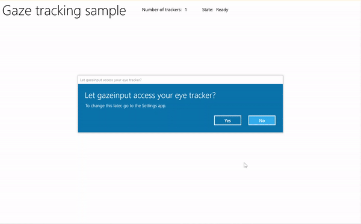

# Gaze interactions and eye tracking in Windows apps


Provide support for tracking a user's gaze, attention, and presence based on the location and movement of their eyes.

> [!NOTE]
> For gaze input in [Windows Mixed Reality](/windows/mixed-reality/), see [Gaze]/windows/mixed-reality/mrtk-unity/features/input/gaze).

**Important APIs**: [Windows.Devices.Input.Preview](/uwp/api/windows.devices.input.preview), [GazeDevicePreview](/uwp/api/windows.devices.input.preview.gazedevicepreview), [GazePointPreview](/uwp/api/windows.devices.input.preview.gazepointpreview), [GazeInputSourcePreview](/uwp/api/windows.devices.input.preview.gazeinputsourcepreview)

## Overview

Gaze input is a powerful way to interact and use Windows applications that is especially useful as an assistive technology for users with neuro-muscular diseases (such as ALS) and other disabilities involving impaired muscle or nerve functions.

In addition, gaze input offers equally compelling opportunities for both gaming (including target acquisition and tracking) and traditional productivity applications, kiosks, and other interactive scenarios where traditional input devices (keyboard, mouse, touch) are not available, or where it might be useful/helpful to free up the user's hands for other tasks (such as holding shopping bags).

> [!NOTE]
> Support for eye tracking hardware was introduced in **Windows 10 Fall Creators Update** along with [Eye control](https://support.microsoft.com/help/4043921/windows-10-get-started-eye-control), a built-in feature that lets you use your eyes to control the on-screen pointer, type with the on-screen keyboard, and communicate with people using text-to-speech. A set of Windows Runtime APIs ([Windows.Devices.Input.Preview](/uwp/api/windows.devices.input.preview)) for building applications that can interact with eye tracking hardware is available with **Windows 10 April 2018 Update (Version 1803, build 17134)** and newer.

## Privacy

Due to the potentially sensitive personal data collected by eye tracking devices, you are required to declare the `gazeInput` capability in the app manifest of your application (see the following **Setup** section). When declared, Windows automatically prompts users with a consent dialog (when the app is first run), where the user must grant permission for the app to communicate with the eye-tracking device and access this data.

In addition, if your app collects, stores, or transfers eye tracking data, you must describe this in your app's privacy statement and follow all other requirements for **Personal Information** in the [App Developer Agreement](/legal/windows/agreements/app-developer-agreement) and the [Microsoft Store Policies](/windows/apps/publish/store-policies-and-code-of-conduct).

## Setup

To use the gaze input APIs in your Windows app you'll need to: 

- Specify the `gazeInput` capability in the app manifest.

    Open the **Package.appxmanifest** file with the Visual Studio manifest designer, or add the capability manually by selecting **View code**, and inserting the following `DeviceCapability` into the `Capabilities` node:

    ```xaml
    <Capabilities>
       <DeviceCapability Name="gazeInput" />
    </Capabilities>
    ```

- A Windows-compatible eye-tracking device connected to your system (either built-in or peripheral) and turned on.

    See [Get started with eye control in Windows 10](https://support.microsoft.com/help/4043921/windows-10-get-started-eye-control#supported-devices ) for a list of supported eye-tracking devices.

## Basic eye tracking

In this example, we demonstrate how to track the user's gaze within a Windows app and use a timing function with basic hit testing to indicate how well they can maintain their gaze focus on a specific element.

A small ellipse is used to show where the gaze point is within the application viewport, while a [RadialProgressBar](/windows/communitytoolkit/controls/radialprogressbar) from the [Windows Community Toolkit](/windows/communitytoolkit/) is placed randomly on the canvas. When gaze focus is detected on the progress bar, a timer is started and the progress bar is randomly relocated on the canvas when the progress bar reaches 100%.



*Gaze tracking with timer sample*

**Download this sample from [Gaze input sample (basic)](https://github.com/MicrosoftDocs/windows-topic-specific-samples/archive/uwp-gazeinput-basic.zip)**

1. First, we set up the UI (MainPage.xaml).

    ```xaml
    <Page
        x:Class="gazeinput.MainPage"
        xmlns="http://schemas.microsoft.com/winfx/2006/xaml/presentation"
        xmlns:x="http://schemas.microsoft.com/winfx/2006/xaml"
        xmlns:local="using:gazeinput"
        xmlns:d="http://schemas.microsoft.com/expression/blend/2008"
        xmlns:mc="http://schemas.openxmlformats.org/markup-compatibility/2006"
        xmlns:controls="using:Microsoft.Toolkit.Uwp.UI.Controls"    
        mc:Ignorable="d">
    
        <Grid Background="{ThemeResource ApplicationPageBackgroundThemeBrush}">
            <Grid x:Name="containerGrid">
                <Grid.RowDefinitions>
                    <RowDefinition Height="Auto"/>
                    <RowDefinition Height="*"/>
                </Grid.RowDefinitions>
                <StackPanel x:Name="HeaderPanel" 
                        Orientation="Horizontal" 
                        Grid.Row="0">
                    <StackPanel.Transitions>
                        <TransitionCollection>
                            <AddDeleteThemeTransition/>
                        </TransitionCollection>
                    </StackPanel.Transitions>
                    <TextBlock x:Name="Header" 
                           Text="Gaze tracking sample" 
                           Style="{ThemeResource HeaderTextBlockStyle}" 
                           Margin="10,0,0,0" />
                    <TextBlock x:Name="TrackerCounterLabel"
                           VerticalAlignment="Center"                 
                           Style="{ThemeResource BodyTextBlockStyle}"
                           Text="Number of trackers: " 
                           Margin="50,0,0,0"/>
                    <TextBlock x:Name="TrackerCounter"
                           VerticalAlignment="Center"                 
                           Style="{ThemeResource BodyTextBlockStyle}"
                           Text="0" 
                           Margin="10,0,0,0"/>
                    <TextBlock x:Name="TrackerStateLabel"
                           VerticalAlignment="Center"                 
                           Style="{ThemeResource BodyTextBlockStyle}"
                           Text="State: " 
                           Margin="50,0,0,0"/>
                    <TextBlock x:Name="TrackerState"
                           VerticalAlignment="Center"                 
                           Style="{ThemeResource BodyTextBlockStyle}"
                           Text="n/a" 
                           Margin="10,0,0,0"/>
                </StackPanel>
                <Canvas x:Name="gazePositionCanvas" Grid.Row="1">
                    <controls:RadialProgressBar
                        x:Name="GazeRadialProgressBar" 
                        Value="0"
                        Foreground="Blue" 
                        Background="White"
                        Thickness="4"
                        Minimum="0"
                        Maximum="100"
                        Width="100"
                        Height="100"
                        Outline="Gray"
                        Visibility="Collapsed"/>
                    <Ellipse 
                        x:Name="eyeGazePositionEllipse"
                        Width="20" Height="20"
                        Fill="Blue" 
                        Opacity="0.5" 
                        Visibility="Collapsed">
                    </Ellipse>
                </Canvas>
            </Grid>
        </Grid>
    </Page>
    ```

2. Next, we initialize our app.

    In this snippet, we declare our global objects and override the [OnNavigatedTo](/uwp/api/windows.ui.xaml.controls.page.onnavigatedto) page event to start our [gaze device watcher](/uwp/api/windows.devices.input.preview.gazedevicewatcherpreview) and the [OnNavigatedFrom](/uwp/api/windows.ui.xaml.controls.page.onnavigatedfrom) page event to stop our [gaze device watcher](/uwp/api/windows.devices.input.preview.gazedevicewatcherpreview).

    ```csharp
    using System;
    using Windows.Devices.Input.Preview;
    using Windows.UI.Xaml.Controls;
    using Windows.UI.Xaml;
    using Windows.Foundation;
    using System.Collections.Generic;
    using Windows.UI.Xaml.Media;
    using Windows.UI.Xaml.Navigation;
    
    namespace gazeinput
    {
        public sealed partial class MainPage : Page
        {
            /// <summary>
            /// Reference to the user's eyes and head as detected
            /// by the eye-tracking device.
            /// </summary>
            private GazeInputSourcePreview gazeInputSource;
    
            /// <summary>
            /// Dynamic store of eye-tracking devices.
            /// </summary>
            /// <remarks>
            /// Receives event notifications when a device is added, removed, 
            /// or updated after the initial enumeration.
            /// </remarks>
            private GazeDeviceWatcherPreview gazeDeviceWatcher;
    
            /// <summary>
            /// Eye-tracking device counter.
            /// </summary>
            private int deviceCounter = 0;
    
            /// <summary>
            /// Timer for gaze focus on RadialProgressBar.
            /// </summary>
            DispatcherTimer timerGaze = new DispatcherTimer();
    
            /// <summary>
            /// Tracker used to prevent gaze timer restarts.
            /// </summary>
            bool timerStarted = false;
    
            /// <summary>
            /// Initialize the app.
            /// </summary>
            public MainPage()
            {
                InitializeComponent();
            }

            /// <summary>
            /// Override of OnNavigatedTo page event starts GazeDeviceWatcher.
            /// </summary>
            /// <param name="e">Event args for the NavigatedTo event</param>
            protected override void OnNavigatedTo(NavigationEventArgs e)
            {
                // Start listening for device events on navigation to eye-tracking page.
                StartGazeDeviceWatcher();
            }
    
            /// <summary>
            /// Override of OnNavigatedFrom page event stops GazeDeviceWatcher.
            /// </summary>
            /// <param name="e">Event args for the NavigatedFrom event</param>
            protected override void OnNavigatedFrom(NavigationEventArgs e)
            {
                // Stop listening for device events on navigation from eye-tracking page.
                StopGazeDeviceWatcher();
            }
        }
    }
    ```

3. Next, we add our gaze device watcher methods. 
    
    In `StartGazeDeviceWatcher`, we call [CreateWatcher](/uwp/api/windows.devices.input.preview.gazeinputsourcepreview.createwatcher) and declare the eye-tracking device event listeners ([DeviceAdded](/uwp/api/windows.devices.input.preview.gazedevicewatcherpreview.added), [DeviceUpdated](/uwp/api/windows.devices.input.preview.gazedevicewatcherpreview.updated), and [DeviceRemoved](/uwp/api/windows.devices.input.preview.gazedevicewatcherpreview.removed)).

    In `DeviceAdded`, we check the state of the eye-tracking device. If a viable device, we increment our device count and enable gaze tracking. See next step for details.

    In `DeviceUpdated`, we also enable gaze tracking as this event is triggered if a device is recalibrated.

    In `DeviceRemoved`, we decrement our device counter and remove the device event handlers.

    In `StopGazeDeviceWatcher`, we shut down the gaze device watcher. 

```csharp
    /// <summary>
    /// Start gaze watcher and declare watcher event handlers.
    /// </summary>
    private void StartGazeDeviceWatcher()
    {
        if (gazeDeviceWatcher == null)
        {
            gazeDeviceWatcher = GazeInputSourcePreview.CreateWatcher();
            gazeDeviceWatcher.Added += this.DeviceAdded;
            gazeDeviceWatcher.Updated += this.DeviceUpdated;
            gazeDeviceWatcher.Removed += this.DeviceRemoved;
            gazeDeviceWatcher.Start();
        }
    }

    /// <summary>
    /// Shut down gaze watcher and stop listening for events.
    /// </summary>
    private void StopGazeDeviceWatcher()
    {
        if (gazeDeviceWatcher != null)
        {
            gazeDeviceWatcher.Stop();
            gazeDeviceWatcher.Added -= this.DeviceAdded;
            gazeDeviceWatcher.Updated -= this.DeviceUpdated;
            gazeDeviceWatcher.Removed -= this.DeviceRemoved;
            gazeDeviceWatcher = null;
        }
    }

    /// <summary>
    /// Eye-tracking device connected (added, or available when watcher is initialized).
    /// </summary>
    /// <param name="sender">Source of the device added event</param>
    /// <param name="e">Event args for the device added event</param>
    private void DeviceAdded(GazeDeviceWatcherPreview source, 
        GazeDeviceWatcherAddedPreviewEventArgs args)
    {
        if (IsSupportedDevice(args.Device))
        {
            deviceCounter++;
            TrackerCounter.Text = deviceCounter.ToString();
        }
        // Set up gaze tracking.
        TryEnableGazeTrackingAsync(args.Device);
    }

    /// <summary>
    /// Initial device state might be uncalibrated, 
    /// but device was subsequently calibrated.
    /// </summary>
    /// <param name="sender">Source of the device updated event</param>
    /// <param name="e">Event args for the device updated event</param>
    private void DeviceUpdated(GazeDeviceWatcherPreview source,
        GazeDeviceWatcherUpdatedPreviewEventArgs args)
    {
        // Set up gaze tracking.
        TryEnableGazeTrackingAsync(args.Device);
    }

    /// <summary>
    /// Handles disconnection of eye-tracking devices.
    /// </summary>
    /// <param name="sender">Source of the device removed event</param>
    /// <param name="e">Event args for the device removed event</param>
    private void DeviceRemoved(GazeDeviceWatcherPreview source,
        GazeDeviceWatcherRemovedPreviewEventArgs args)
    {
        // Decrement gaze device counter and remove event handlers.
        if (IsSupportedDevice(args.Device))
        {
            deviceCounter--;
            TrackerCounter.Text = deviceCounter.ToString();

            if (deviceCounter == 0)
            {
                gazeInputSource.GazeEntered -= this.GazeEntered;
                gazeInputSource.GazeMoved -= this.GazeMoved;
                gazeInputSource.GazeExited -= this.GazeExited;
            }
        }
    }
```

4. Here, we check if the device is viable in `IsSupportedDevice` and, if so, attempt to enable gaze tracking in `TryEnableGazeTrackingAsync`.

    In `TryEnableGazeTrackingAsync`, we declare the gaze event handlers, and call [GazeInputSourcePreview.GetForCurrentView()](/uwp/api/windows.devices.input.preview.gazeinputsourcepreview.getforcurrentview) to get a reference to the input source (this must be called on the UI thread, see [Keep the UI thread responsive](/windows/uwp/debug-test-perf/keep-the-ui-thread-responsive)).

    > [!NOTE]
    > You should call [GazeInputSourcePreview.GetForCurrentView()](/uwp/api/windows.devices.input.preview.gazeinputsourcepreview.getforcurrentview) only when a compatible eye-tracking device is connected and required by your application. Otherwise, the consent dialog is unnecessary.

```csharp
    /// <summary>
    /// Initialize gaze tracking.
    /// </summary>
    /// <param name="gazeDevice"></param>
    private async void TryEnableGazeTrackingAsync(GazeDevicePreview gazeDevice)
    {
        // If eye-tracking device is ready, declare event handlers and start tracking.
        if (IsSupportedDevice(gazeDevice))
        {
            timerGaze.Interval = new TimeSpan(0, 0, 0, 0, 20);
            timerGaze.Tick += TimerGaze_Tick;

            SetGazeTargetLocation();

            // This must be called from the UI thread.
            gazeInputSource = GazeInputSourcePreview.GetForCurrentView();

            gazeInputSource.GazeEntered += GazeEntered;
            gazeInputSource.GazeMoved += GazeMoved;
            gazeInputSource.GazeExited += GazeExited;
        }
        // Notify if device calibration required.
        else if (gazeDevice.ConfigurationState ==
                    GazeDeviceConfigurationStatePreview.UserCalibrationNeeded ||
                    gazeDevice.ConfigurationState ==
                    GazeDeviceConfigurationStatePreview.ScreenSetupNeeded)
        {
            // Device isn't calibrated, so invoke the calibration handler.
            System.Diagnostics.Debug.WriteLine(
                "Your device needs to calibrate. Please wait for it to finish.");
            await gazeDevice.RequestCalibrationAsync();
        }
        // Notify if device calibration underway.
        else if (gazeDevice.ConfigurationState == 
            GazeDeviceConfigurationStatePreview.Configuring)
        {
            // Device is currently undergoing calibration.  
            // A device update is sent when calibration complete.
            System.Diagnostics.Debug.WriteLine(
                "Your device is being configured. Please wait for it to finish"); 
        }
        // Device is not viable.
        else if (gazeDevice.ConfigurationState == GazeDeviceConfigurationStatePreview.Unknown)
        {
            // Notify if device is in unknown state.  
            // Reconfigure/recalbirate the device.  
            System.Diagnostics.Debug.WriteLine(
                "Your device is not ready. Please set up your device or reconfigure it."); 
        }
    }

    /// <summary>
    /// Check if eye-tracking device is viable.
    /// </summary>
    /// <param name="gazeDevice">Reference to eye-tracking device.</param>
    /// <returns>True, if device is viable; otherwise, false.</returns>
    private bool IsSupportedDevice(GazeDevicePreview gazeDevice)
    {
        TrackerState.Text = gazeDevice.ConfigurationState.ToString();
        return (gazeDevice.CanTrackEyes &&
                    gazeDevice.ConfigurationState == 
                    GazeDeviceConfigurationStatePreview.Ready);
    }
```

5. Next, we set up our gaze event handlers.

    We display and hide the gaze tracking ellipse in `GazeEntered` and `GazeExited`, respectively.

    In `GazeMoved`, we move our gaze tracking ellipse based on the [EyeGazePosition](/uwp/api/windows.devices.input.preview.gazepointpreview.eyegazeposition) provided by the [CurrentPoint](/uwp/api/windows.devices.input.preview.gazeenteredprevieweventargs.currentpoint) of the [GazeEnteredPreviewEventArgs](/uwp/api/windows.devices.input.preview.gazeenteredprevieweventargs). We also manage the gaze focus timer on the [RadialProgressBar](/windows/communitytoolkit/controls/radialprogressbar), which triggers repositioning of the progress bar. See next step for details.

    ```csharp
    /// <summary>
    /// GazeEntered handler.
    /// </summary>
    /// <param name="sender">Source of the gaze entered event</param>
    /// <param name="e">Event args for the gaze entered event</param>
    private void GazeEntered(
        GazeInputSourcePreview sender, 
        GazeEnteredPreviewEventArgs args)
    {
        // Show ellipse representing gaze point.
        eyeGazePositionEllipse.Visibility = Visibility.Visible;

        // Mark the event handled.
        args.Handled = true;
    }

    /// <summary>
    /// GazeExited handler.
    /// Call DisplayRequest.RequestRelease to conclude the 
    /// RequestActive called in GazeEntered.
    /// </summary>
    /// <param name="sender">Source of the gaze exited event</param>
    /// <param name="e">Event args for the gaze exited event</param>
    private void GazeExited(
        GazeInputSourcePreview sender, 
        GazeExitedPreviewEventArgs args)
    {
        // Hide gaze tracking ellipse.
        eyeGazePositionEllipse.Visibility = Visibility.Collapsed;

        // Mark the event handled.
        args.Handled = true;
    }

    /// <summary>
    /// GazeMoved handler translates the ellipse on the canvas to reflect gaze point.
    /// </summary>
    /// <param name="sender">Source of the gaze moved event</param>
    /// <param name="e">Event args for the gaze moved event</param>
    private void GazeMoved(GazeInputSourcePreview sender, GazeMovedPreviewEventArgs args)
    {
        // Update the position of the ellipse corresponding to gaze point.
        if (args.CurrentPoint.EyeGazePosition != null)
        {
            double gazePointX = args.CurrentPoint.EyeGazePosition.Value.X;
            double gazePointY = args.CurrentPoint.EyeGazePosition.Value.Y;

            double ellipseLeft = 
                gazePointX - 
                (eyeGazePositionEllipse.Width / 2.0f);
            double ellipseTop = 
                gazePointY - 
                (eyeGazePositionEllipse.Height / 2.0f) - 
                (int)Header.ActualHeight;

            // Translate transform for moving gaze ellipse.
            TranslateTransform translateEllipse = new TranslateTransform
            {
                X = ellipseLeft,
                Y = ellipseTop
            };

            eyeGazePositionEllipse.RenderTransform = translateEllipse;

            // The gaze point screen location.
            Point gazePoint = new Point(gazePointX, gazePointY);

            // Basic hit test to determine if gaze point is on progress bar.
            bool hitRadialProgressBar = 
                DoesElementContainPoint(
                    gazePoint, 
                    GazeRadialProgressBar.Name, 
                    GazeRadialProgressBar); 

            // Use progress bar thickness for visual feedback.
            if (hitRadialProgressBar)
            {
                GazeRadialProgressBar.Thickness = 10;
            }
            else
            {
                GazeRadialProgressBar.Thickness = 4;
            }

            // Mark the event handled.
            args.Handled = true;
        }
    }
    ```
6. Finally, here are the methods used to manage the gaze focus timer for this app.

    `DoesElementContainPoint` checks if the gaze pointer is over the progress bar. If so, it starts the gaze timer and increments the progress bar on each gaze timer tick.

    `SetGazeTargetLocation` sets the initial location of the progress bar and, if the progress bar completes (depending on the gaze focus timer), moves the progress bar to a random location.

    ```csharp
    /// <summary>
    /// Return whether the gaze point is over the progress bar.
    /// </summary>
    /// <param name="gazePoint">The gaze point screen location</param>
    /// <param name="elementName">The progress bar name</param>
    /// <param name="uiElement">The progress bar UI element</param>
    /// <returns></returns>
    private bool DoesElementContainPoint(
        Point gazePoint, string elementName, UIElement uiElement)
    {
        // Use entire visual tree of progress bar.
        IEnumerable<UIElement> elementStack = 
            VisualTreeHelper.FindElementsInHostCoordinates(gazePoint, uiElement, true);
        foreach (UIElement item in elementStack)
        {
            //Cast to FrameworkElement and get element name.
            if (item is FrameworkElement feItem)
            {
                if (feItem.Name.Equals(elementName))
                {
                    if (!timerStarted)
                    {
                        // Start gaze timer if gaze over element.
                        timerGaze.Start();
                        timerStarted = true;
                    }
                    return true;
                }
            }
        }

        // Stop gaze timer and reset progress bar if gaze leaves element.
        timerGaze.Stop();
        GazeRadialProgressBar.Value = 0;
        timerStarted = false;
        return false;
    }

    /// <summary>
    /// Tick handler for gaze focus timer.
    /// </summary>
    /// <param name="sender">Source of the gaze entered event</param>
    /// <param name="e">Event args for the gaze entered event</param>
    private void TimerGaze_Tick(object sender, object e)
    {
        // Increment progress bar.
        GazeRadialProgressBar.Value += 1;

        // If progress bar reaches maximum value, reset and relocate.
        if (GazeRadialProgressBar.Value == 100)
        {
            SetGazeTargetLocation();
        }
    }

    /// <summary>
    /// Set/reset the screen location of the progress bar.
    /// </summary>
    private void SetGazeTargetLocation()
    {
        // Ensure the gaze timer restarts on new progress bar location.
        timerGaze.Stop();
        timerStarted = false;

        // Get the bounding rectangle of the app window.
        Rect appBounds = Windows.UI.ViewManagement.ApplicationView.GetForCurrentView().VisibleBounds;

        // Translate transform for moving progress bar.
        TranslateTransform translateTarget = new TranslateTransform();

        // Calculate random location within gaze canvas.
            Random random = new Random();
            int randomX = 
                random.Next(
                    0, 
                    (int)appBounds.Width - (int)GazeRadialProgressBar.Width);
            int randomY = 
                random.Next(
                    0, 
                    (int)appBounds.Height - (int)GazeRadialProgressBar.Height - (int)Header.ActualHeight);

        translateTarget.X = randomX;
        translateTarget.Y = randomY;

        GazeRadialProgressBar.RenderTransform = translateTarget;

        // Show progress bar.
        GazeRadialProgressBar.Visibility = Visibility.Visible;
        GazeRadialProgressBar.Value = 0;
    }
    ```

## See also

### Resources

- [Windows Community Toolkit Gaze library](/windows/communitytoolkit/gaze/gazeinteractionlibrary)

### Topic samples

- [Gaze sample (basic) (C#)](https://github.com/MicrosoftDocs/windows-topic-specific-samples/archive/uwp-gazeinput-basic.zip)
