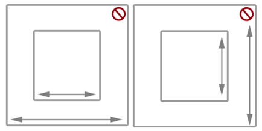
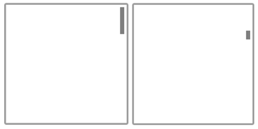
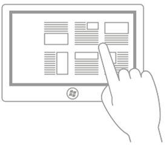
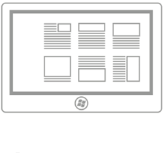
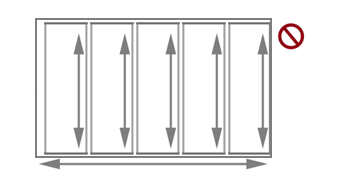

# Guidelines for panning

Panning or scrolling lets users navigate within a single view, to display the content of the view that does not fit within the viewport. Examples of views include the folder structure of a computer, a library of documents, or a photo album.

> **Important APIs**: [**Windows.UI.Input**](/uwp/api/Windows.UI.Input), [**Windows.UI.Xaml.Input**](/uwp/api/Windows.UI.Xaml.Input)

## Dos and don'ts

**Panning indicators and scroll bars**

-   Ensure panning/scrolling is possible before loading content into your app.

-   Display panning indicators and scroll bars to provide location and size cues. Hide them if you provide a custom navigation feature.

    **Note**  Unlike standard scroll bars, panning indicators are purely informative. They are not exposed to input devices and cannot be manipulated in any way.

     

**Single-axis panning (one-dimensional overflow)**

-   Use one-axis panning for content regions that extend beyond one viewport boundary (vertical or horizontal).

    -   Vertical panning for a one-dimensional list of items.
    -   Horizontal panning for a grid of items.
-   Don’t use mandatory snap-points with single-axis panning if a user must be able to pan and stop between snap-points. Mandatory snap-points guarantee that the user will stop on a snap-point. Use proximity snap-points instead.

**Freeform panning (two-dimensional overflow)**

-   Use two-axis panning for content regions that extend beyond both viewport boundaries (vertical and horizontal).

    -   Override the default rails behavior and use freeform panning for unstructured content where the user is likely to move in multiple directions.
-   Freeform panning is typically suited to navigating within images or maps.

**Paged view**

-   Use mandatory snap-points when the content is composed of discrete elements or you want to display an entire element. This can include pages of a book or magazine, a column of items, or individual images.

    -   A snap-point should be placed at each logical boundary.
    -   Each element should be sized or scaled to fit the view.

**Logical and key points**

-   Use proximity snap-points if there are key points or logical places in the content that a user will likely stop. For example, a section header.

-   If maximum and minimum size constraints or boundaries are defined, use visual feedback to demonstrate when the user reaches or exceeds those boundaries.

**Chaining embedded or nested content**

-   Use single-axis panning (typically horizontal) and column layouts for text and grid-based content. In these cases, content typically wraps and flows naturally from column to column and keeps the user experience consistent and discoverable across Windows apps.

-   Don't use embedded pannable regions to display text or item lists. Because the panning indicators and scroll bars are displayed only when the input contact is detected within the region, it is not an intuitive or discoverable user experience.

-   Don't chain or place one pannable region within another pannable region if they both pan in the same direction, as shown here. This can result in the parent area being panned unintentionally when a boundary for the child area is reached. Consider making the panning axis perpendicular.

    

## Additional usage guidance

Panning with touch, by using a swipe or slide gesture with one or more fingers, is like scrolling with the mouse. The panning interaction is most similar to rotating the mouse wheel or sliding the scroll box, rather than clicking the scroll bar. Unless a distinction is made in an API or required by some device-specific Windows UI, we simply refer to both interactions as panning.

> 

> <strong>Windows 10 Fall Creators Update - Behavior change</strong>
> By default, instead of text selection, an active pen now scrolls/pans in Windows apps (like touch, touchpad, and passive pen).  
> If your app depends on the previous behavior, you can override pen scrolling and revert to the previous behavior. For details, see the API reference topic for the <a href="/uwp/api/windows.ui.xaml.controls.scrollviewer">Scroll​Viewer Class</a>.
> 

Depending on the input device, the user pans within a pannable region by using one of these:

-   A mouse, touchpad, or active pen/stylus to click the scroll arrows, drag the scroll box, or click within the scroll bar.
-   The wheel button of the mouse to emulate dragging the scroll box.
-   The extended buttons (XBUTTON1 and XBUTTON2), if supported by the mouse.
-   The keyboard arrow keys to emulate dragging the scroll box or the page keys to emulate clicking within the scroll bar.
-   Touch, touchpad, or passive pen/stylus to slide or swipe the fingers in the desired direction.

Sliding involves moving the fingers slowly in the panning direction. This results in a one-to-one relationship, where the content pans at the same speed and distance as the fingers. Swiping, which involves rapidly sliding and lifting the fingers, results in the following physics being applied to the panning animation:

-   Deceleration (inertia): Lifting the fingers causes panning to start decelerating. This is similar to sliding to a stop on a slippery surface.
-   Absorption: Panning momentum during deceleration causes a slight bounce-back effect if either a snap point or a content area boundary is reached.

**Types of panning**

Windows supports three types of panning:

-   Single axis - panning is supported in one direction only (horizontal or vertical).
-   Rails - panning is supported in all directions. However, once the user crosses a distance threshold in a specific direction, then panning is restricted to that axis.
-   Freeform - panning is supported in all directions.

**Panning UI**

The interaction experience for panning is unique to the input device while still providing similar functionality.

There are two panning display modes based on the input device detected:

-   Panning indicators for touch.
-   Scroll bars for other input devices, including mouse, touchpad, keyboard, and stylus.

**Note**  Panning indicators are only visible when the touch contact is within the pannable region. Similarly, the scroll bar is only visible when the mouse cursor, pen/stylus cursor, or keyboard focus is within the scrollable region.

 

**Panning indicators**
Panning indicators are similar to the scroll box in a scroll bar. They indicate the proportion of displayed content to total pannable area and the relative position of the displayed content in the pannable area.

The following diagram shows two pannable areas of different lengths and their panning indicators.

**Panning behaviors**
**Snap points**
Panning with the swipe gesture introduces inertia behavior into the interaction when the touch contact is lifted. With inertia, the content continues to pan until some distance threshold is reached without direct input from the user. Use snap points to modify this inertia behavior.

Snap points specify logical stops in your app content. Cognitively, snap points act as a paging mechanism for the user and minimize fatigue from excessive sliding or swiping in large pannable regions. With them, you can handle imprecise user input and ensure a specific subset of content or key information is displayed in the viewport.

There are two types of snap-points:

-   Proximity - After the contact is lifted, a snap point is selected if inertia stops within a distance threshold of the snap point. Panning can still stop between proximity snap points.
-   Mandatory - The snap point selected is the one that immediately precedes or succeeds the last snap point crossed before the contact was lifted (depending on the direction and velocity of the gesture). Panning must stop on a mandatory snap point.

Panning snap-points are useful for applications such as web browsers and photo albums that emulate paginated content or have logical groupings of items that can be dynamically regrouped to fit within a viewport or display.

The following diagrams show how panning to a certain point and releasing causes the content to automatically pan to a logical location.

:::row:::
   :::column:::
      

      Swipe to pan.
   :::column-end:::
   :::column:::
      

      Lift touch contact.
   :::column-end:::
   :::column:::
      

      Pannable region stops at the snap point, not where the touch contact was lifted.
   :::column-end:::
:::row-end:::

**Rails**
Content can be wider and taller than the dimensions and resolution of a display device. For this reason, two-dimensional panning (horizontal and vertical) is often necessary. Rails improve the user experience in these cases by emphasizing panning along the axis of motion (vertical or horizontal).

The following diagram demonstrates the concept of rails.

**Chaining embedded or nested content**

After a user hits a zoom or scroll limit on an element that has been nested within another zoomable or scrollable element, you can specify whether that parent element should continue the zooming or scrolling operation begun in its child element. This is called zoom or scroll chaining.

Chaining is used for panning within a single-axis content area that contains one or more single-axis or freeform panning regions (when the touch contact is within one of these child regions). When the panning boundary of the child region is reached in a specific direction, panning is then activated on the parent region in the same direction.

When a pannable region is nested inside another pannable region it's important to specify enough space between the container and the embedded content. In the following diagrams, one pannable region is placed inside another pannable region, each going in perpendicular directions. There is plenty of space for users to pan in each region.

Without enough space, as shown in the following diagram, the embedded pannable region can interfere with panning in the container and result in unintentional panning in one or more of the pannable regions.

This guidance is also useful for apps such as photo albums or mapping apps that support unconstrained panning within an individual image or map while also supporting single-axis panning within the album (to the previous or next images) or details area. In apps that provide a detail or options area corresponding to a freeform panning image or map, we recommend that the page layout start with the details and options area as the unconstrained panning area of the image or map might interfere with panning to the details area.

## Related articles

- [Custom user interactions](../layout/index.md)
- [Optimize ListView and GridView](/windows/uwp/debug-test-perf/optimize-gridview-and-listview)
- [Keyboard accessibility](../accessibility/keyboard-accessibility.md)

**Samples**
- [Basic input sample](https://github.com/Microsoft/Windows-universal-samples/tree/master/Samples/BasicInput)
- [Low latency input sample](https://github.com/Microsoft/Windows-universal-samples/tree/master/Samples/LowLatencyInput)
- [User interaction mode sample](https://github.com/Microsoft/Windows-universal-samples/tree/master/Samples/UserInteractionMode)
- [Focus visuals sample](https://github.com/Microsoft/Windows-universal-samples/tree/master/Samples/XamlFocusVisuals)

**Archive samples**
- [Input: XAML user input events sample](https://github.com/microsoftarchive/msdn-code-gallery-microsoft/tree/411c271e537727d737a53fa2cbe99eaecac00cc0/Official%20Windows%20Platform%20Sample/Input%20XAML%20user%20input%20events%20sample)
- [Input: Device capabilities sample](https://github.com/microsoftarchive/msdn-code-gallery-microsoft/tree/411c271e537727d737a53fa2cbe99eaecac00cc0/Official%20Windows%20Platform%20Sample/Windows%208%20app%20samples/%5BC%23%5D-Windows%208%20app%20samples/C%23/Windows%208%20app%20samples/Input%20Device%20capabilities%20sample%20(Windows%208))
- [Input: Touch hit testing sample](https://github.com/microsoftarchive/msdn-code-gallery-microsoft/tree/411c271e537727d737a53fa2cbe99eaecac00cc0/Official%20Windows%20Platform%20Sample/Windows%208%20desktop%20samples/%5BC%2B%2B%5D-Windows%208%20desktop%20samples/C%2B%2B/Windows%208%20desktop%20samples/Input%20Touch%20hit%20testing%20sample)
- [XAML scrolling, panning, and zooming sample](https://github.com/microsoftarchive/msdn-code-gallery-microsoft/tree/411c271e537727d737a53fa2cbe99eaecac00cc0/Official%20Windows%20Platform%20Sample/Universal%20Windows%20app%20samples/111487-Universal%20Windows%20app%20samples/XAML%20scrolling%2C%20panning%2C%20and%20zooming%20sample)
- [Input: Simplified ink sample](https://github.com/microsoftarchive/msdn-code-gallery-microsoft/tree/411c271e537727d737a53fa2cbe99eaecac00cc0/Official%20Windows%20Platform%20Sample/Input%20Simplified%20ink%20sample)
- [Input: Manipulations and gestures sample](https://github.com/microsoftarchive/msdn-code-gallery-microsoft/tree/411c271e537727d737a53fa2cbe99eaecac00cc0/Official%20Windows%20Platform%20Sample/Input%20Gestures%20and%20manipulations%20with%20GestureRecognizer)
- [DirectX touch input sample](https://github.com/microsoftarchive/msdn-code-gallery-microsoft/tree/411c271e537727d737a53fa2cbe99eaecac00cc0/Official%20Windows%20Platform%20Sample/Windows%208%20app%20samples/%5BC%2B%2B%5D-Windows%208%20app%20samples/C%2B%2B/Windows%208%20app%20samples/DirectX%20touch%20input%20sample%20(Windows%208))
